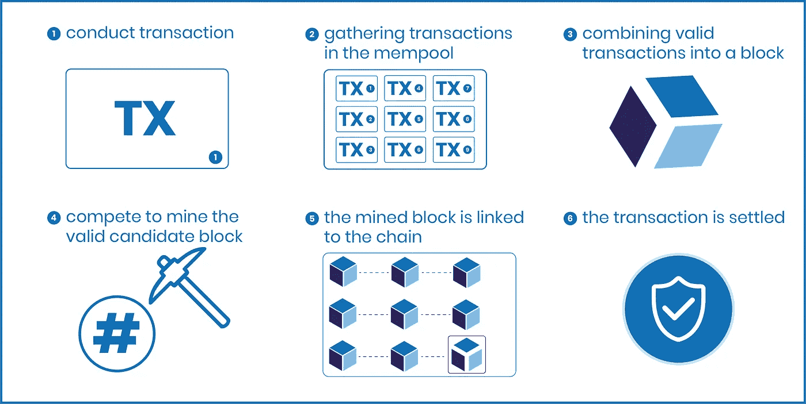
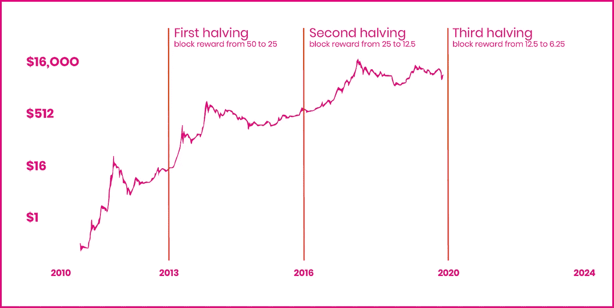

# 的。比特币。基本原理

> 原文：<https://medium.com/coinmonks/the-bitcoin-fundamentals-b23139df7748?source=collection_archive---------35----------------------->

在上一篇文章中，我们总结了数字去中心化货币的历史，我们试图回答这个问题:比特币为什么会存在？所以，下一个问题应该会给我们更多关于底层网络基础的见解:比特币网络是如何运作的，它的关键机制是什么？

# 网络

首先，比特币网络通过分散账本技术(DLT)运行，或者更具体地说，是区块链技术，这是 DLT 的衍生物。区块链技术的主要优点是数据存储的分散化方法。这仍然是一个相当模糊的定义，所以我们将回顾一些我们日常使用的集中式网络的例子，以及它们与分散式网络相比有何不同。[4]

我们的网上银行系统，我们在网飞上播放的视频，或者你正在阅读本文的媒体网站，都可以被认为是集中的平台。这是因为所有数据都是通过中央数据中心(或服务器)存储和访问的，如下图所示。因此，主机(您的银行、网飞和媒体)充当连接服务或产品与用户的中介，因此控制着网络。本质上，他们决定谁可以在网络内操作。例如，您的银行可以轻松限制您的交易或锁定您的银行账户，从而控制您的财务。或媒体可以很容易地禁止某些帐户或文章不符合他们的条款和条件。因此，一般来说，集中式网络创建规则并决定谁可以访问和参与网络。[4]

Centralized networks

那么，集中式网络与分散式网络相比有什么不同，分散式基础设施的优势是什么？首先，分散式网络通过 p2p 网络在不同的“节点”上传播数据，而不是单一的访问点，每个节点都保存着网络交易历史的副本，称为分类账(见下图)。其次，大多数网络(如比特币)都是开源的，因此，每个人都可以贡献网络代码。第三，网络是不可变的，这意味着存储在网络上的数据不能被改变。链中的每个块都保存数据，并通过唯一的块头进行密封。因此，没有交易可以撤销，并且由于其 p2p 和开源基础设施，每个人都能够参与到网络中。在一个段落中压缩区块链技术的主要卖点并不容易，但您需要了解的主要方面是:(I)没有单一实体控制网络，(ii)在真正去中心化的网络上交易是不可变的(例如，比特币)，这意味着每个人都能够通过验证交易(挖掘)来交易和维护网络。[4] [5]

decentralized p2p network

如果我们回到可以阻止交易的银行的例子，我们会看到像比特币这样的去中心化网络如何提供更多的主权。由于比特币网络的开源和 p2p 性质，没有任何一个实体可以控制网络，因此，交易不需要中央参与者的许可。简而言之，交易不能在网络上被阻止，可以全天候发送。[4]

# 供应

与我们由法令驱动的经济相比，比特币网络在稀缺性方面保持着不同的方式。比特币的供应不是无限的，而是有限的，并且有 2100 万个比特币的上限。硬封顶的供应被编码到网络的原始代码中，使用和维护网络的人理解并接受这个决定。有限的供应将确保网络的价值不会因为印刷(开采)更多的硬币而降低。除了有上限的供应，Satoshi 确保供应将稳定地进入流通。新比特币的缓慢发行将为人们积累数字资产提供公平的机会，并将为人们维护网络创造经济激励，这被称为挖掘，并确保交易得到验证。[2]

# 网络共识机制/挖掘

因此，我们到了应该讨论新比特币是如何产生的时候了，但首先，我们需要一些背景知识。比特币通过工作证明(PoW)共识协议运行，这意味着那些维护网络的人需要利用他们的计算能力来验证交易。因此，为了在比特币网络上进行交易，我们要求人们愿意使用他们的计算能力来验证交易。下面，我们将简要概述如何在网络上处理交易。[4]

(I)个人 A 发布交易，并且将支付费用来发送他/她的交易。

(ii)交易将由 mempool 拾取，其中每个交易将由网络检查，以确保所有交易都是有效的。

(iii)每个挖掘者在应该被添加到链中的相同块号上工作，但是每个挖掘者将从 mempool 开发由不同(有效)事务组成的个人块。

㈣一旦对候选区块达成共识，矿工将通过解一个数学方程(解散列)来竞争核实他们的(个人)区块。获胜的矿工将获得区块奖励和与区块相关的费用。

㈤一旦其中一名矿工开采了该区块，该区块将被连接到链条上。

(VI)B 人将从 a 人处收到资金。

mining process (simplified)

这份材料可能看起来很复杂，因为我们刚刚引入了没有任何上下文的新术语。然而，这仅仅是网络如何运行的简单表示，但这应该是理解事务如何通过网络发送的良好起点。然而，我们没有提到最重要的部分:新的比特币是如何铸造的？

# 周期

除了费用之外，矿工们还竞相验证区块，以获得以比特币支付的区块奖励。因此，该网络开采的每个区块都将释放新的比特币，支付给验证该区块的矿工。大约每 10 分钟网络挖掘一个新区块，当前周期每区块奖励 6.25 比特币。因此，平均每天有 900 个比特币进入流通。我们再次遇到一些新的术语，比特币兔子洞不断展现新的机制。但是，我们将尝试简单地解释我们对周期的定义(减半周期和 T2 周期是可以互换的)。[1] [2]

Satoshi 发明了一种聪明的方法来慢慢地发行新的硬币进入流通，首先创造激励他人验证交易以换取比特币，以大宗奖励和交易费的形式支付。其次，他引入了四年周期，即每四年将整体薪酬减半。因此，回到 2009 年，每个区块的开采奖励是 50 个比特币，导致每天开采 7200 个比特币。然后，第一次减半发生在 2013 年，将块奖励减半，每块只有 25 个比特币。第二次减半发生在 2016 年，我们从每块 25 个比特币变成了 12.5 个比特币。目前，我们发现自己处于 2020 年开始的第三个周期，再次将奖励切成两半，第四个周期将发生在 2024 年，届时每个块奖励将等于 3.125 比特币。[1] [2]

outline bitcoin halving chart

# 小小的技术弯路…

在前面的部分中，我们试图涵盖众多的网络活动，并且交易过程的每一步都可以很容易地成为一篇独立的文章。然而，由于其复杂性，我们没有讨论的一件事是:矿工如何通过求解数学方程来验证区块。我发现很难用一种可以理解的方式来解释这个话题，尤其是在这样一篇文章中，我试图给出一个简要的概述。但我会试一试！

每个经过验证的块可以被认为是由块头密封的，这意味着存储在块中的事务不能被更改，如果有人成功地更改了单个事务，网络将陷入停顿，并且将出现并行链。迄今为止，这种情况从未发生过，而且由于网络的弹性，以及改变密封块所需的巨大计算能力，改变事务是不可能的。[3] [5]

但是一个街区是如何密封的呢？每个块都通过成形为块头的散列来密封。标头保存有关嵌套在块中的事务的信息，它生成一个时间戳，并链接到前一个块。一般来说，矿工竞相猜测候选块的散列；那些首先想出散列的人，将获得块奖励和它的交易费。然而，这仅仅是一个简单的过程，它跳过了重要的部分。但主要的收获是，矿工会用有效和未确认的事务创建块，并尝试猜测哈希，这将把块链接到链。[3] [5]

# 结论

我们已经讨论了基本的机制，但是如果它很难理解，那也是正常的。我告诉自己要轻松地解释基本面，但似乎我打破了自己的规则。尽管如此，本文还是会让您对比特币网络机制和其他工作验证协议有一个简单的了解。如果您在理解某些术语或机制方面仍有困难，请不要担心。其他人，还有我，在我们试图把握基本面的时候也很迷茫。因此，要了解更多信息，请查看脚注，了解其他文章的来源和有趣的链接。或者用谷歌，迷失在兔子洞里。

# 来源

[1]康威、卢克、埃里卡·拉苏尔和斯凯拉·克拉琳。“比特币减半。” *Investopedia* (博客)，2021 年 11 月 29 日。https://www.investopedia.com/bitcoin-halving-4843769.

[2]弗洛伊德、大卫、朱利叶斯·曼萨和皮特·拉斯伯恩。“比特币如何运作。” *Investopedia* (博客)，2021 年 11 月 29 日。[https://www.investopedia.com/news/how-bitcoin-works/.](https://www.investopedia.com/news/how-bitcoin-works/.)

[3]海斯、亚当和埃里卡·拉苏尔。"目标哈希。" *Investopedia* (博客)，2021 年 8 月 29 日。[https://www.investopedia.com/terms/t/target-hash.asp.](https://www.investopedia.com/terms/t/target-hash.asp.)

[4]劳赫什、米歇尔、安德鲁·格利登、布瑞恩·戈登、吉娜·彼得、马蒂诺·雷卡纳蒂尼、弗朗索瓦·罗斯坦德、凯瑟琳·瓦涅尔和布赖恩·张铮。"分布式分类帐技术系统:概念框架." *SSRN 电子期刊*，2018。[https://doi.org/10.2139/ssrn.3230013.](https://doi.org/10.2139/ssrn.3230013.)

[5]塔斯卡、保罗和克劳迪奥·j·特松。“区块链技术分类:识别和分类原则”，2019 年。[https://doi.org/10.5195/ledger.2019.140.](https://doi.org/10.5195/ledger.2019.140.)

> *加入 Coinmonks* [*电报频道*](https://t.me/coincodecap) *和* [*Youtube 频道*](https://www.youtube.com/c/coinmonks/videos) *了解加密交易和投资*

# 另外，阅读

*   [霍比审核](https://coincodecap.com/huobi-review) | [OKEx 保证金交易](https://coincodecap.com/okex-margin-trading) | [期货交易](https://coincodecap.com/futures-trading)
*   [Cloudbet 赌场评论](https://coincodecap.com/cloudbet-casino-review) | [点火赌场评论](https://coincodecap.com/ignition-casino-review)
*   [Godex.io 审核](/coinmonks/godex-io-review-7366086519fb) | [邀请审核](/coinmonks/invity-review-70f3030c0502) | [BitForex 审核](https://coincodecap.com/bitforex-review)
*   [Crypto.com 费用](/coinmonks/binance-fees-8588ec17965) | [僵尸加密审查](/coinmonks/botcrypto-review-2021-build-your-own-trading-bot-coincodecap-6b8332d736c7) | [替代品](https://coincodecap.com/crypto-com-alternatives)
*   如何在 Bitbns 上购买柴犬(SHIB)币？ | [印度的币安](https://coincodecap.com/binance-in-india)
*   [币安 vs Bitstamp](https://coincodecap.com/binance-vs-bitstamp)|[bit panda vs 比特币基地 vs Coinsbit](https://coincodecap.com/bitpanda-coinbase-coinsbit)
*   [如何购买 Ripple (XRP)](https://coincodecap.com/buy-ripple-india) | [非洲最好的加密交易所](https://coincodecap.com/crypto-exchange-africa)
*   [非洲最佳加密交易所](https://coincodecap.com/crypto-exchange-africa) | [胡交易所评论](https://coincodecap.com/hoo-exchange-review)
*   [eToro vs robin hood](https://coincodecap.com/etoro-robinhood)|[MoonXBT vs Bybit vs Bityard](https://coincodecap.com/bybit-bityard-moonxbt)
*   [Stormgain 回顾](https://coincodecap.com/stormgain-review) | [Bexplus 回顾](https://coincodecap.com/bexplus-review) | [币安 vs Bittrex](https://coincodecap.com/binance-vs-bittrex)