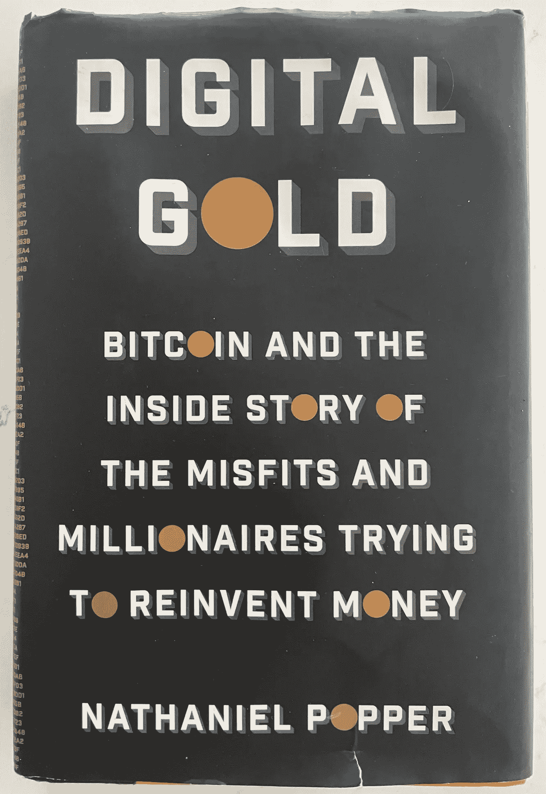

# 比特币的动机:是什么让比特币安全？

> 原文：<https://medium.com/coinmonks/the-bitcoin-incentive-3a994a5b3e78?source=collection_archive---------17----------------------->

2012 年10 月，来自阿根廷的比特币企业家温塞斯·卡萨雷斯(Wences Casares)向来自东欧的两名程序员投资了总计 25 万美元，他们的任务是试图破解比特币协议。几个月来，他们不顾一切地尝试能否伪造比特币，或者花掉别人钱包里的比特币。

他们失败了。

就目前而言，这是温塞斯遗留问题之一所需的所有证据:比特币会被黑客攻击吗？答案是否定的。

温塞斯有很多理由投入大量资金来见证比特币的成功。[根据比特币记者 Laura shin 主持的加密播客 Unchained](https://www.youtube.com/watch?v=cfMJ9iI9K2Y) 的说法，由于他的祖国对国家货币的错误管理，他眼睁睁地看着他的家人失去了三次他们拥有的一切。

对他来说，钱从来都不是既定的，所以他想确保这种新的数字货币是合理的。很安全。

# 比特币安全吗？

要知道，仅仅因为上面提到的两个白帽黑客最终没能黑掉比特币区块链。并不意味着其他人不能成功。事实上，在网络发展的早期，一位名叫 *Artforz* 的德国程序员给匿名的比特币创造者中本聪发了一封电子邮件，内容是关于比特币交易管理的一个致命缺陷，这个缺陷使得人们有可能花掉别人钱包里的比特币。

根据 Nathaniel Popper 的密码书 [*Digital Gold*](https://www.goodreads.com/book/show/23546676-digital-gold) 的说法，这可能会使整个项目走下坡路，Satoshi 实际上不得不修补软件。幸运的是，程序员希望看到比特币成功。

但激励始终是比特币协议的一部分。

*Digital Gold* by Nathaniel Popper

# 比特币激励

卓越的运营和激励的结合使比特币协议从未被黑客攻击过，甚至直到今天。没有多少人想到我们会在这里:十多年后，比特币区块链仍然没有被攻破。

在比特币的早期(直到今天),人们对网络的有效性和安全性有很多批评。有人担心数据库的扩展，有人认为区块链会变得太大太快，还有人担心所谓的 51%攻击。一个恶意参与者会利用比特币设计的“多数规则”架构的概念。

## 51%攻击的危险

这种类型的攻击过去是，现在仍然是一个真正的问题。比特币最终是由散列率运行的，散列率是处理和验证区块链上的交易所需的计算能力。该网络由一组运行比特币软件的节点(主要是矿工)组成，这些节点竞相解决需要大量哈希运算能力的计算难题。对该软件的更改(对区块链的新添加)需要得到大多数计算机的同意。

这意味着拥有 50%以上哈希能力的人理论上可以控制网络。当达到“51%”的计算能力时，恶意参与者可能会分发一个不正确的或欺诈性的区块链版本，他们会为自己的目的塑造该版本——其他节点会不知不觉地接受该版本。这样做的一个原因是获得消费比特币的能力，然后再把它们拿回来再次消费——或者“双重消费”。

但是比特币保持安全的一个方面是激励，这是[比特币 Maxis](https://investmentfirms.com/crypto-slang-terms-to-know/) 经常宣扬的东西。出于许多原因，把所有的努力都投入到获得大部分的散列能力上，而只是为了危及你的硬币的有效性，这是没有意义的。换句话说，如果你最终得到了所有的硬币，但没有人愿意和你做生意，那么一开始就获得多数的散列权有什么好处呢？

## **高能哈希**

这就是为什么高能散列法实际上可以帮助支持比特币网络。如果足够多的“好人”获得了大量的散列能力，它可以作为一种保护来抵御类似 51%的攻击。

在比特币的早期历史中，这个概念一次又一次地被证明是正确的。

例如，全球最大的加密采矿公司之一，一家名为 [Bitfury](https://bitfury.com/) 的公司，一度威胁要代表超过 50%的计算能力。事实证明，这给业内人士带来了麻烦。然而，他们通过承诺在任何时候都不会超过 40%的在线矿业电力，成功地恢复了人们的信心。

鉴于如果系统遭到破坏，他们的硬币就会过时，他们作出这一承诺是完全有道理的。一家生产这么多硬币的公司绝不会希望自己处于一个发现所有硬币突然变得一文不值的境地。

## 生成硬币

该网络提供的一个具体激励是比特币区块链上每个区块创建期间发生的第一笔交易。这是一个创造新硬币的特殊交易。这个小而强大的特性是激励节点支持网络所需要的。

这就是为什么即使是最坏的“坏人”也会选择创造更多的新硬币，而不是去偷它们，如果他们想获得对矿业的控制权的话。每次创建一个块时，最初支持网络总是有意义的，而不是破坏它。

激励是一种强大的动力。这也是比特币既安全又诚实的特征之一。

> 加入 Coinmonks [电报频道](https://t.me/coincodecap)和 [Youtube 频道](https://www.youtube.com/c/coinmonks/videos)了解加密交易和投资

# 另外，阅读

*   [最佳密码交换平台](https://coincodecap.com/best-crypto-swap-platforms) | [最佳密码交易所](https://coincodecap.com/crypto-exchange)
*   [购买比特币印度](/coinmonks/buy-bitcoin-in-india-feb50ddfef94) | [Pionex 评论](/coinmonks/pionex-review-exchange-with-crypto-trading-bot-1e459d0191ea) | [加密交易机器人](/coinmonks/crypto-trading-bot-c2ffce8acb2a)
*   [n rave ZERO Review](/coinmonks/ngrave-zero-review-c465cf8307fc)|[phe MEX Review](/coinmonks/phemex-review-4cfba0b49e28)|[PrimeXBT Review](/coinmonks/primexbt-review-88e0815be858)
*   最佳[区块链分析](https://bitquery.io/blog/best-blockchain-analysis-tools-and-software)工具| [赚比特币](/coinmonks/earn-bitcoin-6e8bd3c592d9)
*   [Cloudbet 赌场评论](https://coincodecap.com/cloudbet-casino-review) | [点火赌场评论](https://coincodecap.com/ignition-casino-review)