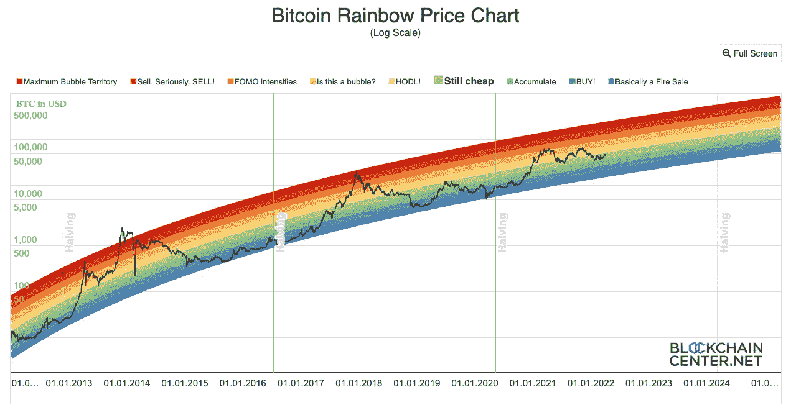

# 比特币市场快照和宏观概述

> 原文：<https://medium.com/coinmonks/the-bitcoin-market-snapshot-macro-overview-8b6b03402efa?source=collection_archive---------15----------------------->

来自隐鹰队的问候！

理解、跟踪和交易加密货币可能会让人不知所措。什么推动了价格行为？为什么某些硬币的表现优于其他？crypto 将何去何从？在这一系列文章中，我们的团队将展示各种主题、时事和行业深度探讨，以帮助您进行加密货币教育、研究和投资决策。在这份创刊号中，我们将讨论加密货币世界的中心**比特币**。我们走吧！

**比特币&它在加密世界的地位**

我们从推动一切加密的力量开始我们的旅程:**比特币**。比特币是什么？**比特币**是迄今为止第一种也是最主要的加密货币，占整个加密市场资本总额的 40%以上*(超过 2 万亿美元)。*比特币是 2009 年由一个化名为*中本聪*的匿名个人发明的。有趣的事实:一个“Satoshi”或“Sat”现在指的是 0.00000001 BTC。

比特币最初被认为是一种自由运行的数字货币，不受银行或政府的任何中央控制或监督。本质上，它是作为一种法定替代物被发明的，可以在世界任何地方使用，而不需要货币兑换或银行媒介。然而，随着时间的推移和全球的采用，*事情发生了变化*。虽然比特币的基本特征保持不变，但它的使用场景和围绕它的法规已经发生了变化。

今天，比特币被广泛认为是一种*而非 ***支付手段。*** 还能用来办公吗？当然啦！那么…为什么要改变呢？好吧，首先，现在有超过 14000 种其他加密货币，其中一些也被设计成支付手段。比特币和区块链技术的出现为替代货币(通常被称为替代币或替代币)的开发和利用奠定了无限的基础。现在，我们将对这一讨论进行总结，并在以后的文章中再次讨论。现在需要理解的重要一点是，**整个**加密货币市场*随着比特币而波动。**

***价格讨论:内在因素&历史驱动因素***

*现在我们已经确定了**比特币是占主导地位的加密货币，**让我们来讨论是什么推动了它的价格。比特币有一个固定的最大供应量**2100 万枚**硬币——现存的任何一个聪都不会超过**2100 万枚**。鉴于其固定的供应量，比特币被认为是一种*通货膨胀*资产，其价格会因采用、稀缺、利用等原因而逐渐升值。从历史上看，比特币的价格升值也受到**挖矿奖励**和相应的每 4 年发生一次的*“奖励减半”*的影响。比特币“矿工”是功能强大的计算机，旨在集体解决线性代数方程，并在完成后获得 BTC 形式的“奖励”。由于需要矿工的计算能力来促进网络，并且比特币有固定的最大供应量，因此*“奖励减半”*对于采矿激励的持久性至关重要。在过去的周期中，比特币在最近一次计划减半后的 1-2 年内创下新高。*

*无论你是加密新手还是有经验的投资者，下面的图表提供了历史价格运动及其相关性的可视化效果。看看吧！*

**

*[https://www.blockchaincenter.net/bitcoin-rainbow-chart/](https://www.blockchaincenter.net/bitcoin-rainbow-chart/)*

***价格讨论:当前主题***

*除了上述内在因素，比特币的价格还受到全球通胀、货币政策、采用(流动性)以及最近的*监管变化*的影响。比特币经济中最普遍的一个主题是，它是一种针对通货膨胀的对冲。简而言之，随着美国(和全球)货币供应量的增加，比特币以及石油、玉米和大豆等其他大宗商品的价格也会上涨。不同的是，我们可以种更多的玉米……*我们不能种更多的比特币。**

*现在我们已经研究了几个宏观价格主题，让我们来谈谈影响短期价格运动的*时事&法规*:*

**采用:*2020 年 8 月，美国货币监理署(OCC)悄然将**机构托管加密货币资产**合法化。这是迄今为止影响加密货币的最大监管变化之一。现在，银行、公司和受托人可以合法持有加密货币资产并向各自的客户提供加密货币资产，人们开始争相寻找最安全、最有效的购买、存储和转移手段。*

**监管:*为了应对 OCC 的新政策，一项跨部门的工作已经展开，旨在为购买、交易和出售加密货币的机构和个人提供具体的指导方针。*尘埃落定。*如果你读过关于国税局、证交会、美联储或白宫围绕加密货币制定法律和法规的文章，你就已经到达了当前价格行动的最前沿:数十亿新的机构流动性悬而未决。*

***2022 年展望***

*过去的表现、内在特性和宏观主题告诉我们，比特币的价格将永远上涨，但当前的事件和监管似乎暂时阻止了这一点。许多人将 2022 年称为“砍”的一年，因为全球股市&监管机构试图在巩固加密货币监管的同时打击恶性通货膨胀。在经济不确定时期，风险资产通常不会出现抛物线式增长——在许多情况下，它们是在“FUD”(恐惧、不确定性和怀疑)中最先被出售的。然而，新的机构指导方针的最终确定以及全球市场波动性的降低，可能会为比特币达到历史新高甚至更高提供一个最终的发射台。*

***隐鹰的长短垂***

*加密货币中有如此多的事情正在发生，以至于似乎不可能得出一个明智的价格前景，更不用说解释每一个相关的故事了。对于交易员和短期投资者来说，CryptoHawk 的多空信号服务为比特币&以太坊提供了一个浓缩的算法前景，以帮助用户利用短期价格波动和波动。查看 [cryptohawk.ai](http://cryptohawk.ai/) 节省时间，像专业人士一样交易！*

> *加入 Coinmonks [电报频道](https://t.me/coincodecap)和 [Youtube 频道](https://www.youtube.com/c/coinmonks/videos)了解加密交易和投资*

# *另外，阅读*

*   *[Bookmap 评论](https://coincodecap.com/bookmap-review-2021-best-trading-software) | [美国 5 大最佳加密交易所](https://coincodecap.com/crypto-exchange-usa)*
*   *最佳加密[硬件钱包](/coinmonks/hardware-wallets-dfa1211730c6) | [Bitbns 评论](/coinmonks/bitbns-review-38256a07e161)*
*   *[新加坡十大最佳加密交易所](https://coincodecap.com/crypto-exchange-in-singapore) | [收购 AXS](https://coincodecap.com/buy-axs-token)*
*   *[红狗赌场评论](https://coincodecap.com/red-dog-casino-review) | [Swyftx 评论](https://coincodecap.com/swyftx-review) | [CoinGate 评论](https://coincodecap.com/coingate-review)*
*   *[投资印度的最佳加密软件](https://coincodecap.com/best-crypto-to-invest-in-india-in-2021)|[WazirX P2P](https://coincodecap.com/wazirx-p2p)|[Hi Dollar Review](https://coincodecap.com/hi-dollar-review)*