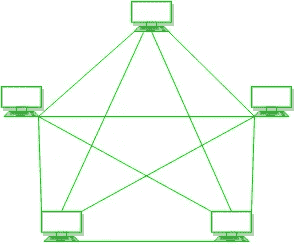

# 比特币网络

> 原文：<https://medium.com/coinmonks/the-bitcoin-network-af7525bc5a12?source=collection_archive---------26----------------------->


culled from google.com

我们都熟悉使用客户端-服务器模型的网络，客户端可能是笔记本电脑、智能手机等计算机形式，从服务器(也可能是计算机)请求信息，比如文件、网站，服务器听到请求并作出响应。在这个模型中，多个客户端连接到一个服务器(服务器总是给，客户端总是拿)。

然而，比特币网络并不是这样工作的，它利用了点对点系统(P2P)。没有特定的客户端或服务器，所有的计算机都是平等的，它们互相充当服务器和客户端，并且对信息的访问不是由特定的计算机处理的。参与这种网络体系结构的计算机称为节点，它们同时相互连接。



对于比特币网络来说，它不仅仅是相互连接的计算机，它被设计成一个数字现金系统，利用 P2P 架构有助于实现去中心化和透明。所以当你听到“比特币网络”的时候，记住它只是简单的指运行比特币 P2P 协议的节点集合。

# 比特币网络上的节点

节点可以是任何形式的，电话可以作为节点，笔记本电脑、台式机或任何类型的计算机也是如此。尽管比特币网络上的所有节点都是平等的，但由于其功能性，它们往往会扮演不同的角色(手机显然不能做笔记本电脑所做的一切)。一个比特币节点具有不同的功能，例如挖掘、路由、钱包服务和区块链数据库。路由功能对所有节点都是通用的，因为它是参与网络所必需的。

# 节点类型及其功能

**完整节点**:这是能够执行比特币网络节点所需的所有功能的节点类型。除了路由之外，它们能够保持和维护区块链的最新副本，区块链包含曾经执行的比特币交易的所有记录，并且它保持更新，因为平均每 10 分钟就有包含交易的新块被添加到区块链，因此，完整节点必须保持更新它们的区块链副本。据 statistica.com 的[报道，区块链的大小目前超过 350 千兆字节，这意味着一个完整的节点必须有足够的磁盘空间来容纳数据库。](http://statistica.com/)

完整节点还可以执行挖掘功能，这意味着它们可以验证交易并将其添加到区块链中，这是通过解决复杂的密码哈希难题来完成的，这需要强大的计算能力和复杂的设备。然而，由于挖掘所需的资源，大多数全节点只关注其他功能，而将挖掘功能留给挖掘节点。

**SPV/轻量级节点** : SPV 节点类似于完整节点，除了它们确实有区块链的完整副本，它们只有块头来帮助确认区块链的有效性并将信息传递给另一个节点。SPV 节点如何工作的一个简单解释是，它们下载包含 Merkle 根的块头(这是从连接块中包含的事务的所有散列得到的散列)，为了验证事务，节点连接到完整节点并请求 Merkle 路径，这是计算 Merkle 根所需的最少节点数。

```
Hash of the transactionA to verify = HashA
 Block125 Merkle root  = HashADFN
 Merkle path requested = [ HashD, HashF, HashN]
 -Concatenate Hash A with the first element on the Merkle path list, 
 - Repeat concatenation with every element in the list,
 - Compare the result to Block125 Merkle root 
 - if result ==Block Merkle root
         transaction A is present in  Block 125
 - else:
        transaction A is not added in block125
```

虽然看起来 P2P 网络不是用轻型节点实现的，但是由于它们必须从完整节点请求，SPV 节点连接到多个节点(完整节点和轻型节点)，因此如果完整节点被黑客攻击并因此具有区块链的不正确副本，则 SPV 节点可以选择将区块链视为假，并确认完整节点应该维护的正确区块链。因此，P2P 架构仍然存在。

**采矿节点**:除了满和轻节点之外，还有采矿节点，集中在增加到区块链的采矿块上。一些挖掘节点有区块链的副本，而一些选择没有它。采矿伴随着激励，采矿者只有在他们开采的区块被传播并添加到区块链中时才能获得采矿奖励，因此，他们处于解决工作证明问题的持续时间敏感的竞争中，并且他们必须最小化传播采矿区块和开始下一轮竞争所花费的时间。

比特币 P2P 网络具有高网络延迟对于比特币挖掘节点的需求，想象一下在特定块已经传播之后试图挖掘该块，而不是仅仅因为通信中的高延迟告诉你该块已经被另一个挖掘者挖掘和传播(浪费时间和资源)而开始另一轮挖掘。为了最大限度地减少块传输的延迟，Matt Corallo 在 2015 年创建了比特币中继网络，它通过为矿工创建高速中继节点系统来帮助减少矿工之间的块传播时间，该网络由分散在全球各地的专门节点组成，用于连接大多数矿工。比特币中继网络在 2016 年进一步被光纤取代，光纤(快速互联网比特币中继引擎)旨在中继节点网络内的块，通过光纤几乎没有超过光速的延迟。提高区块传播速度使开采更加公平，降低集中压力，也鼓励更多人开采。

比特币中继网络和光纤并没有以任何形式取代比特币 P2P 网络，它们只是帮助在挖掘节点之间提供额外的连接。比特币网络将永远基于 P2P 架构。

比特币中使用的 P2P 架构确实有助于确保网络的去中心化，然而网络需要增长，更多的节点必须加入网络。交易通过遵循共识规则来验证，没有人规定规则，它必须由网络上的每个人同意。目前，比特币网络估计有超过 47，000 个功能节点，网络中需要更多的节点以确保大公司或政府不会劫持网络，因为他们有权拥有大量节点，这可能导致集中化，并违背网络的目的。

比特币是一个不可信的系统，将你的信任放在一方或钱包提供商身上可能会有风险，他们运行你的比特币接入网关，为你实施共识规则，甚至可能拥有你的硬币的所有必要信息。

**比特币是为所有人服务的**，运行一个功能节点保证了网络甚至硬币的安全，所以下次当你听到“比特币”这个词时，不要把它当成加密货币，试着参与改善网络。

> 加入 Coinmonks [电报频道](https://t.me/coincodecap)和 [Youtube 频道](https://www.youtube.com/c/coinmonks/videos)获取每日[加密新闻](http://coincodecap.com/)

# 另外，阅读

*   [如何购买 Monero](https://coincodecap.com/buy-monero) | [IDEX 评论](https://coincodecap.com/idex-review) | [BitKan 交易机器人](https://coincodecap.com/bitkan-trading-bot)
*   [CoinDCX 评论](/coinmonks/coindcx-review-8444db3621a2) | [加密保证金交易交易所](https://coincodecap.com/crypto-margin-trading-exchanges)
*   [红狗赌场评论](https://coincodecap.com/red-dog-casino-review) | [Swyftx 评论](https://coincodecap.com/swyftx-review) | [CoinGate 评论](https://coincodecap.com/coingate-review)
*   [Bookmap 评论](https://coincodecap.com/bookmap-review-2021-best-trading-software) | [美国 5 大最佳加密交易所](https://coincodecap.com/crypto-exchange-usa)
*   [如何在 FTX 交易所交易期货](https://coincodecap.com/ftx-futures-trading) | [OKEx vs 币安](https://coincodecap.com/okex-vs-binance)
*   [CoinLoan 评论](https://coincodecap.com/coinloan-review) | [YouHodler 评论](/coinmonks/youhodler-4-easy-ways-to-make-money-98969b9689f2) | [BlockFi 评论](https://coincodecap.com/blockfi-review)
*   [XT.COM 评论](https://coincodecap.com/profittradingapp-for-binance)币安评论 |