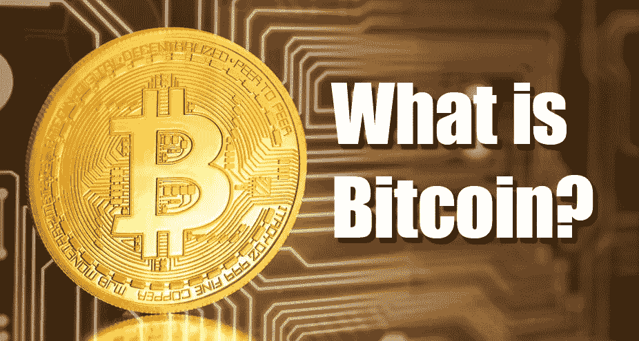

# 比特币革命澄清了。

> 原文：<https://medium.com/coinmonks/the-bitcoin-revolution-clarified-acd153928064?source=collection_archive---------36----------------------->

## 介绍

什么是比特币？当人们问我这个问题时，我首先开始幸灾乐祸，然后发表独白，大多数人在仅仅半分钟后就退出了。他们经常被各种复杂而陌生的术语弄得不知所措。“去中心化”、“区块链”、“点对点网络”、“节点”等术语，以及对当前货币体系的全球解释；自尼克松 1971 年放弃金本位以来，凭空创造货币和对法定货币的不合理信任。不过，我不能责怪他们退出对话。突然被有关央行权力、无限印钞(我最喜欢模仿“印钞机发出 brrr”的声音)、相关通胀和其他一些末日情景的信息轰炸，真是难以下咽。大多数人就是不喜欢。他们宁愿活在当下，对每个人都可以参与的时事谈笑风生，保持简单。在他们看来，这仍然是“离他们的床戏太远了”。然而，恰恰是当前的全球资金流动与国际事件和时事有很大关系。跟着钱走是众所周知的口号；当一个人清楚地考虑到经济激励时，政治和国家决策就更容易理解了。

这让我很沮丧……这么多年来，我痴迷于阅读各种书籍、播客、文章以及我能找到的任何关于比特币的信息；我似乎仍然无法以简单的方式向我的人类同胞传达比特币的重要性及其可能性。也是因为我所处的环境缺乏理解而产生的孤独感，甚至有点疼。我想这感觉就像从码头向一个冲浪者大喊，他没有意识到附近的水里有一条鲨鱼，但由于强风，他听不到呼喊。

正因如此，我决定影响风向，因此向每个人简单易懂地解释比特币的重要性成为了我的使命。

比特币不仅仅是一种数字货币。比特币也是协议的名字，是一种点对点网络，是一种分布式计算创新。比特币代表了数十年来密码学和分布式系统研究的顶峰，包括以独特而强大的组合形式汇集在一起的关键创新。比特币由一个公共交易分类账(区块链)、一套独立交易验证和货币发行的规则组成，是一种达成全球分散共识的机制。比特币货币真的只是这个发明的第一个应用；可能性是无限的。比特币就像是货币互联网，一个通过分布式计算传播价值和保护数字资产所有权的网络。比特币远不止初看上去那么简单，稍后会有更多介绍！

在接下来的几周，我将推出我的网站，我将发布一个每周博客，在其中我将简单易懂地解释比特币最重要的方面。此外，我的网站上还会有一些操作指南，并会讨论市场的最新发展。

www.bitcoinclarified.com

向前向上！感谢阅读。

—游里