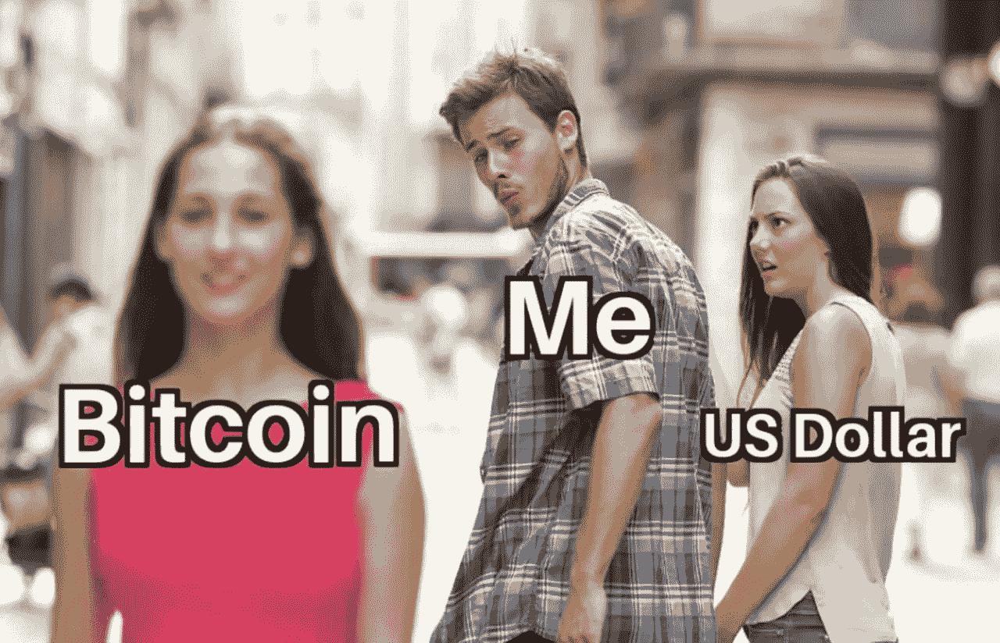
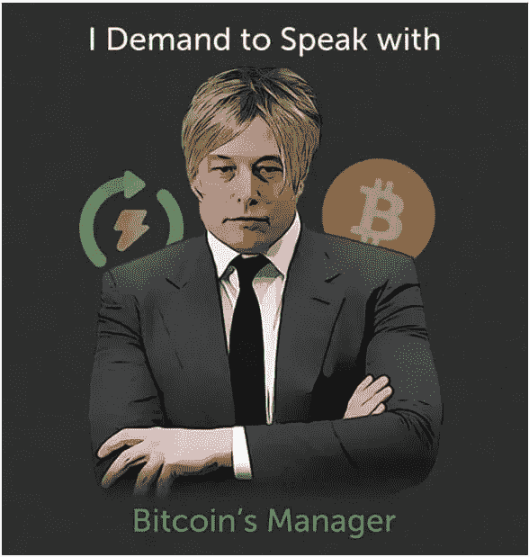
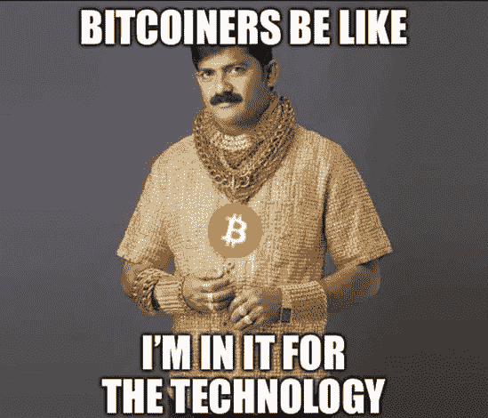

# 比特币革命从你开始。

> 原文：<https://medium.com/coinmonks/the-bitcoin-revolution-starts-with-you-608f32458528?source=collection_archive---------80----------------------->

有比特币吗？恭喜你！你是个比特币制造者。哦，等等…

我在 2017 年初的某个时候得到了我的第一批几个 satoshis 老实说，我隐约知道拥有哪怕是最少量的比特币意味着什么。如果你想知道我是怎么得到它们的——一个水龙头。哈哈，好笑，但是那些实际上是当时的事情，而且他们是真实的。很多人都是通过这种方式获得了他们的第一枚“微小”比特币。与目前互联网上随处可见的猖獗的假水龙头不同，比特币水龙头是真的，并支付给那些有足够好奇心尝试它们的人。

我试图将我的第一笔收入从水龙头转移到我的钱包里，这是我好奇心的真正触发点。一个钱包、一个关键短语、一把私人钥匙……这些对一个陌生人来说都是陌生的。比特币意味着什么；我几乎不知道。这个过程并不简单，但是是的，我学得很快。在成功地将我的第一笔收入存入我的钱包后，我对区块链技术的兴趣增加了。

转账过程很快，但这是比特币的最后一个好处。通过阅读互联网上的资源，我了解到比特币不仅仅是一种移动模糊数字的手段。神秘、技术、大胆和未来都被浓缩在一个概念中——比特币。嗯，区块链技术和加密货币作为一个整体。

好吧，尽管叫我“笨蛋”好了，但是我失去了从水龙头里赚来的那些小智。也许有一天我会找到密码。别担心，这只是一个小数目，不会成为新闻。sat 考试结束了，但人们对“金钱的未来”的兴趣继续增长。我参与了其他一些加密货币和区块链项目，并在 2018 年崩盘后购买了更多比特币。我又一次在比特币挖矿骗局中失去了它们。

年度最佳假人！或者说，年度比特币先生！这是一个更恰当的术语。

持有一些比特币只会让你成为投资者。耐心等待价格达到你的目标，然后抛售以充实你的资产池。这是一个聪明的投资者，充其量只是一个比特币制造者。

加密货币无疑是过去十年中表现最好的资产。它们给持有者带来的财务优势是无法形容的。一项成功的加密货币投资可能会改变生活。只有少数股票能够拥有类似的财务表现。

在这些金融超级故事的背后，是通过许多有趣的概念和技术积极影响社会的尝试。金融技术、政治、互联网、公共权力和权威的分配；在比特币的引领和其他知名项目的支持下，区块链技术和加密货币正在寻找进入这些重要话题的途径。

仅仅投资比特币和其他加密货币不会让它们在投资领域之外变得有意义。浓厚的兴趣和额外的参与推动这个概念超越了赚钱和变得“富有”的想法。虽然拥有比特币是一个很好的开始，但事实上，这只是一个“开始”。

在一个有许多自愿空间要填充的空间中，你的额外参与是什么？好吧，建议你的叔叔们投入几美元是不错的，但当你引诱他们购买顶部时就不是了。不管怎样，你更像一个比特币创造者，而不是一个把几百个比特币锁在钱包里的投资者。

[将我们的下一期出版物发送到您的邮箱](https://cryptoscripts.medium.com/subscribe)

加密货币脚本正在转变成一个由热情的加密货币和区块链信徒组成的社区！[加入冒险！](https://t.me/cryptocurrencyscripts)

# 你会喜欢看类似的文章吗？

[将我们的下一期出版物发送到您的邮箱](https://cryptoscripts.medium.com/subscribe)

在[推特](https://twitter.com/scriptscrypto)
关注我们在[媒体](https://cryptoscripts.medium.com/)
关注我们在[出版 0x](https://www.publish0x.com/@Dzoelx)
关注我们在[脸书](https://www.facebook.com/scriptscrypto)

> 加入 Coinmonks [电报频道](https://t.me/coincodecap)和 [Youtube 频道](https://www.youtube.com/c/coinmonks/videos)了解加密交易和投资

# 另外，阅读

*   [最佳加密分析或链上数据](https://coincodecap.com/blockchain-analytics) | [Bexplus 评论](https://coincodecap.com/bexplus-review)
*   [NFT 十大市场造币集锦](https://coincodecap.com/nft-marketplaces)
*   [AscendEx Staking](https://coincodecap.com/ascendex-staking)|[Bot Ocean Review](https://coincodecap.com/bot-ocean-review)|[最佳比特币钱包](https://coincodecap.com/bitcoin-wallets-india)
*   [Bitget 回顾](https://coincodecap.com/bitget-review) | [双子 vs 区块链](https://coincodecap.com/gemini-vs-blockfi) | [OKEx 期货交易](https://coincodecap.com/okex-futures-trading)
*   [美国最佳加密交易机器人](https://coincodecap.com/crypto-trading-bots-in-the-us) | [经常性回顾](https://coincodecap.com/changelly-review)
*   [在印度利用加密套利赚取被动收入](https://coincodecap.com/crypto-arbitrage-in-india)