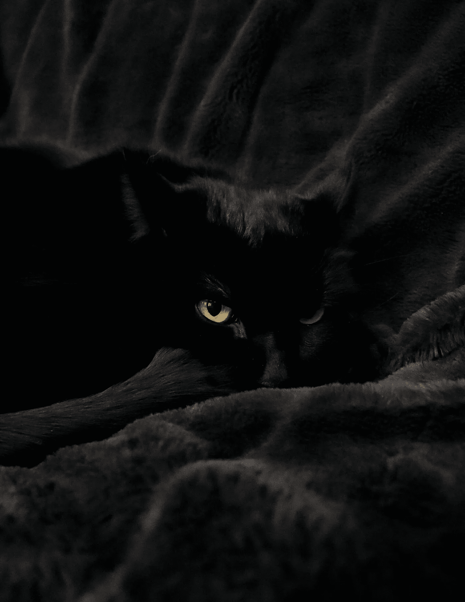

# 黑猫——敌人还是朋友？

> 原文：<https://medium.com/coinmonks/the-black-cat-foe-or-friend-91f630f2d04f?source=collection_archive---------51----------------------->

来源:[希瑟](https://unsplash.com/@hlaurphotography)

好了，不要再说敌人了…

## 有人说九条命

随着时间的推移，这些美丽的黑色野兽被描绘成拥有第六感的动物。就我个人而言，当他们靠近时，我皮肤上的毛发有时会竖起来。就好像他们能感觉到你的每一个存在，或者能看到你从内在散发出来的气场。从古代…