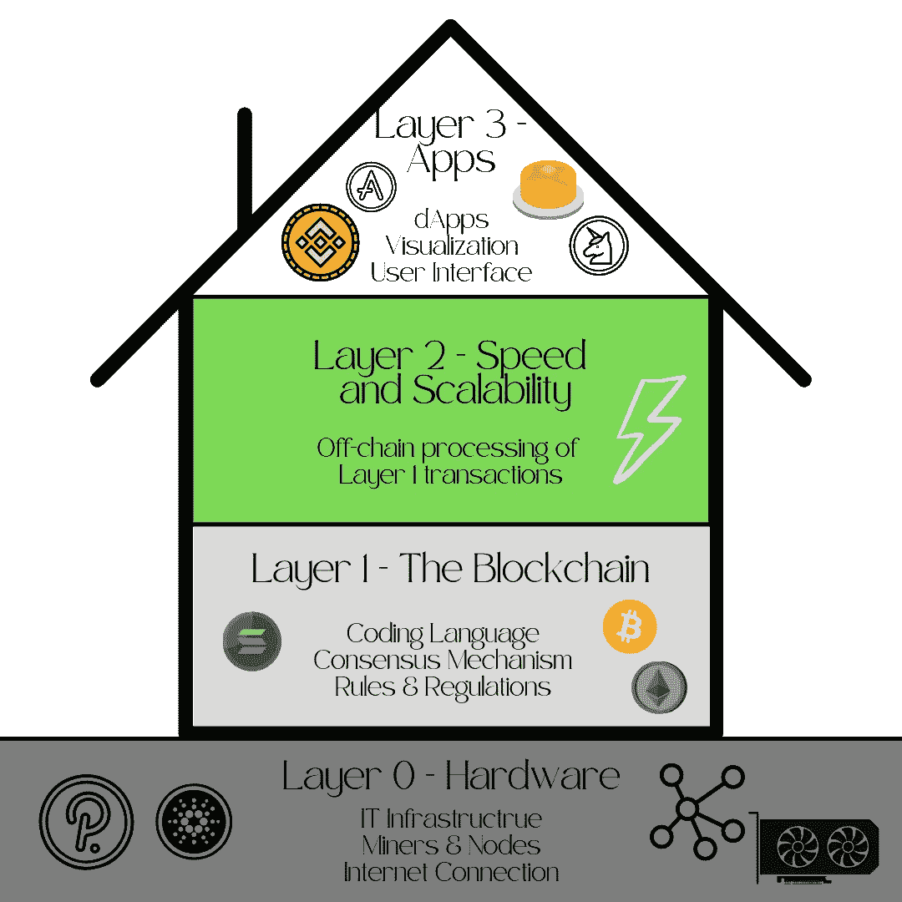
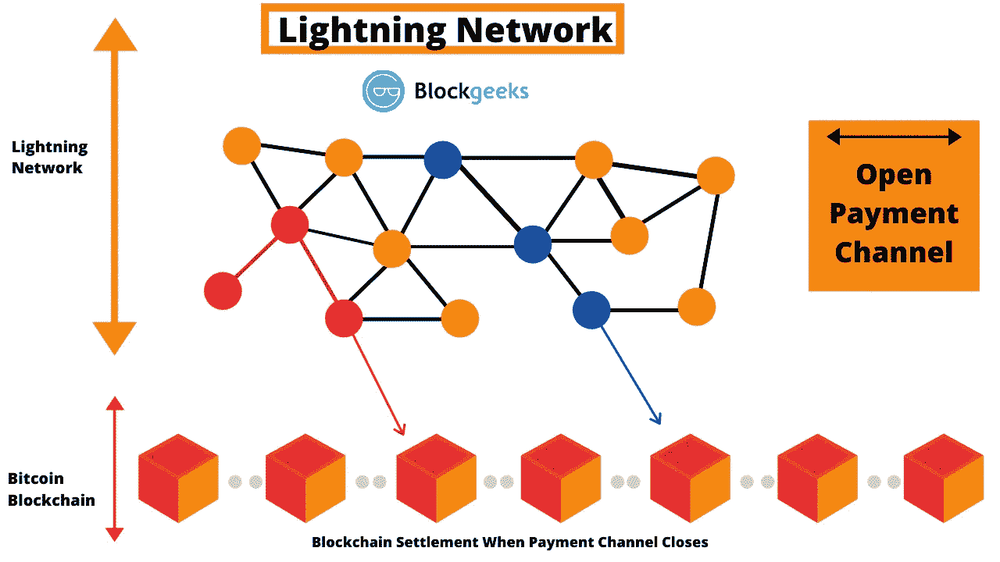
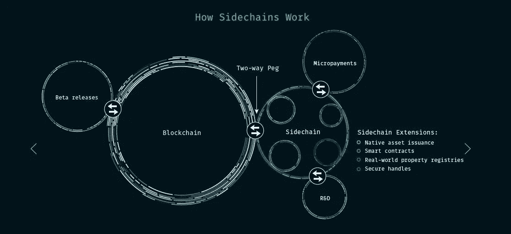

# 区块链初学者指南—图层

> 原文：<https://medium.com/coinmonks/the-block-beginners-guide-layers-2ffc9ee94b82?source=collection_archive---------28----------------------->

## 了解各层与区块链的关系，它们是如何工作的，以及为什么它们对技术的效率和可扩展性至关重要。

Photo by [Clark Van Der Beken](https://unsplash.com/@snapsbyclark?utm_source=medium&utm_medium=referral) on [Unsplash](https://unsplash.com?utm_source=medium&utm_medium=referral)

当谈到 Web 3.0 和去中心化账本技术(DLT)时，尤其是结合区块链时，你可能已经听到人们谈论各种层。但是它们到底是什么，为什么如此重要？

在这篇文章中，我们来看看层如何在 IT 生态系统中发挥重要作用，以及如何为区块链设置工作。理解关键差异并分解词汇表将有助于您理解这项新技术的优势、风险和动力。

# 多层的房子

虽然没有区块链层的通用标准，但 3 层方法可能是最常见的方法。

我最喜欢把区块链层比作房子。虽然基础(L0)，底层(L1)和屋顶(L3)是固有的要求，任何额外的地板(L2)是可选的。L2 等额外楼层有助于避免拥挤，并为效率和可扩展性提供更多空间。没有基础，你就无法建造上层建筑或屋顶。虽然每一层都提供不同的功能，但它们都是互连的。

The House of Blockchain Layers

现在，我们已经对区块链生态系统的构建有了基本的了解，让我们更详细地看看每一层是做什么的。

# 生态系统的细节

## 第 0 层—区块链的互联网

这是基础层，包括构建区块链生态系统主干的硬件和软件。

> 第 0 层是运行在区块链下的网络框架。它由协议、连接、硬件、挖掘器等组成，构成了区块链生态系统的基础。( [Coinmarketcap](https://coinmarketcap.com/alexandria/glossary/layer-0)

第 0 层还支持链间可操作性，也就是说，它允许区块链相互通信。它为解决后续层的可伸缩性问题提供了重要的基础。第 0 层通常使用提供参与和开发访问的本机令牌。这一层可以被视为“区块链的互联网”。

第 0 层的例子有:[波尔卡多特](https://polkadot.network/)、[阿弗兰切](https://www.avax.network/)、[卡尔达诺](https://cardano.org/)和[宇宙](https://cosmos.network/)

## 第 1 层-区块链

如果第 0 层是地下室，第 1 层代表底层，因此大部分代码对更广泛的公众是可见的。当人们提到以太坊和比特币时，这就是他们所说的那一层。

L1 代表了实际的区块链，并承担了大部分工作负载，如共识机制、编程语言、区块时间、争议解决以及维持区块链网络基本功能的规则和参数。

这一层必须处理的大量任务通常会导致可伸缩性问题。随着越来越多的用户进入特定的区块链，需要越来越多的计算能力来解决和添加区块链，这反过来导致费用增加和处理时间变慢。

改进的共识机制，如利益证明和分片(将计算任务分成更小的块)的引入，部分缓解了扩展问题。然而，过去已经证明，它们是不够的。

第一层的例子有:[比特币](https://bitcoin.org/en/)、[以太坊](https://bitcoin.org/en/)、[币安智能链](https://docs.binance.org/)和[索拉纳](https://solana.com/)

## 第 2 层—速度和可扩展性

第 2 层旨在为区块链 L1 的可扩展性问题提供解决方案。

虽然想法保持不变，但通过从第 1 层、第 2 层解决方案中分流流量来缓解拥塞采取了不同的形式。为简单起见，我将介绍第 2 层解决方案的最常见形式，但不会详细讨论它们的优缺点。

**状态通道** 状态通道批量采集和处理交易。然而，并不是批中的每一单个交易都被报告给链。可以把它想象成一个处理事务的独立链(或通道)。第 1 层只存储来自第 2 层的有效性信息(信道状态),而不是记录每一个事务。

例子:[比特币闪电网](https://lightning.network/)

Source: [https://blockgeeks.com/guides/lightning-network/](https://blockgeeks.com/guides/lightning-network/)

**侧链** 侧链是独立的区块链，与现有的第 1 层并行运行，通过双向网桥(peg)与 L1 的本地令牌相连。侧链使用自己的协议、一致算法、块参数和治理来处理事务，但使用第 1 层令牌。这意味着 ETH 侧链将在 ETH 中进行交易，而不需要另一个令牌，并且在侧链上开发的任何 dApps 将无缝集成到第 1 层网络中。

例子:[比特币的根茎](https://www.rsk.co/)

Source: [https://www.coindesk.com/learn/an-introduction-to-sidechains/#:~:text=Real%2Dlife%20examples%20of%20sidechains,on%20top%20of%20Bitcoin's%20mainnet](https://www.coindesk.com/learn/an-introduction-to-sidechains/#:~:text=Real%2Dlife%20examples%20of%20sidechains,on%20top%20of%20Bitcoin's%20mainnet).

**汇总** 汇总将交易处理部分从区块链中取出，只将结果报告给区块链。汇总在第 1 层之外执行事务，然后将数据提交到达成一致的第 1 层。

示例:[用于 ETH 的 ZSync】](https://zksync.io/)

**嵌套链** 嵌套的区块链本质上是另一个区块链内的区块链，或者更确切地说，是另一个之上的。嵌套的区块链体系结构通常包括一个主区块链，它为一个更广泛的网络设置参数，而执行是在一个次级链的互联网络上进行的。可以在主链上构建多个区块链级别，每个级别都使用父子连接。父链将工作委托给子链，子链处理并在完成后返回给父链。底层基础区块链不参与二级链的网络功能，除非有必要解决争议。(来源:[Gemeni.com](https://www.gemini.com/cryptopedia/blockchain-layer-2-network-layer-1-network))

示例:[ETH 上的 OMG 血浆](https://omg.network/)

## 第 3 层—应用程序(用户界面)

第三层是最终肉眼可见的部分。这些是参与者最终使用的用户界面(UI)。这一层试图在处理 L1 和 L2 时提供简单和方便。L3 不仅提供 UI，还以链内和链间可操作性的形式提供效用，例如通过分散的交换、流动性供应和赌注应用。

第 3 层接口通常被称为分散应用(dApps ),它为区块链技术提供真实世界的应用。

**例题**

分散加密交换: [Uniswap](https://uniswap.org/) ， [Pancake Swap](https://pancakeswap.finance/)

钱包提供商和集中交易所:[比特币基地](https://www.coinbase.com/)，[币安](https://www.binance.com/en)

贷款和流动性管理: [Aave](https://aave.com/) ，[复利](https://compound.finance/)

支付:[龙卷风现金](https://tornado.cash/)

# 与 Web 2.0 的比较

传统的 Web 2.0 层一般被认为是上厚下薄。这意味着包括服务器技术和软件应用程序在内的顶层得到了最多的关注和开发。另一方面,[骨干](https://en.wikipedia.org/wiki/Internet_backbone)在过去的二十年里几乎没有什么变化。这导致了头重脚轻的结构，由跨国公司控制，主要目的是为股东创造利润，而不是推进技术。

Web 3.0 试图通过激励所有层面的创新和创造力来根除这种现状。到目前为止，Web 3.0 的去中心化本质很少受到监管，并且主要由开发人员社区驱动，而不是大型 IT 集团。社区和个人将他们的工作货币化的能力，成为新思想的滋生地，并吸引同时在各个层面工作的人才，最终形成一个快速发展的生态系统。

# 总结和结论

虽然 Web 3.0 的层的概念与 Web 2.0 没有很大的不同，但是不同层的方法肯定是不同的。

Web 2.0 带来了高度先进的前端解决方案，而底层基础设施几乎没有变化。被许多人使用但被少数人控制，Web 2.0 开始显示出局限性和缺乏创新。

这与 Web 3.0 形成对比。在这里，软件 dApps (L3)可能是创新中最明显的部分，但我们在底层技术(L0-L3)方面经历了更强大的进步。社区和开发者在所有层面赚钱的能力导致了一个不断扩大的创新周期，参与者众多。

尽管这种快速推进的创新步伐可能最终会惠及所有人，但我们必须小心，不要让任何利益相关者掉队。当涉及到行业标准、安全和监管等问题时，尤其如此。

没有规则导致无政府状态，规则太多导致压迫。

**作者的一句话:**
欢迎联系我或者在评论区发起一个对话！

请务必订阅并访问我们关于[Medium.com](/@inside-block)的其他文章

加入 Telegram、脸书、Instagram 和 Twitter 上的“街区内部”,了解 crypto 和区块链。(下面的链接)

 [## 在块内部|链接树

### 穿越噪音&提供关于区块链、Web 3.0、NFTs 和 DeFi 的信息

linktr.ee](https://linktr.ee/Insidetheblock) 

[在社交媒体上联系 Block 和 real 里面所有可用的文章](https://linktr.ee/Insidetheblock)！

*免责声明:本文中的任何信息都是基于我的个人经验，并根据我的知识和能力出于个人兴趣而撰写的。本文没有宣传目的，不代表投资建议，文中提到的任何名称、品牌和报价仅用于说明目的。小心使用任何相关链接，风险自负。永远做你自己的研究。*

> 加入 Coinmonks [电报频道](https://t.me/coincodecap)和 [Youtube 频道](https://www.youtube.com/c/coinmonks/videos)了解加密交易和投资

# 另外，阅读

*   [用于 Huobi 的加密交易信号](https://coincodecap.com/huobi-crypto-trading-signals) | [HitBTC 审查](/coinmonks/hitbtc-review-c5143c5d53c2)
*   [如何在 FTX 交易所交易期货](https://coincodecap.com/ftx-futures-trading) | [OKEx vs 币安](https://coincodecap.com/okex-vs-binance)
*   [OKEx vs KuCoin](https://coincodecap.com/okex-kucoin) | [摄氏替代品](https://coincodecap.com/celsius-alternatives) | [如何购买 VeChain](https://coincodecap.com/buy-vechain)
*   [ProfitFarmers 点评](https://coincodecap.com/profitfarmers-review) | [如何使用 Cornix 交易机器人](https://coincodecap.com/cornix-trading-bot)
*   [如何匿名购买比特币](https://coincodecap.com/buy-bitcoin-anonymously) | [比特币现金钱包](https://coincodecap.com/bitcoin-cash-wallets)