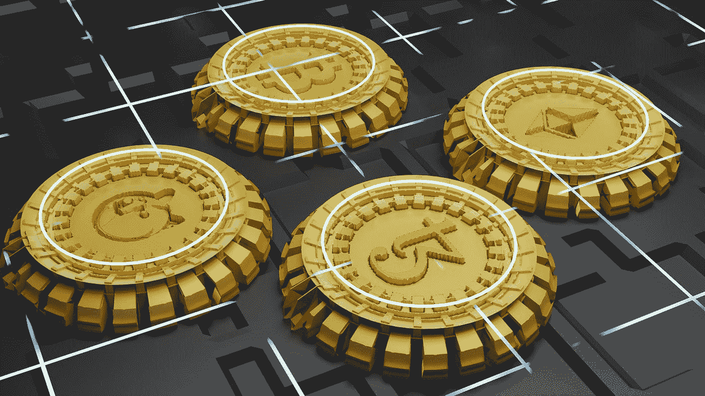
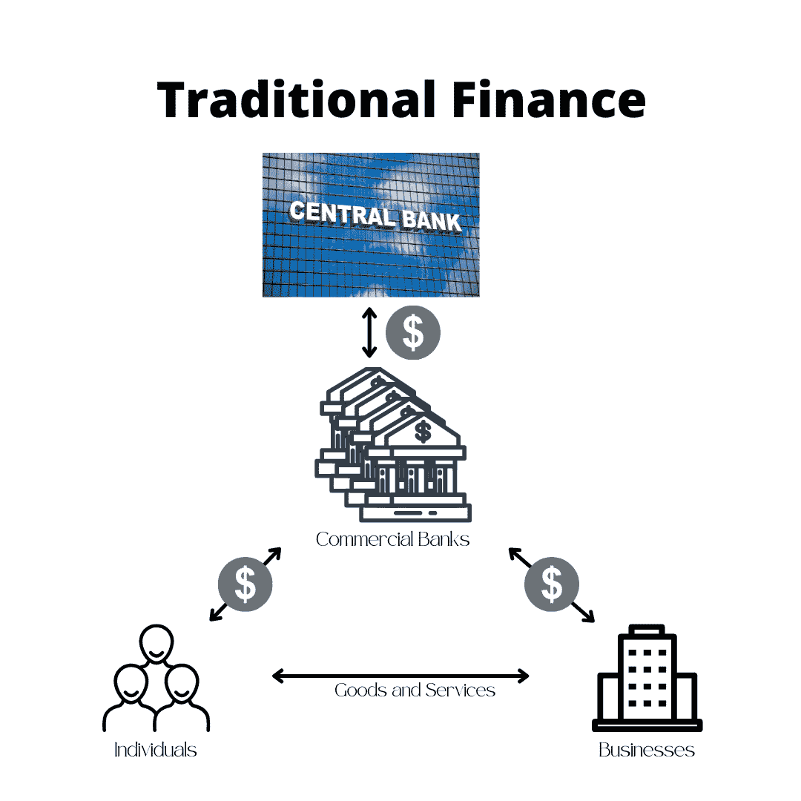
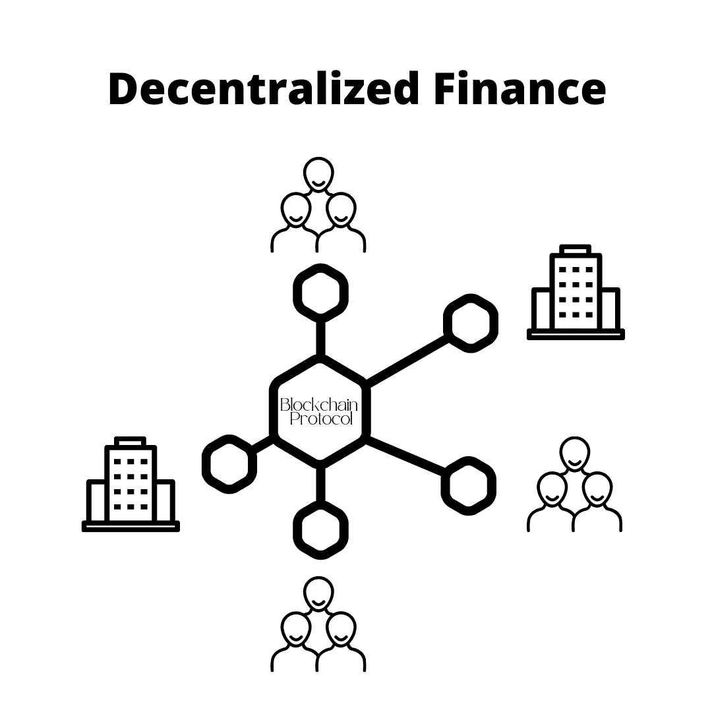

# 区块链初学者指南——去中心化金融(DeFi)

> 原文：<https://medium.com/coinmonks/the-blockchain-beginners-guide-decentralized-finance-defi-471e487f9d6c?source=collection_archive---------20----------------------->

了解你需要知道的关于 DeFi 的一切。了解术语、工作原理、优点和局限性。

分散金融(DeFi)涉及使用区块链技术来促进传统的金融交易。这篇文章将帮助你建立安全地与这种新形式的金融互动所需的知识。它将展示这种新的融资方式带来的好处和局限性。

*免责声明:我故意避免深入任何特定的 DeFi 协议，但尝试解释 DeFi 如何工作，它与传统金融相比的现状，以及潜在的未来影响。*

Photo by [Shubham Dhage](https://unsplash.com/@theshubhamdhage?utm_source=medium&utm_medium=referral) on [Unsplash](https://unsplash.com?utm_source=medium&utm_medium=referral)

**DeFi 的定义及其存在的原因**

首先，我们需要理解 DeFi 的定义，以及它最初为什么会存在。

**什么是 DeFi？**

分散金融寻求通过使用区块链技术减少金融交易中的中间人数量来促进金融交易。

传统金融市场由银行和管理机构控制，而 DeFi 则由算法协议和点对点(P2P)交易管理。减少这些中间商增加了透明度，降低了成本，提高了交易速度。

虽然在理论上这听起来很棒，但在实践中，目前有许多未回答的问题阻碍了广泛采用。但稍后会详细介绍。

**金融史简要讲座**

让我们先花点时间回到过去理解(传统的)金融市场。

在人类历史的很大一部分时间里，贸易都局限在当地，主要是因为缺乏高效的运输。人们可以通过交换物品在当地进行交流。作为交换手段的货币的发明促进了贸易，货币迅速成为贸易的主要媒介。商品可以换成货币，而货币又可以换成其他商品。货币提供了一种储存、交换和运输价值的简单方式。

这导致了一系列货币的诞生。有时到了邻近城镇会铸造他们自己的货币的程度。这提出了一个新问题；一个人怎么能在使用不同货币的地方买卖商品呢？

**输入银行和交易所**

银行将允许人们储存、兑换或借出不同的货币。对于他们的服务，他们会收取费用。

不断改进的交通工具导致贸易和商人财富的增加。与此同时，银行成为贸易不可或缺的一部分，其中许多银行为已经控制了商品贸易的商人所拥有。最终创造了一个非常强大和有影响力的公民阶层，不断重塑社会的权力分配。

由国家管理的中央机构的建立旨在限制和控制这些全能的商业银行的权力。中央银行的任务是引入和控制中央货币，以及监督资本流动。通过行使其职权，它们将稳定币值，有效地进一步促进货币作为交换手段的使用。

这就是我们今天所知道的金融体系，一些中央银行通过其他银行控制货币体系，这些银行反过来控制我们使用货币来储存、交换和借贷的方式。

Simplified view of a Traditional Finance

你可能会问，如果当前的金融体系是一台如此成熟的机器，为什么要改变它？

嗯，今天的世界与这个系统刚建立的时候大不相同。商品和服务以前所未有的速度交换，贸易路线几乎没有限制，互联网等技术改变了我们做生意的方式。

因此，传统金融系统及其众多的控制实体和中间人越来越难以在速度、成本和可扩展性方面提高效率。

**我们应该忘记传统金融，转而使用 DeFi 吗？**

尽管密码爱好者希望听到肯定的回答，但最直接的答案更有可能是否定的。DeFi 不仅可以取代传统金融，还可以增强和改善现有的设置。要了解原因，让我们仔细看看 DeFi。

**什么是 DeFi，如何使用？**

如前所述，DeFi 允许参与者在对等的基础上进行金融交易，并且只有一个基于区块链的算法作为中间人。

与传统货币不同，DeFi 使用加密货币和代币作为交易媒介。

Simplified View of DeFi

分散融资目前有三个主要应用。

1.  资产转让和交换
2.  赌注和流动性管理
3.  放款

**转让&资产交换**

参与者可以通过去中心化应用程序(dApps)直接相互转移资产，如钱包和交易所。底层的区块链协议确保交易的完整性并存储所有信息。

代币和货币可以通过交易所买卖，这些交易所可以是集中式的(CEx ),即由受控实体经营，也可以是非集中式的(DEx)。DEx 仅充当连接买方和卖方的平台，并且仅由使用智能合约的数字协议管理。任何人都可以与分散的交易所互动，而不需要任何 KYC。

DEx 的性质提供了无限制的访问、高处理速度和低成本。

另一方面，分散的性质也意味着不可能撤销交易，并且在出现欺诈或错误的情况下没有可以求助的控制机构。

 [## 分散交换. DeFi 加密交换列表(DEX)

### 2020 年是分散式交易所(以下简称 dex)占据主流的一年，2021 年将是…

defirate.com](https://defirate.com/dex/) 

**跑马圈地&流动性管理**

像银行一样，许多 DeFi 协议允许参与者从其持有的资产中赚取利息。通常情况下，如果长期持有，利息会增加。这些流动资金被称为**池**。

例如，有人决定购买一枚稳定的美元硬币。然后，这些硬币被放入一个水池中一段时间。在期限结束时，投资者将收回他的硬币加上利息。

除了游泳池，还有**农场**。场使用一个称为 LP 的特殊令牌，它是在两个令牌配对时生成的。这个 LP 然后被交还给协议，并为想要交易该令牌对的其他参与者注入流动性。协议规定，通过有限合伙人注入流动性通常会获得该货币对交易的一定比例的奖励。

例子:一个投资者拥有 USDT 和 ETH。他现在可以将这些资产合并到 USDT/联邦理工学院的 LP 中，然后交给 DEx 协议。该协议将根据其他市场参与者在 USDT 和瑞士联邦理工学院之间的交易支付报酬。

LP 令牌的使用包含所谓的[“非永久性损失”](https://academy.binance.com/en/articles/impermanent-loss-explained)的风险，我们将在另一篇文章中讨论。

池和农场背后的想法是激励参与者通过锁定令牌并将其交给协议供进一步使用来为协议提供流动性。这确保了有足够的代币和货币供应来维持有效的市场和价格稳定。

 [## 加密赌注奖励概述

### 赌注回报是赌注和加密增长工具的领先数据提供商。我们目前正在跟踪和 263…

www.stakingrewards.com](https://www.stakingrewards.com/) 

**借贷**

与传统金融一样，市场参与者可以分为两类，拥有资本的人(贷方)和寻求资本的人(借方)。贷方愿意将他们的资产交给借方以换取利息。

银行通常扮演中间人的角色，将双方联系起来。在 DeFi 中，所有的借贷都是基于协议的点对点交易。

借贷利率取决于协议的去中心化程度。与银行类似，集中交易所通常向贷款人提供略低的利率，因为它们收取做市商费用。分散式交易所通常提供更好的利率，但由于参与者完全依赖于基础协议的效率，因此风险增加。

由于没有昂贵的中间人，DeFi 开放了小额交易贷款。从管理的角度来看，传统银行没有兴趣发放小额贷款，即使发放，成本通常也很高。对于 DeFi 协议来说，数量的多少没有什么区别，因为该过程是完全自动化的，并且是基于对等的。

从负面来看，DeFi 贷款完全依赖于基础协议的稳定性，并且没有监管监督。由于加密令牌的易变性质，这可能导致欺诈、缺乏流动性和抵押问题。

 [## 加密贷款利率

### 借贷市场是任何货币市场的重要组成部分。临时获得或卸载资金的能力…

defirate.com](https://defirate.com/lend/) 

现在我们已经了解了 DeFi 是什么以及如何使用它，让我们来看看它的优点和缺点，以便评估 DeFi 的价值。

**DeFi 的优势**

1.  全自动协议允许**更低的交易成本**、**更高的回报率**和**透明度**。
2.  **消除人为错误**，除非基础合同写得不好
3.  **进入门槛低**，任何有互联网连接的人都可以参与
4.  **无权限**；完全由用户控制，不依赖做市商和其他中介

**DeFi 的缺点**

1.  对基础区块链的依赖。《区块链议定书》的弱点会对 DeFi 项目产生影响。这包括可扩展性问题和生态影响。
2.  低**流动性**可能导致 DeFi 项目无效，因为参与者无法从协议中提取资金。
3.  区块链之间的互操作性意味着许多项目是孤立的
4.  缺乏监管和保险意味着参与者更容易遭受欺诈和滥用。
5.  **智能合约的漏洞**而代码中的缺陷可能导致 DeFi 合约的崩溃或使其面临欺诈。
6.  交易所带来的**集中化**和**瓶颈**风险。
7.  **你的责任**:即使区块链和 DeFi 协议完美无瑕，去中心化意味着每个用户都要对自己的行为 100%负责。

**结论，风险是否大于收益？**

首先，人们必须认识到 DeFi 仍然是一个非常年轻的概念，因此将继续有突破和崩溃的时刻。

前进的道路肯定不会一帆风顺，但 DeFi 有办法将一个陈旧、缓慢且昂贵的系统带入 21 世纪。许多中央银行和金融机构已经开始发展或至少承认 DeFi 的影响。然而，克服一些问题需要时间。特别是建立法律框架和适当的规章制度，为投资者提供额外的安全保障。缺乏这种技术将阻止大型机构和企业采用这种技术，原因很简单，他们无法承受监管机构的审查。

所以，在不久的将来，也许不是所有的事情都会被定义。但是更低的成本、额外的透明度、访问的便利性和交易速度是围绕这项新技术展开对话的令人信服的理由。因此，DeFi 更有可能增强当前的金融体系，而不是彻底取代它。

**作者的一句话:**
加入 Telegram、脸书、Instagram 和 Twitter 上的“街区内部”，了解 crypto 和区块链。点击以下链接查找我们所有的社交媒体和联系方式:

请务必订阅并访问我们关于[Medium.com](/@inside-block)的其他文章

 [## 在块内部|链接树

在社交媒体上联系街区内的所有可用文章](https://linktr.ee/Insidetheblock) 

*免责声明:本文中的任何信息均基于我的个人经历，出于个人兴趣而撰写。本文没有宣传目的，不代表投资建议，文中提到的任何名称、品牌和报价仅用于说明目的。小心使用任何相关链接，风险自负。永远做你自己的研究。*

> 加入 Coinmonks [电报频道](https://t.me/coincodecap)和 [Youtube 频道](https://www.youtube.com/c/coinmonks/videos)了解加密交易和投资

# 另外，阅读

*   [如何购买 Monero](https://coincodecap.com/buy-monero) | [IDEX 评论](https://coincodecap.com/idex-review) | [BitKan 交易机器人](https://coincodecap.com/bitkan-trading-bot)
*   [CoinDCX 评论](/coinmonks/coindcx-review-8444db3621a2) | [加密保证金交易交易所](https://coincodecap.com/crypto-margin-trading-exchanges)
*   [红狗赌场评论](https://coincodecap.com/red-dog-casino-review) | [Swyftx 评论](https://coincodecap.com/swyftx-review) | [造币厂评论](https://coincodecap.com/coingate-review)
*   [Bookmap 评论](https://coincodecap.com/bookmap-review-2021-best-trading-software) | [美国 5 大最佳加密交易所](https://coincodecap.com/crypto-exchange-usa)
*   [如何在 FTX 交易所交易期货](https://coincodecap.com/ftx-futures-trading) | [OKEx vs 币安](https://coincodecap.com/okex-vs-binance)
*   [CoinLoan 审查](https://coincodecap.com/coinloan-review) | [YouHodler 审查](/coinmonks/youhodler-4-easy-ways-to-make-money-98969b9689f2) | [BlockFi 审查](https://coincodecap.com/blockfi-review)