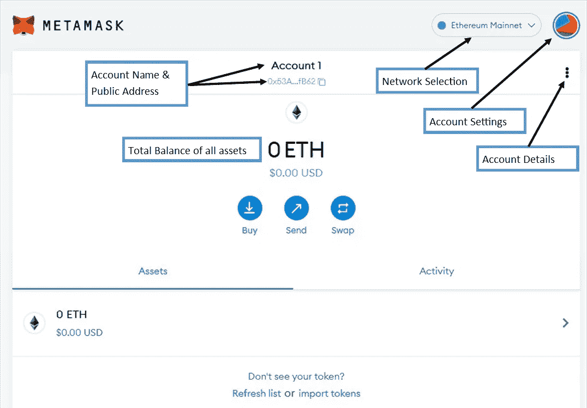
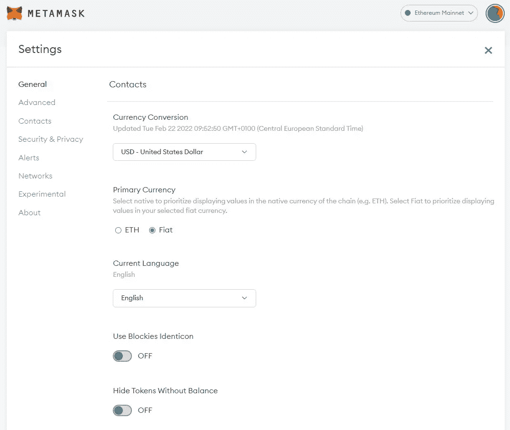
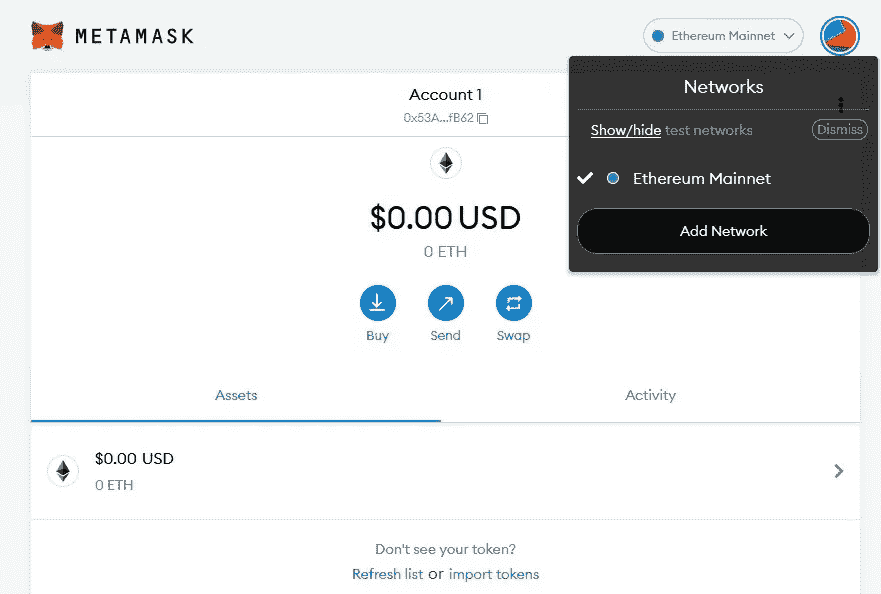
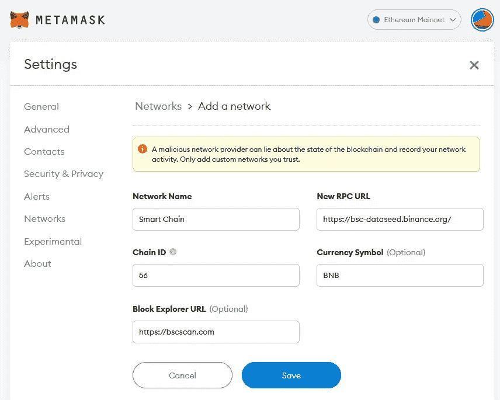
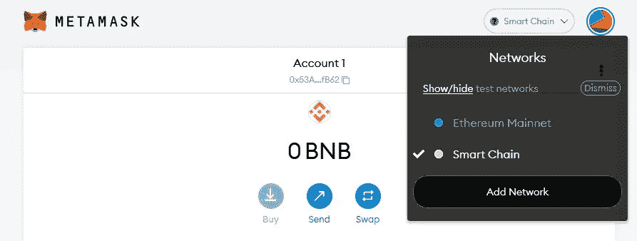
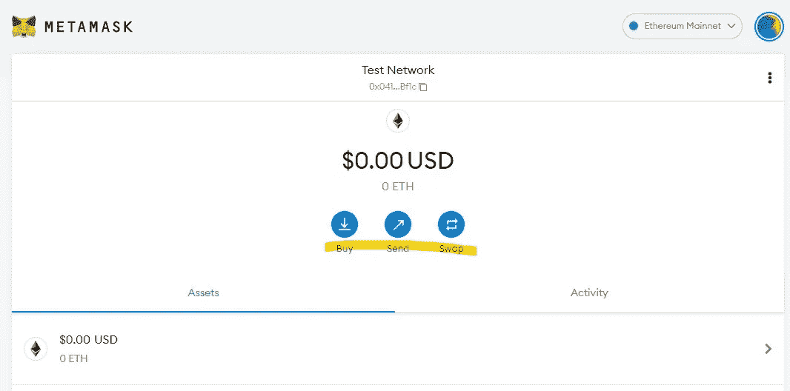
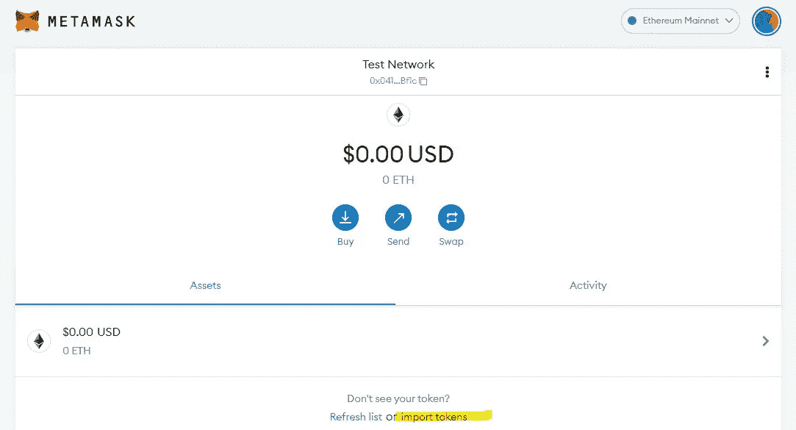
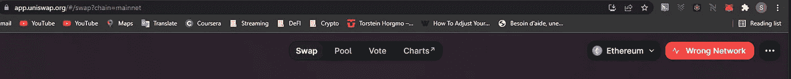
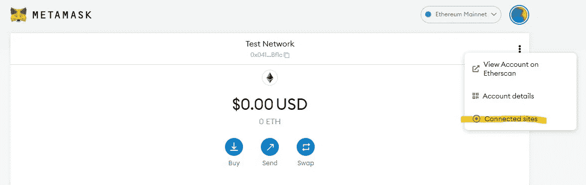

# 区块链初学者指南— Meta Mask

> 原文：<https://medium.com/coinmonks/the-blockchain-beginners-guide-meta-mask-e54f32629bc2?source=collection_archive---------15----------------------->

## 不熟悉加密？需要一个易于安装并能容纳几乎任何加密货币或 NFT 的钱包吗？关于设置 Meta Mask 软件钱包，您需要知道的一切。

# 什么是 Meta Mask，我为什么要使用它？

维基百科的官方描述是:

> **MetaMask** 是一款软件加密货币钱包，用于与以太坊区块链互动。它允许用户通过浏览器扩展或移动应用程序访问他们的以太坊钱包，然后可以用来与分散的应用程序进行交互。MetaMask 由区块链软件公司 ConsenSys Software Inc .开发，专注于基于以太坊的工具和基础设施。([维基百科](https://en.wikipedia.org/wiki/MetaMask))

但是我觉得 MetaMask 不止这些！

MetaMask 是一款[软件钱包](https://inside-block.medium.com/the-blockchain-beginners-guide-the-wallet-2a66e22ec516)，可以通过网络浏览器、浏览器插件和 Android 和 iOS 的移动应用程序获得。第一版[元掩码](https://metamask.io/)仅基于浏览器，于 2016 年推出。根据 2021 年 11 月彭博的一篇文章，该工具已经积累了超过 2000 万的月活跃用户。

有许多软件钱包随时可用。大多数交易平台，如比特币基地、币安、北海巨妖都提供钱包服务。然而，这些钱包通常提供有限的功能，并且缺乏定制，尤其是对于想要使用多个区块链或者对小众代币和 NFT 感兴趣的人。

与基于交换的钱包不同，MetaMask 不提供在应用程序中存储法定货币或注册信用卡购买硬币的可能性。有链接到第三方网站，以购买加密与法定货币，但它不是 MetaMask 的核心优势。但是，它提供了一种简单而有效的方法，可以在一个位置保存和管理大量的加密资产。它几乎支持你能想到的任何链或令牌，并允许用户在需要时手动添加令牌和链。

由于 MetaMask 没有内部交易功能，因此(到目前为止)没有 KYC 要求。这意味着，注册和设置钱包不需要尽职调查或身份验证。

通过它的 API MetaMask 连接你的钱包到大量的加密交换，DeFi 项目，智能合同等。建立连接是一件轻而易举的事，只需点击几下鼠标，使用这些协议的交易就会自动反映到您的钱包中。

# 我如何第一次设置元掩码？

设置 MetaMask 钱包非常简单，只需几个步骤即可完成。根据您选择使用应用程序、网络浏览器还是插件，安装过程会略有不同。

对于大多数部件，所有平台上的安装过程都是相似的。安装是导向的，非常简单。

注意:在这篇文章中，我将关注基于桌面/浏览器版本的 MetaMask。但是，设置 MetaMask Mobile 是类似的。

1.  前往[头部 **MetaMask 下载页面**](https://metamask.io/download/)
2.  **选择您的设备**(浏览器、iOS、Android)
3.  单击“**为…** 安装元蒙版”
4.  允许你的浏览器**添加元掩码插件**
5.  点击**开始使用**
6.  现在，“设置助理”可以让您设置一个新的钱包，或者将您自己连接到现有的钱包。例如，如果您想在多个设备上使用钱包，连接现有的钱包会很有帮助。然而，现在我们关注**“创建(新)钱包”**
7.  同意(或不同意)用户数据条件
8.  设置您的**个人密码&同意使用条款**
9.  **观看**视频“保护您的钱包”。
    *确保你注意了，因为这将会谈到你的恢复阶段。如果没有恢复密码，您的钱包将永远无法使用，任何有恢复密码的人都可以使用您的钱包。因此，请确保您安全地存储这个短语！*
10.  注意**秘密恢复短语** *以物理方式或数字方式。如果以数字方式存储，确保存储器处于* ***离线状态*** *，如 u 盘，并有密码保护。*
11.  **按照正确的顺序重新输入恢复短语**。
12.  **祝贺您**您的 MetaMask 钱包已经设置好，可以使用了。

但是现在呢？好吧，现在我们需要明白我们在看什么。以下是您新创建的钱包的一些最有用的功能。

# 元掩码 101

让我们来看看您新创建的钱包的一些最重要的功能以及一些“隐藏”的功能。就我个人而言，我觉得这个界面非常友好，你应该很快就可以开始使用了。

## 主屏幕

这是您打开 MetaMask 钱包时看到的第一个屏幕。在这里，您可以查看您的资产，检查余额，并输入与您的 MetaMask 钱包相关的所有设置。

The MetaMask main screen is simple and everything can be accessed from here with a few simple clicks.

**账户名称&公共地址**
显示您账户的名称和公共地址。虽然名称是个人选择，可以随时更改，但公共地址是不可更改的，是永久的，这意味着它在(以太坊)区块链上注册，不能删除。

**账户详情** 点击三个圆点会给你选项；

1.  **在以太扫描** [上查看您的账户以太扫描](https://etherscan.io/.)是一款以太坊区块链浏览器，让您在区块链以太网上查看任何交易。通过输入一个公共地址，Etherscan 将向您显示与该地址相关的任何交易。如果您需要有关特定交易的信息，或者想要检查您的或您正在交互的任何其他公共地址，这将非常有用。
2.  **账户详情** 这将打开一个小弹出窗口，显示您账户的二维码和完整公共地址。**无论何时您想要将资产存入您的钱包，都需要您的公钥。尽管这是你的公钥，我还是建议你只把它交给你真正信任的第三方。当您的钱包与不同的第三方应用程序(如 Uniswap)连接时，您的公钥也将用作标识符。
    *注意:还有一个导出私钥的选项。私钥顾名思义；私人的，不能和任何人分享！***
3.  **账户设置** 在这里你可以选择添加**附加账户**，**导入现有账户**，**连接硬件钱包**，比如账本或者 Trezor。每个附加帐户都有自己的公共地址。如果你想分开你的资产，额外的帐户是有帮助的。每个额外的账户都有自己的公钥，就像你在银行有不同的账户一样。*你也可以访问元掩码帐户设置，我将在本文中单独讨论。*
4.  **网络选择
    默认情况下**meta mask 使用以太坊 Mainnet。对许多人来说，这包括大多数代币、硬币和非功能性货币。以太坊主网覆盖任何 ERC-20 兼容的令牌，但是元掩码允许您添加额外的网络，如越来越受欢迎的币安智能链、多边形或雪崩。*更多网络的详细设置指南可在下面找到。*

## **账户设置**

对于新用户，元掩码几乎不需要更改设置。然而，高级用户会发现各种各样的功能来进一步定制他们的体验。让我们来看看一些对初学者来说最重要的设置和一些更友好的用户体验的调整:

MetaMask offers a large amount of user settings to optimize and personalize your user experience.

**General** 就我个人而言，我更喜欢将**法币作为主要货币，**这样就可以显示所有持有资产的美元价值。此外，我倾向于“**隐藏没有余额的代币**”，让你的资产概览保持整洁。

**安全和隐私** 在这里你可以**透露你的秘密恢复短语**。正如本文开头提到的，恢复短语是您钱包的访问代码，必须始终保持安全。如果您忘记了登录凭据，或者要在不同的 PC 或移动设备上安装电子钱包，则需要使用恢复短语来访问您的电子钱包。只有使用密码登录元掩码 wallet，您才能访问恢复短语。没有您的恢复短语，就没有**密码恢复**。如果您丢失了恢复密码，您的帐户将无法恢复。在另一台设备上重新安装钱包时也需要恢复短语。

**网络**
管理、添加和删除网络。默认情况下，元掩码链接到以太坊主网。通过单击“添加网络”添加其他网络。如果您想与以太坊主网之外的其他区块链进行交互，此功能尤其有用。

## 添加其他网络

ETH Mainnet 支持近 50 万个兼容的 ERC-20 令牌，是元掩码的标准。最近，其他网络，如币安智能链，多边形或雪崩获得了吸引力。使用替代网络的原因是多方面的，包括处理速度、天然气费用和可扩展性等因素。

那么，如何向元掩码添加额外的网络呢？

在屏幕顶部点击“以太坊主网”下拉菜单，然后点击“添加网络”

The Ethereum Mainnet is the standard network on MetaMask. The chain holds all ERC-20 tokens and gives you access over 450.000 different tokens and coins.

这将打开一个屏幕，您可以在其中输入新网络的详细信息。一些受欢迎的补充是:

[币安智能链](https://academy.binance.com/en/articles/connecting-metamask-to-binance-smart-chain)
[多边形](https://docs.polygon.technology/docs/develop/metamask/config-polygon-on-metamask/)
[雪崩](https://support.avax.network/en/articles/4626956-how-do-i-set-up-metamask-on-avalanche)

*注意:当您手动添加网络时，请确保您使用的细节是真实的，否则您可能会将您的钱包暴露在欺诈交易中。*

Sample of what your screen should look like when you add the Binance Smart Chain.

保存后，您现在可以使用顶部的选项卡在网络之间切换。

Swap between chains easily with the Networks selection tab.

**买、送、换**

尽管没有提供真正的交换，MetaMask 允许您通过应用程序直接购买、发送和出售资产。

这可以通过使用主屏幕上相应的蓝色按钮来完成。

Buy, Send and Swap functions are easily accessible on the MetaMask Mains Screen.

1.  购买:这将带您进入一个弹出窗口，允许您通过三个不同的第三方供应商购买 ETH
2.  发送:您可以在这里将资产发送到您的其他钱包或第三方账户
3.  交换:这个功能可以让你从一项资产交换到另一项资产。有大量预选的令牌可供选择，在大多数情况下都应该涵盖这些令牌。

*如前所述，我将 MetaMask 用作纯存储钱包，实际上只使用了 send 功能。为了购买和交换资产，我使用第三方供应商，并链接到我的元掩码钱包。*

## 导入自定义令牌

元掩码允许您直接在主屏幕上创建和保存自定义令牌。对于希望持有鲜为人知的、新发行的令牌或通过 Airdrop 分发的令牌的高级用户来说，这尤其有趣。

Click on “import tokens” to add a token and its details manually.

单击“导入令牌”后，您将可以选择:

**搜索预定义的令牌；**添加预定义的令牌是不言自明的，只需搜索名称或滚动条，然后单击添加。

**添加自定义令牌；**定制令牌需要额外的细节，比如令牌合同地址、令牌符号和小数。

我们来看一个添加名为 FanVerseCoin[(ticker $ FANV)](https://etherscan.io/token/0x43835ca7646c07b6933d0c1c16ddc41c4cb5600e)的自定义 ERC-20 令牌的示例。

1.  转至 [Etherscan](https://etherscan.io/) 并键入您要查找的滚动条，在本例中为 [FANV](https://etherscan.io/token/0x43835ca7646c07b6933d0c1c16ddc41c4cb5600e)
2.  然后复制“合同地址”并粘贴到元掩码中
3.  元掩码自动完成符号和小数，但如果需要，您可以编辑此信息。
4.  单击“添加自定义令牌”
5.  将出现您要添加的令牌的预览
6.  单击“导入令牌”

现在，令牌将显示在元掩码主屏幕上您的“资产”下，您的钱包现在可以与令牌交互。

建议(尽管不是必需的)确保您计划与之交互的任何令牌首先在元掩码钱包中设置，然后再进行其他操作。因此，在这种情况下，你应该确保在 uniswap 等第三方网站上购买硬币之前，将 FANV 添加到元掩码中。通过这种方式，您的新余额将会立即更新，并且一旦在链上处理了交易，购买将会可见。

## 为什么发送到我钱包的令牌没有显示出来？

可能会出现令牌已发送到您的钱包地址(例如通过 Airdrop)但令牌未显示在“资产”下的情况。当您在将资产导入元蒙版之前购买资产时，也会发生这种情况。

没必要惊慌。您的资产都存储在区块链上，这意味着元掩码没有自动检测到资产，需要手动添加。只需按照上述步骤手动导入令牌。添加元掩码后，将直接从区块链加载代币，包括您的余额。

*请记住，如果您在设置中切换了“隐藏零余额”,没有余额的新代币将不可见。*

## 我如何使用第三方网站和应用程序？

MetaMask 允许您将钱包插入大量分散的工具和网站，包括交易所、DeFi 协议和智能合约。

这些工具然后与你的钱包通信。例如加密货币交易所，如 Mainnet 上的 [Uniswap](https://app.uniswap.org/#/swap?chain=mainnet) 或币安连锁店上的 [Pancakeswap](https://pancakeswap.finance/) 。

要将您的钱包连接到支持的网站，只需访问该网站，然后单击页面顶部的“连接钱包”。一些网站会问你想连接什么钱包，选择“元掩码”。

MetaMask 现在会提示一个弹出窗口，要求允许连接钱包。一旦获得授权，网站和你的钱包就可以互相通信了。*同样，确保你只允许可信的应用程序访问你的钱包。*

可能会有一个通知，说明您在“错误的网络”上。这仅仅意味着您当前在 MetaMask 中的网络与您当前试图链接的站点的网络不匹配(即不在同一链上)。例如，元掩码设置为币安智能链，而您正尝试连接以太网主网上的 UniSwap。要解决这个问题，只需前往 MetaMask，更改网络，然后刷新网站。现在你的钱包应该连接正确。

“Wrong Network” errors indicate that your selected MetaMask network is not compatible with the site your are using. Simply head to MetaMask and switch to a different network.

**断开站点**

一旦连接，MetaMask 将记住网站，以便当你回来时，你的钱包自动加载。要永久断开某个站点与您的钱包的连接，只需进入“帐户详情”选项卡，然后单击“已连接的站点”。现在，单击您想要断开连接的站点旁边的 bin 图标。

如果你觉得你连接的网站不值得信任，或者你不希望服务永久连接到你的钱包，这是非常有用的。

Connected Sites list all websites and protocols that can interact with your wallet.

# 关键要点

1.  MetaMask 是一个软件钱包，作为 iOS 和 Android 的浏览器插件和移动应用程序提供。
2.  根据定义，元掩码实际上并不包含您的资产。资产由区块链本身持有。您的元掩码钱包包含访问这些资金的密钥，并提供可视化用户界面。
3.  MetaMask 只是一个钱包。资产的购买和出售是通过您的元掩码所连接的第三方应用程序来完成的。
4.  您可以在同一个元掩码帐户下创建多个钱包，每个钱包都有自己的公共地址。
5.  Meta Mask 原生支持以太坊 Mainnet，其他链可以手动添加。
6.  大多数 ERC-20 令牌都是自动识别的。可以手动添加其他链上的未知令牌或资产。
7.  将您的恢复密码和私钥脱机保存在一个安全的地方。没有它们，您就有可能无法访问钱包中的所有资产。
8.  元掩码在与第三方应用程序和网站(如 exchanges 和 DeFi 协议)一起使用时最为强大。

## 了解更多信息和官方支持

要了解更多信息，你可以随时联系[元蒙版支持](https://metamask.zendesk.com/hc/en-us)，加入他们的 Discord 频道或查看[社区板](https://community.metamask.io/)。

在这种状态下，没有元掩码的官方电报通道。任何在 Telegram 上声称是元掩码或元掩码支持的频道都是非官方的。

*免责声明:本文中的任何信息都是基于我的个人经历，出于个人兴趣而写。这篇文章没有推广的目的，文中提到的任何名称、品牌和代号仅用于说明目的。小心使用任何相关链接，风险自负。永远做你自己的研究。*

> 加入 Coinmonks [电报频道](https://t.me/coincodecap)和 [Youtube 频道](https://www.youtube.com/c/coinmonks/videos)了解加密交易和投资

# 另外，阅读

*   [美国最佳加密交易机器人](https://coincodecap.com/crypto-trading-bots-in-the-us) | [经常性回顾](https://coincodecap.com/changelly-review)
*   [在印度利用加密套利赚取被动收入](https://coincodecap.com/crypto-arbitrage-in-india)
*   [Godex.io 审核](/coinmonks/godex-io-review-7366086519fb) | [邀请审核](/coinmonks/invity-review-70f3030c0502) | [BitForex 审核](https://coincodecap.com/bitforex-review)
*   [最佳比特币保证金交易](/coinmonks/bitcoin-margin-trading-exchange-bcbfcbf7b8e3) | [萝莉点评](/coinmonks/lolli-review-e6ddc7895ad8) | [比特币保证金交易](https://coincodecap.com/bityard-margin-trading)
*   [创造并出售你的第一个 NFT](https://coincodecap.com/create-nft) | [密码交易机器人](https://coincodecap.com/best-crypto-trading-bots)
*   [如何在 CoinDCX 上购买柴犬(SHIB)币？](https://coincodecap.com/buy-shiba-coindcx)
*   [CBET 评论](https://coincodecap.com/cbet-casino-review) | [库库恩 vs 比特币基地](https://coincodecap.com/kucoin-vs-coinbase)
*   [折叠 App 回顾](https://coincodecap.com/fold-app-review) | [LocalBitcoins 回顾](/coinmonks/localbitcoins-review-6cc001c6ed56) | [Bybit vs 币安](https://coincodecap.com/bybit-binance-moonxbt)
*   [加密保证金交易交易所](/coinmonks/crypto-margin-trading-exchanges-428b1f7ad108) | [赚取比特币](/coinmonks/earn-bitcoin-6e8bd3c592d9) | [Mudrex 投资](https://coincodecap.com/mudrex-invest-review-the-best-way-to-invest-in-crypto)