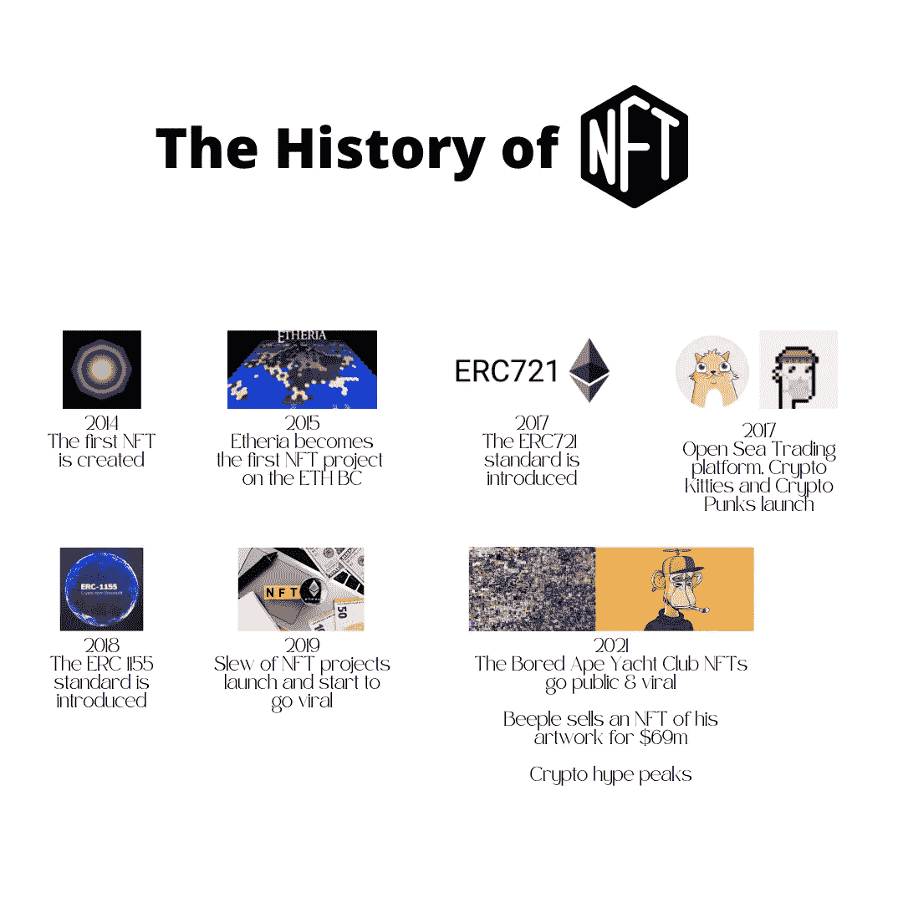

# 区块链初学者指南— NFTs

> 原文：<https://medium.com/coinmonks/the-blockchain-beginners-guide-nfts-1e1a2e01ab54?source=collection_archive---------19----------------------->

## 了解关于不可替换令牌(NFT)的所有知识。它们是如何工作的，为什么存在，如何处理，缺点在哪里。

Photo by [Andrey Metelev](https://unsplash.com/@metelevan?utm_source=medium&utm_medium=referral) on [Unsplash](https://unsplash.com?utm_source=medium&utm_medium=referral)

当 2017 年人们开始以 NFT 的形式交易小猫的数码照片时，很少有人会想到几年后这将成为一个数十亿美元的市场。现在没有一天你不会读到不可替代令牌(NFT)。

但是为了理解对 NFTs 的大肆宣传，我们需要更深入一点。在这篇文章中，我试图解释 NFT 是如何工作的，它们如何适应今天的世界，以及未来会怎样。

> 要点:
> -NFT 是与区块链关联的独特且不可互换的代币
> -NFT 于 2014 年首次出现，但直到 2019 年才引起公众的极大兴趣
> -NFT 最广为人知的形式是可收藏的(数字)艺术品
> -NFT 有各种各样的使用案例，包括房地产和数字身份证

# 什么是 NFT？

不可替代令牌本质上是一段具有唯一数字签名的数据，存储在一个可以交易的区块链(数字分类账)中。它们代表了简单加密货币的演变，尽管它们以类似的方式运行。与加密货币不同，NFT 的签名是不可互换的，因此提供了真实性的证明。但这意味着什么呢？

## NFT 对加密

加密货币是可互换的代币，这意味着代币的一个单位总是可以在 1:1 的基础上与另一个单位交换。比如说；一个比特币总是可以与另一个价值相同的比特币进行兑换。

最简单的 NFT 带有独特的数字签名，这使得它不可替代。虽然 NFT 可以与 crypto、fiat 甚至另一个 NFT 交换，但它们的独特性意味着它们永远只能被换成另一个价值。

## NFT 从何而来？

尽管第一个 NFT 诞生于 2014 年，但直到 2017 年，NFT 才受到广泛关注。那一年，通过在以太坊区块链和一系列 NFT 项目上实施标准(定义)。

今天以太坊是最广泛使用的区块链，用于 NFT 的创作和交易，尽管其他连锁店也越来越多地获得市场份额，原因我们将在后面讨论。现在让我们关注 ETH 标准。

以太网协议(ERC-20)在 2017 年的一份 Ehereum 改进提案(EIP)中首次概述了 NFTs。本标准获得批准，编号为 [ERC-721](https://eips.ethereum.org/EIPS/eip-721) 。在 2019 年和增强形式 [ERC-1155](https://eips.ethereum.org/EIPS/eip-1155) 紧随其后。结果是两个新的令牌标准 ERC-721 和 ERC-1155，它们定义了我们今天所知道的 NFT。

补充说明:ERC-721 要求每种类型的令牌都有一个新的智能合约，从而赋予每个 NFT 完全的唯一性。另一方面，ERC-1155 提供了更多的灵活性，因为它允许创建半可替换的令牌和批处理(在一次交易中交易多个 NFT)。

Brief Timeline of NFTs

 [## NFT 时间表

### 这个网站的重点是 NFTs(不可替换的代币)的发展和与艺术和音乐相关的 NFTs 的首次使用…

nfttimeline.com](https://nfttimeline.com/) 

# NFT 可以用来做什么？

除了收集小猫和猿的图像，NFT 实际上有各种各样的用例。它们可以用来认证真实世界或数字资产，而底层区块链则充当安全透明的账本。

让我们看一下 NFT 的一些用例；

## 艺术

今天，NFT 最广为人知的用途是用在艺术作品上，无论是数字作品还是实物作品。NFT 的数字签名允许辨别艺术品的真实性。此外，艺术品的交易历史可在区块链上追踪。NFTs 还允许艺术家接触到大量观众并与之交易，而不需要依靠拍卖行等中间人。

## 音乐

与艺术品类似，音乐人可以将他们的歌曲作为非音乐作品直接发布给他们的观众，而不依赖于标签，同时保持嵌入 NFT 的版权和版税。

## 电影

例如，电影制片厂可以制作一部现有电影的剧照，并以 NFT 的形式出售，以便为下一个项目筹集资金。另一方面，NFTs 可以配备一定的额外津贴，例如作为电影首映门票的能力，作为购买的额外奖励。

## 赌博

NFT 在在线游戏中变得越来越重要，它们被用在许多方面。玩家化身以 NFTs 的形式出现，作为数字身份，包含玩家可以交易的虚拟土地或物品。

## 数字身份

NFT 的独特性允许它们代表一个数字身份。这可以从提供访问您的在线服务而不是密码，一直到将护照或健康记录数字化。它们还可用于提供现实生活中的福利，其中 NFT 可作为会员卡，授予访问某些服务、位置或活动的权限。

## 房地产

每栋房子、每套公寓和每块土地都是独一无二的。房地产交易通常成本很高，并涉及许多中间人，如公证人或地方当局。将房地产资产标记为 NFT 不仅可以促进房地产的买卖，还有助于简化注册，并为房地产市场提供更多实时数据。

## 供应链管理

使用 NFT 作为产品 ID 有助于简化供应链管理，每个有权限的人都可以确定某个产品的原产地和目的地，而无需书面记录，并且在区块链上完全不可更改。它还可以用来验证产品的真实性和防止伪造。

虽然其中一些用例也继承了一定的风险，但它无疑表明，除了收藏艺术品之外，NFT 还可以在现实世界中有许多应用。NFT 可以为我们提供一种鉴别资产所有权和交易方式的替代方法。

# NFT 的利与弊

现在我们已经了解了什么是 NFT，让我们讨论一下它们的优点和缺点。

## 利益

*   **可转移性**；由于基础的区块链技术，非金融交易可以很容易地转移和交易。所需要的只是互联网接入。
*   **安全**；区块链的不变性确保了 NFT 的安全性，并允许参与者跟踪和追踪交易。
*   **灵活性**；只要底层协议允许，NFTs 可以整合多种功能和额外待遇，如版权和创作者未来交易的版税支付。
*   **速度&交易成本**；与 NFTs 交易时没有中间人，提高了速度并消除了第三方成本。
*   **职责**；NFT 的所有者对令牌承担全部责任，并且是唯一资产的唯一所有者。

## 缺点

*   **互通性**；NFT 依赖于它们的底层区块链，在不同的链之间转移它们可能很困难或者根本不可能。
*   **对区块链的依赖**；任何 NFT 都依赖于底层区块链的稳定。
*   **成本**；根据潜在的区块链，创建和转移 NFT 可能会以气费的形式产生高成本。NFT 市场会增加交易成本。
*   **市场场所**；非功能性交易(尤其是艺术品)严重依赖市场，这导致了市场的集中风险和对市场的依赖
*   **责任**；虽然区块链提供了分散化和自治，但这也意味着用户对其数据的安全性负全部责任。
*   **环境影响**；今天，大多数非功能性测试运行在证明工作链上，这被证明是高能耗的。
*   **不确定的规定**；与大多数加密资产一样，NFT 市场目前缺乏监管框架，这可能导致不确定性，并阻碍日常使用中的广泛适应。

# 结论

虽然最著名的是(数字)艺术收藏品，但 NFT 协议背后的开放架构允许对几乎任何资产进行令牌化，同时每个 NFT 的唯一性验证了该资产。

NFT 技术可以帮助促进贸易，简化供应链管理，保护版权，并提供关于令牌化资产的不可变的安全信息。

虽然这一切听起来很棒，但 NFTs 的概念仍然年轻，就像底层的区块链技术一样面临障碍。虽然目前围绕 NFTs 的大肆宣传对于开启围绕该技术的实用性的对话很有帮助，但在广泛采用之前，需要围绕该主题制定更明确的规则和法规。

**作者的一句话:**
加入 Telegram、脸书、Instagram 和 Twitter 上的“街区内部”，了解 crypto 和区块链。点击以下链接查找我们所有的社交媒体和联系方式:

请务必订阅并访问我们关于[Medium.com](/@inside-block)的其他文章

 [## 在块内部|链接树

### 穿越噪音&提供关于区块链、Web 3.0、NFTs 和 DeFi 的信息

linktr.ee](https://linktr.ee/Insidetheblock) 

[在社交媒体上联系街区内和现实中所有可用的文章](https://linktr.ee/Insidetheblock)

*免责声明:本文中的任何信息均基于我的个人经历，出于个人兴趣而撰写。本文没有宣传目的，不代表投资建议，文中提到的任何名称、品牌和报价仅用于说明目的。小心使用任何相关链接，风险自负。永远做你自己的研究。*

> 加入 Coinmonks [电报频道](https://t.me/coincodecap)和 [Youtube 频道](https://www.youtube.com/c/coinmonks/videos)了解加密交易和投资

# 另外，阅读

*   [Bookmap 评论](https://coincodecap.com/bookmap-review-2021-best-trading-software) | [美国 5 大最佳加密交易所](https://coincodecap.com/crypto-exchange-usa)
*   最佳加密[硬件钱包](/coinmonks/hardware-wallets-dfa1211730c6) | [Bitbns 评论](/coinmonks/bitbns-review-38256a07e161)
*   [新加坡十大最佳加密交易所](https://coincodecap.com/crypto-exchange-in-singapore) | [收购 AXS](https://coincodecap.com/buy-axs-token)
*   [红狗赌场评论](https://coincodecap.com/red-dog-casino-review) | [Swyftx 评论](https://coincodecap.com/swyftx-review) | [CoinGate 评论](https://coincodecap.com/coingate-review)
*   [投资印度的最佳密码](https://coincodecap.com/best-crypto-to-invest-in-india-in-2021)|[WazirX P2P](https://coincodecap.com/wazirx-p2p)|[Hi Dollar Review](https://coincodecap.com/hi-dollar-review)