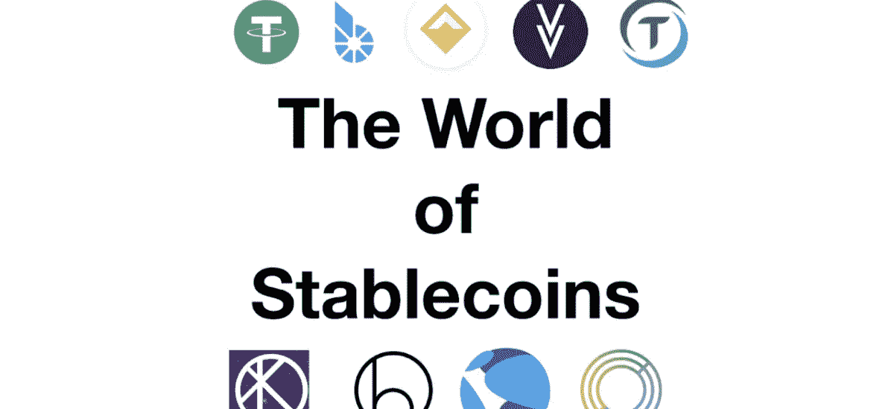

# 区块链初学者指南— Stablecoins

> 原文：<https://medium.com/coinmonks/the-blockchain-beginners-guide-stablecoins-19a5a79b1737?source=collection_archive---------14----------------------->

## 在这一集里，你将学到所有你需要知道的关于稳定犬的知识。它们是什么，它们是如何工作的，何时使用它们，以及相关的风险是什么？

The World of Stablecoins (Moralis Academy)

在本文中，我们将深入探讨稳定币的世界，并评估这些代币的定义、价值和风险。我们将评估用例，并阐明它们在加密货币大计划中的当前位置。

# 定义

> 稳定币是一种特殊的加密代币，它依靠基础资产来限制价值波动(即价格波动)。

很少有加密货币得到现实世界资产的支持。因此，它们往往会经历巨大的价格波动，并主要由需求和供应驱动。稳定债券旨在通过与作为储备持有的真实资产挂钩来缓解这一问题。储备中的资产充当抵押品，因此在理论上，代币总是反映该储备的价值。

最常见的稳定货币与法定货币挂钩，如美元、欧元或瑞士法郎。然而，这并不意味着稳定货币是官方货币的数字版本，也就是法定货币。这仅仅意味着该协议旨在维持基础法定资产的价格挂钩(例如，1 枚硬币= 1 美元)。

稳定硬币的协议可以与任何现实世界的资产相联系，尽管菲亚特是最常用的储备。非法定稳定币的一个例子是 [XAUT](https://gold.tether.to/) ，它与一盎司黄金的价格挂钩。

尽管法定货币受到央行及其管理机构的监管，但稳定货币在很大程度上不受监管，只是代表一种模仿和标记基础资产的数字协议。

尽管遵循相同的原则，但并非所有的稳定点都是平等的。主要区别在于该协议如何定义基础储备资产以及保持盯住汇率的方式。这一微小但重要的细节促使监管者越来越多地评估稳定资本的状况。

# 稳定曲线的类型

## 平面校对的

顾名思义，这些硬币是由传统的法定货币支持的，例如美元、欧元和瑞士法郎。这一术语还包括由贵金属等其他现实资产支持的硬币。就采用和数量而言，法定抵押债券是最普遍的类型。储备币和稳定币之间的 peg 通常是 1:1 的比率，尽管协议的作者可以完全自由地定义 peg。

稳定硬币的储备是由独立保管人而不是中央银行维持的。理想情况下，保管人受到定期审计和适当管理，以确保协议和令牌的安全性和稳定性。

菲亚特校准的 Stablecoins 的例子有来自币安的 [BUSD](https://www.binance.com/en/busd) 和来自 Circle 的 [USDC](https://www.circle.com/en/usdc) 。

## 秘密抵押的

这些稳定的货币由其他加密货币支持。准备金的高波动性通常会导致过度抵押。这意味着托管人需要持有比发行代币更多的储备，以防止抵押品短缺。一些加密抵押的稳定货币使用一篮子储备货币来分散波动风险。

这里的一个例子是 MakerDOA 的[戴](https://makerdao.com/en/)。

## 非抵押(算法)

无抵押的稳定货币不依赖储备来维持其价值。相反，一种算法通过干预供求来管理估值，类似于央行。在这个阶段，无抵押的稳定债券是有限的，还没有被广泛采用。

按市值过滤的 stablecoins 列表可在此处找到:

 [## 市值最高的稳定硬币代币|硬币市值

### 获取按市值✔️列出的稳定币的当前市值

coinmarketcap.com](https://coinmarketcap.com/view/stablecoin/) 

# 用例

你可能会问，为什么我要使用稳定的硬币，而不是直接购买或持有现实世界的资产？为了回答这个问题，让我们看看 Stablecoins 的可用性。

## 作为转移手段的稳定资本

转移法定货币可能会很麻烦、缓慢且昂贵。Stablecoins 旨在通过使用区块链技术来缓解这些问题。由于稳定硬币已经是真实资产的数字化版本，因此在钱包、平台甚至不同的区块链之间转移它们是简单、快速和高效的。区块链上的转让几乎是瞬间发生的，而且往往只是价格的一小部分。运动被记录在区块链上，这意味着它们是不可改变的，并且很容易被追踪。分散资产，从而不依赖全球银行体系，可能是另一个优势。然而，这也意味着任何转让都发生在通常的管辖和监管框架之外。这可能会对欺诈和恶意行为产生影响。

## 稳定作为价值储存手段

由于稳定的货币与现实世界的资产挂钩，它们可以被用作数字价值储存手段。加密领域的许多参与者使用 stablecoins 作为他们的数字储备货币，用于买卖其他加密货币和加密资产，如 NFT。将真实世界的资产带入和带出区块链可能会很复杂，并且会受到 KYC 和反洗钱的限制。Stablecoins 提供了一种过渡性解决方案，可以长期保持闲置资产的数字化。

一些较大的密码交易所，如币安已经推出了他们自己的 stablecoins。发行自己的 stablecoin 允许这些平台提供额外的服务，更有效地利用资产负债表，并帮助将用户绑定到他们的生态系统。

## 稳定收入作为投资

稳定的债券几乎没有波动性，因此对投资没有吸引力。然而，一些投资者寻求稳定的收益，因为它们可以提供比现实世界更高的收益。

因此，稳定的玉米可能会吸引保守的投资者，通过高产种植来赚取利息。crypto 中收益农业的概念类似于传统金融市场，在传统金融市场中，愿意持有某种资产并向市场提供流动性的参与者将获得回报。

在撰写本文时，许多稳定的硬币提供了比传统的法定货币存款更高的回报率。在真实世界利率远低于通胀的环境下，投资者可以转向稳定的货币来减轻资产贬值。

让我们看一个简化的例子，假设:

*   美元储蓄率为每年 1%
*   美元通货膨胀率为每年 6%
*   USDC 稳定的货币利率是每年 10%

从现在起一年后一笔 1.000 美元的**定期银行存款**将会是价值 950 美元的**，因为你的实际利率是负 5%。也就是说，你 1000 美元的存款将获得 10 美元的利息，但由于通货膨胀，你失去了大约 60 美元的购买力。**

另一方面，同样的 1000 美元存款在 USDC 将价值 1.040 美元，因为尽管通货膨胀，实际利率仍然为正。

许多集中式和分散式加密平台提供了从稳定的硬币存款中赚取利息的能力。尽管条款和条件因平台而异，但利率通常会明显优于常规资本市场。

# 稳定的货币利率解释

你可能会问，为什么稳定存款能够提供比传统存款更高的利率？

稳定债券的利率机制与传统金融市场相似，稳定债券的利息主要取决于两个因素。**贷款的需求和供给**和**协议如何定义准备金。**

## 贷款需求

对于一个正常运转的贷款市场，我们需要至少两个参与者。首先，我们需要一个“贷款人”，即拥有一项资产并愿意有偿出借的人。其次，我们需要一个“借款人”，即需要流动性的市场参与者。通常有一个第三方或“中介”连接贷款人和借款人。中介确保市场的完整性，收取费用和利息，并进行再分配。

在加密货币术语中，**“贷方”**是稳定币的所有者/持有者。**“借款人”**可能是一个交易者或希望用另一种加密货币借入稳定币的人。**【中介】**可以以不同的形式出现，如钱包提供商或加密货币交易所。

借款需求越高，中介收取的借款价格就越高。反过来，这增加了中介能够为提供流动性而支付给贷方的金额。

一些中介机构向愿意将存款锁定更长时间的贷款人提供额外奖励。类似于你银行的定期存款会比你的普通账户获得更高的利率。

通过提供流动性和分配奖励，stablecoins 在加密资产领域扮演了重要角色，与传统金融市场没有太大区别。

## 储备回报

对于贷方购买的每单位稳定币，中介将获得现实世界资产的等价物。这些现实世界的资产本身能够以利息和/或资产增值的形式产生回报。重新分配这些回报为贷方和中间方提供了额外的收入来源。

Stablecoin Interest Rates Explained (simplified)

对借贷的高需求，加上区块链的效率和相对较低的中介成本，使得稳定的货币能够产生远高于传统法定货币的利率。然而，重要的是要明白这是**当前的情况**和**可能会随着时间而改变！**

# 风险

和其他资产一样，债券也有一定的风险。除了交易对手风险等传统风险，稳定债券仍然是一个非常年轻的资产类别。它们在很大程度上不受监管，并且严重依赖于它们的底层协议。

## 协议风险

stablecoins 的存在完全基于底层协议。这意味着稳定币的值取决于协议如何定义储备以及协议如何有效地处理与现实世界资产的挂钩。没有一种稳定的方案是相同的，因此了解每种方案的能力和局限性以评估收益和风险是很重要的。

## 准备金或流动性风险

因为稳定币的价值与储备挂钩，所以理解储备本身的定义是很重要的。储备持有量越不稳定，大规模市场波动给稳定的货币持有者带来的风险就越高。储备货币的大幅贬值会导致钉住汇率制度的崩溃，这反过来又会带来稳定的货币价值贬值的风险。不断恶化的储备价值可能会迫使协议限制稳定货币的流动性，并给投资者带来风险。

## 监管风险

随着监管机构争相评估当前形势，Crypto 和区块链成了焦点。稳定货币尤其如此，因为它们与法定货币有许多相似之处。许多管理机构不喜欢央行和金融市场监管机构无法控制数字货币的想法。在我们看来，限制性监管将损害稳定资本的利益，并导致对其协议的干扰，最终给投资者带来风险。另一方面，由于欺诈和操纵的风险，没有任何法规或框架可以阻止广泛采用。

## 征税

一般来说，对密码征税的情况是复杂和分散的。Stablecoins 也不例外。

**购买、出售和交换**菲亚特抵押稳定债券通常很少或不引发税务事件，因为没有价格波动，因此没有资本收益。

另一方面，加密抵押和算法稳定的硬币会引发基于税收的硬币价格波动。

根据你的税收居住地**稳定收入的利息**可能需要缴纳所得税。

许多管辖区要求报告密码持有情况。例如，美国将 stablecoins 和其他加密资产视为财产，这意味着任何销售或交易都必须向美国国税局报告。

一般来说，对稳定账户和加密账户征税是一个高度动态的话题，并且不断变化。因此，我们强烈建议在进行任何投资之前，仔细研究您所在司法管辖区的税法。

# 稳定硬币的利与弊

## 赞成的意见

*   交易的廉价和快速处理
*   区块链的不变性
*   相对于潜在的真实世界资产，波动性很小或没有
*   过桥资产；可以轻松地与其他数字资产相互交换
*   可在传统金融系统的营业时间之外访问
*   在可用性方面类似于传统的法定货币
*   底层协议为现实世界的采用提供了灵活性
*   目前缺失的监管允许围绕安全和安保展开公开辩论，并提供了在现实世界货币不足的领域增加价值的可能性

**缺点:**

*   参与者需要理解区块链术语
*   兼容性和互操作性问题；不同的马厩用不同的区块链
*   稳定币的值取决于协议的效率和基础储备资产
*   稳定币的安全性完全依赖于协议、中介和它的保留
*   很少或没有法规阻止传统市场的广泛采用
*   监管变化可能会阻碍进一步采用，并干扰现有的协议

稳定货币发挥着越来越重要的作用，不仅在加密货币领域，而且在解决当前金融系统的一些缺点方面。无论这是速度、不变性还是监管问题。然而，为了释放稳定债券的全部潜力，市场参与者了解与稳定债券和区块链总体相关的风险、收益和限制是至关重要的。

— — — — — — — — — — — — — — — — — — — — — — — — — — — —

**作者的一句话:**
加入 Telegram、脸书、Instagram 和 Twitter 上的“街区内部”，了解 crypto 和区块链。点击以下链接查找我们所有的社交媒体和联系方式:

 [## 在块内部|链接树

### 穿越噪音&提供关于区块链、Web 3.0、NFTs 和 DeFi 的信息

linktr.ee](https://linktr.ee/Insidetheblock) 

《区块链新手指南》是周刊。请务必订阅并访问我们关于[Medium.com](/@inside-block)的其他文章

— — — — — — — — — — — — — — — — — — — — — — — — — — — —

*免责声明:本文中的任何信息均基于我的个人经历，出于个人兴趣而撰写。本文没有宣传目的，不代表投资建议，文中提到的任何名称、品牌和报价仅用于说明目的。小心使用任何相关链接，风险自负。永远做你自己的研究。*

> *加入 Coinmonks* [*电报频道*](https://t.me/coincodecap) *和* [*Youtube 频道*](https://www.youtube.com/c/coinmonks/videos) *了解加密交易和投资*

# 另外，阅读

*   【T23 商业评论 | [Pionex 评论](https://coincodecap.com/pionex-review-exchange-with-crypto-trading-bot) | [Coinrule 评论](/coinmonks/coinrule-review-2021-a-beginner-friendly-crypto-trading-bot-daf0504848ba)
*   [莱杰 vs n rave](/coinmonks/ledger-vs-ngrave-zero-7e40f0c1d694)|[莱杰 nano s vs x](/coinmonks/ledger-nano-s-vs-x-battery-hardware-price-storage-59a6663fe3b0) | [币安评论](/coinmonks/binance-review-ee10d3bf3b6e)
*   [Bybit Exchange 审查](/coinmonks/bybit-exchange-review-dbd570019b71) | [Bityard 审查](https://coincodecap.com/bityard-reivew) | [Jet-Bot 审查](https://coincodecap.com/jet-bot-review)
*   [3 commas vs Cryptohopper](/coinmonks/3commas-vs-pionex-vs-cryptohopper-best-crypto-bot-6a98d2baa203)|[赚取加密利息](/coinmonks/earn-crypto-interest-b10b810fdda3)
*   最好的比特币[硬件钱包](/coinmonks/hardware-wallets-dfa1211730c6) | [BitBox02 回顾](/coinmonks/bitbox02-review-your-swiss-bitcoin-hardware-wallet-c36c88fff29)
*   [block fi vs Celsius](/coinmonks/blockfi-vs-celsius-vs-hodlnaut-8a1cc8c26630)|[Hodlnaut 审核](/coinmonks/hodlnaut-review-best-way-to-hodl-is-to-earn-interest-on-your-bitcoin-6658a8c19edf) | [KuCoin 审核](https://coincodecap.com/kucoin-review)
*   [Bitsgap 审查](/coinmonks/bitsgap-review-a-crypto-trading-bot-that-makes-easy-money-a5d88a336df2) | [Quadency 审查](/coinmonks/quadency-review-a-crypto-trading-automation-platform-3068eaa374e1) | [Bitbns 审查](/coinmonks/bitbns-review-38256a07e161)
*   [加密复制交易平台](/coinmonks/top-10-crypto-copy-trading-platforms-for-beginners-d0c37c7d698c) | [Coinmama 评论](/coinmonks/coinmama-review-ace5641bde6e)