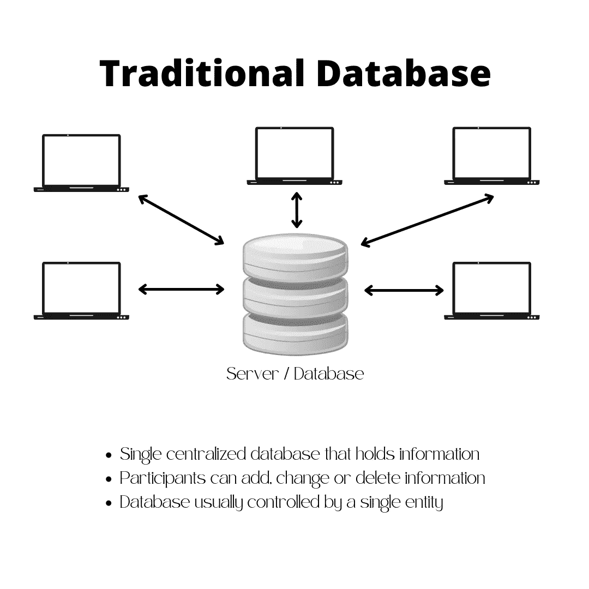
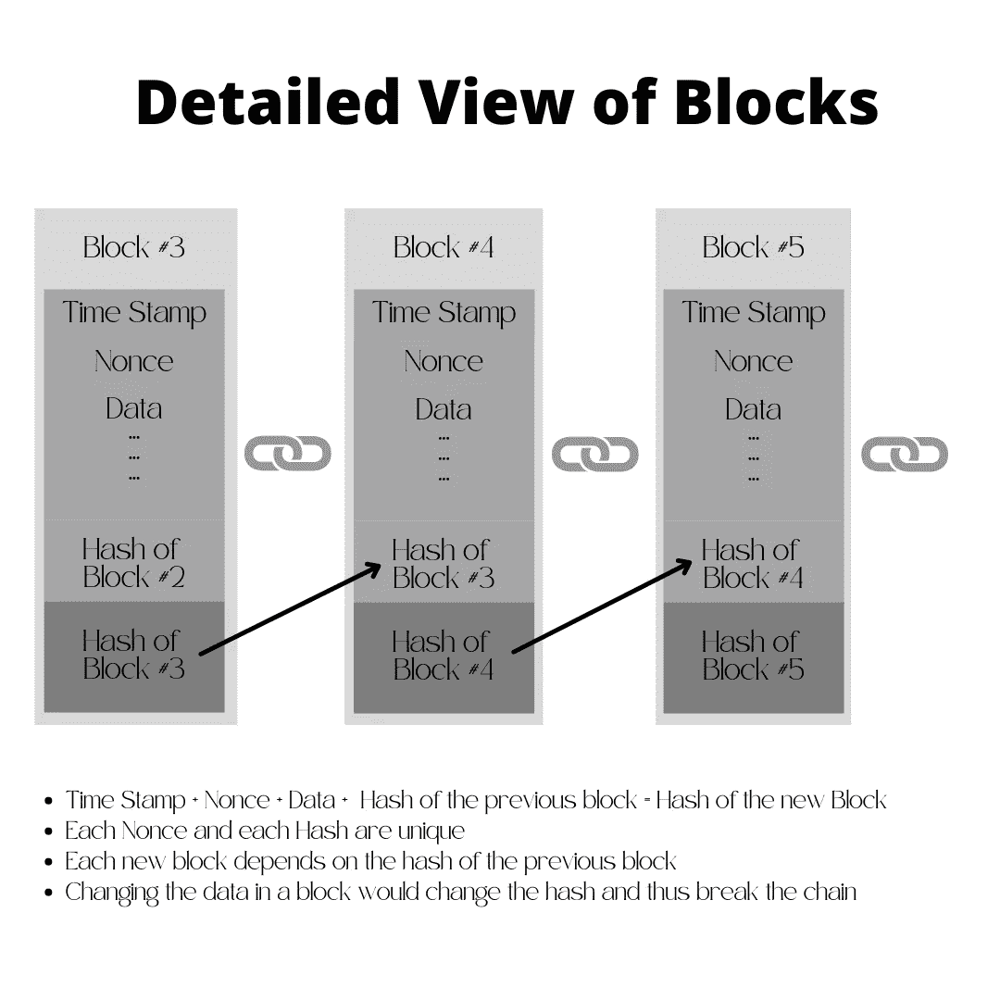
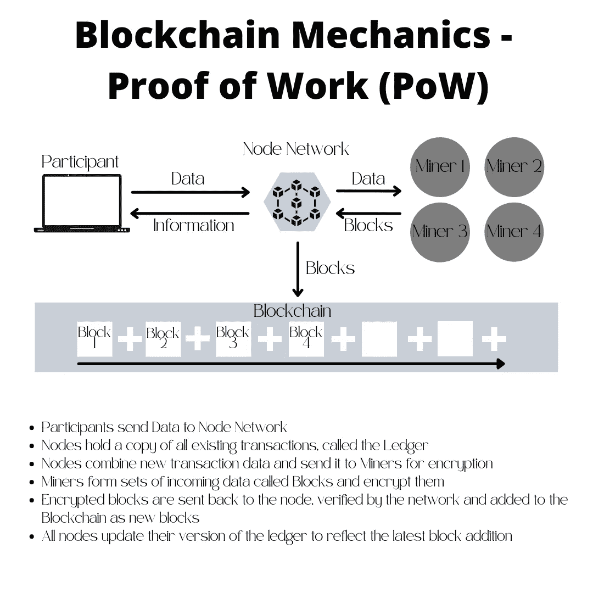
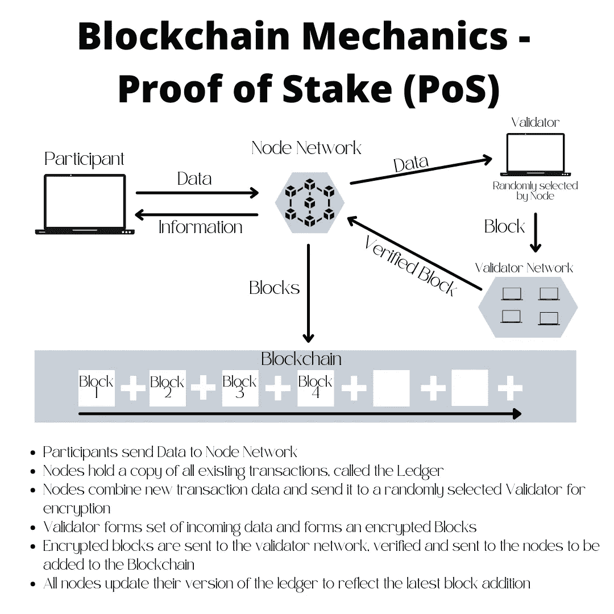

# 区块链初学者指南——什么是区块链

> 原文：<https://medium.com/coinmonks/the-blockchain-beginners-guide-what-is-blockchain-a886d68eaa1?source=collection_archive---------18----------------------->

## **了解区块链的定义，了解技术背后的东西，我们如何从中受益以及局限性在哪里。**

Photo by [Launchpresso](https://unsplash.com/@launchpresso?utm_source=medium&utm_medium=referral) on [Unsplash](https://unsplash.com?utm_source=medium&utm_medium=referral)

T 本文旨在通过查看历史、定义并将其与传统数据库进行比较，来建立您对区块链的基本了解。了解这项技术的机制、优势和局限性。

# **一点点历史**

Stuart Haber 和 W. Scott Stornetta 在 1991 年首次概述了区块链技术，这两位研究人员希望实现一个文档时间戳不能被篡改的系统。但直到近 20 年后，随着 2009 年 1 月比特币的推出，区块链才有了第一个现实世界的应用。(比特币基地，[《什么是比特币》](https://www.coinbase.com/learn/crypto-basics/what-is-bitcoin))

比特币的创始人，[中本聪](https://www.investopedia.com/terms/s/satoshi-nakamoto.asp)，称他的发明是“一个完全点对点的新电子现金系统，没有可信的第三方。”([比特币白皮书](https://bitcoin.org/bitcoin.pdf))。

从那时起，无数的其他区块链，侧链和仲链已被开发出来。尽管电子货币替代现金的想法仍是一个主导因素，但区块链的无数其他使用案例已经出现。想想所有权验证(NFTs)、智能签约、供应链管理和投票，等等。

但是为了理解为什么区块链技术越来越受欢迎，我们需要理解区块链是如何工作的，以及它与传统数据库的区别。

# **定义**

首先也是最重要的；**区块链不是加密货币**。**区块链是一种数据库技术。**加密货币只是区块链的一种使用方式。

与传统数据库不同，区块链不是通过单个实体控制的，而是通过参与者网络控制的。数据以加密方式存储，并采用分类帐格式，其中条目会不断添加并相互依赖。

让我们仔细看看传统数据库和区块链结构之间的主要区别。

## **传统数据库**

传统数据库将所有数据存储在一个地方，通常是服务器。服务器是集中式的，通常由单个实体控制或托管。根据权限级别，用户可以添加、修改和删除信息。这种单点访问会使服务器容易受到攻击和滥用。如果没有足够的控制，数据可能会被操纵、删除、丢失或破坏。控制实体可以在任何时候非法撤销对数据库的访问。

## **区块链**

区块链试图缓解单一入口的问题，代之以将数据形成加密块的计算机网络。现在，信息不仅被加密，而且跨多个存储点存储。反过来，每个新的信息块必须由网络验证并添加到数据库中。由于每个块的加密过程都是基于前一个块中包含的信息，因此我们最终会得到一个不可变的数据串，因为一个块中的更改会影响所有后续块，并且需要网络重新验证。

Detailed View of a Block

创建一个块的过程被称为**散列。**哈希处理任何种类的数据，并将其转换成固定长度的代码串**。这个唯一的字符串是其数据的精确翻译。因此，没有块可以携带相同的散列，除非其中的数据是相同的。这就是区块链不变性的由来，稍后会有更多的介绍。**

一个块包含四个元素:

1.  印时戳
2.  Nonce(数字只使用一次)作为唯一标识符
3.  输入数据
4.  前一个块的哈希

这四个元素的组合被加密并翻译成一行代码，称为**散列**。**哈希**是将数据转换成一行代码的过程，产生一个(Data) **块**。块被链接在一起并记录在**分类账**中。因此得名**区块链**。在创建或散列新块之后，它将被发送到网络进行验证。一旦通过验证，新块将被添加到链中。奖励散列块是为了激励参与者维护网络。

# **共识机制**

在区块链上散列和验证块的方式由**共识机制**定义。

今天最常见的类型是 P **工作屋顶(PoW)** 和**桩证明(PoS)。存在其他类型，但是为了简单起见，我们将集中于功率和位置。**

## **工作证明**

使用 PoW 的区块链使用**节点和矿工。节点**管理 PoW 区块链，维护所有交易的分类账，并收集新交易的数据。**节点**收集新的数据，并将其发送到一个叫做**矿工的高效计算机网络。**这些计算机对数据进行分组，并通过散列法竞相将其分组为块。矿工的计算能力越强，他第一个创造区块的机会就越高，这反过来为他赢得了奖励。

使用电力的区块链的一个例子是比特币。

Blockchain Mechanics — Proof of Work

## **股权证明**

尽管创建区块并将其添加到链中的概念保持不变，但 PoS 区块链在如何创建区块上采用了不同的方法。

节点将**随机选择一个名为**验证器**的网络参与者**来创建块，而不是向矿工发送数据并让他们相互竞争。在块被创建之后，它被发送到其他验证器来确认该块。一旦确认，块被添加到链中，过程再次开始。

PoS 链的例子有 [Cardano](https://cardano.org/) 和 [Solana](https://solana.com/) 。

Blockchain Mechanics — Proof of Stake

根据区块链，必须满足某个要求以充当验证者，例如链本地令牌的最小持有量。这种要求的影响是双重的。首先，参与者不必参与技术军备竞赛，其次，它激励参与者坚守他们的加密资产。理论上，这降低了流动性，使代币随着时间的推移变得更有价值。

## **工作证明与利益证明**

有人声称区块链的一场**战俘**正在对可持续性造成影响。所需的计算能力导致矿工对强大 IT 设备的需求急剧增加，导致高端显卡(GPU)供应短缺。GPU 消耗了大量的能量，造成了生态影响。还有一种观点认为，采矿违背了权力下放的概念，因为采矿者的目标是获得更大的市场份额，以开采区块并获得回报。矿工没有什么动力保留奖励代币，倾向于卖掉它们以购买额外的采矿设备。

**PoS** 旨在限制随机选择块验证器对可持续性的影响，基于它们在网络中的参与份额，而不是计算能力。虽然能源和材料消耗较少，但区块链鼓励参与者囤积代币，从而限制了流动性。流动性降低往往会提高代币的价格，但同时也有限制其可用性的风险，因为参与者在与代币交易时没有太大的动力，而是坐在代币上等待预期的价值增加。

现在我们已经了解了数据是如何被散列成块、加密和串在一起的，让我们来看看不同类型的区块链。

# **区块链的种类**

像传统数据库一样，区块链在可访问性方面可以有不同的类型。

## **大众区块链**

公共区块链没有访问限制，任何有互联网接入的人都可以参加。公共区块链的例子有 [**比特币**](https://bitcoin.org/en/) 和 [**以太坊**](https://ethereum.org/en/) 区块链。

## **列兵区块链**

私有区块链需要管理员的访问权限。例如，一家工业公司为其供应链管理设置了一个内部区块链。

## **混合动力区块链**

一种介于私人和公共区块链之间的混合体，具有集中和分散两种成分。

## **侧链**

侧链使用主区块链作为参照，但与主链平行运行。这允许基于已经存在的概念创建新的链，但是允许结合额外的特征。比如[多边形](https://polygon.technology/)就是一个[以太坊](https://ethereum.org/en/)侧链。侧链也称为第二层链。

# **区块链今日**

在开始的时候，我提到过除了加密货币，区块链还提供了各种各样的用例。在过去的几年中，我们已经看到了许多新的现实生活中的应用，并且很可能会出现更多。虽然不是所有这些都可能改变我们的生活方式，但其中一些具有革命性的潜力。

让我们看看加密货币以外的一些应用领域。

## **医疗保健**

将医疗记录存储在区块链上可以让患者确信这些记录不会被篡改。由于加密，患者可以完全控制谁可以访问这些高度机密的数据，对于医疗保健提供商来说，这意味着在需要的情况下，数据可以随时在线获得。此外，这些记录是以通用语言(代码)保存的，可以很容易地被最终用户软件破译。

## **属性**

区块链上不可变的财产登记为监管者和财产所有者提供了透明度。财产转移可以通过智能合同执行，产生财产转移的时间、地点和条件的清晰记录。交易几乎不需要像公证人这样的中间人参与。这种分散的性质也意味着，想一想那些政府不稳定或腐败的地方，要想不被发现地篡改记录是不可能的。

## **智能合约**

智能合约是内置于区块链中的代码行。通过一系列编码条件，智能合约可以控制、协商、促进甚至验证交易。这可以最大程度地实现贸易和交易的自动化，减少对中间商和第三方的需求，从而提高效率和降低成本。

## **供应链**

区块链可用于跟踪和追踪商品的整个生命周期，从最初的原材料一直到垃圾场，并实时进行跟踪和追踪。这不仅有助于改善供应链，还能向生产商和消费者传递有关产品生命周期的宝贵信息。这些数据可以用来追究制造商对生产缺陷和违反规章制度的责任。

## **投票**

区块链的不变性允许它被用于促进投票。对区块链的投票提供了透明度和效率。计票可以通过电子方式完成，减少了投票结果被篡改的可能性。

## **数字身份**

医疗记录、出生证明、护照、生物特征数据、信用记录、税务数据、财产契约、文凭和其他资格证书等机密数据可用于构建数字身份。有了私钥，数据的所有者就可以完全控制他自己的信息以及他授权谁访问这些信息。这些数据可以从任何地方以任何语言访问，并有助于恢复所有者的真实身份。想象一下，一个难民来到一个国家，他不会说该国的语言，也无法用实际文件证明自己的身份。

# **限制**

理论上，区块链的应用是无限的。但是也有一些主要的缺点和不足，至少目前是这样。然而，这些限制不应被视为死胡同，而是鼓励我们去克服它们。

## **成本**

采用区块链可能会带来巨大的开发和维护成本。数据必须被格式化和迁移。需要特殊的 IT 设备，并且必须编写与该链交互的程序。取决于所使用的区块链技术，会涉及高能量成本，这会造成环境影响。

## **效率&可扩展性**

在交易速度至关重要的领域，许多区块链还无法与现有的“传统”系统竞争。想象一下，仅仅因为你的付款必须先加入区块链，你就必须为你的外带咖啡等 10 分钟。

数据块只能包含一定量的数据，这意味着需要处理的数据越多，需要的数据块就越多，这反过来会降低处理速度并使网络拥塞。

## **规定**

你如何监管一个没有人真正控制的分散实体？又需要多大的控制力？出了问题谁负责，谁能帮忙？这些以及其他许多问题都是激烈争论的话题。尽管过度监管会限制区块链应用的好处，但没有监管会给参与者带来不确定性。

这样想吧；政府和监管机构往往会对他们不了解的事情进行过度监管，市场参与者不会采用一项他们可能会与当局陷入麻烦的技术。

因此，围绕收益、风险和局限性展开公开和建设性的讨论至关重要。

# **关键要点**

*   区块链是一种数据库技术
*   在区块链上，数据被编译成加密的数据块，然后一个接一个地添加到账本中。因此得名区块链。
*   区块链是不可变的，因为每个新的区块都依赖于前一个区块。如果一个块被改变，所有后面的块都不相加。
*   工作证明(PoW)和利益证明(PoS)描述了创建区块的方式。
*   区块链可以是公共的(任何人都可以参与)，私人的(受监管的参与)或两者的混合。
*   虽然数据是加密的，但任何有权限的人都可以轻易破译。
*   尽管在数据存储和管理方面提供了无数的好处，但是区块链有一些主要的缺点，到目前为止限制了它的广泛采用。

**作者的一句话:**
加入 Telegram、脸书、Instagram 和 Twitter 上的“街区内部”，了解 crypto 和区块链。点击以下链接查找我们所有的社交媒体和联系方式:

请务必订阅并访问我们关于[Medium.com](/@inside-block)的其他文章

 [## 在块内部|链接树

### 穿越噪音&提供关于区块链、Web 3.0、NFTs 和 DeFi 的信息

linktr.ee](https://linktr.ee/Insidetheblock) 

*免责声明:本文中的任何信息均基于我的个人经历，出于个人兴趣而撰写。本文没有宣传目的，不代表投资建议，文中提到的任何名称、品牌和报价仅用于说明目的。小心使用任何相关链接，风险自负。永远做你自己的研究。*

> 加入 Coinmonks [电报频道](https://t.me/coincodecap)和 [Youtube 频道](https://www.youtube.com/c/coinmonks/videos)了解加密交易和投资

# 另外，阅读

*   [Bitsgap 审查](/coinmonks/bitsgap-review-a-crypto-trading-bot-that-makes-easy-money-a5d88a336df2) | [Quadency 审查](/coinmonks/quadency-review-a-crypto-trading-automation-platform-3068eaa374e1) | [Bitbns 审查](/coinmonks/bitbns-review-38256a07e161)
*   [密码本交易平台](/coinmonks/top-10-crypto-copy-trading-platforms-for-beginners-d0c37c7d698c) | [Coinmama 审核](/coinmonks/coinmama-review-ace5641bde6e)
*   [印度的加密交易所](/coinmonks/bitcoin-exchange-in-india-7f1fe79715c9) | [比特币储蓄账户](/coinmonks/bitcoin-savings-account-e65b13f92451)
*   [OKEx vs KuCoin](https://coincodecap.com/okex-kucoin) | [摄氏替代品](https://coincodecap.com/celsius-alternatives) | [如何购买 VeChain](https://coincodecap.com/buy-vechain)
*   [币安期货交易](https://coincodecap.com/binance-futures-trading)|[3 commas vs Mudrex vs eToro](https://coincodecap.com/mudrex-3commas-etoro)
*   [如何购买 Monero](https://coincodecap.com/buy-monero) | [IDEX 评论](https://coincodecap.com/idex-review) | [BitKan 交易机器人](https://coincodecap.com/bitkan-trading-bot)