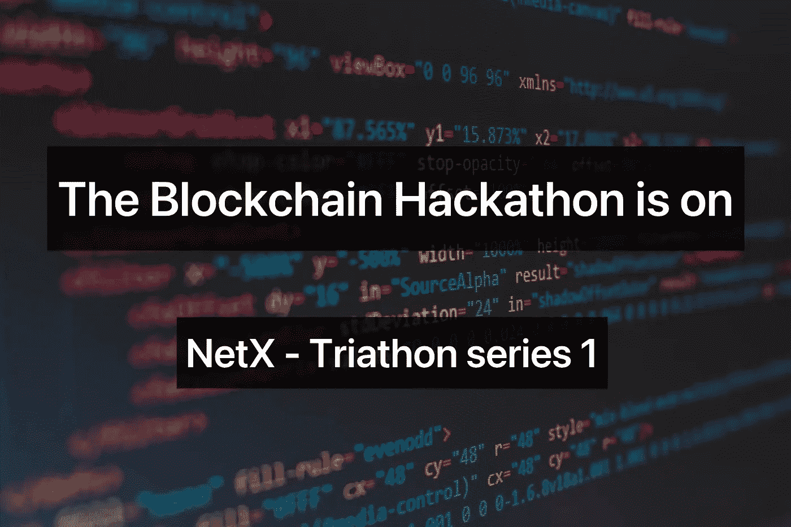

# 区块链黑客马拉松开始了

> 原文：<https://medium.com/coinmonks/the-blockchain-hackathon-is-on-3e57bc1ed366?source=collection_archive---------14----------------------->

TL；速度三角形定位法(dead reckoning)

*   必须对智能合约进行安全审计，以避免由代码缺陷或安全漏洞引起的黑客攻击。
*   铁人三项自然是区块链的黑客马拉松。我们承诺保护 Web 3.0。我们也渴望用代码改变世界。
*   Triathon 致力于为区块链和 dApps 建立一个分散的、社区驱动的测试和审计框架。

DApps 利用智能合约与区块链交换数据。与其他软件类似，代码缺陷可能会导致安全漏洞。然而，最大的区别在于他们对金融资产的直接控制，在这种情况下，一个小问题可能会导致巨大的损失。一个例子是 Axie Infinity 最近价值 6.15 亿美元的[浪人](/@Triathon/axie-infinitys-ronin-bridge-hacked-for-600m-triathonnow-f2b3346ebb9f)桥劫案，这是 [*rekt 排行榜*](https://rekt.news/leaderboard/) 上的第 1 号案件。然而，这种悲剧并不罕见。统计数据显示，自 2012 年以来，全球区块链社区在 700 多起安全丑闻中遭受了近 2600 万美元的损失。

密码市场潜力巨大，其市值高达 1.7 万亿美元(CMC)。然而，大量的黑客攻击凸显了不成熟。虽然我们正在拥抱一个充满希望的未来，但安全攻击仍然是摆在所有区块链开发者面前的棘手问题。摆脱这种困境需要智能合同安全审计，以暴露代码缺陷和安全漏洞。这就是我们最初的愿望指引我们的地方，开发一个开发者和用户不必担心 bug 的区块链。

# **区块链风洞测试**

去年 8 月，Triathon 作为一个分散的、社区驱动的区块链和 dApp 测试和审计平台正式启动。虽然 NetX 上的七个主要项目都有自己特殊的名字，但 Triathon 将自己解释为 Trias 的黑客马拉松。区块链黑客马拉松(Blockchain Hackathon)得名于传统的黑客马拉松，旨在为开发人员提供资源，在创新发生的地方建立 dApps，并通过竞赛检测漏洞。

如今，第三方代码审查主要集中在白盒测试，即理论分析上。但是在 Triathon，用户可以享受动态黑盒测试，代码在透明的测试环境中运行，任何人都可以参与其中。其广泛和深入的审计不仅补充了白盒测试，还突出了动态审计的优点。用户可以通过玩游戏来赚钱。这样，积极的社区参与将通过分散的测试产生更有说服力的结果。

Triathon 负责测试公共链、dApps、智能合约、侧链和 Web 3.0 项目的性能、功能、可信度和安全性。即使是非技术背景的投资者也可以通过测试获得决策的主要线索，这就是我们所说的测试驱动投资。除此之外，Triathon 还通过我们称之为测试驱动的启动，为具有未开发潜力的项目提供启动服务。众所周知，飞机在出厂前必须通过风洞试验。这些测试模拟飞机周围的气流，为真正的飞行做准备。这也适用于孵化区块链项目。只有当项目通过了某些社区定义的测试，它才能进入资金筹集阶段。用户可以找到测试网所需的各种服务，如筹款、实时安全监控、性能提升、技术创新和生态系统扩展。业绩得到改善和提升的项目更有机会获得投资者和全球社会的认可和信任。那些前景看好的公司甚至可能进入初始测试网(ITO)融资阶段。

# **快来报名参加区块链黑客马拉松**

作为一个社区驱动的、去中心化的测试和审计平台，Triathon 肯定会吸引很多**开发者**。一方面，开发人员(包括传统的黑客、安全测试人员和区块链开发人员)可以向用户出售他们开发的测试用例。另一方面， **B 端用户或机构**可以获得优质的测试资源。Triathon 寻求提供低成本的解决方案，省去用户为潜在的 bug 创建测试环境的所有麻烦。

即使是最**专业的团队**，也有思想达不到的地方。有了这些优秀的开发人员，Triathon 代表了强大的专业精神和创新思维。通过这种方式，我们努力为外部项目进行独立的第三方测试，并帮助他们超越他们的限制。

Triathon 不仅为开发团队和企业用户工作，还为**个人用户**(即投资人、玩家、dApp 用户以及所有使用区块链技术的人)进行测试和审计。“玩赚”允许玩家在战场上同时玩游戏和赢得奖励。铁人三项的目标是超越区块链编程，与来自不同文化和兴趣广泛的人一起实现彻底的去中心化。这是一个仙境，人们可以测试，玩游戏，并赢得奖励。

> 加入 coin monks[Telegram group](https://t.me/joinchat/Trz8jaxd6xEsBI4p)学习加密交易和投资

# 这是结尾部分

黑客马拉松实际上是去中心化的产物。纽约城市大学的社会学家 Sharon Zukin 和 Max Papadantonakis 在一项研究中指出，2008 年的金融危机催生了黑客马拉松。当时，许多黑客仅靠全职工作无法维持生计。与此同时，随着移动应用市场的蓬勃发展，创新被寄予厚望，随着电影《T2 社交网络》的上映，人们的情绪也越来越高。黑客们争相加入竞赛，希望通过黑客马拉松让世界变得更美好。研究表明，*工作是娱乐，疲惫是兴奋，危险是机遇。这种想法很大程度上与 Web 3.0 梦想家所追求的不谋而合。他们用代码改变世界的野心从未改变。虽然区块链对他们来说只是另一个机会，但 Triathon 决心为这个去中心化的世界提供有效的代码评审。*

***NetX，面向可信可靠的智能自治系统的数字生活的链原生互联网(***[***Trias***](https://www.trias.one/)***)***

[***铁人三项***](https://www.triathon.space/#/)***|***[***Ethanim***](https://www.ethanim.network/)***|***[***Tusima***](https://www.tusima.network/#/)***| behemo tum | Octavius | leviam | Divina***