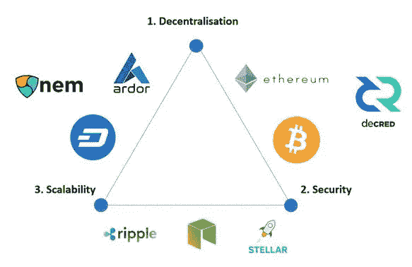

# 区块链三难困境。

> 原文：<https://medium.com/coinmonks/the-blockchain-trilemma-9c45b9119d17?source=collection_archive---------33----------------------->

如果你去过区块链，你应该听说过“**区块链困境”**，如果你没有听说过或者你不知道那是什么，你很幸运，因为我会很快解释这意味着什么。

你知道你如何不容易平衡工作、睡眠和社交生活吗？是啊，区块链三难困境也差不多。

以太坊区块链的联合创始人**维塔利克·布特林**创造了区块链三难困境，这是整个加密货币社区所持的信念，即真正去中心化的区块链需要在安全性和可扩展性之间做出选择。

使用上面的图像作为参考，区块链只能有三角形的一边，这就是以太坊不可伸缩的原因，因为他们更关注安全性和分散化，在寻找解决以太坊可伸缩性问题的解决方案时，第 2 层诞生了。

# 你可能会问什么是第 2 层？

它是建立在现有层/区块链之上的次级框架或协议，这些协议的主要目标是解决主链存在的可扩展性问题。

它们创建了一个框架，交易可以独立于主链进行，它们也被称为“链外”扩展解决方案。

但是这对可伸缩性问题有什么帮助呢？

虽然主链侧重于去中心化和安全性，但由于第 2 层构建在主链之上，它不需要担心安全性和去中心化(使它能够每秒执行数百甚至数千个事务)。主链上的工作量被转移到第 2 层。

# 前 3 名第 2 层解决方案；

1.多边形，以前称为 Matic

2.和谐与

3.活套

这是一个简单的快速运行层 2 和区块链三难，感谢阅读，希望你学到了一两件事。

> *加入 Coinmonks* [*电报频道*](https://t.me/coincodecap) *和* [*Youtube 频道*](https://www.youtube.com/c/coinmonks/videos) *了解加密交易和投资*

# 另外，阅读

*   [3 商业评论](/coinmonks/3commas-review-an-excellent-crypto-trading-bot-2020-1313a58bec92) | [Pionex 评论](https://coincodecap.com/pionex-review-exchange-with-crypto-trading-bot) | [Coinrule 评论](/coinmonks/coinrule-review-2021-a-beginner-friendly-crypto-trading-bot-daf0504848ba)
*   [莱杰 vs Ngrave](/coinmonks/ledger-vs-ngrave-zero-7e40f0c1d694) | [莱杰 nano s vs x](/coinmonks/ledger-nano-s-vs-x-battery-hardware-price-storage-59a6663fe3b0) | [币安评论](/coinmonks/binance-review-ee10d3bf3b6e)
*   [Bybit Exchange 评论](/coinmonks/bybit-exchange-review-dbd570019b71) | [Bityard 评论](https://coincodecap.com/bityard-reivew) | [Jet-Bot 评论](https://coincodecap.com/jet-bot-review)
*   [3 commas vs crypto hopper](/coinmonks/3commas-vs-pionex-vs-cryptohopper-best-crypto-bot-6a98d2baa203)|[赚取加密利息](/coinmonks/earn-crypto-interest-b10b810fdda3)
*   最好的比特币[硬件钱包](/coinmonks/hardware-wallets-dfa1211730c6) | [BitBox02 回顾](/coinmonks/bitbox02-review-your-swiss-bitcoin-hardware-wallet-c36c88fff29)
*   [BlockFi vs 摄氏](/coinmonks/blockfi-vs-celsius-vs-hodlnaut-8a1cc8c26630) | [Hodlnaut 点评](/coinmonks/hodlnaut-review-best-way-to-hodl-is-to-earn-interest-on-your-bitcoin-6658a8c19edf) | [KuCoin 点评](https://coincodecap.com/kucoin-review)