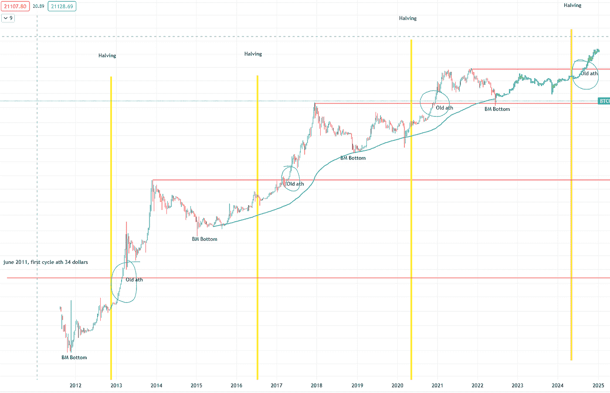
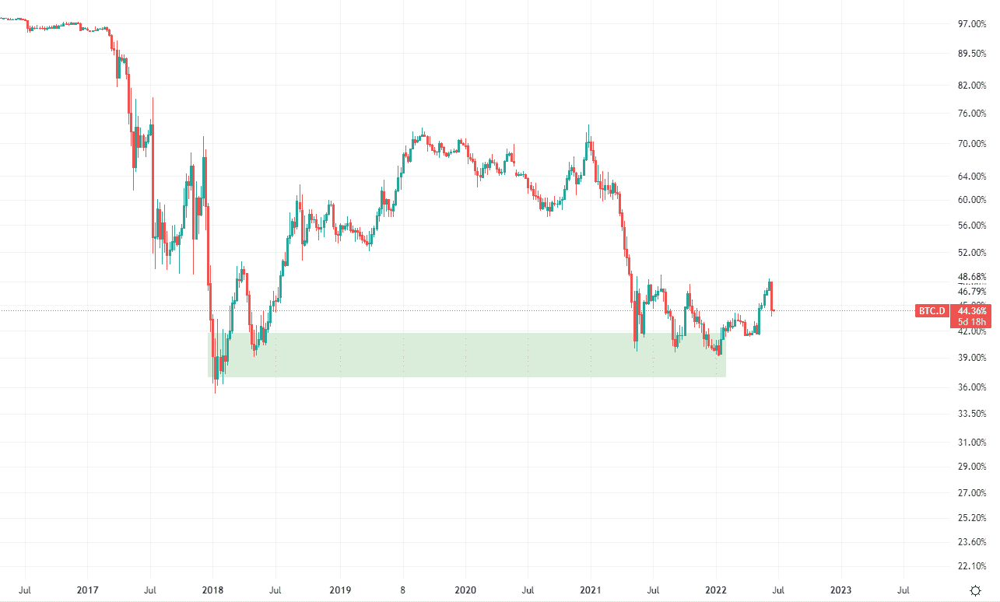

# 底部在里面

> 原文：<https://medium.com/coinmonks/the-bottom-is-in-2bd9af7b3c53?source=collection_archive---------38----------------------->

## 比特币一路大跌，从市值 1.3 万亿美元的 69k 美元，一路跌至市值仅 3350 亿美元的 17.6k 美元。有些人拉了裤子，在这么低的价位卖掉了所有的股票。我们大多数人都知道，这一次，底部将在 20k 左右。我们从过去的周期中吸取了教训，并开始理解比特币的行为方式。在这篇文章中，我给出了我的推测性观点，为什么我认为底部已经到位，比特币不会跌得更低。

## 美联储

最近的加息对市场产生了很大影响。伴随着从 COVID 时期就注定会发生的衰退，以及许多人对第三次世界大战的不合理恐惧，市场开始进入熊市。许多机构和投资银行开始抛售高风险资产。比特币正因此遭受损失。在未来的 6 个月到一年内，我相信美联储将停止加息，市场将开始降温。现在，加息已经反映在市场价格中，这也是我认为我们可能很快就会看到一些上行的原因之一。COVID 大部分已经结束，当外面变冷时，我们可能会看到一个小的 hick-up，但我们很可能不会看到另一个封锁，关闭我们的经济，并带来更多的供应链问题(至少我希望如此)。美联储正在与通货膨胀作斗争，正在停止大量印刷钞票，并且没有像以前那样向市场注入那么多资金。我们在过去两年中看到的所有不同的问题对比特币来说都是完美的，因为现在发生的一切都是比特币诞生的原因。我们已经看到它作为一个不可改变和不可审查的点对点现金系统运行，因为它节省了许多乌克兰人的钱。我们还看到比特币自 COVID 触底以来上涨了 1700%，目前仍上涨了 460%，如果这还不能抵御通胀，那么我不知道什么是有史以来最好的价值储存手段。未来几个月，我们将看到比特币越来越多地被用作一种保护手段，我认为 BTC 的价值可能会上升。

## 200WMA

Source: Tradingview, my personal analysis

我们大多数人都知道，200 周移动平均线是熊市底部的完美指标之一。我们又一次击中了它，我们在它下面得到了一个灯芯。200WMA 给了我们很大的支持，我们看到了它的反弹。如果 BTC 保持在这些价格，它再次得到验证。对我来说，这是一个很好的指示，用我为这个特殊事件攒下的所有钱去买。我们完全按照我几个月前的计划到达了 200WMA。预测未来可能发生的事情让我为即将到来的 200WMA 攒些钱。加上我的空头头寸和我在历史高点卖出的比特币，我在这次崩盘中积累了大量的比特币。我们看到比特币否定了我们不会跌破上一个历史高点的理论，这再次表明模型只是模型，最终它们将是错误的。在我看来，这种现象有一个非常简单的解释。由于我们在这个周期中所处的气候，BTC 无法发挥其全部潜力。根据模型和过去的周期，比特币有点扩张不足，应该在第二个峰值时走高。这将最终导致熊市底部也向上一点。在这种情况下，如果世界气候有所不同，这种情况应该也可能发生，我们不会看到比特币跌破其历史最高水平，我们会看到比特币在今年晚些时候触及 200WMA。

## BTC。D

Source: Tradingview, my personal analysis

我们终于看到 BTC 的优势再次上升。它在其支持区域反弹，并开始上升。我们看到了一波不错的低价，露娜被取消了，UST 也从顶级硬币中消失了。有很多 FUD 围绕着替代硬币，索拉纳可能是下一个硬币去。熊市总是好的，因为它摆脱了垃圾币和无用的替代币，刚刚加入这个周期的人将开始意识到比特币是少数真正值得购买的硬币之一。替代硬币给了 BTC 成长的空间，因为他们再一次失败了，除了被炒作。上一次统治地位从急剧下降开始上升是在 2018 年 1 月。在我们看到这种优势上升后，BTC 从 3400 美元涨到 69000 美元。从历史上看，统治力一直在下降，但每次上升都是一个好迹象，表明人们开始欣赏 BTC 而不是 alt。

## **减半周期**

Source: Tradingview, my personal analysis

我为 200WMA 使用的第一张图片也有比特币减半的情况。这些很好地表明了我们在周期中的位置。我们已经看到 BTC 触底，距离下一次减半还有 360 天、400 天和 500 天。周期在变长，熊市每次都在变长。下一次减半将在 2024 年 4 月。这距离现在大约有 680 天，因此我们将迎来一个更长的熊市，这种情况在每个周期都会发生。正如我之前所说，这次比特币的表现有所不同，应该会在今年晚些时候触底，这将使我们距离下一次减半可能还有 550-600 天。过去，我们看到比特币在减半后大约 200 天就打破了历史新高。如果比特币继续这种模式，我们将看到它在 2024 年底或 2025 年初突破 69k，之后它将达到新高，最终我们很可能会看到 100k！！

## **DCA**

我选择从 200WMA 开始兑换比特币。我首先投入一大笔现金以获得这个低价，在接下来的几个月里，在熊市中，我每周都会将现金兑换成比特币。一旦比特币打破历史新高，我可能会停止买入，开始寻找退路。如果一切都像我在这篇文章中解释的那样，这将是最好的策略之一，不会带来太大的风险。我个人也在 18k 左右进行了一些杠杆操作，以获得一些额外的回报，但这当然增加了风险。

## **我们很幸运**

两年后，每个人都会告诉那些以这些价格买入的人，这只是运气。当这一幕没有上演时，每个人都会被嘲笑。对我个人来说，冒这个险是值得的。如果你真的长期相信比特币，并且没有在这些价格买入，那么看看更多的模型并思考你对市场的看法可能是个好主意。我在这篇文章中只是给了你们一些基本的模型来证实我的观点，但是还有很多其他的模型和连锁数据来证实这个理论。也许我遗漏了什么，或者这些场景不会上演，所以如果你有不同的观点，请在评论中告诉我。对于每个持有 BTC 的人来说，我希望这个游戏结束，我们可以在这个过程中积累尽可能多的 sat！祝大家好运。

*本文提到的一切都不是财务建议，每个人都应该自己研究和思考:)！*

> 加入 Coinmonks [电报频道](https://t.me/coincodecap)和 [Youtube 频道](https://www.youtube.com/c/coinmonks/videos)了解加密交易和投资

# 另外，阅读

*   [密码本交易平台](/coinmonks/top-10-crypto-copy-trading-platforms-for-beginners-d0c37c7d698c) | [Coinmama 审核](/coinmonks/coinmama-review-ace5641bde6e)
*   [印度加密交易所](/coinmonks/bitcoin-exchange-in-india-7f1fe79715c9) | [比特币储蓄账户](/coinmonks/bitcoin-savings-account-e65b13f92451)
*   [OKEx vs KuCoin](https://coincodecap.com/okex-kucoin) | [摄氏替代品](https://coincodecap.com/celsius-alternatives) | [如何购买 VeChain](https://coincodecap.com/buy-vechain)
*   [币安期货交易](https://coincodecap.com/binance-futures-trading)|[3 comas vs Mudrex vs eToro](https://coincodecap.com/mudrex-3commas-etoro)
*   [如何购买 Monero](https://coincodecap.com/buy-monero) | [IDEX 评论](https://coincodecap.com/idex-review) | [BitKan 交易机器人](https://coincodecap.com/bitkan-trading-bot)