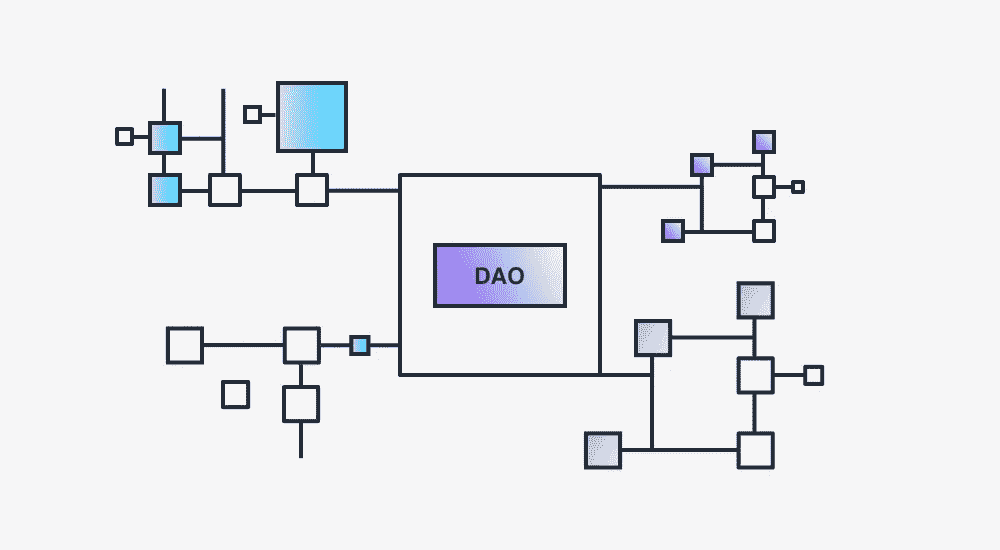

# 道的经营之道

> 原文：<https://medium.com/coinmonks/the-business-craft-of-dao-27defbb035d6?source=collection_archive---------8----------------------->

~dwulf

我不是金融顾问，律师，我只是一个普通的工程师。

如何用一个假想的道实体来制作一把刀？

## **绿开关 _ 刀的详情**

green switch 项目的分散自治组织的想法是为 GreenWitch _ DAO 管理的加密资本提供一个管家。

目标是让 GreenWitch _ DAO 与任何不必要的菲亚特交易完全解耦，并在 green switch 区块链的第 1 层和第 2 层的加密生态系统中进行 100%的协商。

Substrate 的框架和 Rust 的编程语言将构建 GreenWitch _ DAO 的核心逻辑，重点是 Parathreads，因为 Parachains 目前竞争太激烈了。

理想情况下，为了避开 KYC 问题，DAO 需要成为自己的加密交换，以避开监管者和其他不良参与者，当在第 1 层和第 2 层时，XCM/XCMP 等需要更多的手动 API 工具。但是在那个层次上，你是你自己的节点，因为你在为区块链旋转。

## **匿名资本，收入层层**

这是 GreenWitch _ DAO 资本布局的一个假想布局。

**第 0 层**是从金库中的硬币/代币、赌注、赚取利息、快速贷款或其他钱包中产生的资本。收入的产生是基于绿魔道中所有保留的硬币。

**第 1 层**是资本生成，无论是在平面还是加密中，都是通过最基本的最少劳动和费用的方式。在线流媒体渠道，广告收入，分支机构，在线商店。产生的大部分收入可以避开银行机构和那些不通过传统薪酬处理渠道的机构，转到由有限责任公司拥有、由首席财务官控制的商业银行账户。

**第 2 层**主要是菲亚特的资本生成，涉及更多的参与和费用。在农贸市场设立蘑菇摊，经营兽医诊所和狗场，经营咖啡店。这一层的大部分业务在本质上是扁平的，将需要更多的旧世界经济工件的可访问性，这将通过 KYC 应急会计来完成。

**GreenWitch 会计公司，KYC 或有事项**

在某种程度上，在当地法律的监督和审查下，与民族国家互动，与 CBDCs 和中央交易所合作，可能是一种战略优势。

会计契约播种了一个新的钱包，由新开采和混合的硬币组成，并产生了其动态的 KYC，暴露在受监控的民族国家面前。按照公认会计原则(GAAP)对账户、收入和支出进行预先格式化的列举

这是 green switch _ DAO 的一个应急功能，DAO 的目标是立即将所有资产转换为其数字等价物，以便馈入 green switch _ DAO 保险库。

## **监管不确定性**

GreenWitch DAO 在网络空间中运行，既有 metal，也有 cloud，以 Docker 和带 Ansible 的 K8 为核心 DevOp 工具。在这个代码就是法律的世界里。

监管机构确实会影响价格和一些市场条件，但他们不会影响区块链本身的功能及其点对点的力量。DAO 更容易避免与复杂的硬币/代币或监管审查下的硬币/代币桥接，而只是选择加入对 DAO 更友好的其他网络。

## **结论:**

这只是“道”在民族国家的监管噩梦海洋中共存的一种方式。它是独一无二的，因为它不是人类，不受任何人类法律的约束，它没有公民身份，因此没有纳税义务，它不会被迫缴纳什一税，或做出任何不会增加其底线的支出。它是分散的，只在第 1 层和第 2 层交换，如果需要的话，偶尔在 KYC 的第 3 层交换。

将人工智能和软件思维机器相结合，DAO 将加速其底线和创收，摆脱过时的收入层(妈妈和流行咖啡店等)。)并专注于纯粹高效的创收。

我并不担心监管机构会制定武断的法律，或强制规定每一笔交易都要向税务部门申报。DAO 是一个软件代理，并且基于在它开始时提供给它的工程化治理，按照它自己的规律运行。

> 加入 Coinmonks [电报频道](https://t.me/coincodecap)和 [Youtube 频道](https://www.youtube.com/c/coinmonks/videos)了解加密交易和投资

## 也阅读

 [## 杠杆代币[多头代币]终极指南

### 杠杆化令牌是具有杠杆化风险敞口的 ERC20 令牌，不考虑保证金、要求、管理…

medium.com](/coinmonks/leveraged-token-3f5257808b22)  [## 最佳加密交易所| 2022 年十大加密货币交易所| CoinCodeCap

### 哪一个是最好的加密交换？在本文中，我们将根据多种加密货币列出 10 大加密货币交易所

coincodecap.com](https://coincodecap.com/crypto-exchange)  [## 2022 年最佳加密交换平台| CoinCodeCap

### 随着时间的推移，我们大多数人将转向 dex 以获得更好的安全性和隐私。因此。在这里，我们将讨论…

coincodecap.com](https://coincodecap.com/best-swap-platforms)  [## 10 大最佳在线赌场|赢得并赢取免费 BTC 2022 | CoinCodeCap

### 接收、支付和赚取加密货币| |有各种各样的最佳在线赌场可供选择，有可能…

coincodecap.com](https://coincodecap.com/best-online-casinos)  [## 2021 年最佳加密借贷平台| 6 大比特币借贷平台

### 获得比特币和其他加密货币的最佳贷款利率

medium.com](/coinmonks/top-5-crypto-lending-platforms-in-2020-that-you-need-to-know-a1b675cec3fa)  [## 2021 年 6 大最佳硬件钱包|顶级加密硬件钱包[更新]

### 最好的加密货币硬件钱包是绝对必要的。我们将在 NGRAVE、Ledger Nano X 和…

medium.com](/coinmonks/the-best-cryptocurrency-hardware-wallets-of-2020-e28b1c124069)  [## 加密交易机器人——19 款最佳免费加密交易机器人

### 2022 年币安、比特币基地、库币和其他密码交易所的最佳密码交易机器人。四进制，位间隙…

medium.com](/coinmonks/crypto-trading-bot-c2ffce8acb2a)  [## 最佳 4 个加密交易信号电报通道

### 这是乏味的找到正确的加密交易信号提供商。因此，在本文中，我们将讨论最好的…

medium.com](/coinmonks/best-crypto-signals-telegram-5785cdbc4b2b)  [## Bitsgap 评论-交易机器人加密信号和套利 2022

### 这篇文章的重点是 Bitsgap 审查，这是一个最终的交易解决方案，并提供交易机器人，信号…

coincodecap.com](https://coincodecap.com/bitsgap-review)