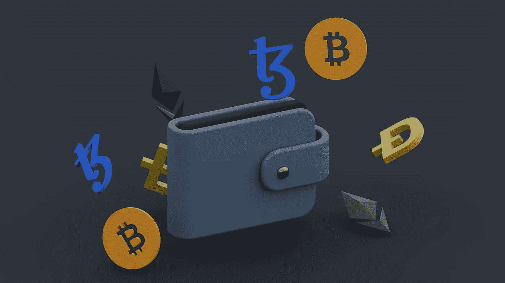

# 面对全球法规的自托管钱包案例

> 原文：<https://medium.com/coinmonks/the-case-for-self-hosted-wallets-in-face-of-global-regulations-ce66427a397f?source=collection_archive---------27----------------------->

The Case for Self-Hosted Wallets

2018 年 12 月 9 日，加拿大当时最大的加密货币交易所 QuadrigaCX 的首席执行官 Gerald Cotten 去世，带走了该交易所价值 2.15 亿美元的客户资产(主要是比特币和其他加密货币)。QuadrigaCX 倒闭后，大约 17，000 名债权人(主要由普通加拿大人组成)失去了提供给 QuadrigaCX 的“托管”或“托管”加密货币钱包的大部分资产。QuadrigaCX 按照反洗钱规定，向 FINTRAC 推销自己的持牌货币服务业务。

QuadrigaCX 的倒闭和普通加拿大人经历的损失提供了一个明确的例子，说明受监管实体持有的加密货币总量所涉及的风险。尽管存在这些风险，但全球监管机构此后开始提出监管措施，通过瞄准和阻止使用替代产品“自托管钱包”来鼓励加密货币的总体持有量。

# 什么是自托管钱包？

自托管钱包是一种字母数字代码，可用于访问区块链网络上的特定地址。当与区块链服务交互时，例如创建 NFT(不可替换的令牌)或玩游戏时，可使用自托管钱包通过访问它所代表的特定区块链地址来与服务交互。自托管钱包的基本目的是允许个人安全地直接参与网络。对于受监管实体提供的托管或保管钱包，这种形式的参与通常是不可能的。

自托管钱包本质上是区块链地址的密码，因此这个术语用词不当。这不同于由受监管实体提供的托管或托管钱包，这些实体提供类似的服务，并与银行账户或在线支付服务共享类似的基础设施，其中实体代表他人持有加密货币。

由于托管钱包的相关风险，区块链行业的许多活跃参与者更喜欢使用自托管钱包。除了 QuadrigaCX，许多提供托管钱包的交易所和平台都成为各种骗局和盗窃的目标，如“SIM-swapping”攻击，导致近年来价值数百万美元的客户加密货币被盗。将加密货币分散在众多安全的自托管钱包中(分散)防止了个人成为网络犯罪的受害者。不幸的是，监管者在制定应对自存钱包的法规时忽略了这一动态。

# 监管方向

美国和欧洲的监管机构当前追求的方向是授权受监管的实体对它们与之交互的自托管钱包执行反洗钱措施。欧洲议会经济和货币事务委员会最近批准了一项资金转移立法修正案，该修正案要求受监管实体获取、保留并尝试验证与其互动的自托管钱包的受益人信息。在美国，金融犯罪执法网络提议修订反洗钱立法，要求受监管实体保存记录，并核实使用自助钱包进行交易的个人的身份。

加拿大监管机构尚未宣布针对自有钱包的措施。然而，据广泛报道，美国加密货币交易所的高调高管发布的倡导使用自主钱包的推文，被安大略省证券委员会提交给加拿大皇家骑警进行调查。这可能表明了政府部门对未来监管这一问题的立场。

# 这些方法的问题

监管机构已开始通过提出新的反洗钱规则来瞄准自托管钱包的使用，这表明可能对其目的存在根本性误解。将资金转移视为自托管钱包的主要目的，而非附带功能，使得全面反洗钱法规的应用和覆盖范围可能会对自托管钱包的功能和广泛采用造成破坏性影响。以这种方式监管区块链技术核心组成部分的决定也代表了与其他技术监管的巨大差异。

通过对自托管钱包应用一揽子合规性规定，许多与资金转移无关的功能可能变得不切实际，并且在自托管钱包中不再出现。此外，合规措施可能阻碍受监管实体与自托管钱包和主要处理自托管钱包的其他服务提供商进行交互。这将增加与受监管实体持有的加密货币总量相关的潜在系统性风险。这还将导致需要大量的资源来监控自托管钱包中的交易，以遵守风险可能与成本不符的活动的法规。

通过将自托管钱包定性为资金转移工具，监管机构已经开始对这一基本的区块链技术实施过于宽泛的监管。这很可能导致许多活动需要繁重的财务监督措施，而这些措施不相关且难以实施，从长远来看，这将威胁到区块链不同使用案例的可行性。

# 结论

随着区块链技术的普及，监管环境以不威胁其生存能力的深思熟虑的方式与它一起发展是至关重要的。虽然各国政府完全有理由采取措施打击反洗钱，但不清楚为什么要针对自有钱包而不是实物现金、黄金和其他商品提出过于宽泛的立法，因为在实物现金、黄金和其他商品中，洗钱和其他非法活动有据可查，并且在绝对和相对基础上普遍存在。

自托管钱包被广泛视为与区块链网络互动的最安全方法，也是分解加密货币持有量的有效方法。通过对区块链技术公司更彻底和细致的了解，可以起草务实和有效的法规，以适当解决监管问题，而没有发生另一次 QuadrigaCX 事故的风险。

*本文原载于律师日报(*[*www . thelawyersdaily . ca*](https://www.thelawyersdaily.ca/articles/37392/the-case-for-self-hosted-wallets-in-face-of-global-regulations)*)，隶属于 LexisNexis Canada Inc.*

*图片来源:@ /舒巴姆·达奇—UNSPLASH.COM*

> 加入 Coinmonks [电报频道](https://t.me/coincodecap)和 [Youtube 频道](https://www.youtube.com/c/coinmonks/videos)了解加密交易和投资

# 另外，阅读

*   [3 商业评论](/coinmonks/3commas-review-an-excellent-crypto-trading-bot-2020-1313a58bec92) | [Pionex 评论](https://coincodecap.com/pionex-review-exchange-with-crypto-trading-bot) | [Coinrule 评论](/coinmonks/coinrule-review-2021-a-beginner-friendly-crypto-trading-bot-daf0504848ba)
*   [莱杰 vs n 格拉夫](/coinmonks/ledger-vs-ngrave-zero-7e40f0c1d694) | [莱杰纳诺 s vs x](/coinmonks/ledger-nano-s-vs-x-battery-hardware-price-storage-59a6663fe3b0) | [币安评论](/coinmonks/binance-review-ee10d3bf3b6e)
*   [加密交易机器人](/coinmonks/crypto-trading-bot-c2ffce8acb2a) | [Bingbon 评论](https://coincodecap.com/bingbon-review)
*   [Bybit 交易所评论](/coinmonks/bybit-exchange-review-dbd570019b71) | [Bityard 评论](https://coincodecap.com/bityard-reivew) | [Jet-Bot 评论](https://coincodecap.com/jet-bot-review)
*   [3 commas vs crypto hopper](/coinmonks/3commas-vs-pionex-vs-cryptohopper-best-crypto-bot-6a98d2baa203)|[赚取加密利息](/coinmonks/earn-crypto-interest-b10b810fdda3)
*   最好的比特币[硬件钱包](/coinmonks/hardware-wallets-dfa1211730c6) | [BitBox02 回顾](/coinmonks/bitbox02-review-your-swiss-bitcoin-hardware-wallet-c36c88fff29)