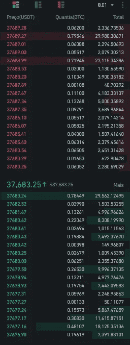
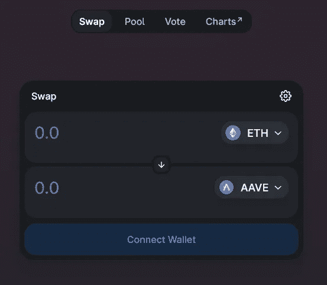
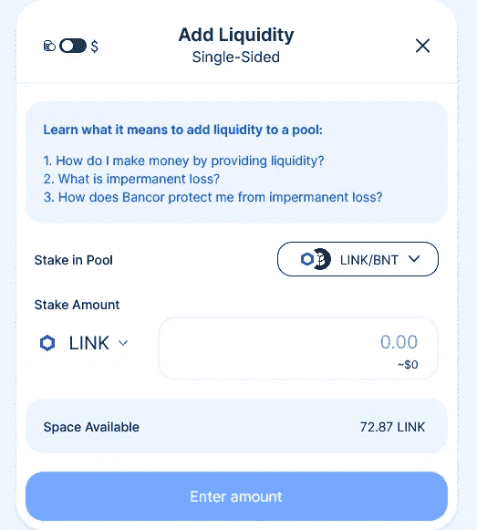

# 分散交易所的案例:金融世界是如何形成的？

> 原文：<https://medium.com/coinmonks/the-case-of-decentralized-exchanges-how-is-the-financial-world-shaping-up-feb88cb048b5?source=collection_archive---------8----------------------->

Fearless Girl — WallpaperAccess

我记得当我还是一个办公室勤杂工的时候，在烈日下走在科帕卡巴纳和里约热内卢市中心的街道上，从一家银行游荡到另一家银行去支付一些账单。那是大约 27 年前的事了。

20 世纪 80 年代至 90 年代初打击巴西的恶性通货膨胀促使金融机构大量投资于技术，以应对巴西货币政治的疯狂动态。由于猖獗的通货膨胀，在其他地方“过境”或“停留”一天的钱在到达目的地时将意味着贬值。

尽管金融服务行业有所创新，但我仍然不得不在银行排长队来支付公司账单。当我排队等候时，很少有人愿意使用自动取款机。原因似乎很明显:

*   自动提款机被限制在少数几种服务上，使得它只在一定程度上是合适的；
*   人们不相信它；
*   也不知道如何操作那个东西。

ATM 恐慌已经体现在我们的文化中。但是到了 20 世纪 90 年代末，自动取款机已经得到了广泛的认可，它们更加实用和安全，几乎每个人都在使用它们。如今，这些机器在我们的掌握之中。但那是后话了。

自动取款机的例子证明了在新产品、新概念或新技术被广泛接受之前，创新和必要的适应之间的细微差别。分散式交易所和未来的金融世界就是如此。

# **区分集中交易和分散交易**

**集中交易所，也称为 CEX** ，其特点是客户在进行交易前需要注册。通常有一个称为 KYC(了解你的客户)的过程，在这个过程中，客户必须通过提交正式文件来证明所提供的信息。在这个过程之后，用户必须存入一些钱，通常通过银行账户或借记卡/信用卡，并开始在平台上交易。

通过集中市场的交易不是在区块链上进行，而是通过该平台提供的订单簿(买卖订单列表)进行。这样，当你购买或出售一项资产时，这些信息被存储在必须拥有基础资产的中央经纪数据库中。

当你需要将资金存入区块链上的另一个钱包时，交易所将为你处理交易。这和从一个银行账户取钱到另一个账户是一样的。你不直接这样做，信息首先传递给负责转账的银行。

Binance Order Book

Crypto.com 的币安、比特币基地、FTX、北海巨妖、Kucoin、火币环球、Gate.io、Bitfinex、Gemini 和 Bitstamp 是一些最著名的集中交易所。

**另一方面，dex，或分散式交易所**，允许用户直接相互交换加密货币，而不需要中介，就像在集中式平台上一样。在这种模式下，也没有 KYC 系统。根据 CoinMarketCap 的数据，在撰写本文时，Uniswap、PancakeSwap 和 dYdX 是市值最高的三个指数。

虽然一些“分散”的交易所提供了一个订单簿，但它们是不必要的。要通过 dex 进行交易，您必须拥有一个加密货币钱包，如 Metamask、比特币基地、Exodus 等。来保管你的资产。

Uniswap Interface

一旦你的资产被托管，下一步就是将钱包与 DEX 相连，开始点对点交易，而不需要依赖中介。最后一个过程由自动做市商(AMMs)通过算法完成。

# **自动做市商的角色**

AMM 是加密货币市场中债券曲线为人所知的原因。粘合曲线是连接两个变量的数学方程。通过将资产的价格与其供给联系起来，债券曲线使这些变量变得相互依赖。并且令牌的值根据供应“自动”改变。

总而言之，债券曲线或自动做市商是智能合约中编码的等式，允许加密货币交易不依赖于订单簿，就像在集中交易所一样。

然而，为了使这项工程正常运行，有必要创建一个流动性池。简而言之，流动性池是两个或更多代币的储备。从资金池开始，分散式交易所向通过向资金池中存放代币来提供流动性的参与者提供激励。因此，随着每一笔交易的进行，存款人(通常被称为流动性提供者)会根据提供给资金池的百分比获得代币奖励。

Staking Liquidity on Bancor Protocol

对这种机制如何工作的详细解释超出了本文的范围。尽管如此，如果你有兴趣并想更深入地研究，我推荐这篇文章:[了解自动化做市商，第一部分:价格影响](https://research.paradigm.xyz/amm-price-impact)。

# 金融世界是如何形成的？

分散式交易所为贷款人或借款人提供了机会，对于那些想要赚取被动收入的人来说，这已经成为现实。在这个去中心化的世界里，筹款、抽奖和策展活动比比皆是。

然而，为了使这些服务更容易获得，仍然有一些问题需要解决。它们符合我所说的 ATM 恐慌:

*   分散的组织仍然缺乏许多服务产品。与竞争的集中式服务相比，当前的产品组合并不令人满意；
*   安全性和可访问性问题吓跑了许多潜在客户；
*   这是一个主要局限于加密货币领域的市场，也是它的发源地。

但不要被愚弄或分心。我真的不记得我在银行排队付账的最后一天了。

集中实体不会突然消失。虽然其中一些可能会发生这种情况，但我相当相信大多数将成为基于 CeFi 和 [DeFi](/coinmonks/defi-a-trillion-dollar-tsunami-about-to-flood-the-markets-d71e08f1ed94) 治理模式的混合机构。

相反，新兴的去中心化组织已经提供了旧组织无法提供的东西:自由选择、透明、授权、自治和尊重。所有这些都编码在智能合约中，智能合约是新金融体系的模型。

如果你已经做到了这一步并且喜欢它，不要忘记[关注我](https://marciogandara.medium.com)来获得新故事的更新。谢谢大家！

[***莱娅***](https://marciogandara.medium.com/o-caso-das-exchanges-descentralizadas-como-o-mundo-financeiro-est%C3%A1-se-moldando-fe84c840f1fe)

## [推特:甘达拉马西奥](https://twitter.com/gandaramarcio)

> 加入 Coinmonks [电报频道](https://t.me/coincodecap)和 [Youtube 频道](https://www.youtube.com/c/coinmonks/videos)了解加密交易和投资

## 另外，阅读

*   [币安交易机器人](/coinmonks/binance-trading-bots-d0d57bb62c4c) | [OKEx 评论](/coinmonks/okex-review-6b369304110f) | [阿塔尼评论](https://coincodecap.com/atani-review)
*   [最佳加密交易信号电报](/coinmonks/best-crypto-signals-telegram-5785cdbc4b2b) | [MoonXBT 评论](/coinmonks/moonxbt-review-6e4ab26d037)
*   如何在 Bitbns 上购买柴犬(SHIB)币？ | [购买 Floki](https://coincodecap.com/buy-floki-inu-token)
*   [CoinFLEX 评论](https://coincodecap.com/coinflex-review) | [AEX 交易所评论](https://coincodecap.com/aex-exchange-review) | [UPbit 评论](https://coincodecap.com/upbit-review)
*   [十大最佳加密货币博客](https://coincodecap.com/best-cryptocurrency-blogs) | [YouHodler 评论](https://coincodecap.com/youhodler-review)
*   [AscendEx 保证金交易](https://coincodecap.com/ascendex-margin-trading) | [Bitfinex 赌注](https://coincodecap.com/bitfinex-staking)
*   [最好的卡达诺钱包](https://coincodecap.com/best-cardano-wallets) | [Bingbon 副本交易](https://coincodecap.com/bingbon-copy-trading)
*   [印度最佳 P2P 加密交易所](https://coincodecap.com/p2p-crypto-exchanges-in-india) | [柴犬钱包](https://coincodecap.com/baby-shiba-inu-wallets)
*   [8 大加密附属计划](https://coincodecap.com/crypto-affiliate-programs) | [eToro vs 比特币基地](https://coincodecap.com/etoro-vs-coinbase)
*   最好的[加密税务软件](/coinmonks/best-crypto-tax-tool-for-my-money-72d4b430816b) | [硬币追踪评论](/coinmonks/cointracking-review-a-reliable-cryptocurrency-tax-software-5114e3eb5737)
*   [Stackedinvest 评论](https://coincodecap.com/stackedinvest-review) | [北海巨妖评论](/coinmonks/kraken-review-6165fc1056ac) | [bitFlyer 评论](https://coincodecap.com/bitflyer-review)