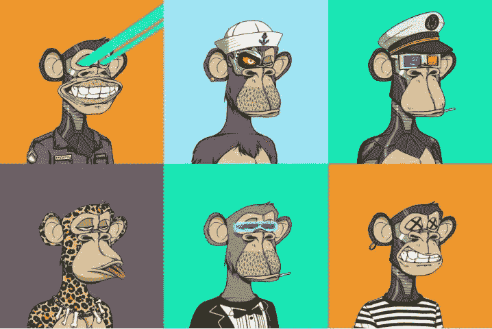
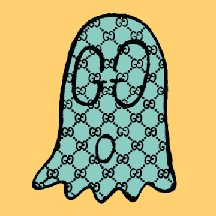
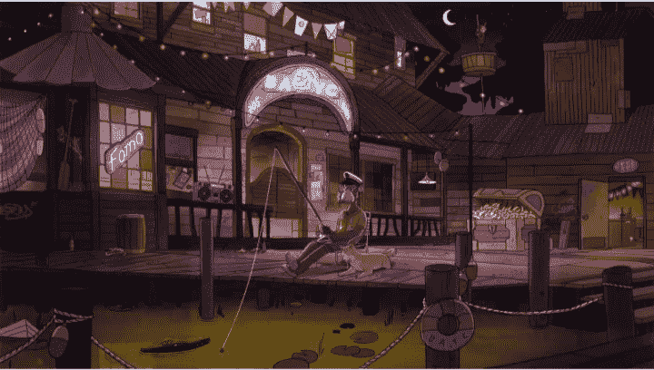
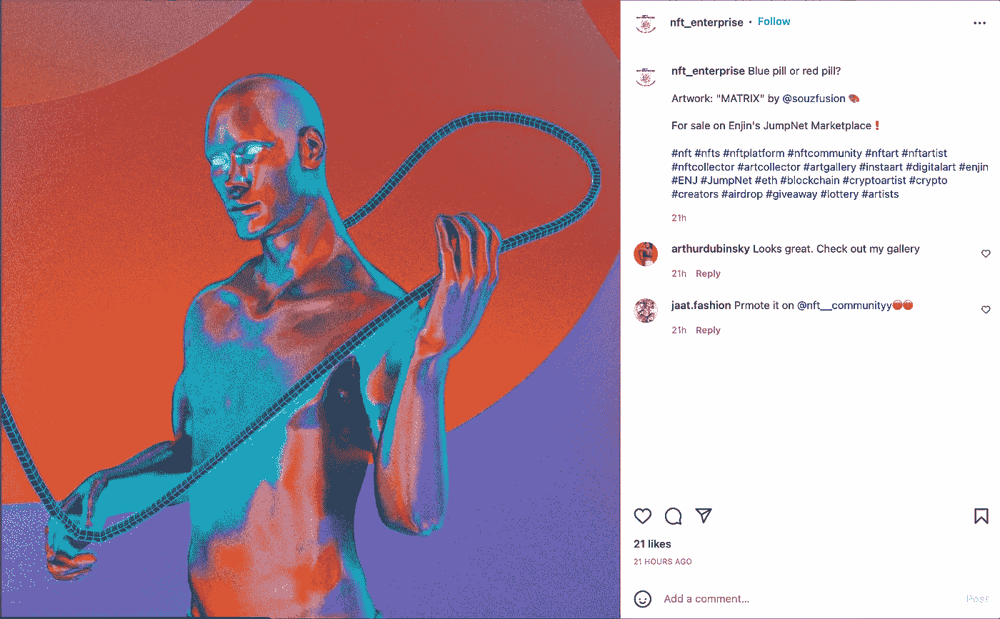
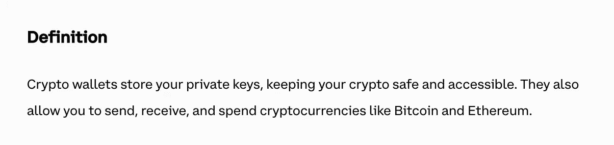
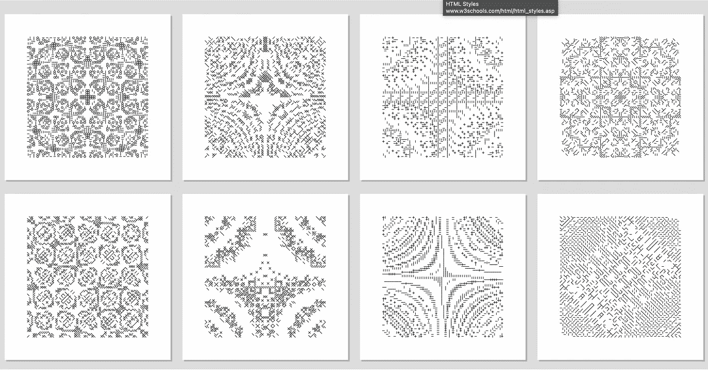
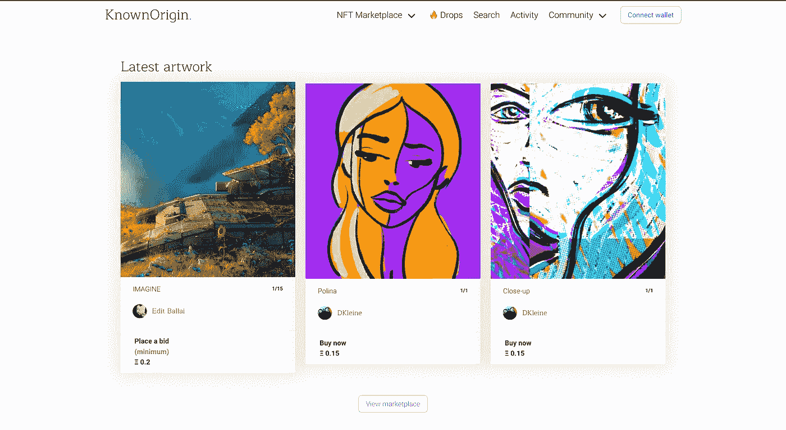

# 未来的无现金社会。

> 原文：<https://medium.com/coinmonks/the-cashless-society-of-the-future-c84cdfc8c64?source=collection_archive---------36----------------------->

Cashless Society

在加密货币 NFTs 和采矿领域的许多个人中，这是一种真正的趋势。这些科技流行语如此受欢迎，以至于许多人都将他们的全职/兼职努力和资源投入到了加密货币的事业中。所以在这篇文章中，我讨论了我在 crypto 和 NFTs 领域的知识和经验。😇

# **1。NFTs(不可替换令牌)**

NFT 是一种数字资产，它象征着现实世界中的对象，也不能被任何其他数字资产所替代。NFT 可以由艺术、音乐、gif、电影或任何游戏中的物品和普遍流行的虚拟化身组成。所以 NFT 属于以太坊区块链(像 Dogecoin，比特币)加密货币，平台支持 NFT 买卖。

一般来说，在 NFT 领域，总会有艺术家、买家或收藏家来进行交易。艺术家是指在任何设计平台上根据自己的想法或创意设计或创作非绘画作品的人，而买家或收藏家则从授权平台以一定的价格购买非绘画作品，他们可以保留 NFT，再转售给收藏者。这些天有流行的 NFT 社区，如企鹅社区，无聊猿游艇俱乐部，这是 NFTs 的趋势。每个 NFT 都有其原创版本，但也有不同版本的复制版本在互联网上提供，作为买家，这是一个预防措施，以分析卖方和 NFT 是真实的，崭新的。通过拥有 NFT 的原始版本，您将有自由细分实物资产的所有权，并可以为投资组合提供多样化的好处。此外，它们可以被用来延续欺诈，它们缺乏流动性和不稳定性。

A different version of an NFT | Source images courtesy Bored Ape Yacht Club

*This last NFT was sold for $3,600, but the current owner is asking for $16,300.* GIF by Trevor Andrew

*More than previous N.F.T. avatar projects, Bored Ape Yacht Club created rich and detailed iconography drawn from its founders’ personal tastes.* Image courtesy Bored Ape Yacht Club

# 2.企业 NFTs

ENFTs(企业不可替代令牌)是数字令牌，旨在解决供应链、制造业和各种其他行业中的问题。
企业要跟踪众多组织中的商品、服务和资产，需要使用不可替代的令牌。它们非常适合处理涉及许多不同公司和消费者的复杂情况。ENFTs 有助于使这些复杂的程序更加透明。ENFT 技术利用一个不可变的分类帐，在一个分散的数据库中跟踪所有交易和信息，以便于访问和收听。这可以通过比特币或 DigiByte 等公共区块链来完成，也可以通过半私有的区块链来完成。ENFT 令牌主要用于在资产完全存在期间跟踪、验证和认证资产。

Enjin enterprise NFT

# **3。钱包**

在解释什么是加密钱包之前，让我从 coinbase 中找出加密货币社会中什么是钱包的定义。

Definition from Coinbase.

加密钱包，不像传统的钱包可以保存实物现金，不保存加密货币。您的资产存储在区块链上，但只有私钥可以用来访问它们。您的密钥证明您控制您的数字货币，并允许您使用它进行交易。如果您的私钥丢失，您将无法使用您的资金。这就是为什么保护你的硬件钱包或利用像比特币基地、币安等知名钱包服务是至关重要的。在无现金社会中从事交易或交换时，拥有一个钱包对于密码交易员来说是至关重要的功能。

# **4。生成艺术**

什么是生成艺术？这个问题本身有一个不言自明的定义，它部分是由艺术家和计算机自主系统的合作产生的。使用智能合约，您现在可以生成艺术作品。智能合约是一段代码，存储在特定地址下的区块链上，通常在以太坊区块链上。当 crypto(通常是 ETH)被发送到该地址时，智能合约被触发，并且存储在该地址下的代码自动运行。

由于项目的独特性，在生殖艺术上有许多类型的项目，花费大约数十亿美元。有些是，

1.**艺术街区**:该项目在以太坊区块链上运行，创造抽象的艺术作品，如 Fidenzas、Chromie Squiggles 和 Ringers 系列。

**an example of generative art (**[**https://live.staticflickr.com/3390/3286169319_41800a9fbf_z.jpg**](https://live.staticflickr.com/3390/3286169319_41800a9fbf_z.jpg)**)**

2. [**失落** **诗人**](https://lostpoets.xyz/) : NFT 收藏品和战略游戏，这个项目被分解成几个步骤和一个路线图来铸造任何超过 60000 个可获得的 NFT 和收藏品的收藏品。这个价值超过 7000 万美元的项目仍然是当今世界的 NFT 项目。

3.**:在以太坊区块链上，autoglyphs 是第一个“链上”生成艺术。它们是一个完全独立的创作和拥有艺术品的机制。今天，它的总销售额超过了 4100 万美元。**

****

**First-generation of generative art Source: [Autoglyphs (larvalabs.com)](https://www.larvalabs.com/autoglyphs)**

**4.[**known origin**](https://knownorigin.io/):由一级和二级市场组成，known origin 是一个发现和购买新的数字艺术品的市场，以一定的投标价格出售。目前在 OpenSea 上的总销售额约为 2600 万美元，KnownOrigin 仍然比 blocks 小得多。**

****

**Known Origin marketplace website**

****参考:****

**[由 Datash | Medium](/@datash/an-introduction-to-generative-art-nfts-35e650a0f281) 编写的《生成艺术导论》**

**[生成艺术和非功能性艺术——ARTnews.com](https://www.artnews.com/list/art-in-america/features/generative-art-and-nfts-1234586572/zach-lieberman-blob-extrude-study/)**

**[比特币基地——购买&出售比特币、以太坊和更多可信的东西](https://www.coinbase.com/)**

**本文的第一部分，总结了当今社会的介绍性话题和最流行的流行语。我是如此渴望更多地讨论关于 ***元宇宙、空投、毒气战、沙盒、地板价值操纵等话题。*****

**如果你觉得这些免费内容值得，并激励我创造更多内容，请鼓掌。**

**谢谢大家，干杯！！🥂**

****

> **加入 Coinmonks [电报频道](https://t.me/coincodecap)和 [Youtube 频道](https://www.youtube.com/c/coinmonks/videos)了解加密交易和投资**

# **另外，阅读**

*   **[加拿大最佳加密交易机器人](https://coincodecap.com/5-best-crypto-trading-bots-in-canada) | [库币评论](https://coincodecap.com/kucoin-review)**
*   **[火币加密交易信号](https://coincodecap.com/huobi-crypto-trading-signals) | [HitBTC 审核](/coinmonks/hitbtc-review-c5143c5d53c2)**
*   **[如何在 FTX 交易所交易期货](https://coincodecap.com/ftx-futures-trading) | [OKEx vs 币安](https://coincodecap.com/okex-vs-binance)**
*   **[OKEx vs KuCoin](https://coincodecap.com/okex-kucoin) | [摄氏替代品](https://coincodecap.com/celsius-alternatives) | [如何购买 VeChain](https://coincodecap.com/buy-vechain)**
*   **[ProfitFarmers 回顾](https://coincodecap.com/profitfarmers-review) | [如何使用 Cornix Trading Bot](https://coincodecap.com/cornix-trading-bot)**
*   **[如何匿名购买比特币](https://coincodecap.com/buy-bitcoin-anonymously) | [比特币现金钱包](https://coincodecap.com/bitcoin-cash-wallets)**