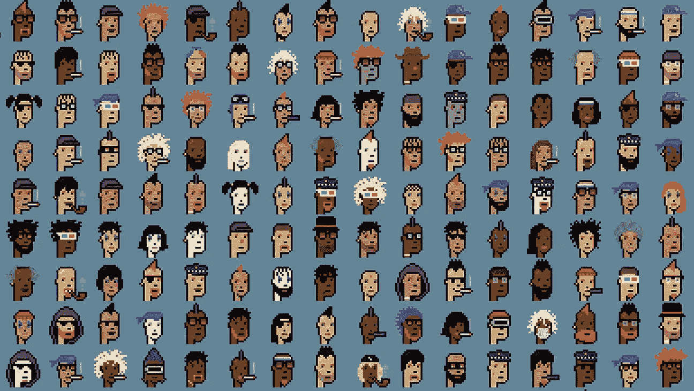
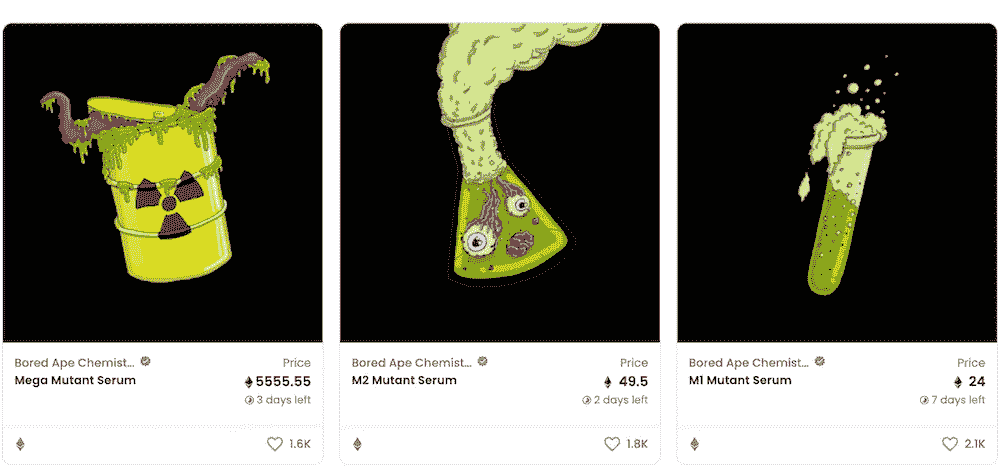
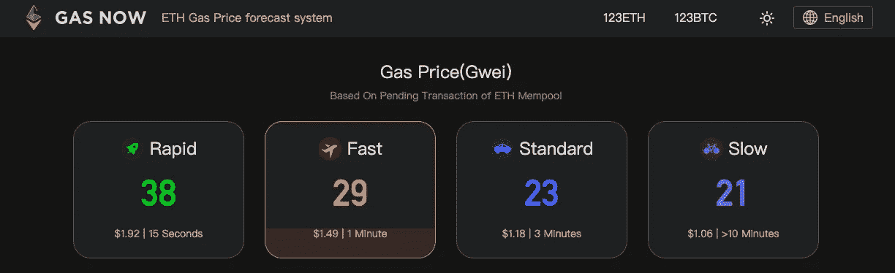
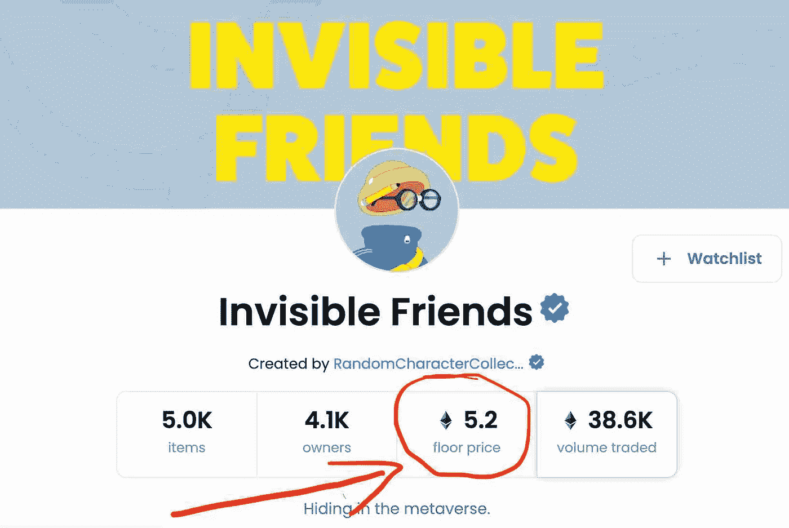
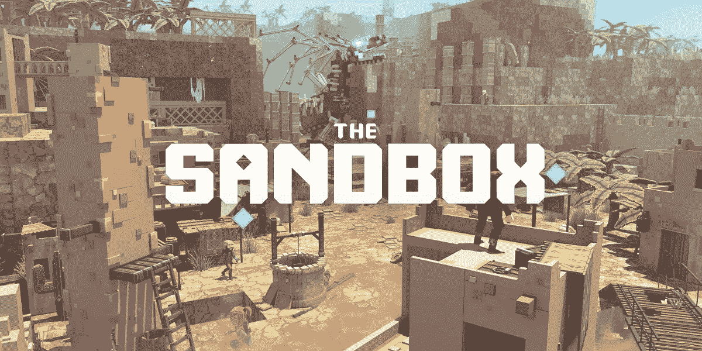
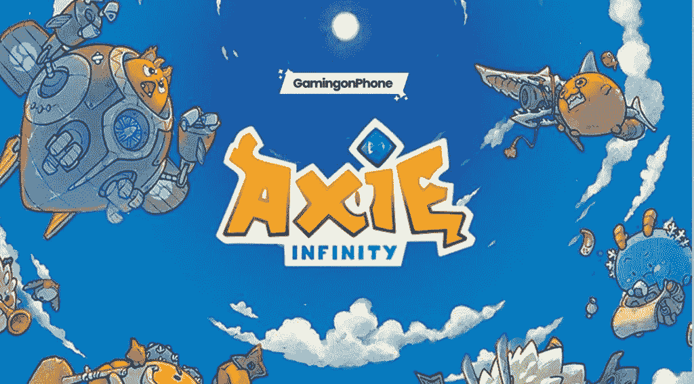
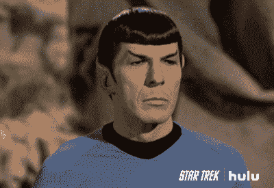

# 未来的无现金社会。第二卷。

> 原文：<https://medium.com/coinmonks/the-cashless-society-of-the-future-vol-2-83f9757b40c4?source=collection_archive---------27----------------------->

自从上一篇关于加密货币的文章以来，在这篇文章中，正如我提到的，我想讨论一下我在上一篇文章中提到的主题。

Cryptopunks NFTs

# **空投**

空投是将加密货币、代币或 NFT 免费发放到 web3 钱包地址，作为促销活动，或作为完成任务或获得数字资产的奖励。空投通常用于提高价值或引起对产品或服务的注意。空投通常被用作推广 NFT 项目或另一个区块链社区的营销工具，如 DAO(去中心化自治组织)或新形成的加密货币。

空投是 web3 生态系统的关键组成部分，因为它们是企业的促销工具，允许公司继续向其持有者提供额外的价值和效用，并允许区块链在不损害用户信任和关系的情况下开始新的项目。
要获得空投资格，你必须拥有特定资产的最低金额，如 NFT，或者利用了使你有资格获得空投的特定服务，如在市场上交易。要接收空投的资产，您还需要一个 web3 钱包。空投有多种类型，

1.  ***标准空投；*** 不要求你为了接收空投而花费任何金钱；取而代之的是，你完成一项任务，然后得到空投的奖励。加密货币通常是一种较新的未知货币，可能不如比特币和以太坊等知名加密货币有价值。
2.  ***独家空投；*** 给予长期持有或使用加密货币或区块链社区的成员。独家空投本质上是对忠诚用户的奖励，通常除了忠诚之外没有任何条件。
3.  ***NFT 空投；对 NFT 进行空投有各种各样的原因。你可以因为在钱包里保留一个特定的 NFT，以某种方式推广一个品牌，参加一个赠品，甚至作为一个礼物而不是一个营销策略而得到一个 NFT 空投。从 NFT 空投会非常有益。无聊猿突变血清是一个很好的例子，值得 NFT 空投。变异血清 NFT 被空投到无聊猿游艇俱乐部 NFT 持有者。***

Mutant Serum NFT (Source: Google)

4. ***Hardfork 空投；*** 当一个区块链被永久拆分或者一个新版本推出，需要创造一个新的硬币与之配套时发生。一般来说，旧版本的先前区块链将继续与您的旧代币一起存在，但是新代币将以与旧代币相同的比例空投给您。

# 天然气战争

一场气体战争是一场争夺区块链第一名的比赛，这场比赛将在区块链上进行验证。当有大量需求时，优先职位的成本可能会增加。

Example of a gas price of ETH at Gas Now platform (Source — Google)

根据以太坊的说法，在工作证明共识协议中验证交易所需的计算机能力被称为“gas”。这种计算能力为网络和运行于其上的所有程序提供了动力。因此，必须支付基本燃气费来支付计算费用。然而，一场关于定期付款的天然气战争不太可能爆发。更有可能的情况是，一个不可替代的令牌(NFT)被出售，而其中只有一小部分可以访问。如果消费者输掉这场天然气战争，他们可能无法以广告价格购买 NFT。这导致用户之间的摩擦，并经常导致竞标战。

汽油大战有时能带来比出售的真正商品更多的钱。当《时代》杂志在 2021 年 9 月拍卖有限数量的 0.1 ETH 的 NFT 时，一些买家显然支付了四倍于代币的汽油费。天然气战争的一个副作用是，少数富裕的买家偶尔可以轻易赶走那些负担不起天然气价格的买家，从而主导市场。

# **下限数值操作**

*成为 NFT 项目会员或购买 NFT 某项目 NFT 的最低 ETH 金额被称为 NFT 底价。*通常，我们说这是购买 NFT 的最低价格，尽管这确实取决于供应商。

在 OpenSea 上，你可以通过点击一个 NFT 的收藏来查看底价，它会每小时更新一次。

以 NFT 项目“隐形朋友”为例，这是互联网上最知名的 NFT 项目之一。下图描述了 OpenSea 的底价。

OpenSea Invisible Friends NFTs (source: Google)

隐形朋友目前的底价是 5.2 以太坊。这意味着购买者或投资者有兴趣购买一个无形的朋友 NFT 可以这样做为 5.2 ETH，这是最低的价格一个 NFT 对无形的朋友项目可以购买。

# **沙盒/遗产/ Axie**

正如在前面的文章中提到的，NFT 可以通过各种方式发布，包括游戏。因此，下面提到的是一些流行的游戏和市场的 NFTs 和密码交易。

**沙盒**

沙盒游戏是一种玩家很少受到角色限制的游戏，玩家可以自由地旅行和定制他或她认为合适的虚拟世界。一个沙盒游戏，相对于一个进程风格的游戏，强调漫游，并允许玩家选择自己的任务。沙盒游戏，而不是有分割的区域或编号的阶段，发生在一个“世界”中，玩家从头到尾都有完全的控制权。开放世界或自由漫游游戏是沙盒的别称。

Sandbox game (Source: Google)

**阿谢尔**

[Axie Infinity](https://axieinfinity.com/) 公司网站称，这是一款基于《最终幻想战术》和《闲散英雄》等游戏的“闲散战斗”概念的竞技游戏。玩家可以收集 Axies，这是游戏设置中的生物，作为宠物。游戏的目标是让玩家为他们的轴心而战斗、繁殖、收集、成长和建立王国。玩家可以通过游戏内经济购买、出售和交易在游戏中获得的资源。在游戏中最常见的前进方式是增加个人收藏的数量。

该游戏采用“先付后赚”的模式，玩家在支付初始费用后，可以通过游戏赚取一枚基于以太坊的游戏内硬币。每隔 14 天，Axie Infinity 允许用户支付代币。这种方式被认为是一种赌博，市场不稳定，高度依赖新玩家的流入。

Axie Infinity (Source: Google)

我希望与内容共享的主题会提供一些关于加密和 NFT 的见解。觉得这个内容有价值就留个掌声。

谢谢大家，干杯！！🥂

(Source: Google)

> 加入 Coinmonks [电报频道](https://t.me/coincodecap)和 [Youtube 频道](https://www.youtube.com/c/coinmonks/videos)了解加密交易和投资

# 另外，阅读

*   [最佳加密交换平台](https://coincodecap.com/best-crypto-swap-platforms) | [最佳加密交易所](https://coincodecap.com/crypto-exchange)
*   [购买比特币印度](/coinmonks/buy-bitcoin-in-india-feb50ddfef94) | [Pionex 评论](/coinmonks/pionex-review-exchange-with-crypto-trading-bot-1e459d0191ea) | [加密交易机器人](/coinmonks/crypto-trading-bot-c2ffce8acb2a)
*   [n rave 零点回顾](/coinmonks/ngrave-zero-review-c465cf8307fc) | [Phemex 回顾](/coinmonks/phemex-review-4cfba0b49e28) | [PrimeXBT 回顾](/coinmonks/primexbt-review-88e0815be858)
*   最佳[区块链分析](https://bitquery.io/blog/best-blockchain-analysis-tools-and-software)工具| [赚比特币](/coinmonks/earn-bitcoin-6e8bd3c592d9)
*   [Cloudbet 赌场评论](https://coincodecap.com/cloudbet-casino-review) | [点火赌场评论](https://coincodecap.com/ignition-casino-review)
*   [加密套利](/coinmonks/crypto-arbitrage-guide-how-to-make-money-as-a-beginner-62bfe5c868f6)指南| [如何做空比特币](/coinmonks/how-to-short-bitcoin-568a2d0b4ae5)