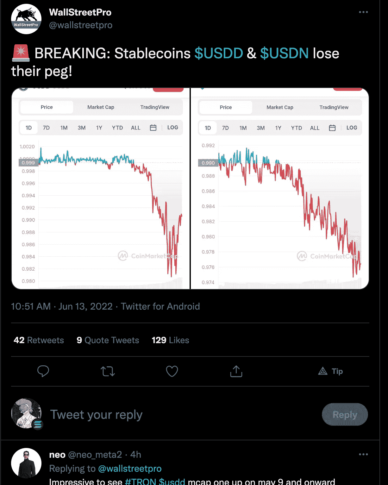

# 摄氏温度问题

> 原文：<https://medium.com/coinmonks/the-celsius-problem-3c31ccc75391?source=collection_archive---------25----------------------->

Alexander Mashinsky, Co-founder & CEO of Celsius Network

加密市场似乎在寻找灾难，因为持有者在猜测下一次类似月亮的内爆将在哪里发生，以及是否会发生。

本周，我加入了黑帮。我感觉沼泽里有更大的投降。

所以…有三个硬币得到了一些主要的热量。

索拉纳

我不会在这里花太多时间，但我们今年已经有 7 次以上的网络中断，大多数是通过机器人从 NFT 市场造成的。这些程序被设计成垃圾交易，堵塞网络并在二级市场上批量购买/卸载 NFT。

对索拉纳来说，这是艰难的一年。

最近的一次停电与 NFTs 毫无关系，由于宏观市场的极度恐慌，吸引了很多 FUD。由于其健康的度量标准，以及处于测试阶段，该链之前已经摆脱了粗糙的补丁。

然而，市场目前并不宽容。

自己拿主意。

**十六进制**

我太无知和多疑了，无法理解妖术的吸引力/效用。我的理解是，它类似于一种养老金储蓄工具，奖励长期持有人保持价格，同时用类似税收的措施“惩罚”纸面上的人。

据我所知，你也不能把它作为交流的媒介，这是故意的。

我宁愿亲自下注，也不愿买妖术…尽管让我们进入那个话题。

**摄氏度**

Celsius network 是一个注册并符合 SEC 要求的贷款平台，为存入的 BTC、ETH 和 stable coins 提供利息，同时允许用户获得加密抵押贷款。

平台上有 4 个不同的玩家:

1.  **贷方。** 他们在出借自己的股份时接收 APY。
2.  **借款人。
    一些人(主要是散户)只想注入少量流动性，而不出售他们的股份。**
3.  **摄氏平台。** 做市商服务有收费。
4.  **外部外汇市场。他们主要使用摄氏温度来注入大量流动性/执行交易。**

**这个问题。**

首先，我们来解释一下什么是 Staked ETH(stETH)。

今年晚些时候，以太坊将很快从高能耗的工作一致性验证算法过渡到利害关系验证模型。你已经可以通过验证器来验证你的 ETH 了，但是这有两个障碍。

1.  大多数股权证明网络需要相对较大的股权。例如，以太坊要求每个验证器有 32 个以太网。
2.  **其次，押了 ETH 被锁起来。这将持续到今年晚些时候的过渡期，可能会有延迟。**

LIDO 是一个赌注平台，让你保持你存放的 ETH 完好无损*和*杠杆你的 ETH 用于其他地方，如 DeFi(贷款，借款和做市)。该协议赌上了他们所有的 ETH(远远超过 32！)并将赌注奖励分发给他们的用户，从而解决了问题 1。

为了规避问题 2，他们引入了一个令牌 stETH，它由通过他们的 ETH 支持。

你得到你的赌注回报，利多得到一份，你得到一个类似期货合约的衍生品。

我们得到了我们的蛋糕并吃掉了它，作为赌注奖励的一小部分。

**狡猾的蛋糕？**

大型加密基金 Alemeda Research 最近退出了 stETH 的大量头寸(近 50K stETH ),以换取未持股的以太坊，导致重大滑点退出。

他们并不孤单。

他们的举动引起了 stETH 的大规模抛售，因为散户投资者猜测，对 stETH 有大量杠杆敞口的任何玩家来说，打破钉住汇率制度可能是一个“LUNA moment”。

可悲的是，他们没有错…这里输入摄氏度。

**摄氏度的角色。**

Celsius 签订了许多锁定其资产的赌注合同，例如，他们可以拿你的 ETH，然后借给你半个以太坊(超额抵押贷款)。

每当你想拿回你的 ETH 抵押品时，Celsius 必须以 CEX/DEX 的价格出售 stETH。

钉住汇率的下滑使得 Celsius 容易受到银行挤兑的影响，因为相对于履行义务所需的 ETH 数量，他们必须以 5%的亏损(截至目前)出售 stETH。

对于银行挤兑事件来说，这是一个可怕的背景。

如果现在亏本出售 stETH 会使 Celsius 破产，…我认为资产冻结是一手烂牌的最好玩法。

这可能会给 Celsius 时间来解决他们的流动性问题，并提高收入来偿还债务。大多数人会同意，这胜过恐慌导致的清算事件，人们可以获得他们所持股份的百分比，因为他们的现金流是积极的。

与卢娜的 UST 不同，这种挂钩是由 ETH 支持的 1 比 1，所以与权让我们遭受的情况相比，它并不那么糟糕。

也就是说，当前的低迷可能会对 Celsius 的收入流产生负面影响，因为用户活动减少，采矿收入减少(能源价格上涨，加密价格下降)。

这是他们最近描述其行为/立场的声明。

[https://blog.celsius.network/a-memo-to-the-celsius-community-59532a06ecc6](https://blog.celsius.network/a-memo-to-the-celsius-community-59532a06ecc6)

**这还不是全部……**

币安刚刚停止了比特币取款。

没错。

[https://twitter.com/cz_binance/status/1536317704990208000](https://twitter.com/cz_binance/status/1536317704990208000)

USDD 和美元，两种稳定的货币，刚刚与美元脱钩…

[https://twitter.com/wallstreetpro/status/1536285081618243585](https://twitter.com/wallstreetpro/status/1536285081618243585)

最重要的是，周三的美联储会议可能会对宏观市场产生负面影响，以回应 8.6%的官方 CPI。美联储可能会通过宣布即将到来的加息计划来搅乱市场。

BTC 很好地跟踪了纳斯达克，所以我们知道这对整个加密市场意味着什么。

六月将是丑陋的小伙子。

我们仍然需要谨慎关注微观策略和系绳…

我引用一句话来结束我的发言。

> 在上一次 ATH 期间，新人们对那些早早进入并坚持下来的食人魔感到惊讶。这就是另一半时间的感觉。你现在的行为决定了你在下一次 ATH 中的感受。
> 
> 不是财务建议。— CZ

> 加入 Coinmonks [电报频道](https://t.me/coincodecap)和 [Youtube 频道](https://www.youtube.com/c/coinmonks/videos)了解加密交易和投资

# 另外，阅读

*   最佳[区块链分析](https://bitquery.io/blog/best-blockchain-analysis-tools-and-software)工具| [赚比特币](/coinmonks/earn-bitcoin-6e8bd3c592d9)
*   [Cloudbet 赌场评论](https://coincodecap.com/cloudbet-casino-review) | [点火赌场评论](https://coincodecap.com/ignition-casino-review)
*   [加密套利](/coinmonks/crypto-arbitrage-guide-how-to-make-money-as-a-beginner-62bfe5c868f6)指南| [如何做空比特币](/coinmonks/how-to-short-bitcoin-568a2d0b4ae5)
*   [如何在加拿大购买加密货币？](https://coincodecap.com/how-to-buy-cryptocurrency-in-canada)
*   [无聊猿游艇俱乐部(BAYC)回顾](https://coincodecap.com/bored-ape-yacht-club-bayc-review) | [拜比特 vs 比特币基地](https://coincodecap.com/bybit-vs-coinbase)
*   [5 款最佳加密交易终端](https://coincodecap.com/crypto-trading-terminals) | [最佳 DeFi 应用](https://coincodecap.com/best-defi-apps)