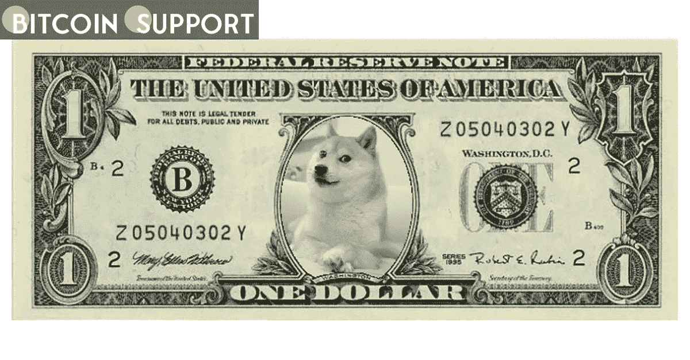

# Robinhood 的首席执行官谈论 DOGE 如何成为“互联网货币”

> 原文：<https://medium.com/coinmonks/the-ceo-of-robinhood-discusses-how-doge-could-become-the-internet-currency-4e1cad8fd71f?source=collection_archive---------32----------------------->

**Visit our website for full blog:-** [**https://bitcoinsupports.com/the-ceo-of-robinhood-discusses-how-doge-could-become-the-internet-currency/**](https://bitcoinsupports.com/the-ceo-of-robinhood-discusses-how-doge-could-become-the-internet-currency/)

就在 Dogecoin 的创始人因 Elon Musk 在 Twitter 上的滑稽行为而对其进行严厉批评几个小时后，Robinhood 首席执行官 Vladimir Tenev 在 Twitter 上解释了 DOGE 如何成为互联网的未来货币。周四下午，Robinhood 首席执行官 Vladimir Tenev 在 Twitter 上解释了 Dogecoin 如何成为“互联网的未来货币”

Tenev 向他的近 20 万名粉丝讲述了将 memecoin 转化为可用于日常支付和互联网交易的资产的必要步骤。https://twitter.com/vladtenev/status/1514684174002634768 开始强调 Dogecoin 的交易费用——大约每笔交易 0.003 美元——已经足够低，足以使其成为可行的电子现金领先者。他认为，如果加密货币要获得广泛采用，Dogecoin 的块大小和块时间是两个最关键的改进领域。

[https://twitter.com/vladtenev/status/1514684178943524871](https://twitter.com/vladtenev/status/1514684178943524871)

Dogecoin 目前的块大小为 1MB，块时间为 1 分钟，这意味着 doge coin 的总吞吐量约为每秒 40 个事务(TPS)。

相比之下，VISA 网络的吞吐量约为 65，000 TPS，这意味着 DOGE 的总吞吐量需要增加约 1，625 倍才能与 VISA 竞争。Tenev 声称这不是一个值得关注的问题，这个问题可以通过简单地将 DOGE 的块大小限制从 1MB 增加到 1GB，并最终增加到 10GB 来解决。Tenev 给 Dogecoin 的开发者发了一条消息，敦促他们优先增加块大小限制。https://twitter.com/kaiynne/status/1514772412482846721 在 Dogecoin 创始人杰克逊·帕尔默抨击前“Dogecoin 首席执行官”埃隆·马斯克恶意收购 Twitter 的计划三个小时后发表了这条帖子。帕尔默在一条发给 4.1 万名粉丝的推文中写道:“把任何类型的‘自由’与世界首富发起敌意收购、迫使最大的公共社交媒体平台之一私有化联系起来，都需要相当惊人的精神体操。”。帕尔默毫不犹豫地批评了马斯克。去年 5 月中旬，帕尔默称马斯克为“自私的骗子”，声称这位亿万富翁在周六夜现场的病毒式表现是“畏缩，兄弟”Dogecoin 的价格相对来说没有受到最近事件的影响，在过去的七天里一直在 0.14 美元到 0.15 美元之间波动。

**访问我们的网站获取完整博客:-**[**https://bitcoinsupports . com/the-CEO-of-robin hood-discuses-how-doge-could-be-the-internet-currency/**](https://bitcoinsupports.com/the-ceo-of-robinhood-discusses-how-doge-could-become-the-internet-currency/)

**免责声明:以上为作者观点，不应视为投资建议。读者应该自己做研究。**

> 加入 Coinmonks [电报频道](https://t.me/coincodecap)和 [Youtube 频道](https://www.youtube.com/c/coinmonks/videos)了解加密交易和投资

# 另外，阅读

*   [AscendEx 保证金交易](https://coincodecap.com/ascendex-margin-trading) | [Bitfinex 赌注](https://coincodecap.com/bitfinex-staking) | [bitFlyer 点评](https://coincodecap.com/bitflyer-review)
*   [Bitget 回顾](https://coincodecap.com/bitget-review)|[Gemini vs block fi](https://coincodecap.com/gemini-vs-blockfi)cmd |[OKEx 期货交易](https://coincodecap.com/okex-futures-trading)
*   [AscendEx Staking](https://coincodecap.com/ascendex-staking)|[Bot Ocean Review](https://coincodecap.com/bot-ocean-review)|[最佳比特币钱包](https://coincodecap.com/bitcoin-wallets-india)
*   [霍比评论](https://coincodecap.com/huobi-review) | [OKEx 保证金交易](https://coincodecap.com/okex-margin-trading) | [期货交易](https://coincodecap.com/futures-trading)
*   [网格交易机器人](https://coincodecap.com/grid-trading) | [Cryptohopper 审查](/coinmonks/cryptohopper-review-a388ff5bae88) | [Bexplus 审查](https://coincodecap.com/bexplus-review)