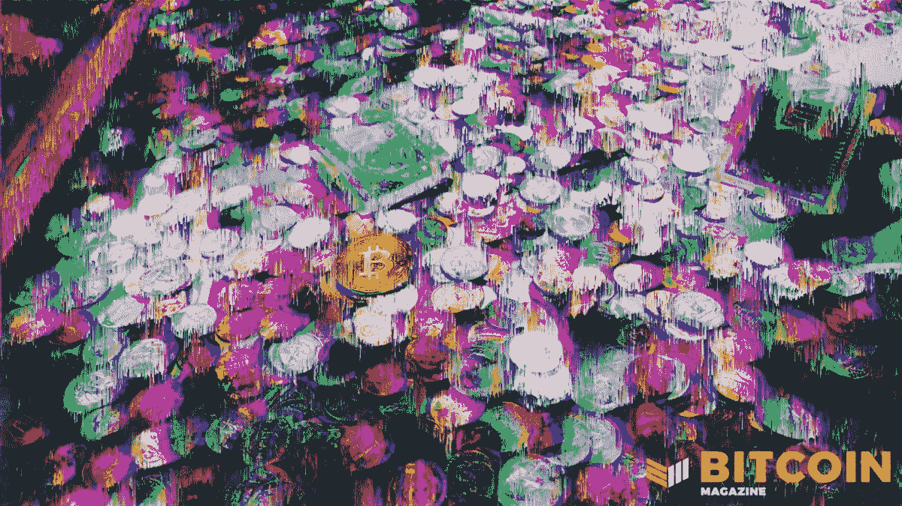

# 变化中的货币体系、收益率曲线和比特币

> 原文：<https://medium.com/coinmonks/the-changing-monetary-system-yield-curves-and-bitcoin-c27aff3a65b7?source=collection_archive---------16----------------------->

讨论比特币和不断变化的货币格局。

**听这一集:**

*   [苹果](https://podcasts.apple.com/de/podcast/jeff-snider-the-monetary-system-is-changing-yield/id1543640492?i=1000549085163)
*   [Spotify](https://open.spotify.com/episode/2njhT9TayM7DZQZ0tRFmQb?si=e3765a8bf6004ccb)
*   [谷歌](https://podcasts.google.com/feed/aHR0cHM6Ly9mZWR3YXRjaC5saWJzeW4uY29tL3Jzcw/episode/MDhmYTYxMDgtZDQ4OC00ZTMwLWFkYjEtMTg5Njg1YTM0NDA3?sa=X&ved=0CAgQuIEEahcKEwiI4LiphtD1AhUAAAAAHQAAAAAQLA)
*   [Libsyn](https://fedwatch.libsyn.com/jeff-snider-the-monetary-system-is-changing-yield-curves-and-bitcoin-fed-78)
*   [阴天](https://overcast.fm/+m2afaQrOc)

在《比特币》杂志“美联储观察”播客的这一集中，我和 Christian Keroles 与 Alhambra Investments 的全球投资研究主管兼首席欧洲美元专家 Jeff Snider 就全球金融体系的现状和变化进行了对话。

我们讨论了伦敦银行间同业拆放利率(LIBOR)和担保隔夜融资利率(SOFR)，美联储的鹰派支点，我们可以从收益率曲线中学到什么，当然还有比特币。

# 为什么伦敦银行同业拆借利率和 SOFR 很重要

伦敦银行同业拆借利率是欧洲美元体系的核心。这是银行间相互借贷的利率。由于它充当了国际欧元美元体系的某种联邦基金利率，因此它是通知高于它的所有其他利率的利率。

多年来，美联储和其他央行一直试图摆脱伦敦银行同业拆借利率，这次他们似乎做到了。根据 2021 年 12 月 15 日发布的国会研究服务[文件](https://sgp.fas.org/crs/misc/IF11315.pdf)，2022 年，“使用 LIBOR 的金融公司面临法律、运营、信用、监管和声誉风险”。

斯奈德的评论颇有见地，解释了为何用了这么长时间才脱离 LIBOR，以及这种过渡至少要持续到 2023 年 6 月，届时最后一批使用 LIBOR 的期货合约将到期。

美联储提供的替代品是 SOFR，而像彭博这样的私人公司也在提供替代品。目前没有明确的赢家，可能在很长一段时间内都没有。

伦敦银行同业拆借利率是一种新兴的市场现象，它让欧洲美元合约蚕食了金融界。根据上述文件，2020 年，价值 223 万亿美元的合同中引用了 LIBOR，根据 CRS[。这是一个很大的平仓，斯奈德提到，在阻止市场使用 LIBOR 的过程中，监管机构带来了更多的系统性风险和不确定性。](https://sgp.fas.org/crs/misc/IF11315.pdf)

就我而言，我认为这是一个观察系统如何适应根本变化的绝佳机会。有一天，当他们采用比特币时，这将不得不发生，所以这个实验是我们可以获得一些数据的一个实验。

# 探索鹰派美联储转向的原因

我不能让斯奈德上节目，而不问他对杰罗姆·鲍威尔最近的转变有什么想法。他的回应集中在美联储担心对世界“暂时”的困惑和不满将渗透到更长期的消费者和企业通胀预期上。这是美联储自金融大危机(GFC)以来一直想要的，但现在它担心通胀预期会变得过高。

施奈德指出，通胀和增长预期实际上一直在下降，因为美联储一直在转向鹰派(不是之后！).未来五年的增长率将降至 2%以下，[国际货币基金组织发布了](https://archive.ph/wEZAR)其 1 月份对 2022 年 GDP 的最新估计，比此前的估计晚了三个月，将美国经济增长下调 1.2%至 4%，全球经济增长下调 4.4%。

*Source:* [*Federal Reserve Bank of St Louis*](https://fred.stlouisfed.org/series/T5YIFR)

接下来，我们试图进入央行行长的头脑，讨论鲍威尔可能做出这一鹰派举动的其他原因，如为未来降息和重启量化宽松(QE)留出空间。如果美联储仍然全速前进，利率为零，QE 为每月 120 美元，那么在即将到来的低迷时期，它会做什么？顺便说一下，这就是欧洲央行(ECB)目前的状况。

# 收益率曲线看起来更像日本，而不是复苏

Snider 是一个收益率曲线窃窃私语。我特别询问了他最近提出的一个观点，即在过去 20 年的意义上，美国收益率曲线更像日本，而不是任何形式的复苏。

他开始做一个伟大的解释。我会详细引用，因为它很好:

> *“如果事情从非常糟糕(这意味着低名义水平)向好于非常糟糕甚至正常的方向发展，我们会预计收益率曲线将首先变陡，名义利率，特别是长期利率将比短期利率上升得更快。这将告诉我们，'好吧，也许有一个政权的变化。他说，也许我们正在摆脱日本通缩的局面，这是更好的情况。*
> 
> “去年年初，2020 年末和 2021 年初，尤其是 2021 年的 1 月和 2 月，收益率曲线开始变陡，开始出现这种情况。收益率曲线当时告诉我们，本质上是因为它仍然很低，并没有真正转变太多，但如果只是相对于 2020 年，市场正变得更加乐观。这不是一个很高的比较标准。但是它从来没有真正的进展超过这一点。收益率曲线总是保持低平，即使它变陡了。
> 
> *“自去年 3 月以来，它基本上一直保持这种状态，但它变得更加平坦，因为现在我们看到美联储预计今年将加息，这产生了提高短期利率而不提高长期利率的效果。现在我们有一条平坦的收益率曲线，处于令人难以置信的低水平，从未真正超出日本的范围，因为缺乏更好的术语，这意味着收益率曲线告诉我们的不是通胀，而是更多的通缩风险。”*

# 杰夫·斯奈德对比特币的看法

斯奈德此前两次被列入“美联储观察”。每一次，我们都在讨论比特币。他最近在一些不同的媒体上谈论比特币，所以我们想知道他的观点是否有所改变。

他并不反对比特币。他喜欢比特币，希望它好运，但并不完全接受它。他完全接受比特币的主要障碍很重要，比特币的创造者们应该倾听他的意见，并试图回答这个问题，而不是忽视它。我个人不同意，但他对当前体系有着广泛的了解。

底线是他没有看到比特币成为交易货币的途径。他确实认为它是一种价值储存手段，但不能成为交换媒介。Snider 的问题是缺乏弹性。

总的来说，这是一个理性的论点，值得参与。我想我会为*比特币杂志*写一篇关于这种批评的文章。敬请关注。

感谢斯奈德的到来。这是一次很棒的谈话！

阿尔罕布拉投资公司:[https://alhambrainvestments.com/](https://alhambrainvestments.com/)

欧洲美元大学 YouTube:[https://www.youtube.com/c/EmilKalinowski](https://www.youtube.com/c/EmilKalinowski)

LIBOR 讣告由*纽约时报*:[https://archive.ph/UfPrs](https://archive.ph/UfPrs)

伦敦银行同业拆借利率的国会研究服务:[https://sgp.fas.org/crs/misc/IF11315.pdf](https://sgp.fas.org/crs/misc/IF11315.pdf)

国际货币基金组织国内生产总值估计数:[https://archive.ph/wEZAR](https://archive.ph/wEZAR)

*原载于 2022 年 1 月 27 日*[*【https://bitcoinmagazine.com】*](https://bitcoinmagazine.com/markets/changing-monetary-system-yield-curves-and-bitcoin)*。*

> 加入 Coinmonks [电报频道](https://t.me/coincodecap)和 [Youtube 频道](https://www.youtube.com/c/coinmonks/videos)了解加密交易和投资

# 另外，阅读

*   [加密保证金交易交易所](/coinmonks/crypto-margin-trading-exchanges-428b1f7ad108) | [赚取比特币](/coinmonks/earn-bitcoin-6e8bd3c592d9)
*   [WazirX vs coin dcx vs bit bns](/coinmonks/wazirx-vs-coindcx-vs-bitbns-149f4f19a2f1)|[block fi vs coin loan vs Nexo](/coinmonks/blockfi-vs-coinloan-vs-nexo-cb624635230d)
*   [BlockFi 信用卡](https://coincodecap.com/blockfi-credit-card) | [如何在币安购买比特币](https://coincodecap.com/buy-bitcoin-binance)
*   [火币交易机器人](https://coincodecap.com/huobi-trading-bot) | [如何购买 ADA](https://coincodecap.com/buy-ada-cardano) | [Geco？一次审查](https://coincodecap.com/geco-one-review)
*   [加密副本交易平台](/coinmonks/top-10-crypto-copy-trading-platforms-for-beginners-d0c37c7d698c) | [五大 BlockFi 替代方案](https://coincodecap.com/blockfi-alternatives)
*   [CoinLoan 审核](https://coincodecap.com/coinloan-review)|[Crypto.com 审核](/coinmonks/crypto-com-review-f143dca1f74c) | [火币保证金交易](/coinmonks/huobi-margin-trading-b3b06cdc1519)