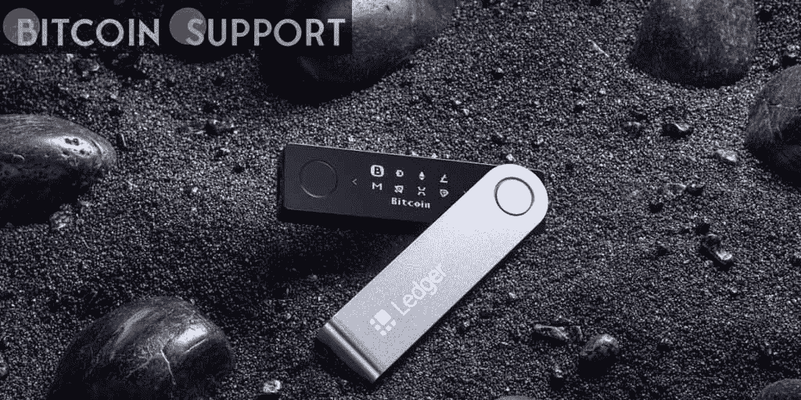

# 莱杰的首席技术官警告加密货币用户“盲签”的风险。

> 原文：<https://medium.com/coinmonks/the-chief-technology-officer-of-ledger-warns-cryptocurrency-users-about-the-risks-of-blind-signing-39c579bf811e?source=collection_archive---------58----------------------->

**Visit our website:-** [**https://bitcoinsupports.com/**](https://bitcoinsupports.com/)

“不信任；硬件钱包制造商 Ledger 的首席技术官 Charles Guillemet 建议道。随着最近对 OpenSea 的攻击暴露了区块链的弱点，Ledger 的 CTO Charles Guillemet 警告用户不要“盲目签名”，他将其描述为“盲目同意交易被签署，而不理解它所包含的内容”

Guillemet 崩溃了，强调了盲签的挑战。根据分类账的首席技术官，同意交易需要签署一份发送给区块链的信息。虽然其他人可以验证签名是否正确，但是用户是唯一可以使用私钥签署事务的人。“问题是，默认情况下，这个消息是不可理解的。它是一个数据有效载荷。

此外，Guillemet 解释说，当一笔货币交易被签署时，它通常伴随着一个“正确解析有效载荷并暴露其意图”的钱包然而，Guillemet 指出，当涉及到签署智能合同的复杂交互时，“解析显示并不总是得到充分的支持，这让你别无选择，只能盲目同意你不理解的交易。”

**“这是有风险的，因为你可能认为你正在签署一项交易，将你的一部分资产转移到地址 A，而实际上，你正在签署一项交易，将你的所有现金转移到地址 b。”**

此外，安全专家提供了盲目签署导致重大损失的实例。在最近的 OpenSea 黑客攻击中，用户成为网络钓鱼攻击的目标，导致 170 万美元的不可伪造令牌(NFT)损失。根据 Guillemet 的说法，攻击者欺骗他们的受害者在一条信息上盲目签名，授权以 0 ETH 出售他们所有的 NFT。

“攻击者需要做的只是签署一份交易，声明‘我同意以 0 ETH 购买这些 NFT’，然后将这两条消息提交给 OpenSea，OpenSea 将执行交易，用 0 ETH 交换所有受害者的 NFT。当被问及他认为盲签名问题的解决方案是什么时，Guillemet 引用了一句古老的密码格言:“不要相信，要验证。他建议加密货币用户“总是核实你同意签署的交易。安全专家提出的一个建议是，交易应该使用可信的显示器来签名，例如那些在硬件钱包上发现的显示器。

**访问我们的网站:-**[**https://bitcoinsupports.com/**](https://bitcoinsupports.com/)

**免责声明:以上为作者观点，不应视为投资建议。读者应该自己做研究。**

> 加入 Coinmonks [电报频道](https://t.me/coincodecap)和 [Youtube 频道](https://www.youtube.com/c/coinmonks/videos)了解加密交易和投资

# 另外，阅读

*   [阿联酋 5 大最佳加密交易所](https://coincodecap.com/best-crypto-exchanges-in-uae) | [SimpleSwap 点评](https://coincodecap.com/simpleswap-review)
*   购买 Dogecoin 的 7 种最佳方式
*   [最佳期货交易信号](https://coincodecap.com/futures-trading-signals) | [流动性交易所评论](https://coincodecap.com/liquid-exchange-review)
*   [火币加密交易信号](https://coincodecap.com/huobi-crypto-trading-signals) | [Swapzone 审查](/coinmonks/swapzone-review-crypto-exchange-data-aggregator-e0ad78e55ed7)
*   最佳[密码交易机器人](https://coincodecap.com/best-crypto-trading-bots) | [购买索拉纳](https://coincodecap.com/buy-solana) | [矩阵导出评论](https://coincodecap.com/matrixport-review)
*   [Coldcard 评论](https://coincodecap.com/coldcard-review) | [BOXtradEX 评论](https://coincodecap.com/boxtradex-review)|[uni swap 指南](https://coincodecap.com/uniswap)
*   [比特币基地评论](/coinmonks/coinbase-review-6ef4e0f56064) | [德里比特评论](/coinmonks/deribit-review-options-fees-apis-and-testnet-2ca16c4bbdb2) | [FTX 评论](/coinmonks/ftx-crypto-exchange-review-53664ac1198f)
*   [n 零审核](/coinmonks/ngrave-zero-review-c465cf8307fc) | [Phemex 审核](/coinmonks/phemex-review-4cfba0b49e28) | [PrimeXBT 审核](/coinmonks/primexbt-review-88e0815be858)
*   最佳[区块链分析](https://bitquery.io/blog/best-blockchain-analysis-tools-and-software)工具| [赚比特币](/coinmonks/earn-bitcoin-6e8bd3c592d9)
*   [Cloudbet 赌场评论](https://coincodecap.com/cloudbet-casino-review) | [点火赌场评论](https://coincodecap.com/ignition-casino-review)