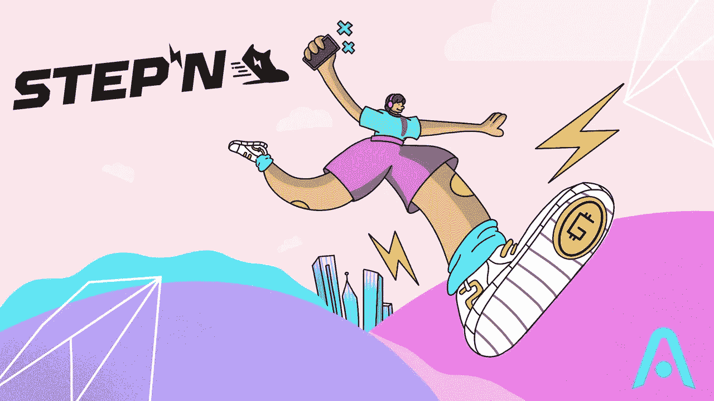

# 斯捷潘的中国风暴！

> 原文：<https://medium.com/coinmonks/the-chinese-storm-in-stepn-56d57abdb94d?source=collection_archive---------4----------------------->

昨晚宣布停止面向中国人的 Stepn App 后，我们目睹了来自中国人的可怕的销售压力，这引起了其他用户的极大恐惧，他们购买了它。

这些恐慌细胞是否严重损害了 Stepn？中国人的离开对 Stepn 有多重要？

让我们来看看昨天发生了什么以及它对这个项目的继续的影响

首先，让我们猜猜 Stepn 有多少中国用户，为此，我试着检查我从不同国家收到的数据

在下图中，你可以看到中国不在十大国家之列的 Stepn.com 游客。

正如你所看到的，俄罗斯是游客最多的第一个国家，占总游客的 9%，乌克兰是第十个国家，占游客的 2.74%，所以中国游客肯定会低于这个数字。

注意，这个统计不是针对应用程序的安装或活跃用户，而只是针对访问网站，但是由于访问者对安装者和活跃用户的转换率通常是线性比例，我们可以猜测访问者对活跃用户的转换率也是相同的比例。

但在下图中，你可以看到最近 3 个月在中国的 Stepn App 通常在 100 强 App 之列，并且在这个国家一直非常受欢迎。

如果我们想比较中国用户和俄罗斯用户，我们也可以看看这些国家的电报集团的统计数据，正如你所看到的，俄罗斯人的存在要大得多。

嗯，到目前为止我们可以得出的结论是，中国的 Stepn 用户至少不在前 10 名，但也不算少。如果有一天 Stepn 决定切断对俄罗斯的服务，它肯定会面临一个非常大的问题。

就链上的数据而言，与我发布的 [***之前的报告***](/coinmonks/can-investing-in-stepn-be-profitable-now-d3ae0af51c32) 相比，情况没有太大变化，新用户被添加到项目中，Solana 进入项目的过程进展顺利。

总的来说，昨晚的情况对项目来说就像一个转瞬即逝的冲击，中国人的突然出售导致一些用户恐慌出售，但也有其他人能够购买卖家的恐惧，并在今天获得良好的利润。
考虑到中国用户的数量不是很大，他们退出的影响可以由新用户在短时间内进入来填补，项目将回到正常的轨道上，因此流程将继续。

> 加入 Coinmonks [电报频道](https://t.me/coincodecap)和 [Youtube 频道](https://www.youtube.com/c/coinmonks/videos)了解加密交易和投资

# 另外，阅读

*   [5 款最佳免费加密货币制图工具](https://coincodecap.com/crypto-charting-tools)
*   [最佳比特币保证金交易](/coinmonks/bitcoin-margin-trading-exchange-bcbfcbf7b8e3) | [萝莉点评](/coinmonks/lolli-review-e6ddc7895ad8) | [比特币保证金交易](https://coincodecap.com/bityard-margin-trading)
*   [创造并出售你的第一个 NFT](https://coincodecap.com/create-nft) | [密码交易机器人](https://coincodecap.com/best-crypto-trading-bots)
*   [如何在 CoinDCX 上购买柴犬(SHIB)币？](https://coincodecap.com/buy-shiba-coindcx)
*   [CBET 评论](https://coincodecap.com/cbet-casino-review) | [库科恩 vs 比特币基地](https://coincodecap.com/kucoin-vs-coinbase) | [拜比特 vs 比特币基地](https://coincodecap.com/bybit-vs-coinbase)
*   [折叠 App 回顾](https://coincodecap.com/fold-app-review) | [LocalBitcoins 回顾](/coinmonks/localbitcoins-review-6cc001c6ed56) | [Bybit vs 币安](https://coincodecap.com/bybit-binance-moonxbt)