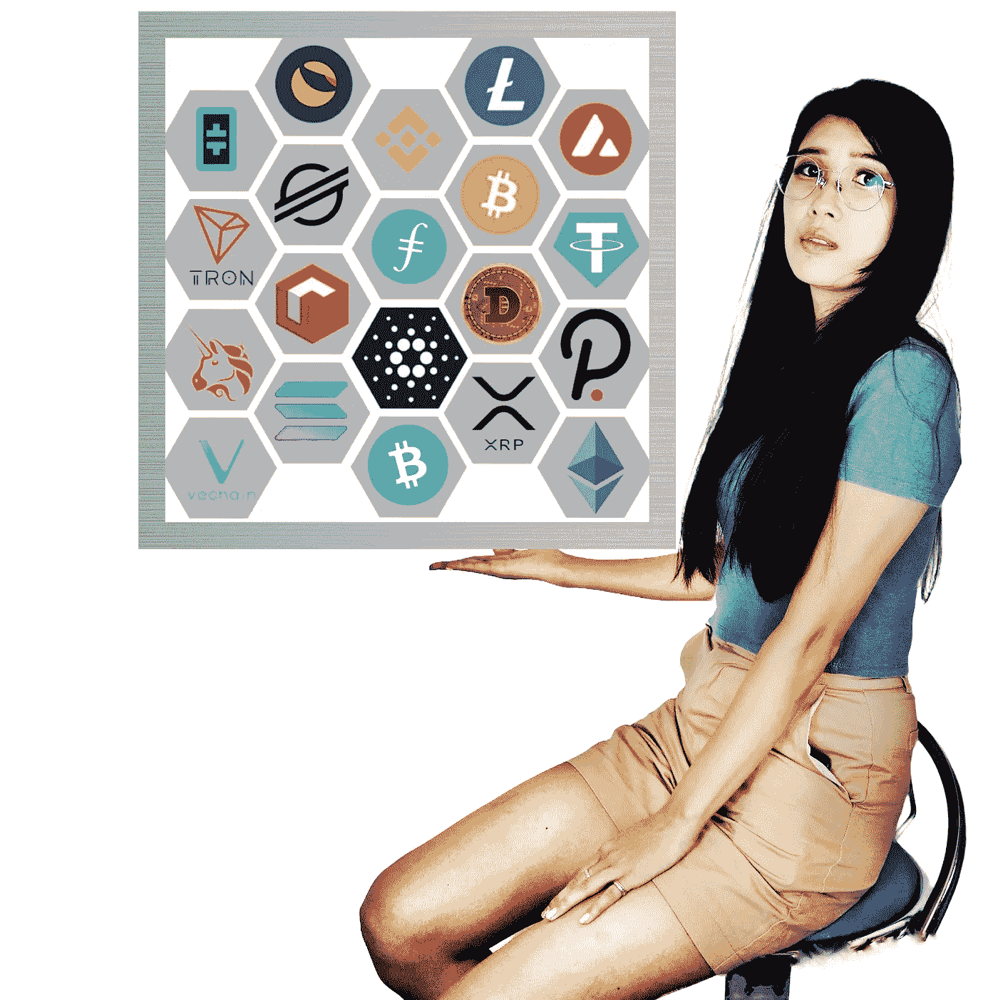

# 不确定时期的精选硬币

> 原文：<https://medium.com/coinmonks/the-chosen-coins-for-uncertain-times-27d3bfe33532?source=collection_archive---------62----------------------->

好了，让我们开门见山吧。加密泵继续与比特币在 44，800 美元和持有。比特币的向上推力提升了所有船只。大型股 cryptos 现在已经远远脱离了 2 月份的低点。我在我的第一篇文章中提到的 terra-Luna[，正在引领 altcoin 的飙升，并且表现出色，本周上涨了 70%以上。](/coinmonks/attention-no-coiners-nows-your-chance-c3fdba052f5e)

正如承诺的那样，我现在将展示我的顶级 altcoin 宝石，考虑到我们目前面临的市场动态，这些宝石是理想的。首先，我们必须定义当前的“市场动态”到底是什么

这是一个可怕的市场。

这是一个不稳定的市场。

这是一个不可预测的市场。

Crypto 总是让人害怕，即使它一周又一周地膨胀，因为你害怕出售，害怕膨胀会永远持续下去。但这种情况是一种‘好’的可怕。“糟糕”是市场目前的状况。可怕的是你被清算。可怕的是你一次又一次地买蘸酱。可怕的是你不再买蘸酱。可怕的是当你甚至开始怀疑你的 HODL 储备。现在市场的恐慌会吓得你抛售股票。不要。

密码总是不稳定的。这是一种新的资产类别。它将保持不稳定，直到 crypto 的市值至少与黄金相当，目前约为 11 万亿美元。Crypto 的市值目前约为 1.8 万亿美元，与 gold 相比仍有很大差距。但最近的波动甚至动摇了专业交易员和投资者。图表分析师已经焦头烂额，影响者也毫无头绪。霍德勒已经完全不再关注价格波动。麦当劳从未拒绝更多求职者。

一般来说，市场是不可预测的，但即使对专业的图表读者来说，加密也总是具有挑战性。操纵市场一直是一个问题，但在加密领域，它不仅是真实的，而且被接受为游戏的一部分。鲸鱼、鲨鱼和虾是词汇的一部分。鲸鱼可以很容易地操纵密码——它们也确实这样做了。最近，即使是鲸鱼也无法控制密码市场的不可预测性。如果鲸鱼不能预测将要发生什么，想想这对虾来说有多难。

考虑到这个市场的极端性质，在我上面概述的三个类别中，我推荐以下密码:

Fantom，Cosmos 和 NEAR 协议。是的，它们都是第一层项目。嗯，Fantom 实际上是一个基于 DAG 的分布式分类帐，这意味着事务被记录为顶点而不是块。(那将是另一篇文章。)

FTM、ATOM 和 NEAR 是我在这个异常艰难的市场中的首选。为什么现在买这些？因为即使市场再次暴跌，它们也会更快更强地反弹。你对这些项目研究得越多，你就越想收藏它们。

如果 Terra-Luna 再次抛售，突袭。但当你从“观察者”变成“创造者”时，你应该已经拥有它了。如果你像我们中的许多人一样，你很快就会成为一个囤积者。有人说是霍德勒。但是 HODL 只是想抓住。一个囤积者，不仅囤，还囤。

囤积和 HODL 范顿，宇宙和近议定书！(不过还是那句话，自己研究吧。)

> 加入 Coinmonks [电报频道](https://t.me/coincodecap)和 [Youtube 频道](https://www.youtube.com/c/coinmonks/videos)了解加密交易和投资

# 另外，阅读

*   [交易信号是什么？](https://coincodecap.com/trading-signal) | [Bitstamp vs 比特币基地](https://coincodecap.com/bitstamp-coinbase) | [买索拉纳](https://coincodecap.com/buy-solana)
*   [ProfitFarmers 回顾](https://coincodecap.com/profitfarmers-review) | [如何使用 Cornix Trading Bot](https://coincodecap.com/cornix-trading-bot)
*   [十大最佳加密货币博客](https://coincodecap.com/best-cryptocurrency-blogs) | [YouHodler 评论](https://coincodecap.com/youhodler-review)
*   [my constant Review](https://coincodecap.com/myconstant-review)|[8 款最佳摇摆交易机器人](https://coincodecap.com/best-swing-trading-bots)
*   [MXC 交易所评论](/coinmonks/mxc-exchange-review-3af0ec1cba8c) | [Pionex vs 币安](https://coincodecap.com/pionex-vs-binance) | [Pionex 套利机器人](https://coincodecap.com/pionex-arbitrage-bot)
*   [我的密码交易经验](/coinmonks/my-experience-with-crypto-copy-trading-d6feb2ce3ac5) | [《比特币基地评论》](/coinmonks/coinbase-review-6ef4e0f56064)