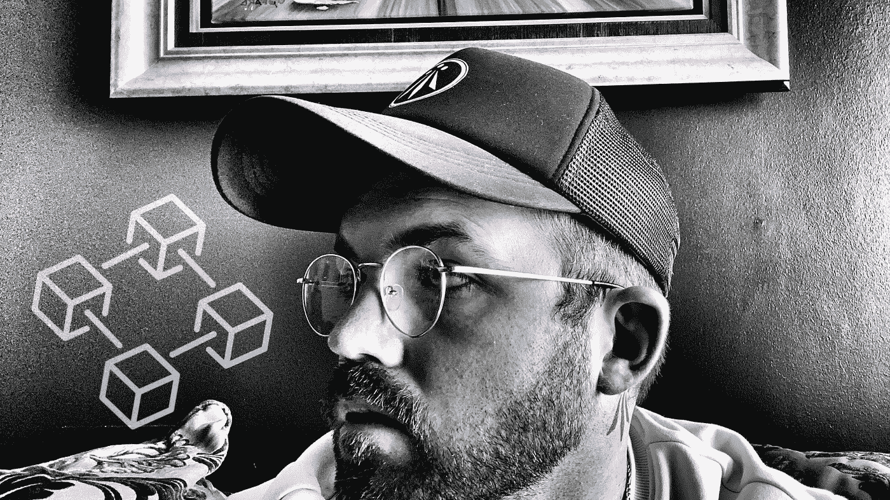
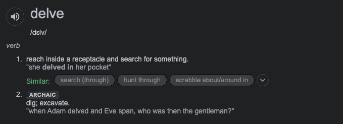
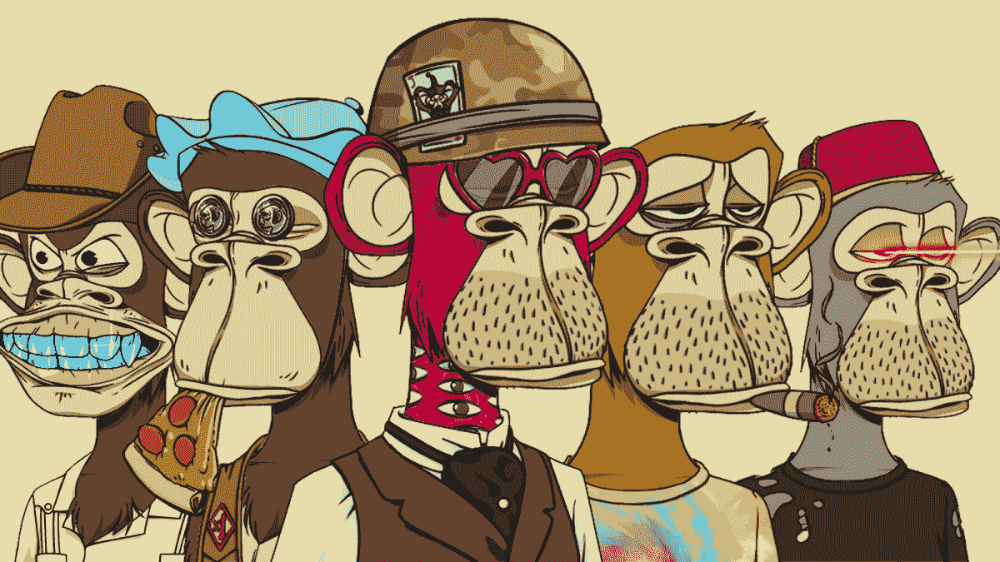

# 一个区块链学生的编年史|第 1 部分

> 原文：<https://medium.com/coinmonks/the-chronicles-of-a-blockchain-student-part-1-be26e5375bff?source=collection_archive---------20----------------------->

所以…为了兑现我的承诺，尊重我最近在 LinkedIn 个人资料上发布的投票结果，这是我的第一篇日志；其中我将尝试分享我在区块链策略课程中的经验。所以我们开始吧…

23.01.2022

**第 1 周//第 5 天**

定位完毕。介绍正在如火如荼地进行。聊天室里交换着一大堆“你好”和客套话，展示着各种各样的人物；从渴望经济革命的热情的 20 多岁的年轻人到稍微犹豫但令人钦佩的好奇的老年人，他们只是想知道到底发生了什么？

我发现自己正处于中间位置——30 岁左右。作为一个时髦的革命者来说太老了，作为任何事情的权威来说又太年轻了……但我还是来了。渴望，好奇&准备好了。

我被介绍到 Web 3.0 的世界，我相信我们大多数人都是这样:通过一个讨厌的朋友，他除了比特币什么都不会说。在遭受了数周不请自来的窃窃私语之后，我决定稍微调查一下，看看到底是什么让我这位以前温文尔雅的会计师朋友陷入了这样的状态？

所以我研究了…研究了又研究。然后我又深入研究了一些。我的眼睛疼，我的手抽筋，我的社交生活变得默默无闻。

我参加这个课程是近两年艰苦研究、热烈讨论和纯粹 FOMO 的结果。我带着学习的目的和扩大志同道合的区块链爱好者网络的希望加入进来，这些爱好者旨在正式接受这方面的教育，并有可能从它的快速崛起中受益。

我已经有幸与不同行业背景的人聊天，每个人都相信了解这项技术将确保他们在后 Web 2.0 市场的地位。

有音乐行业的代表，寻求跟踪版税分配的管理负担的解决方案；一位来自威士忌酒行业的绅士似乎决心要为他的下一次广告活动制造 NFTs 容器；一大群银行家既包括那些渴望不失去自己舒适的餐桌座位的人，也包括那些只想满足客户需求的人；我们也有三四个学者经常争论一个猿的 JPEG 文件在黑市上比埃隆·马斯克的肾更有价值的荒谬性；还有像我这样的人…

我只是一群乐观的人之一，他们相信“区块链战略文凭”可能会引起 Web 3.0 招聘人员或 NFT 集体创始人的注意，或者可能只是为了下次我们与@Fire_puma142 在本周加入的第七次不和中发生哲学分歧时有一个闪亮的资格可以依靠。

谁知道这会有什么结果？当然…我最好继续我痴迷的在线研究，试图说服我的女朋友“购买蘸酱”是花我的奖金支票的一个聪明的方式，并像我自己写的那样复述最新的 Lark Davis 建议，但事实是…我喜欢这项技术。我热爱推动这项运动的社区，我只想以自己的方式参与其中。我知道的唯一方法就是一步一步来。

对我来说，下一步是模块 1…

> 加入 Coinmonks [电报频道](https://t.me/coincodecap)和 [Youtube 频道](https://www.youtube.com/c/coinmonks/videos)了解加密交易和投资

# 另外，阅读

*   [ProfitFarmers 回顾](https://coincodecap.com/profitfarmers-review) | [如何使用 Cornix 交易机器人](https://coincodecap.com/cornix-trading-bot)
*   [如何匿名购买比特币](https://coincodecap.com/buy-bitcoin-anonymously) | [比特币现金钱包](https://coincodecap.com/bitcoin-cash-wallets)
*   [瓦济里克斯 NFT 评论](https://coincodecap.com/wazirx-nft-review)|[Bitsgap vs Pionex](https://coincodecap.com/bitsgap-vs-pionex)|[Tangem 评论](https://coincodecap.com/tangem-wallet-review)
*   [如何使用 Solidity 在以太坊上创建 DApp？](https://coincodecap.com/create-a-dapp-on-ethereum-using-solidity)
*   [币安 vs FTX](https://coincodecap.com/binance-vs-ftx) | [最佳(索尔)索拉纳钱包](https://coincodecap.com/solana-wallets)
*   [如何在 Uniswap 上交换加密？](https://coincodecap.com/swap-crypto-on-uniswap) | [A-Ads 评论](https://coincodecap.com/a-ads-review)
*   [加密货币储蓄账户](/coinmonks/cryptocurrency-savings-accounts-be3bc0feffbf) | [YoBit 评论](/coinmonks/yobit-review-175464162c62)
*   [Botsfolio vs nap bots vs Mudrex](/coinmonks/botsfolio-vs-napbots-vs-mudrex-c81344970c02)|[gate . io 交流回顾](/coinmonks/gate-io-exchange-review-61bf87b7078f)
*   [CoinFLEX 评论](https://coincodecap.com/coinflex-review) | [AEX 交易所评论](https://coincodecap.com/aex-exchange-review) | [UPbit 评论](https://coincodecap.com/upbit-review)