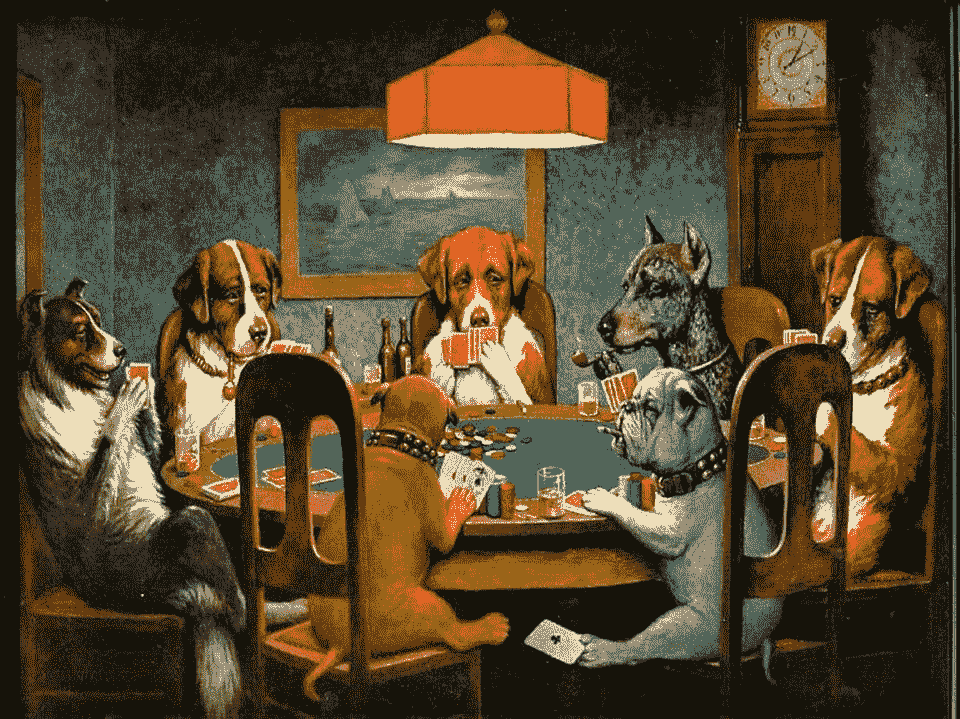

# Terra Luna 的倒闭、监管和美国证券交易委员会 2021 年的传票

> 原文：<https://medium.com/coinmonks/the-collapse-of-terra-luna-regulations-and-a-2021-subpoena-by-the-sec-e8107877c3e7?source=collection_archive---------30----------------------->

分散网络中的规则并不适用。

只有代码、网络、矿工和用户。或许交易所也是如此，因为它们运行节点，必须根据共识规则进行升级。没有领导者，也没有首席执行官。监管者无法控制分散的区块链。