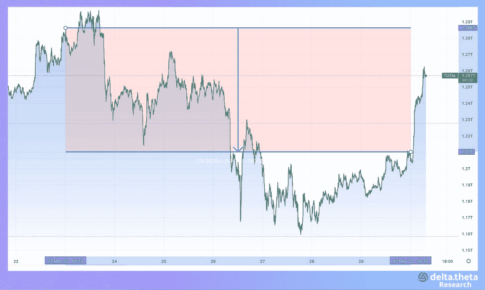

# 密码市场的修正或逆转——上周发生了什么？

> 原文：<https://medium.com/coinmonks/the-correction-or-reversal-in-the-crypto-market-what-happened-last-week-f2f7bc1ae516?source=collection_archive---------23----------------------->

市场继续处于高度不确定性和压力之下。上周，加密货币总市值指数出现了 U 型走势。本周开始时为 1.284 万亿美元，到周中时慢慢降至 1.163 万亿美元，到周末时又迅速回升至 1.261 万亿美元。因此，我们可以说，加密货币市场的总市值在本周几乎保持不变。

比特币上周也处于同样的模式，但波动性稍大。在 30 330 点开始一周之后，“第一种加密货币”在 28 210 点找到了当地底部，然后在周末恢复到 30 700 点。在本文发表时，该资产已经测试了 32 000 次。

以太坊的价格图表在过去一周也是 U 型，但幅度高于比特币。该资产在本周开始时为 2050 点，然后在中期跌至 1720 点，但在期末时仅回升至 1900 点。本周跌幅为 7.3%。

# 新闻

镜像协议，一个在区块链的 DeFi 应用，[又遭受了一次攻击](https://www.coindesk.com/business/2022/05/30/terras-mirror-protocol-allegedly-suffers-new-exploit/)。迄今为止，已有 200 多万美元被盗。镜像协议允许用户使用合成资产在科技股中建立多头或空头头寸。它运行在旧的特拉区块链——现在称为特拉经典——上，在主要的特拉 USD (UST) stablecoin 和密切相关的 Luna token(现在称为 Luna Classic (LUNC))崩溃后，新的区块链取代了它。虽然老区块链被封存，但它仍在继续工作。

全球最大的加密货币交易所之一币安通过[在义大利获得注册和监管批准](https://cointelegraph.com/news/binance-gets-approval-to-operate-in-italy-will-open-office-in-milan)，加强了其在欧洲的存在。按照意大利法律的要求，币安意大利公司已在 Organismo Agenti e Mediatori (OAM)注册为加密货币服务提供商，获得了该国监管机构的批准。注册后，币安可以根据当地法律向意大利客户提供加密货币产品，并开设办事处和扩大当地团队。

系绳[在多边形区块链发射了](https://news.bitcoin.com/tether-launches-on-polygon-usdt-stablecoin-now-hosted-on-11-blockchain-networks/)它的 USDT 稳定币。Polygon 是 USDT 将在其上可用的第 11 个区块链，继 Ethereum、Solana、Avalanche、Algorand、Tron、Omni、EOS、Liquid Network、Kusama 和比特币现金的标准总账协议之后。目前有超过 19 000 个分散的应用程序在 Polygon 上运行。他们的用户现在可以使用 USDT 在生态系统内外转移资金。

使用零知识积累技术的以太坊扩展解决方案开发商 stark ware[在 D 轮融资中筹集了 1 亿美元后，其估值翻了两番，达到 80 亿美元。本轮由 Greenoaks Capital 和 Coatue 领投。Tiger Global 是这家以色列初创公司的早期投资者，也支持这轮融资。尽管泰拉区块链公司倒闭后市场人气最近有所恶化，但 StarkWare 的估值在过去 6 个月大幅上升。去年 11 月，该公司的估值为 20 亿美元。然后在 c 轮融资 5000 万美元，几个加密项目都使用了 StarkWare 的技术，包括 dYdX、Sorare 和 Immutable X。](https://www.theblockcrypto.com/post/148672/starkware-raises-series-d-funding-8-billion-valuation)

# 市场情况

到上周末证券交易所收盘时，比特币与主要指数的相关性已经大大降低。周五晚上，运动动态的差异达到了 8%以上。周末期间，这种差异部分拉平，在本周初几乎完全恢复。

美联储会议协议的公布让投资者对加息过程有了短期确定性(最有可能的情况是在接下来的两次会议上逐步加息 0.5%)。这种情况使得目前的水平适合积累和短期投资。从历史上看，进一步的价格累积水平是支撑或阻力的强大目标。市场波动性的普遍下降也支撑了现货市场。

在期权市场，上周交易最多的工具是季度期权(执行日期为 6 月 24 日、9 月 30 日和 12 月 30 日)以及执行日期为 6 月 3 日的短期周期权。

在大宗期权策略中，交易者的兴趣在 31 000 和 34 000 的最接近执行时间(6 月 3 日、1 0 日和 24 日)的看跌期权和 25000-29000 的最接近执行时间之间平分。市场的调整使交易者能够以最佳方式平衡他们的短期和长期头寸。这是一个受欢迎的发展，因为宏观经济数据和总体市场情绪尚未强烈表明全球经济(和加密市场)最艰难的时期已经过去。