# 宇航员探险-简介

> 原文：<https://medium.com/coinmonks/the-cosmonaut-quest-introduction-ccaf911ce2c6?source=collection_archive---------45----------------------->

欢迎来到宇航员学院，我们在宇宙中的传奇从这里开始。

# 来自宇宙的投资组合日记

正如我在以前的文章中介绍的，我个人非常看好 Cosmos 生态系统，我已经决定开始一个新的投资组合，完全以 Cosmos 为中心，以这个惊人的框架为基础的蓝筹股项目为中心。如果你想阅读宇宙网络的总结，可以在这里找到我的文章([宇宙网络概述](/@fscarionati/the-cosmonaut-quest-cosmos-network-overview-75a3f3583b93))。

我在区块链投资很久了，但是直到 2021 年我才意识到这项技术的未来影响和它带来的和平革命。然而，有许多项目，具有不同的终结和令牌经济学(链的治理令牌的经济学，重要的是要知道记住令牌可以有多膨胀)。那么投资哪里呢？应该只持有比特币和以太坊吗？你应该买小型大写硬币，希望得到一个 x100，改变生活吗？我的方法是针对那些旨在改善现状和带来创新的连锁和项目，同时以社区为中心，由聪明和有能力的远见者资助。

我开始这个项目的原因是，我希望确保、安抚或激励所有那些不能 100%确定在隐语中做什么的人。我从零开始建立了一个宇宙投资组合，期限为 5 年，截止日期为 2027 年 1 月。由于这是一项长期计划，该投资组合的开放金额较低，并将按月封顶，直至 5 年结束。除此之外，我将每周更新一次，为我自己和任何对进展感兴趣的人提供历史数据。这将是一次冒险，我将与每个人分享细节，数字在手，完全透明。完全公开，这不是我目前的主要投资组合。

我把它叫做**宇航员探险**。

现在，让我们来谈谈设置和细节。这不是财务建议，但我会在这里写下我的策略，并每周更新结果，因此，如果有人感兴趣并决定加入挑战，成为一名宇航员，他/她将拥有所有的信息和方法，历史表现数据和投资组合表现的每周更新。

这也将有助于我从这项投资中脱离出来，做出更好的选择，当我们投资于一个我们热爱的项目时，我们都受到个人水平的制约。为此，我的策略从一开始就带有我的个人风格。

由于我出生于 5 月 5 日，我开始投资组合时只有 55 个 ATOM。旅程从这里开始。

# 作为一名宇航员，你需要从什么开始？

让我们从介绍建立投资组合所需的工具开始。我不会在文章中包含关于使用硬件钱包还是冷钱包的观点。鉴于这是我创建的临时投资组合，我将使用冷钱包，我建议使用 Keplr 钱包( [Keplr](https://www.keplr.app/) )。这是一个完整的宇宙钱包，可以在几个宇宙链上操作，使一切都很容易。此外，Keplr 网络浏览器和 Keplr 应用程序让您有机会在浏览器和手机上执行操作(与浏览器相比，操作有限)，这是非常友好的用户界面。另一个不错的选择是宇宙站(link)，它提供了类似的选项。从创建您的钱包开始，离线安全地存储您的种子短语和密码。我把这个从 YouTube 上下载的 Keplr 钱包设置教程留给你，它是由另一位宇航员“对加密充满信心”制作的，他在支持社区方面做了大量的工作:[Keplr 钱包完全指南](https://www.youtube.com/watch?v=bTr79ydiamY&t=746s)。

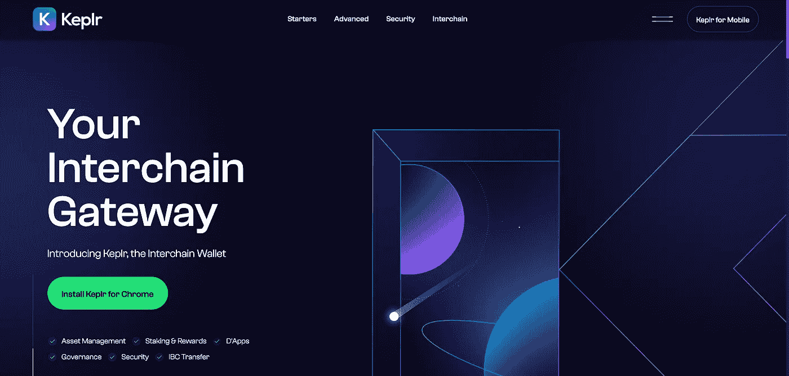

既然钱包已经准备好了，我们如何向它添加 ATOM 令牌呢？有几种方法，但最常见的是从集中交易所购买 ATOM。我个人的选择是直接在手机上使用 Crypto.com 的[App。如果你仍然没有账户，你可以使用我的推荐链接](http://crypto.com/)[https://crypto.com/app/bfemz76sej](https://referral.crypto.com/signup?_branch_match_id=568782849240669041)注册[Crypto.com](http://crypto.com/)(代码:bfemz76sej)，我们都可以得到 25 美元。🤝

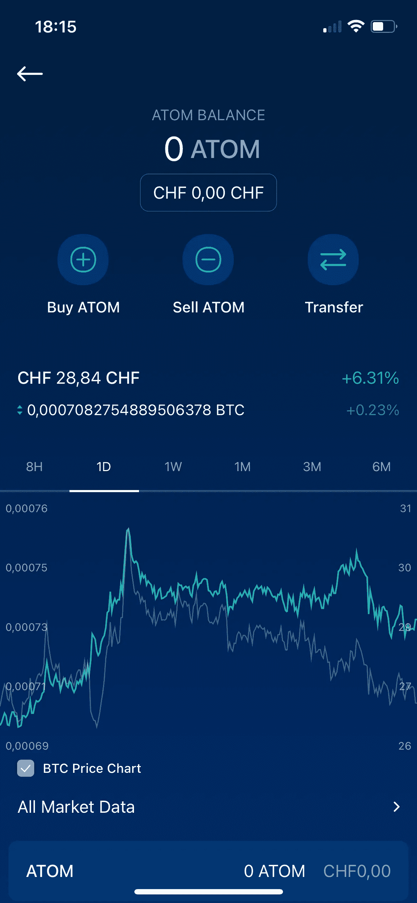

一旦你在[Crypto.com](http://crypto.com/)上购买了 ATOM，下一步就是把你的 Keplr 钱包发给他们，你必须点击“转账”，然后点击“取款”，然后点击外部钱包。根据[Crypto.com](http://crypto.com/)应用程序的要求添加您的新钱包，并按照说明完成。

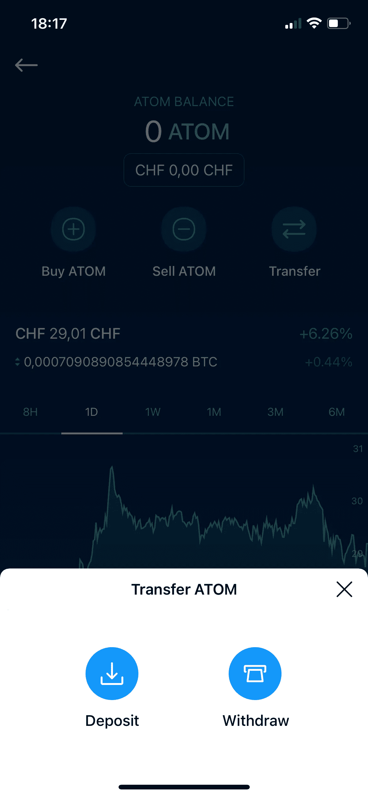

根据[Crypto.com](http://crypto.com/)应用程序的要求添加您的新钱包，并按照说明完成。完成这个过程通常需要大约 2-5 分钟。所以不要紧张。✌️

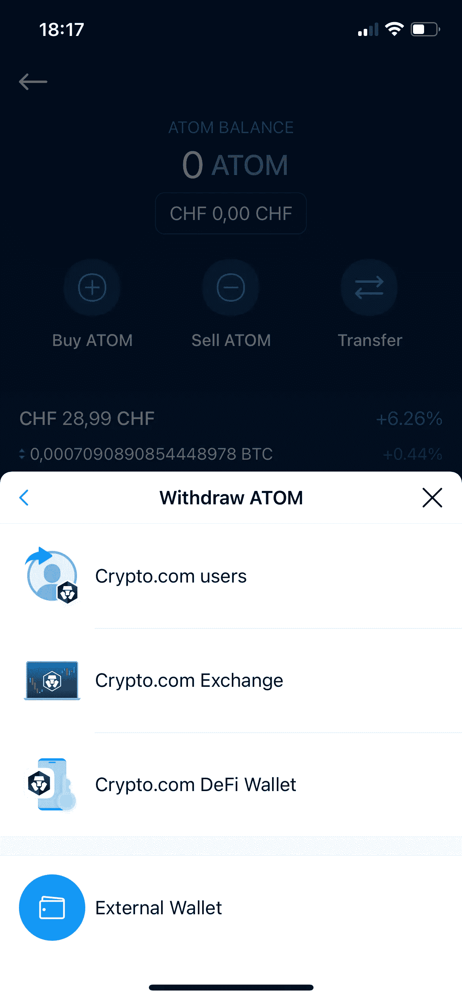

此时，您的 Keplr 钱包中应该已经有了 ATOM 令牌。最后，我们到达果汁，宇宙组合资产配置。

# 宇宙投资组合资产配置

这个投资组合的目的，正如开始所解释的，是积累、储存和经营蓝筹股宇宙资产。我计划对我将保存在这个文件夹中的每个协议做一个简短的介绍，但不是在本文中，请查看我的页面以找到相关信息。

介绍够了，下面你可以看到我看到的值得为宇宙网打造的资产配置:

*   50%原子
*   33%朱诺
*   11%渗透压
*   6% SCRT

请注意，我购买 55 ATOM 的平均价格是 25.00 美元。

因此，初始投资为 1，375.00 美元。

为了用 ATOM 令牌交换上面提到的其他令牌，唯一需要的平台是 Osmosis(链接)，在下一章中会有描述。在“交易”下，你可以交换宇宙生态系统中的代币。著名的代币包括$ATOM，$OSMO，$SCRT，$UST 等等。交换费通常占交易的 0-0.3%。

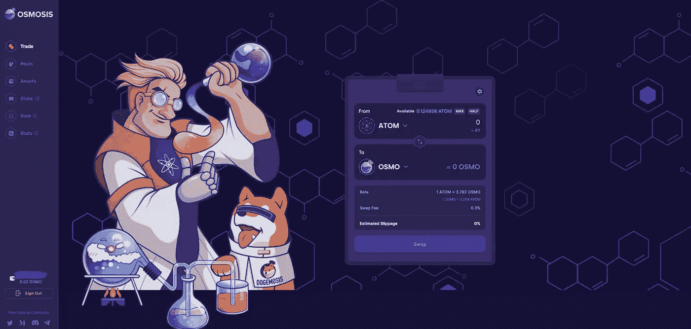

现在让我们介绍一下被选作投资组合一部分的 Cosmos Network 蓝筹股资产。

# 原子:宇宙之王

原子是宇宙的象征，是 HODL 和积累的象征。股票市场的蓝筹股财富和对未来的投资。我不会在这里浪费更多的时间来解释原子。知道的就知道！🙋‍♂️

在我的另一篇文章中找到一个深入的分析。

# 朱诺:精明契约女王来了

Juno 是 JUNO 网络的治理令牌。

Juno 是一个完全由社区驱动、完全可互操作的智能合约网络，采用 Cosmos SDK 构建。该协议作为宇宙生态系统中的一个枢纽运行，并在本地集成了 IBC。通过集成 IBC，Juno 网络可以跨支持 IBC 的各种独立网络传输数据包。总的来说，该项目旨在从 Cosmos Hub 中消除智能合同的计算负担。

此外，Juno 是一个第 1 层智能合约平台，它实现了 CosmWASM，这是一个在 Cosmos SDK 中支持 WebAssembly 虚拟机的项目。WebAssembly 允许用多种语言编写的软件在区块链上安全运行。你可以把它看作是宇宙网络自己的以太坊区块链，由社区本身推动！它在生态系统中的相关性预计将呈指数级增长，这就是我分配第二大份额的原因。

# 奥斯莫:AMM 主教

Osmo 是由 Cosmos SDK 构建的主要自动化做市商(AMM)Osmosis 的治理令牌。渗透专门研究宇宙生态系统中的链间运动(Tendermint-based 区块链)。换句话说，渗透是一个专为 Cosmos 打造的 DEX(去中心化交换),计划扩展到更多的区块链。目前拥有所有令牌对中的大多数，最大的 TVL(总价值锁定)和巨大的 apr。对宇航员来说一定是！我们在产品组合中的第三个位置。

# SCRT:网络的隐私骑士

最后但并非最不重要的，SCRT 是秘密网络的本地令牌。Secret Network 是一种对加密数据执行计算的开源协议，为智能合同和公共区块链带来了隐私。这一独特的功能保护了用户、保护了应用程序，并开启了 Web 3 的数百个新用例。

Secret 是一个 Cosmos SDK 区块链，基于共识运行。Secret 也是第一个拥有隐私保护智能合约的区块链。在投资组合中排名第四。

# 我们如何使用宇宙代币？

正如几次提到的，扣押这些资产就是使用它们。全部都是。有几种方法可以做到这一点。对于这个策略，我将采用一个使用 DeFi 的简单方法，这样每个人都可以很容易地复制它，通过遵循说明和例子。

我将专注于两种方式来优化我的持有:赌注和流动性挖掘。

# **1)打桩**

锁定是锁定数字资产(在宇宙中心的情况下是 ATOM)的过程，以提供公共区块链的经济安全。有三个主要原因可以让你长期持有代币([https://cosmos . network/learn/staking/](https://cosmos.network/learn/staking/))。

*   保护供应链:有了 ATOM，您就拥有了为 Cosmos Hub 的安全和治理做出贡献的超能力
*   赚取奖励:选择一个或多个宇宙中心的验证者，并开始赚取加密资产。
*   为未来投票:Staking ATOM 授予对提案进行投票和对网络未来做出决策的权利。

这一过程适用于我们产品组合中的所有代币，只需使用您的钱包。

**你需要什么工具？**

只需点击几下，就可以直接在 Keplr wallet 上进行下注。从网络浏览器(首选版本)和手机应用程序。进入页面并选择一个验证器。任何收费 5%，排名前 50 的验证器都是不错的选择，但我建议你查看他们的 wabpages，搜索专业的跑马圈地公司。您可以通过手机上的钱包应用程序直接完成:

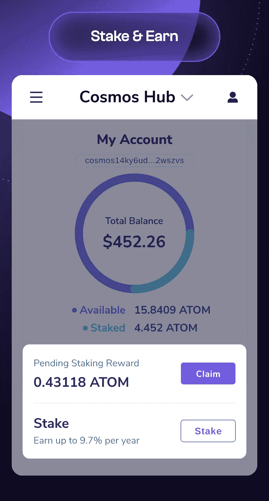

我在这里留下了一个 YouTube 的链接，以获得一个快速视频教程:[如何在 Cosmos sing Keplr 浏览器扩展和网络钱包上下注](https://www.youtube.com/watch?v=KYntLOLnLdg)。

**什么是 APY？**

典型的 APY 是 9.7%的堆积原子(每年)。这意味着每周我们都会收到 ATOM 中的奖励，把分配加起来。从长远来看，标记代币是存储数字资产的最佳方式。

# **2)流动性开采(高产养殖)**

分散金融(DeFi)是一种新兴的金融技术，旨在消除金融交易中的中介。它最近为投资者开辟了多种收入渠道。高产农业是 DeFi 的一种投资策略。它包括借出硬币或代币，以交易费或利息的形式获得奖励。这有点类似于从银行账户赚取利息；技术上来说，你是在借钱给协议。

除了 OSMO 代币，你钱包里的其他代币都必须存入渗透网络。

为此，前往左边的“资产”标签，你会看到渗透网络上的所有令牌。

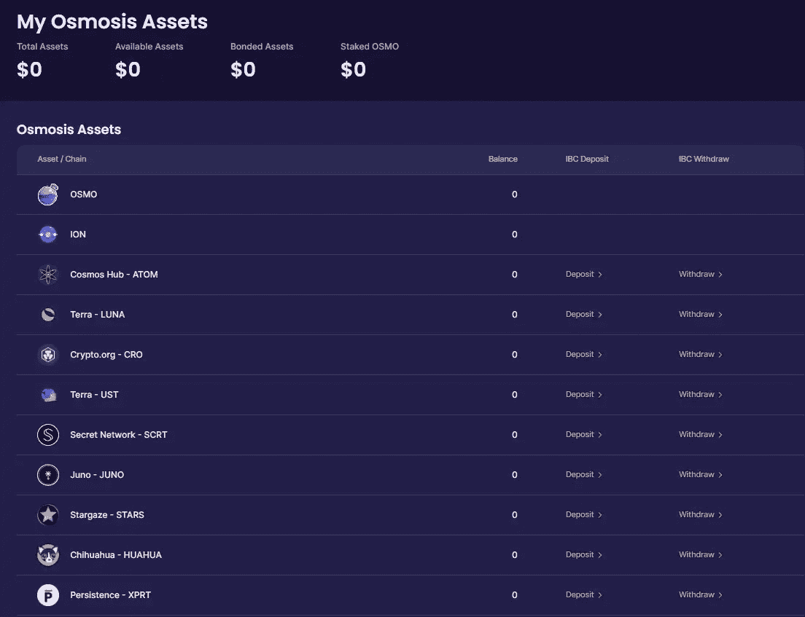

要将代币存入渗透网络，请点击您想要的代币的存款。从你的钱包确认后，从那里你将能够看到渗透平台上出现的资金。

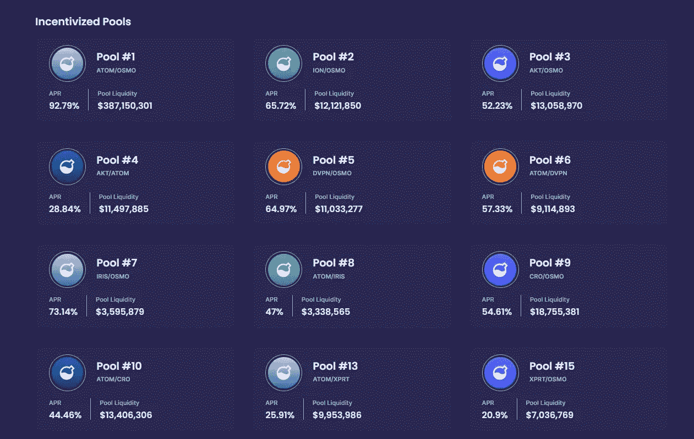

有数百个游泳池，你可以参加。这些资金池中的大多数提供不错的 apy，并且还会在资金池流动性中显示其 TVL。

就我个人而言，当我寻找一个可以参与的资金池时，我会找到一个在可观的回报和可观的 TVL 之间取得平衡的资金池。需要注意的是，池流动性值越高，LP 就越安全。

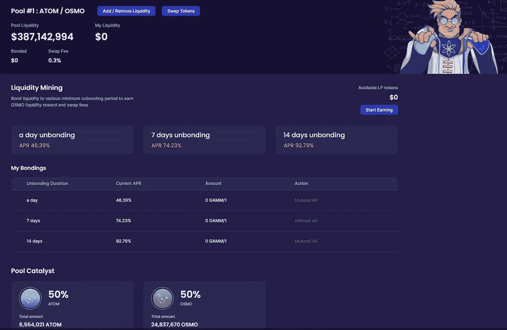

渗透也提供了一个结合期，你可以根据结合期的持续时间获得 APRs。您决定购买 LP 代币的时间越长，您获得的回报就越高。奖励将直接添加到您的资金池中，不断增加您的分配，在令牌对上自动平衡。

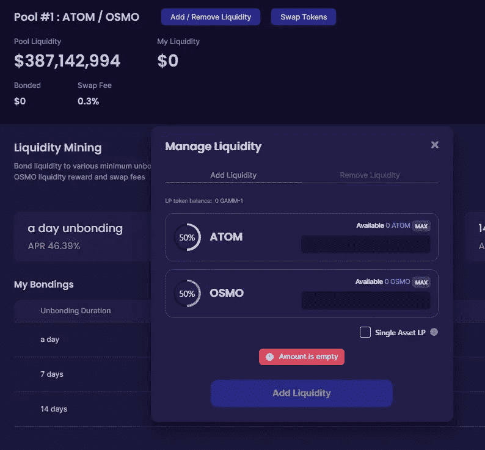

要添加流动性，点击顶部的按钮，并相应地添加它们。请注意，您需要连接您的钱包，并确保您有正确的代币进行委托。否则，请返回“交易”标签，兑换您需要的代币！

虽然有几个 AMM 可以采取这些行动，但我会在任务开始时使用的首选是渗透，同时我会扣留 OSMO 令牌以备将来使用。

原因很简单。渗透已被证明是宇宙生态系统中最具创新性的项目之一，除了 LP APRs，您还将从使用它中获得更多奖励:

**1。外部奖励**

除了正常的 LP 奖励，通过绑定一定数量的纪元，您将有资格获得额外奖励！这太壮观了。

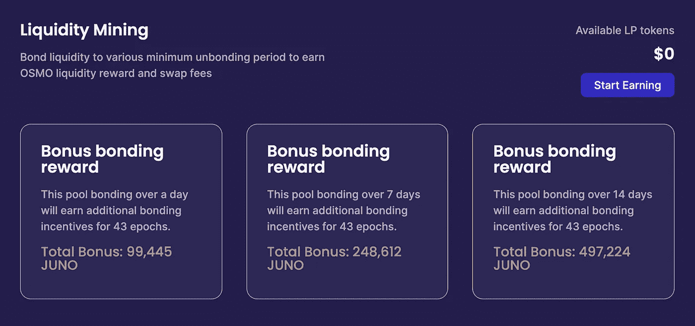

**2。超流体打桩**

是渗透团队在 2022 年 2 月推出的新功能。它将允许您从 LP 池中获得奖励，因为其中的令牌也可以在锁定在池中时下注。这对 DeFi 来说是革命性的。

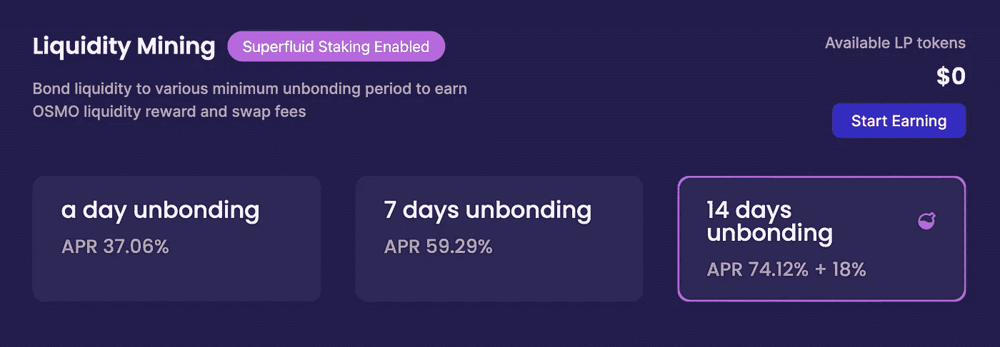

在我的策略中，我的大部分$ATOM，$JUNO，$OSMO 和$SCRT 代币都押在了 Keplr 钱包上。目标是持有 100%的 ATOM 股份和 65–70%的其他资产。剩下的将被注入我的渗透 LP 池，以实现回报最大化。这样，我的非永久性损失的风险会更小，我的代币放在 Keplr 钱包里会更安全。记住，对于流动性挖掘，你仍然承担着使用渗透平台的内在风险。虽然它已经被证明是非常安全的，但请注意这种风险。

# 宇航员探险:投资组合目标

我的计划是将上述资产用于赌注和流动性开采，因此增加其数量，并在此基础上每月注入资本，以建立一个宇宙积累包。

经过仔细考虑，我决定每个月增加和重新分配 300 美元。我会在每个月初购买价值 300 美元的 ATOM(除非疯狂的不稳定正在发生，以防可能要多等几天才能获得最佳收益)，并重新分配我投资组合中的资产，以保持上述%分配目标。

然后，我会每周检查当前配置的状态，看看哪种资产表现更好或最差。每月只进行一次重新平衡。每 3 个月，我会考虑结果，决定是否应该修改资产配置。原因是从打桩和耕作中解绑代币需要 21-24 天。但是这个以后再说。

正如一开始介绍的，宇航员任务将持续 5 年。如果您快速计算一下，考虑到初始投资(1，375 美元)和每月资本流入(300 美元 x 12 个月 x 5 年= 18，000 美元)，我对该投资组合的总投资预测将为 19，375.00 美元。

以下是我投资宇宙网络的策略。我显然看好宇宙生态系统，我会长期持有它们。

由于当前的宏观经济形势和对加密货币的影响，我对宇航员探险的态度相当保守。我相信在投资组合的整个期限内，它将完美地实现平均成本。

每半年对业绩进行一次评估，必要时根据市场情况对战略进行调整。敬请关注！

在检查了不同的来源和预测，联系了一些点，并研究了一般的加密行业格局和正在进行的项目后，我确定了我投资组合中每项资产的目标。

这是我的个人资产价格目标:

*   ATOM = 500 美元
*   朱诺= 300 美元
*   OSMO = 70 美元
*   SCRT = 50 美元

这一目标并不意味着投资组合将被关闭，而是意味着资产配置将被重新调整。

最后但并非最不重要的一点是，要知道把所有这些资产都押在 chain 上会让你在接下来的几个月甚至几年里获得很多空投物资。在加密货币业务中，空投是一种营销噱头，涉及向钱包地址发送硬币或代币，以提高对新推出的代币的认识。少量新的虚拟货币被免费发送到区块链社区活跃成员的钱包中，或者作为参与赌注和链安全的回报。你押的代币越多，空投的代币就越多。尽管空投代币的数量和价格都很高，但这确实是免费的。那就卖掉它，赌注由你决定。总是对新项目和它们的象征性经济进行你自己的研究。

通过运用这一策略，我希望在 5 年后达到 10 万美元的投资组合，这相当于上述预测的总投资的 5 倍。

我不会轻松，但我也相信这是一个相当保守的预测，让我们最后判断！每 6 个月将公布一次新的战略更新，以确保投资组合的风险管理。

# 我留在太空的瓶子里的信息…

致所有读者和宇航员崇拜者:探索是一个学习和发展的机会，挑战你自己的传统信念，尝试新的道路。

我决定与你分享旅途中将要发生的一切，并希望你和我一样从中学习。我希望成为神奇宇航员社区的积极分子，帮助所有感兴趣但持怀疑态度的人加入这个新的宇宙。

航行吧，太空海盗:停泊在港口的船只是安全的，但这不是建造船只的目的。

请在评论中留下任何建议、推荐或要求。我想与尽可能多的人分享这一经验，以学习和参与加密的采用。

在第一次太空之旅后，我们将带来更多更新！

> 加入 Coinmonks [电报频道](https://t.me/coincodecap)和 [Youtube 频道](https://www.youtube.com/c/coinmonks/videos)了解加密交易和投资

# 另外，阅读

*   [MXC 交易所评论](/coinmonks/mxc-exchange-review-3af0ec1cba8c) | [Pionex vs 币安](https://coincodecap.com/pionex-vs-binance) | [Pionex 套利机器人](https://coincodecap.com/pionex-arbitrage-bot)
*   [我的加密副本交易经历](/coinmonks/my-experience-with-crypto-copy-trading-d6feb2ce3ac5) | [比特币基地评论](/coinmonks/coinbase-review-6ef4e0f56064)
*   [CoinFLEX 评论](https://coincodecap.com/coinflex-review) | [AEX 交易所评论](https://coincodecap.com/aex-exchange-review) | [UPbit 评论](https://coincodecap.com/upbit-review)
*   [AscendEx 保证金交易](https://coincodecap.com/ascendex-margin-trading) | [Bitfinex 赌注](https://coincodecap.com/bitfinex-staking) | [bitFlyer 评论](https://coincodecap.com/bitflyer-review)
*   [麻雀交换评论](https://coincodecap.com/sparrow-exchange-review) | [纳什交换评论](https://coincodecap.com/nash-exchange-review)