# 宇航员探险——第 4 周+第 1 个月回顾

> 原文：<https://medium.com/coinmonks/the-cosmonaut-quest-week4-month1-review-bc32135e8a0e?source=collection_archive---------46----------------------->

正式开始后的第 4 周已经过去，现在是检查投资组合表现的时候了。

这一周也代表着挑战第一个月的结束，因此我也将在挑战开始时展示与投资组合的比较。从一开始到现在，您将看到代币金额的差异，而不仅仅是价格相关指标的差异。我们开始吧。

# 介绍

我将简单介绍投资组合中每个头寸的概况，显示每周增加的代币数量，并在每个周日下午显示每个代币的价格。

此外，我将分享我们分配的宇宙生态系统协议和相关市场表现的重要状态更新。

请注意，这一次我们将显示第 4 周的结果。还有，我们这次碰了

不再跑题，让我们来看看最新的投资组合表现。

# 第 4 周结果

在下表中，可以找到第 4 周结果的概述，包括资产分配、数量和价格。价格快照于 2022 年 3 月 20 日周日下午 3 点拍摄。

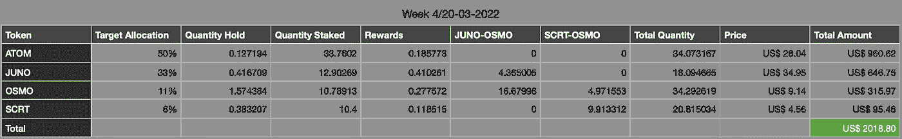

与上周相比，投资组合金额减少了 **+3.38%** 。

# 增长概述

在下表中，可以找到第 4 周结果的概述，包括资产分配、数量和价格。总量快照也是在每个星期天下午 3 点制作的。

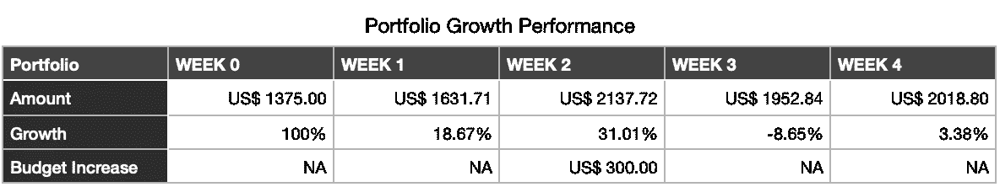

请注意，披露的增长百分比显示的是上周的每周业绩。下面是上表的图示:

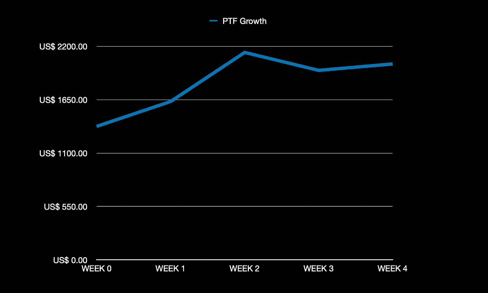

如前所述，我们这次也会检查每月的整体表现。下面是一个快速概述:

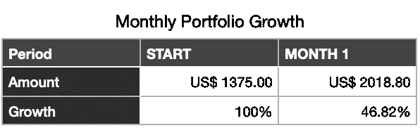

这个月，通过仅增加 300 美元，并利用我们拥有的所有资产采取赌注和 LP 耕作策略，投资组合价值增加了 **+46.82%** ！🤩

# 生态系统性能

下面将介绍投资组合中每种资产在不同点上的表现。跟进每周的生态系统变化和新闻。

# 宇宙(原子)

上周以来的市值是 **+2.87%** 。

**价格行为**

与上周报告相比，过去 7 天的 ATOM 价格为 **+4.51%** 。价格图表如下所示，以供概述。

和每周 ATOM 价格变动可以在下面找到:

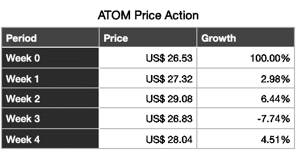

# 每月比较

自从宇航员探险开始以来:

*   价格上涨 **+5.68%** 。
*   数量上升 **+32.66%**
*   总额上升 **+40.21%**

作为开始还不错。下表用数字概括了:

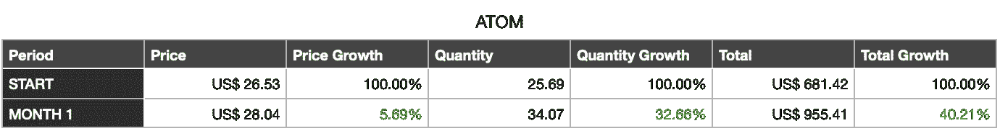

# 渗透作用

上周以来市值 **-1.58%** 。

渗透网络上的 TVL(总值锁定)概述。它目前由 TVL 排名第 18 位(检查 [Defi Llama](https://defillama.com/chains) )。

渗透流动性与上周相比为 **+3.55%** 。上周 TVL 金额快照如下:

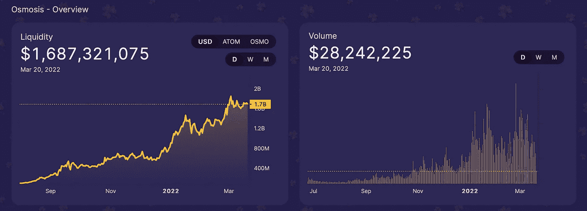

**价格行动**

与上周报告相比，过去 7 天的 OSMO 价格为 **+0.63%** 。价格图表如下所示，以供概述:

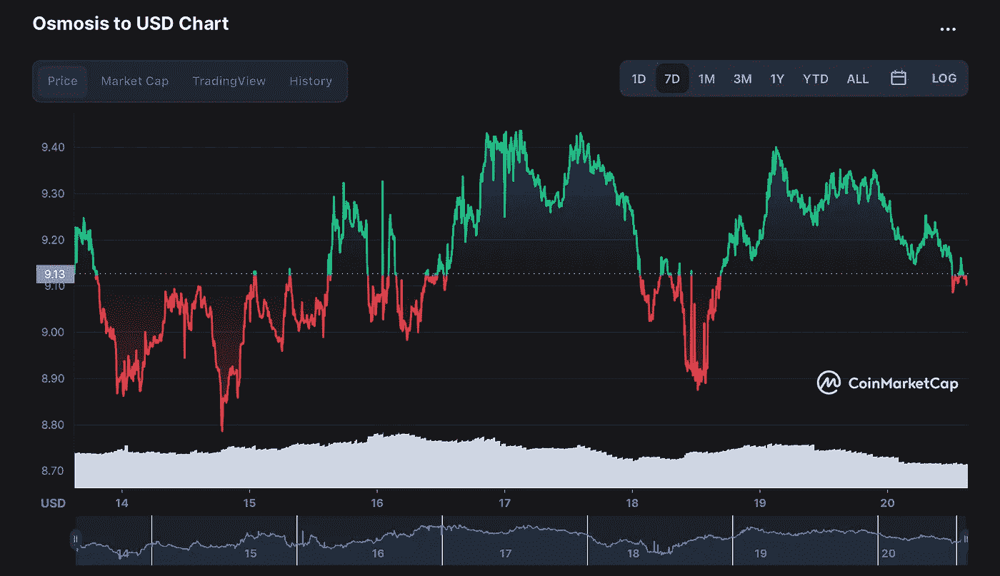

和每周 OSMO 价格变动可以在下面找到:

# 每月比较

自从宇航员探险开始以来:

*   价格上涨 **+5.30%** 。
*   数量上升 **+40.14%**
*   总额上升 **+47.57%**

同样，这是个不错的开始。下表用数字概括了:

# 朱诺(朱诺)

上周以来市值 **-2.58%** 。

**价格行为**

与上周报告相比，最近 7 天的 JUNO 价格为 **-0.88%** 。价格图表如下所示，以供概述:

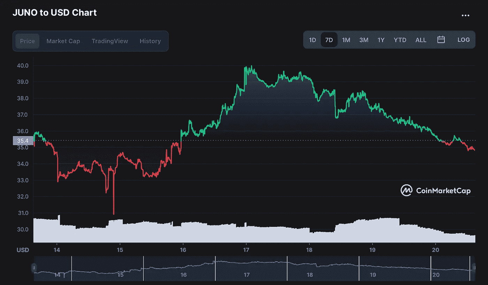

和每周 JUNO 价格变动如下所示:

# 每月比较

自从宇航员探险开始以来:

*   价格上涨 **+21.10%** 。
*   数量上升 **+16.59%**
*   总额上升 **+41.19%**

对于朱诺来说，这也是一个不错的开始。下表用数字概括了:

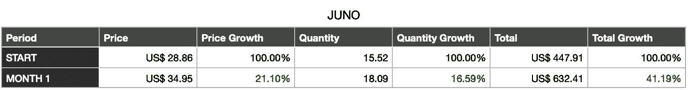

# 秘密(SCRT)

its 协议中保密网络的 TVL(总值锁定)综述。目前，TVL 排名第 47 位，与上周相同。

上周以来的市值是 **-2.91%** 。

**价格行动**

与上周报告相比，最近 7 天的 SCRT 价格为 **-1.83%** 。价格图表如下所示，以供概述:

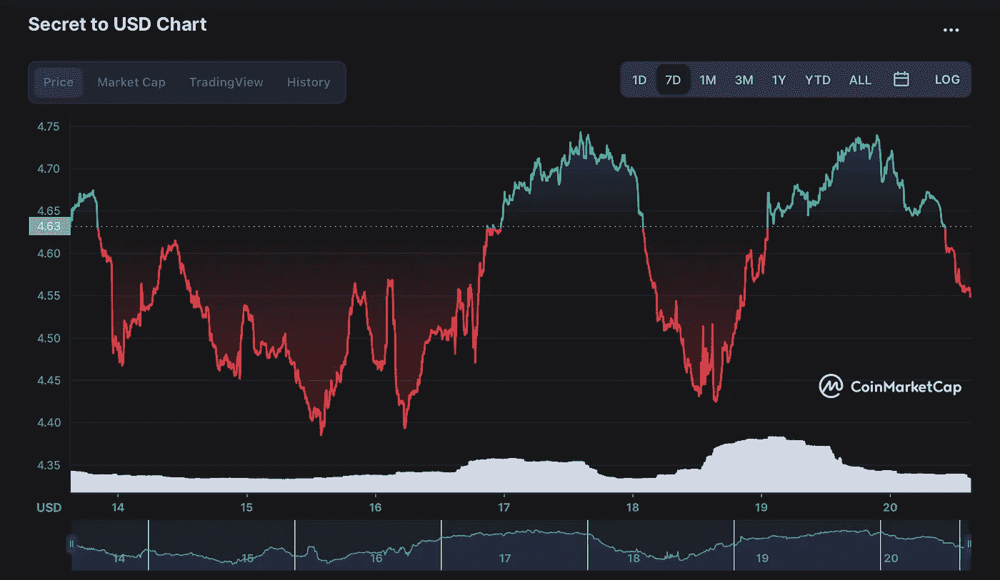

和每周 SCRT 价格变动如下:

# 每月比较

自从宇航员探险开始以来:

*   价格上涨 **-20.00%** 。
*   数量上升 **+42.08%**
*   总额上升 **+13.66%**

最后秘密网络，可以看到，尽管价格下跌，总体每月的结果是积极的。下表用数字概括了:

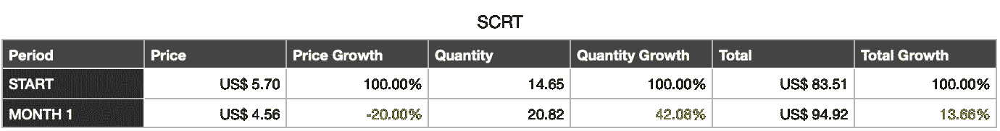

# 空投

在过去的几周里，我也得到了一些有趣的空投:

*   经济的
*   遮光板协议(SHD)

这个阶段的回报总是岌岌可危。通过押标和复合押标奖励，我从上周开始增加了 **+11.07%** 的标数量，从我第一次接受空投开始增加了 **+67.20%** 。时间过得越久，就会有越多的新空投物资被接收、被投放和被强制投放。

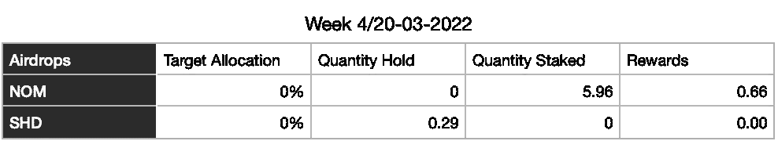

即将收到的新空投物资是 asset mantle(MNTL)、Cerberus(CRBRUS)和 Evmos(Evmos)。遗憾的是，我们已经来不及买$RAW 了……不过没关系，继续下一个吧！

下周再给你一个新的更新！

航行吧，亲爱的宇航员们！

> 加入 Coinmonks [电报频道](https://t.me/coincodecap)和 [Youtube 频道](https://www.youtube.com/c/coinmonks/videos)了解加密交易和投资

# 另外，阅读

*   [雷米塔诺评论](https://coincodecap.com/remitano-review)|[1 英寸协议指南](https://coincodecap.com/1inch)
*   [十大最佳加密货币博客](https://coincodecap.com/best-cryptocurrency-blogs) | [YouHodler 评论](https://coincodecap.com/youhodler-review)
*   [KuCoin vs 币安](https://coincodecap.com/kucoin-vs-binance) | [Bitrue 点评](https://coincodecap.com/bitrue-review) | [Jet-Bot 点评](https://coincodecap.com/jet-bot-review)
*   [买 PancakeSwap(蛋糕)](https://coincodecap.com/buy-pancakeswap)|[matrix export Review](https://coincodecap.com/matrixport-review)