# 宇航员探险——第五周

> 原文：<https://medium.com/coinmonks/the-cosmonaut-quest-week5-669f292c04e6?source=collection_archive---------61----------------------->

正式开始后的第 5 周已经过去，现在是检查投资组合表现的时候了。

# 介绍

我将简单介绍投资组合中每个头寸的概况，显示每周增加的代币数量，并在每个周日下午显示每个代币的价格。

此外，我将分享我们分配的宇宙生态系统协议和相关市场表现的重要状态更新。

这一次我们将展示第 5 周的结果。这次我花了一点时间来发布每周结果。与此同时，自 3 月 27 日周日拍摄快照以来，市场一直在推动新的上涨趋势。BTC 再次达到 48K 美元，而 Terra(露娜)达到了一个新的历史新高！随着新一周的开始，ATOM 和 SCRT 的价格走势良好！

不再跑题，让我们来看看最新的投资组合表现。

# 第 5 周结果

在下表中，可以找到第 5 周结果的概述，包括资产分配、数量和价格。价格快照于 2022 年 3 月 27 日周日下午 3 点拍摄。

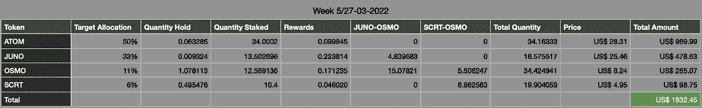

与上周相比，投资组合金额减少了 **-9.23%** 。

# 增长概述

在下表中，可以找到第 5 周结果的概述，包括资产分配、数量和价格。总量快照也是在每个星期天下午 3 点制作的。

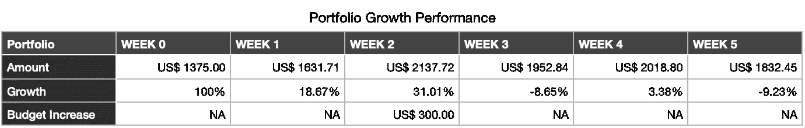

请注意，披露的增长百分比显示的是上周的每周业绩。下面是上表的图示:

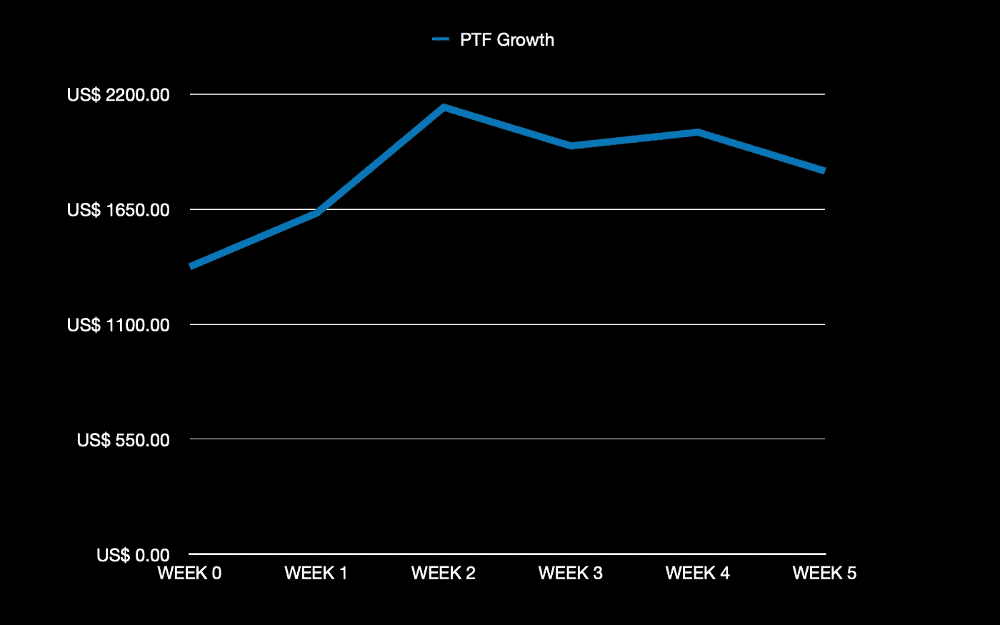

# 生态系统性能

下面将介绍投资组合中每种资产在不同点上的表现。跟进每周的生态系统变化和新闻。

# 宇宙(原子)

市值为 **+4.19%** 。

**价格行动**

与上周报告相比，过去 7 天的 ATOM 价格为 **+0.96%** 。价格图表如下所示，以供概述。

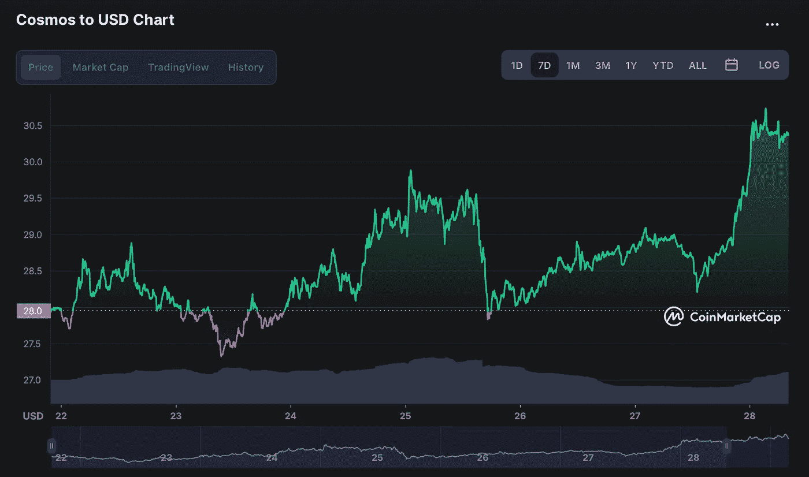

和每周 ATOM 价格变动可以在下面找到:

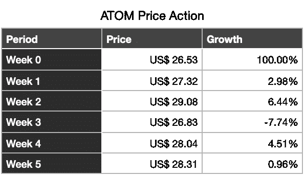

# 渗透作用

市值为 **-11.03%** 。

渗透网络上的 TVL(总值锁定)概述。TVL 目前排名第 12，比上周上升了 6 位。

与上周相比的渗透流动性为 **+0.09%** 。上周 TVL 金额快照如下:

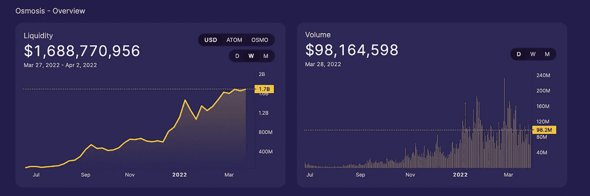

**价格行动**

与上周报告相比，过去 7 天的 OSMO 价格为 **-9.26%** 。价格图表如下所示，以供概述。

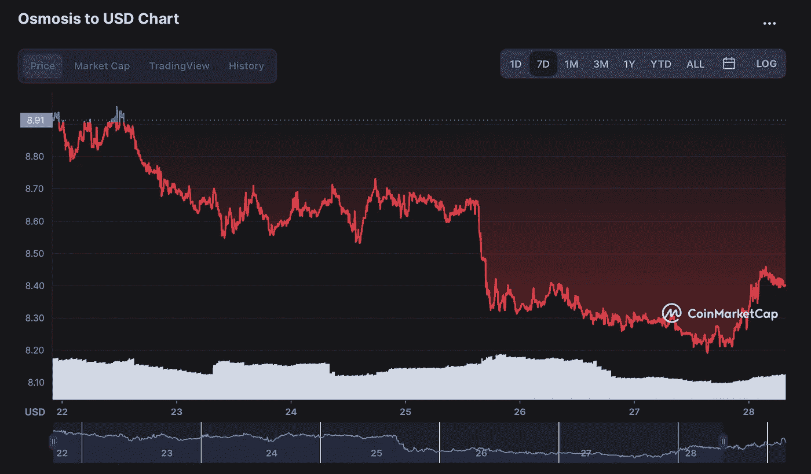

和每周 OSMO 价格变动可以在下面找到:

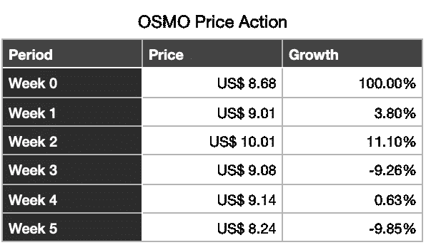

# 朱诺(朱诺)

市值为 **-25.59%** 。机构群体对臭名昭著的提案 16 的投票分裂了 Juno 机构群体。过去几周经历了相当多的起伏，但就基本面而言，Juno 比以往任何时候都更强大。在我看来，在如此敏感的话题和解决方案上出现群体分歧是完全可以接受的。Juno 是一个由社区驱动的网络，并不是所有的提案每次都能得到绝大多数人的同意，这一点也不奇怪。因为我们在为未来创造价值，所以最近的价格波动并不构成风险。此外，遗憾的是现在还不是购买的时候，25 美元的 Juno 真的很便宜。

在本书出版时，价格已经反弹到每台 Juno 29 美元左右。

**价格行动**

与上周报告相比，最近 7 天的 JUNO 价格为 **-27.15%** 。价格图表如下所示，以供概述:

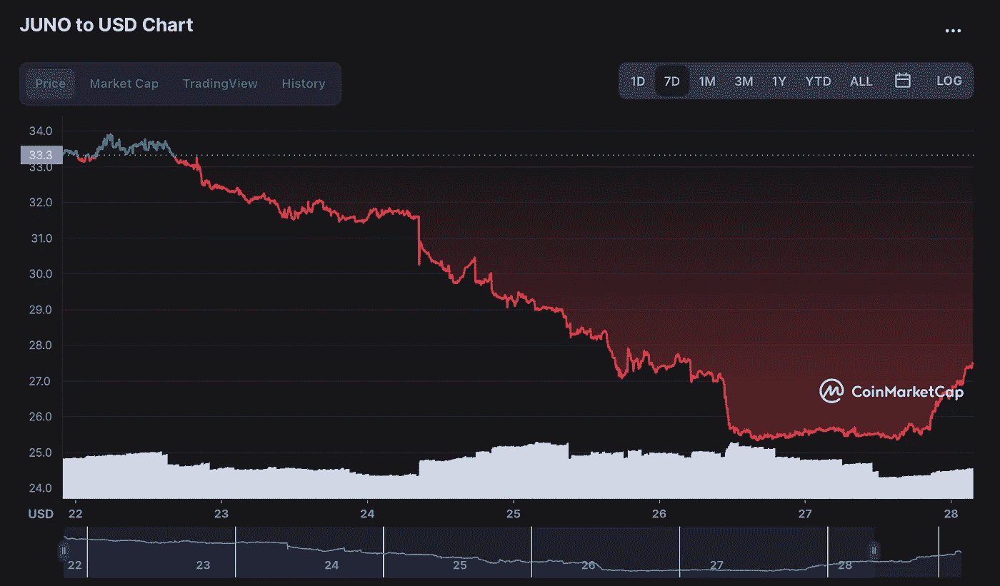

和每周 JUNO 价格变动如下所示:

# 秘密(SCRT)

市值为 **+8.91%** 。

its 协议中保密网络的 TVL(总值锁定)综述。目前，TVL 排名第 47 位，与上周相同。

**价格行为**

与上周报告相比，最近 7 天的 SCRT 价格为 **+8.55%** 。价格图表如下所示，以供概述:

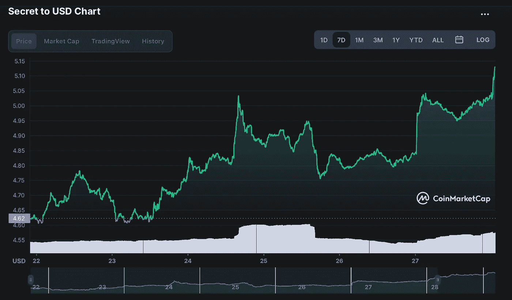

和每周 SCRT 价格变动如下:

# 空投

# 空投

在过去的几周里，我也得到了一些有趣的空投:

*   经济的
*   遮光板协议(SHD)
*   Cheqd (CHEQ)

在这个阶段，奖励总是在可能的情况下投入赌注，或者一旦下注开始，就投入赌注。通过赌注提名和复合赌注奖励，我从上周开始增加了 **+11.03%** 的提名数量，从我第一次接受空投开始增加了 **+85.61%** 。时间过得越久，就会有越多的新空投物资被接收、被投放和被强制投放。

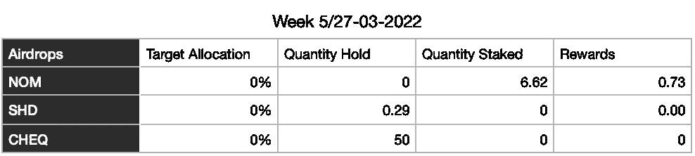

即将接收的新空投物资有资产管理公司(MNTL)、地狱犬公司(CRBRUS)、埃夫莫斯公司(Evmos)和新增加的信贷公司(CRE)。

所以期待认领所有即将到来的空投。对于其中的一些，我已经能够验证分配，这是一个非常积极的结果。这只是免费的钱！

下周再给你一个新的更新！

航行吧，亲爱的宇航员们！

> 加入 Coinmonks [电报频道](https://t.me/coincodecap)和 [Youtube 频道](https://www.youtube.com/c/coinmonks/videos)了解加密交易和投资

# 另外，阅读

*   [CoinFLEX 评论](https://coincodecap.com/coinflex-review) | [AEX 交易所评论](https://coincodecap.com/aex-exchange-review) | [UPbit 评论](https://coincodecap.com/upbit-review)
*   [AscendEx 保证金交易](https://coincodecap.com/ascendex-margin-trading) | [Bitfinex 赌注](https://coincodecap.com/bitfinex-staking) | [bitFlyer 评论](https://coincodecap.com/bitflyer-review)
*   [Bitget 回顾](https://coincodecap.com/bitget-review)|[Gemini vs block fi](https://coincodecap.com/gemini-vs-blockfi)cmd |[OKEx 期货交易](https://coincodecap.com/okex-futures-trading)
*   [AscendEx Staking](https://coincodecap.com/ascendex-staking)|[Bot Ocean Review](https://coincodecap.com/bot-ocean-review)|[最佳比特币钱包](https://coincodecap.com/bitcoin-wallets-india)
*   [霍比评论](https://coincodecap.com/huobi-review) | [OKEx 保证金交易](https://coincodecap.com/okex-margin-trading) | [期货交易](https://coincodecap.com/futures-trading)