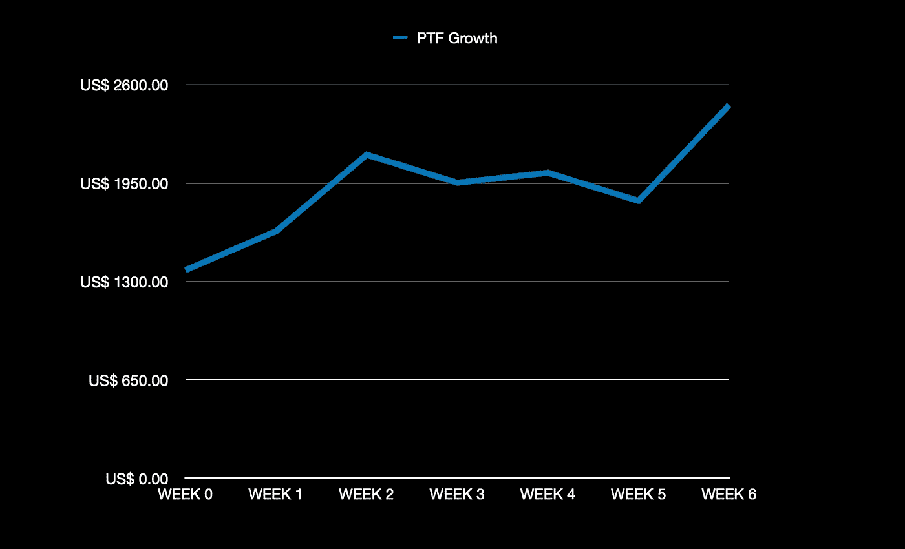

# 宇航员探险——第 6 周

> 原文：<https://medium.com/coinmonks/the-cosmonaut-quest-week6-fc64cee588d4?source=collection_archive---------68----------------------->

正式开始后的第 6 周已经过去，现在是检查投资组合表现的时候了。

这次要快一点！日程真的很忙，但这是这周的结果。

# 介绍

我将简单介绍投资组合中每个头寸的概况，显示每周增加的代币数量，并在每个周日下午显示每个代币的价格。

此外，我将分享我们分配的宇宙生态系统协议和相关市场表现的重要状态更新。

这一次我们将展示第六周的结果！

不再跑题，让我们来看看最新的投资组合表现。

# 第 6 周结果

在下表中，可以找到第 6 周结果的概述，包括资产分配、数量和价格。价格快照拍摄于 2022 年 3 月 4 日周日下午 3 点。

与上周相比，投资组合金额增加了 **+34.59%** 。

# 增长概述

在下表中，可以找到第 6 周结果的概述，包括资产分配、数量和价格。总量快照也是在每个星期天下午 3 点制作的。

本周我们将迎来 2022 年 4 月，正如我在投资组合策略文章(链接)中披露的那样，一个新的 300 美元 ATOM 包已被添加到投资组合中。因此，ATOM 令牌会相应地渗透到新的 JUNO、OSMO 和 SCRT 令牌中。

请注意，披露的增长百分比显示的是上周的每周业绩。下面是上表的图示:

# 生态系统性能

下面你可以看到投资组合中每种资产在不同点上的表现。跟进每周的生态系统变化和新闻。

# 宇宙(原子)

市值为 **14.99%** 。

**价格行动**

与上周报告相比，过去 7 天的 ATOM 价格为 **+10.21%** 。

每周 ATOM 价格变动如下:

自第 0 周以来，ATOM 价格上涨 **+17.60%** ！

# 渗透作用

市值为 **+5.17%** 。

**价格行为**

与上周报告相比，过去 7 天的 OSMO 价格为 **+1.09%** 。

每周 OSMO 价格变动如下:

自第 0 周以来，OSMO 价格上涨 **+0.46%** ！

# 朱诺(朱诺)

市值为 **+7.76%。**

**价格行动**

与上周报告相比，最近 7 天的 JUNO 价格为 **+5.81%** 。

JUNO 每周价格变动如下:

朱诺价格自第 0 周以来下跌 **-6.65%** 。

# 秘密(SCRT)

its 协议中保密网络的 TVL(总值锁定)综述。目前，TVL 排名第 47 位，与上周相同。

市值为 **+31.03%** 。

**价格行动**

与上周报告相比，最近 7 天的 SCRT 价格为 **32.32%** 。

每周 SCRT 价格变动如下:

自第 0 周以来，SCRT 价格上涨 **+14.91%** ！

# 空投

在过去的几周里，我也得到了一些有趣的空投:

*   经济的
*   遮光板协议(SHD)
*   切 qd (CHEQ**)**

在这个阶段，奖励总是在可能的情况下投入赌注，或者一旦下注开始，就投入赌注。通过押标和复合押标奖励，我能够从上周开始增加标数量 **+11.46%** ，从我第一次接受空投开始增加 **+106.31%** 。时间过得越久，就会有越多的新空投物资被接收、被投放和被强制投放。

每周都会有新的空投，但是为了有资格参加空投，我从去年就开始了挑战，太糟糕了。

然而这么多即将到来的即将到来！用来检查所有宇宙空投和要求的一个很好的工具是 [cosmosairdrops.io](http://cosmosairdrops.io/) 。

下周再给你一个新的更新！

航行吧，亲爱的宇航员们！

> 加入 Coinmonks [电报频道](https://t.me/coincodecap)和 [Youtube 频道](https://www.youtube.com/c/coinmonks/videos)了解加密交易和投资

# 另外，阅读

*   [Bookmap 评论](https://coincodecap.com/bookmap-review-2021-best-trading-software) | [美国 5 大最佳加密交易所](https://coincodecap.com/crypto-exchange-usa)
*   最佳加密[硬件钱包](/coinmonks/hardware-wallets-dfa1211730c6) | [Bitbns 评论](/coinmonks/bitbns-review-38256a07e161)
*   [新加坡十大最佳加密交易所](https://coincodecap.com/crypto-exchange-in-singapore) | [购买 AXS](https://coincodecap.com/buy-axs-token)
*   [红狗赌场评论](https://coincodecap.com/red-dog-casino-review) | [Swyftx 评论](https://coincodecap.com/swyftx-review) | [CoinGate 评论](https://coincodecap.com/coingate-review)
*   [投资印度的最佳密码](https://coincodecap.com/best-crypto-to-invest-in-india-in-2021)|[WazirX P2P](https://coincodecap.com/wazirx-p2p)|[Hi Dollar Review](https://coincodecap.com/hi-dollar-review)