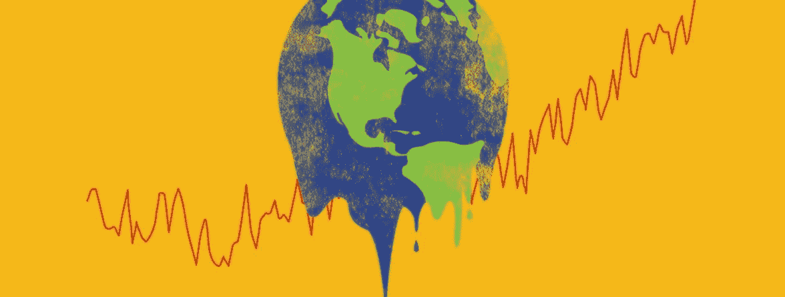
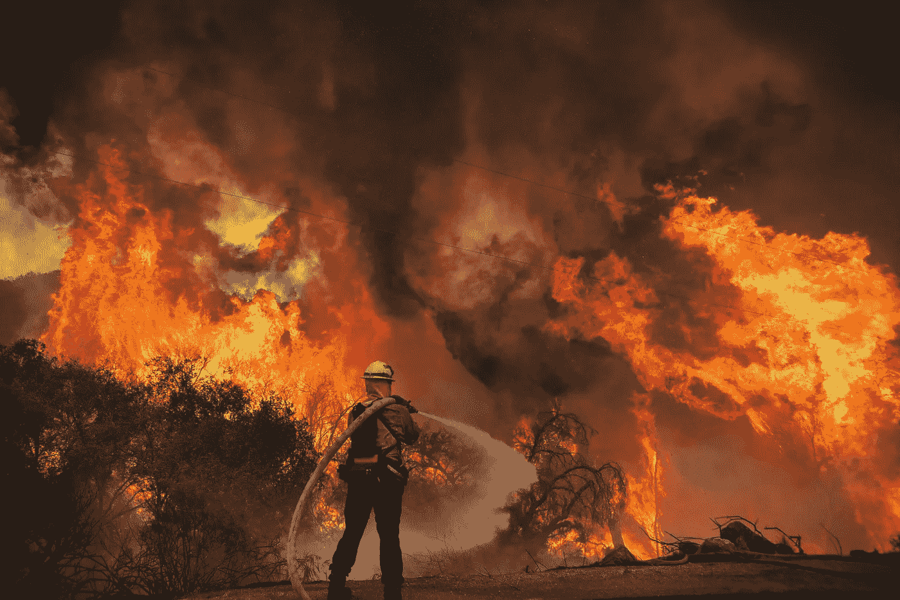
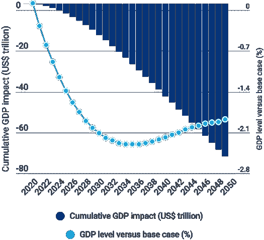
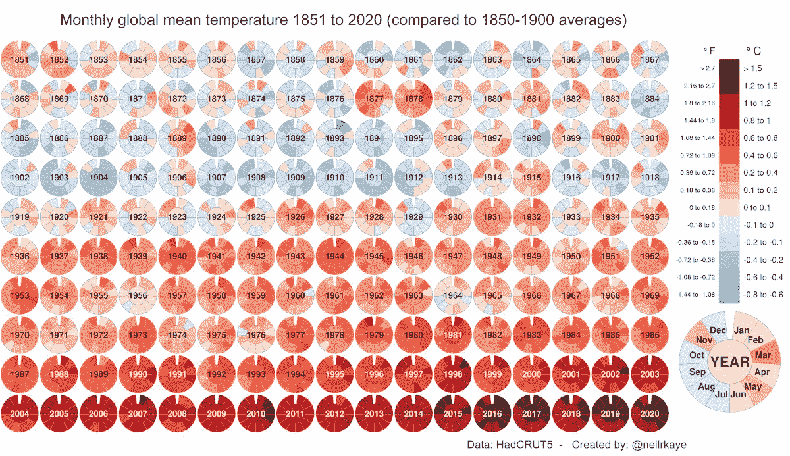
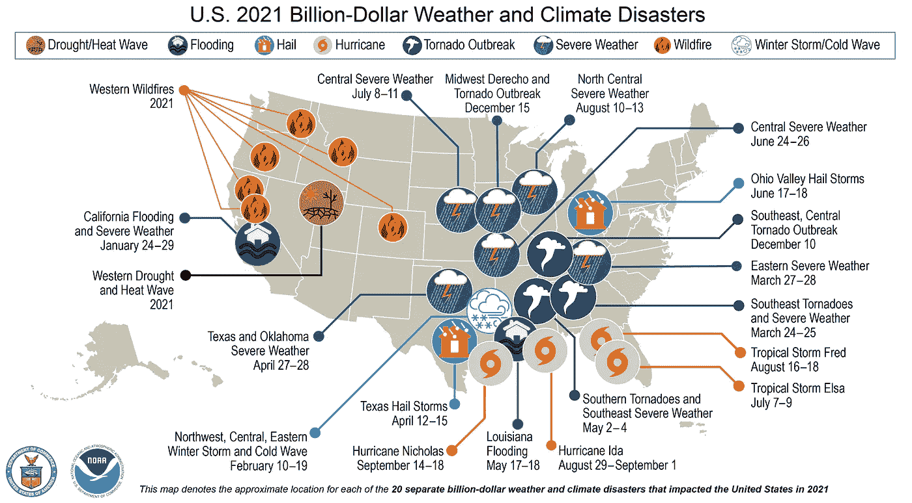
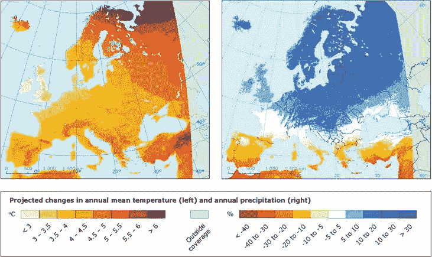
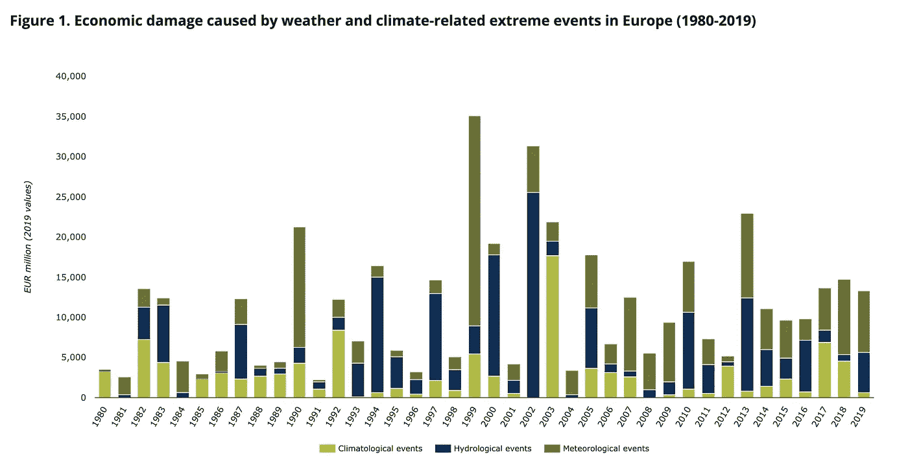
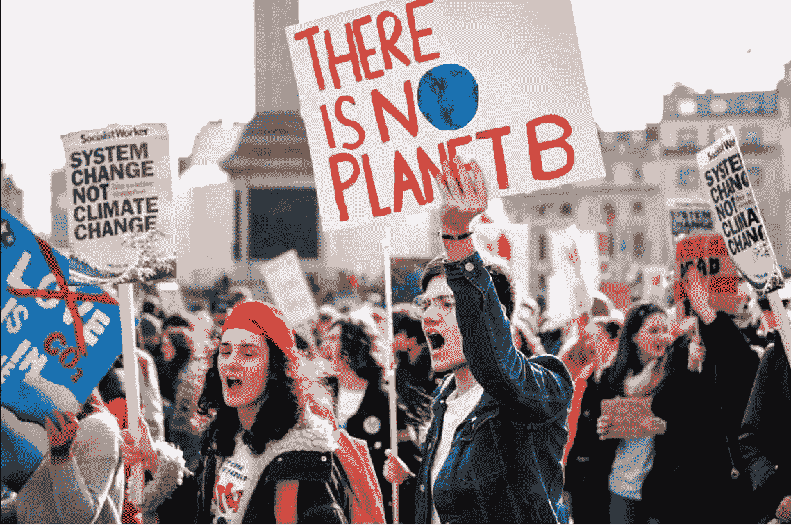
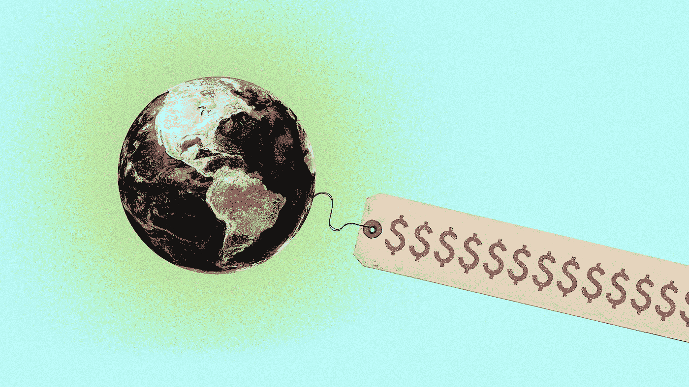

# 气候变化的代价

> 原文：<https://medium.com/coinmonks/the-cost-of-climate-change-97d6b23163e8?source=collection_archive---------77----------------------->

## **2021 年在美国**， **20 个最具灾难性的气候事件**造成**超过 1450 亿美元的损失**。

美国国家海洋和大气管理局(Noaa)的年度报告中公布了一个惊人的数字，其中还包括因最严重的气候灾害造成的 688 人死亡的惊人数字，每个灾害造成的损失超过 10 亿美元。

 [## 数十亿美元的天气和气候灾难

### 自 1980 年以来，美国经历了 310 次天气和气候灾害，总损失/成本达到或超过 1 亿美元…

www.ncdc.noaa.gov](https://www.ncdc.noaa.gov/billions/overview) 

鉴于格拉斯哥的 COP26，IPCC 重申，与气候变化相关的极端事件将会越来越频繁，因此可能会造成越来越多的受害者和越来越大的经济损失。事实上，热浪、飓风和火灾只是这些事件如何在不同纬度加剧并带来严重后果的一些证据。

但是现在，减缓全球变暖已经成为各国财政的沉重负担。据 Wood Mackenzie 称，如果**未能实现将全球变暖**限制在最大上升 ***1.5 摄氏度*** 的目标，到 2050 年全球 GDP 确实可能下降 2%。

Global GDP impact compared to base case — credit: Wood MacKenzie

然而，它解释说，GDP 的下降将对公司和国家产生不同的影响，这取决于它们迄今为止在能源转型中的进展情况。根据世界经济论坛 2022 年全球风险报告[*，与气候变化相关的风险也是未来几年最令人担忧的因素。*](https://www.weforum.org/reports/global-risks-report-2022)

# ***关于增加***

**

*为了了解过去几个月的成本，只需进入 2021 年数据的细节:在美国，热带风暴对经济的影响迄今为止最大，造成了 785 亿美元的损失。其中，740 亿美元来自于去年夏天席卷路易斯安那州和纽约州的飓风“艾达 T3”。但是冬季风暴也造成了 240 亿美元的损失。*

**

*其他高强度风暴和火灾分别给国家造成 204 亿和 106 亿的损失。引人注目的事实是**与前几年相比**，这些数字进一步恶化。2021 年花费超过 10 亿美元的 20 个天气事件远远超过了 1980 年至 2021 年期间每年大约 7 个类似天气事件的平均值。*

*该机构表示，在过去 41 年中记录的 310 起超过 10 亿美元损失的天气事件中，仅 2021 年**就占总数**的 15%以上。事实上，仅在过去的五年里，天气和气候灾害就给美国经济造成了 7421 亿美元的损失，并夺走了大约 4500 人的生命。总的来说，自 1980 年以来，这些赛事的总成本已达 21.55 亿美元。*

# ***欧洲背景***

**

*如果这些数据来自海外，即使在旧大陆，极端事件也有增加的趋势，如特别高温、暴雨和干旱。毫不奇怪，根据欧盟哥白尼气候变化服务中心的说法，2021 年是有记录以来最热的七年之一，温室气体排放持续增加(死亡人数也相当可观)。*

*根据慕尼黑再保险公司的数据，欧洲环境署(Eea)在 2021 年发布的最新报告显示，从 1980 年到 2019 年，欧洲经济区各国(欧盟成员国以及挪威、冰岛和列支敦士登)因与气候和天气有关的极端事件造成了**4460 亿欧元的损失，占所分析国家 GDP 的 3%。在此期间，根据欧洲经济区的估计，意大利遭受了大约 725 亿欧元的损失。***

**

*仍然看 2021 年的数据，计算 2021 年成本的 [*报告指出:气候崩溃的一年*](https://www.christianaid.org.uk/sites/default/files/2021-12/Counting%20the%20cost%202021%20-%20A%20year%20of%20climate%20breakdown.pdf) ，欧洲最昂贵的事件是**去年夏天袭击德、法、荷、比、卢的洪水**。影响超过了 380 亿欧元(约 430 亿美元)。*

**

*根据这份强调了 2021 年十大最具经济破坏性的气候事件的报告，洪水在美国排在紧急 Ida 的经济影响之后。*

*面对这种情况， [*政治*指出](https://www.politico.eu/article/eu-budget-climate-change-greenhouse-gas-emissions-fossil-fuels/)，欧盟正在七年预算(从 2028 年到 2034 年)中寻求一个长期的解决方案，确切地说是关于**如何为代价高昂的应对气候变化的斗争融资**，尽管疫情欠下了沉重的债务。挑战在于，到 2020 年，欧盟的温室气体排放量要比 1990 年减少 55%，这是一项巨大的努力，每年将花费大约 5200 亿欧元。*

*虽然政策制定者正试图将经济绿色化并控制财政，但我们可以清楚地看到，向更绿色、更可持续的经济转变不会很快发生:*

## *未能实现这一目标，除了破坏发达经济体在应对气候变化方面的信誉之外，不仅会产生严重的经济影响，还会对生命本身构成可怕的威胁。*

**

> **加入 Coinmonks* [*电报频道*](https://t.me/coincodecap) *和* [*Youtube 频道*](https://www.youtube.com/c/coinmonks/videos) *了解加密交易和投资**

# *另外，阅读*

*   *[有哪些交易信号？](https://coincodecap.com/trading-signal) | [Bitstamp vs 比特币基地](https://coincodecap.com/bitstamp-coinbase) | [买索拉纳](https://coincodecap.com/buy-solana)*
*   *[ProfitFarmers 回顾](https://coincodecap.com/profitfarmers-review) | [如何使用 Cornix Trading Bot](https://coincodecap.com/cornix-trading-bot)*
*   *[十大最佳加密货币博客](https://coincodecap.com/best-cryptocurrency-blogs) | [YouHodler 评论](https://coincodecap.com/youhodler-review)*
*   *[MyConstant 点评](https://coincodecap.com/myconstant-review) | [8 款最佳摇摆交易机器人](https://coincodecap.com/best-swing-trading-bots)*
*   *[MXC 交易所评论](/coinmonks/mxc-exchange-review-3af0ec1cba8c) | [Pionex vs 币安](https://coincodecap.com/pionex-vs-binance) | [Pionex 套利机器人](https://coincodecap.com/pionex-arbitrage-bot)*