# 疯狂的多元宇宙扩散道

> 原文：<https://medium.com/coinmonks/the-crazy-multiverse-of-diffusiondao-1c2ad03c94b9?source=collection_archive---------35----------------------->

什么是多元宇宙？也许这是你第一次听到这个概念，“多元宇宙”这个术语是由美国哲学家和心理学家威廉·詹姆斯在 1895 年提出的。在根据漫威漫画改编的最新电影中，多元宇宙允许超级英雄在众多平行宇宙之间来回旅行，每个平行宇宙都相似但不同。哥伦比亚大学的理论物理学家布莱恩·格林说:“我认为如果这些想法能够以各种不同的方式呈现出来，那就太好了。”基于<<doctor strange="" the="" multiverse="" of="" madness="">>，多元宇宙被描述为游乐园和鬼屋的混合物，在电影的一个场景中，巫师和他的门徒穿越了令人眼花缭乱的宇宙链，仿佛掉进了万花筒。然而，电影《T2》中描述的多元宇宙正在讲述一个关于生命和家庭的精彩故事。主角在不同的宇宙中经历不同的人生。比如，在宇宙 1 中，她是自助洗衣店的老板；宇宙 2 中的一个首领；而在宇宙№3，她是一个著名的巨星。主角的生活在不同的宇宙中有不同的走向，因为她在不同的关键阶段做出了不同的选择。</doctor>

萨尔先生完全同意格林的多元宇宙的想法。萨尔认为，扩散岛想要建立和授权的 web3 空间可以被表达为一个疯狂的多元宇宙的启动。首先，这个很有意思，但是无论是扩散道还是其他人开启的多元宇宙，其中资产的稳定性都很重要，也就是说，需要在这些数字空间中应用数学金融，需要根据空间变化对这些资产进行监管，基础就是数学金融工程。这也是为什么我们首先开设了元宇宙金融中心——metafis，因为只有经济系统稳定了，数字生态系统才能稳定，多元宇宙的启动才能持续健康发展。

《漫道》疯狂多元宇宙的推出也是一个哲学问题，即“如果你有来生，你会做出怎样的选择？”。现在来说说《扩散岛》中每个多元宇宙的背景故事。你可以在深思熟虑后做出改变你现实生活的选择。这听起来可能有点奇怪，但这是真的。
**1。元宇宙金融中心-扩散元菲:(2022 年 7 月上线)**

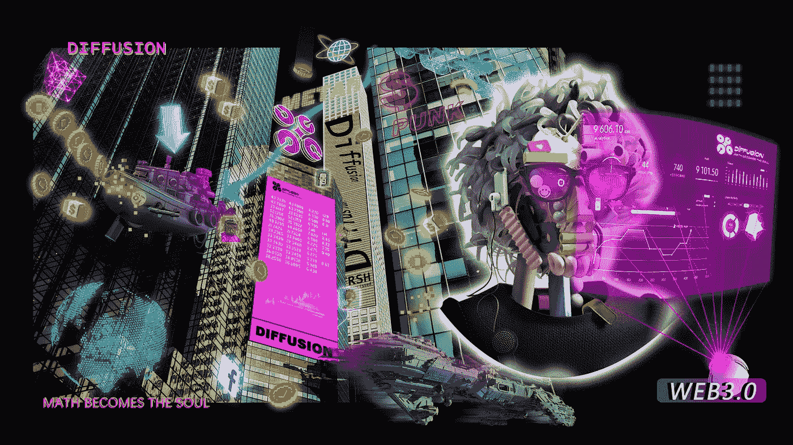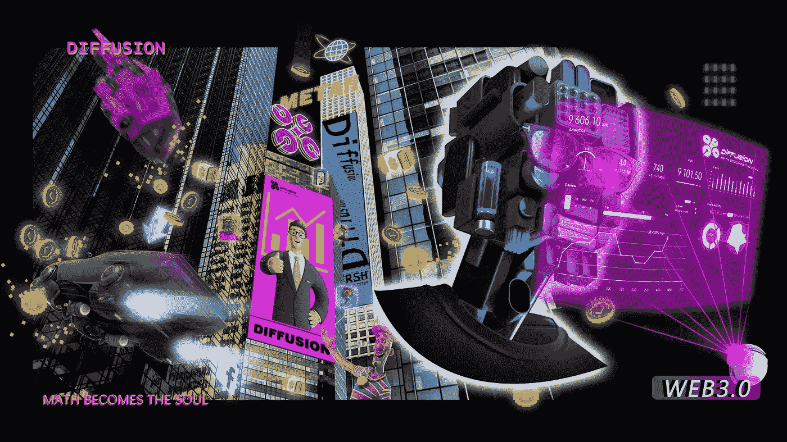

金融大都市 metafis:这是扩散道的核心宇宙，充满了数学符号。这是铸造扩散道核心资产的地方。也是 Sall 亲自参与设计和发起的关于扩散道最核心的项目。Metafis 采用了新凯恩斯主义的 DSGE。该模型调节生态，并触发 DFS 实现目标通货膨胀率和最优货币政策承诺。Metafs 是一个庞大的系统，为整个生态系统做统计。我们分析整个生态的各种数据和指标，比如扩散指数、TVL、总流动性等关键指标，基于 DSGE 模型和 AI 做出一些重大决策。例如，APY 的设定，债券的贴现率等。，并将传统经济学知识与分散金融相结合，对整体生态进行宏观调控。金融资产将在这里迅速丰富和多样化，如债券，储蓄，社会 NFT，股权 NFT，LP 农场等。，同期我们将完成 NFT 交易市场的启动。虽然内容丰富，后端有复杂的数学逻辑，但是我们会对产品进行一个简化的设计，就是用起来非常简单。

当然，我们也鼓励每个参与者进行生态开发、数学模型设计，以便提供更多更好的解决方案。同时，我们鼓励更多的 DAO 组织和社区参与进来，形成自己的收入渠道。无论是 Metafis 中的个人还是组织，都可以通过促进生态获得利益，这是一个相当可观的利益。当然，即使你没有自己的道，没有自己的社群，你只是一个个体，在这个宇宙中，你依然可以轻松获取财富，因为在我们生态启动的初期，储量的快速增长会让你的资产快速增长。同时可以用很低的价格获得大量的高净值资产。综上所述，这是一个值得探索和参与的金融宇宙，请在这里留下你的创富神话。

**2、黄金星辰王国:(2022 年 9 月上线)**

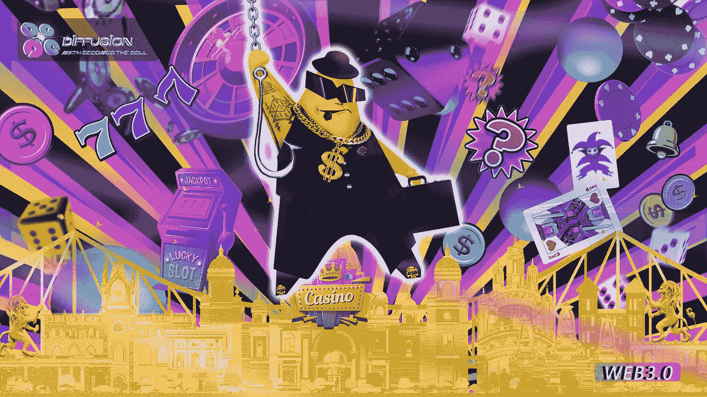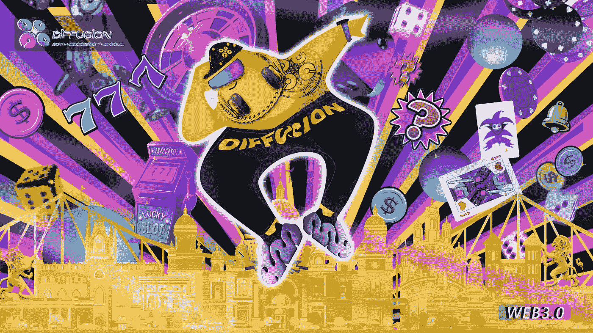

这个世界是由 Drop 在和他的朋友 Skol 聊天时启发和创造的，Skol 是一名德克萨斯州扑克冠军，最近搬到了拉斯维加斯，他在那里度过了大部分时间。Drop 和 Skol 保持着良好的关系。Drop 还对加密货币行业感兴趣，他将加密货币描述为一个大赌场，这是一个非常生动的比喻。他希望能有一个连锁的拉斯维加斯，好吧，我们决定通过创造一个充满冒险的平行宇宙来实现 Skol 的梦想，命名为“星星的黄金王国”。

(上图是 Skol 喝酒的时候拍的。不得不说 Skol 真的很喜欢喝酒。也许他喜欢微醺的感觉。)
金色的星空王国是冒险家的天堂，是一个充满机遇和风险的宇宙，星空已经成为平行宇宙的垄断者。它有疯狂的空间和各种各样的游戏，允许来自所有其他宇宙的人参与并见证谁能在这个看起来辉煌的宇宙中获胜并成为真正的百万富翁。让我们跟随乔治开始我们在星星的黄金王国里的冒险吧，对了，记得要小心这个星星，他是个纯粹的资本家，别让他赢了你的筹码！

**3。自私的空间(2022 年 10 月上线)**

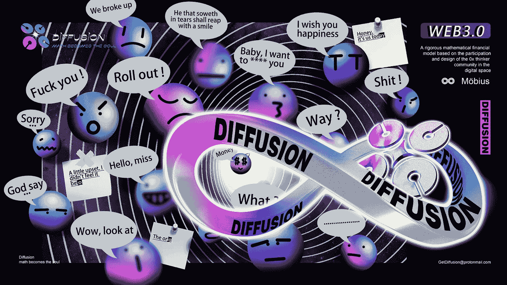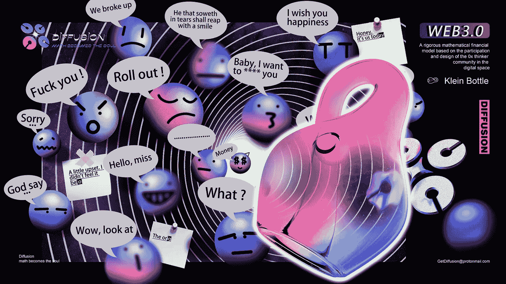

萨尔一直很喜欢托马斯·杰斐逊，托马斯·杰斐逊(1743 年 4 月 13 日—1826 年 7 月 4 日)是美利坚合众国第三任总统(1801—1809)，美国《独立宣言》的主要起草人。他和乔治·华盛顿、本杰明·富兰克林并称为美国的三位开国元勋。在萨尔看来，杰斐逊是完美的领袖。托马斯·杰斐逊在任期间，保护农业，大力发展民族资本主义工业。从法国购买路易斯安那州几乎使当时美国的领土扩大了一倍。此外，杰斐逊还发起创办了弗吉尼亚大学，并担任首任校长。杰斐逊有一句名言:“理性、正义和平等都没有力量统治世界上的人类，只有利益可以。”是的，人类是被利益和自私驱使的。人性固有的本性有非常自私的一面。在加密货币的世界里，自私似乎是常态，甚至这里是一个残酷的金融世界。所以我们创造了这个宇宙——自私的空间。

自私的空间——这是一个分散的留言板，一个由黑板和白色单词组成的私人空间，会有很多内心的谈话，我们怀疑会有很多脏话，但也许其他的情绪会写在黑板上，甚至会有很棒的诗歌。
这是一个会员制俱乐部，你需要有一个 NFT 灵魂，这是一个由矛盾图形组成的 NFT，象征着人类的灵魂本身就是一种矛盾:希望去爱每一个人，却无力阻止仇恨的发生；希望能有所进步，努力工作，却被懒惰所阻碍。简而言之，你需要有这样的 NFT 灵魂才能进入这个空间，去创造或者关爱他人，或者侮辱世界，当然那些话会被做成 NFT，每一次演讲都会消耗 DFS，所以每一个 NFT 都包含 DFS，价值不菲。大家说话的目的都是为了在这里盈利。

**4。绿色地球和儿童笑脸(2022 年 11 月上线)**

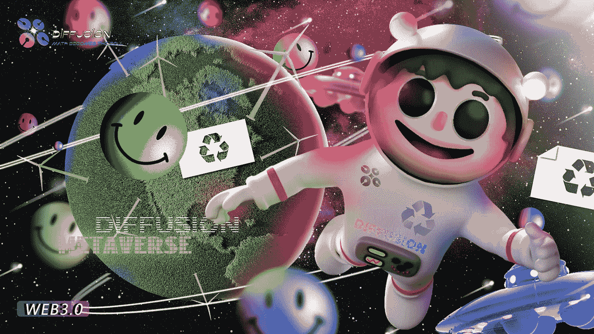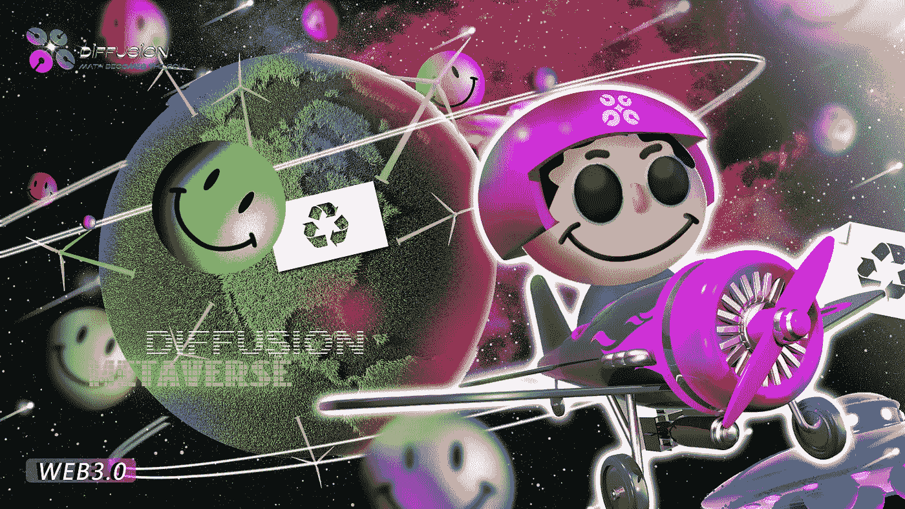

格罗普去过很多国家，他的梦想是环游世界。这个世界上有这么多美丽的地方。他常常感叹，地球是一个充满生机的美丽家园。但是最近几年，他越来越担心，因为我们正在慢慢杀死地球，这是一个非常令人担忧的问题。我们还很年轻，我们的孩子会生活在极端气候的地球吗？他们可能不再(在未来的某个时刻无法被取代)看到地球的本来面目。

Gorp 在印度旅游的时候认识了一个叫 Lakshmi 的小女孩，一个聪明漂亮的女孩。她家在马哈拉施特拉邦经营着一个农场，但近年来的过度开采对农田造成了水土流失，这让一家人的生活更加艰难。他们第一次相遇时，拉克西米只有七岁，现在她十岁了。在过去的三年里，集团一直在给拉克什米的家庭汇款，帮助他们度过困难的生活，然而，国际汇款真的很麻烦！Grop 希望加密货币能够变得更加普及，让转账变得更加容易，让爱能够轻松传播！

(拉克什米的微笑，摄于马哈拉施特拉邦，2019 年)

格罗普深知个人的力量是有限的。他希望更多的人能关注被破坏的地球和在 Web 3.0 发展过程中遇到困难的人们，让我们的孩子有机会接受来自世界各地的那些爱心人士的援助。所以在扩散岛的多元宇宙中，我们希望有一个关心地球和孩子的宇宙。我们相信很多人可以在扩散道创造财富，变得富有，同时也给了每个人选择做一个好人的机会。

(上面的照片发表在反映印度恶劣环境的《自然》杂志上)

**5。我的计算能力世界(2022 年 12 月上线)**

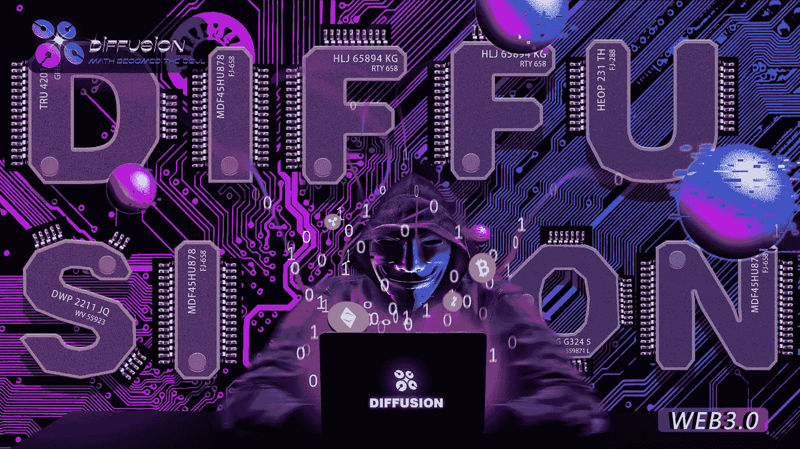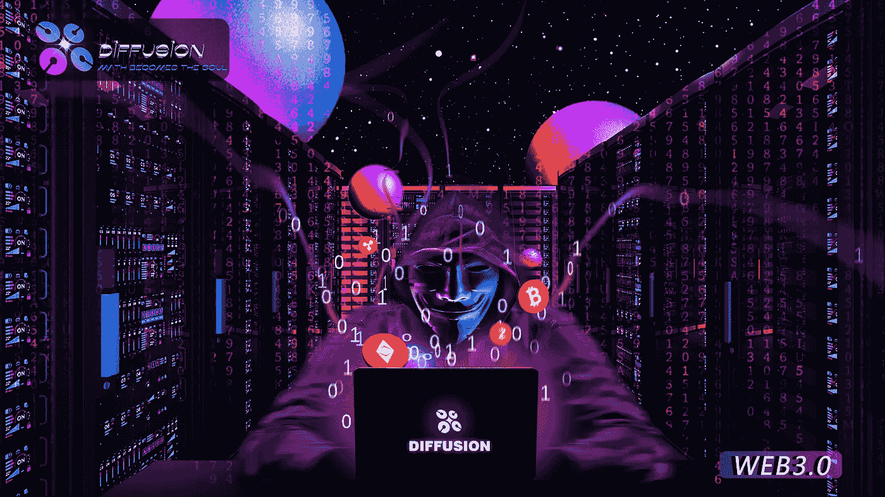

我们的投资者之一是一位来自挪威的绅士，名叫约翰·卡鲁。他从 2016 年开始挖矿，已经开采了很多比特币。他是我们整个团队里最有钱的加密货币大亨！约翰·卡鲁的成功一直让许多人羡慕。
我们将在加密货币世界中发现，计算正确的哈希值简直令人着迷，我们认为创造一个计算能力的世界会很有趣，让 NFT 为我们采矿。在这个世界里，你可以通过购买或者参与活动获得各种类型的 NTF 矿机，在这里你可以开采各种加密货币，比如 BTC 和 ETH。BTC NFT 的背后是 Riot Blockchain Inc，美国最大的上市矿业公司，也是该公司真正的计算能力所在。当然这里会有很多选项，你可以自己决定要哪个币的矿！我们相信会有很多加密货币爱好者参与进来，有很多机会，你甚至可以免费获得 S19pro。好了，准备好进入我们的计算能力世界，成为一名大矿工吧！

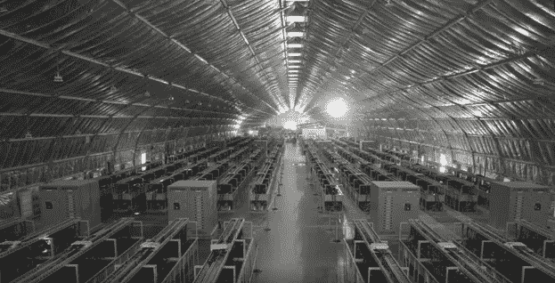

(Riot Blockchain Inc .，美国科西嘉岛矿山)

> *加入 Coinmonks* [*电报频道*](https://t.me/coincodecap) *和* [*Youtube 频道*](https://www.youtube.com/c/coinmonks/videos) *了解加密交易和投资*

# 另外，阅读

*   [3 商业评论](/coinmonks/3commas-review-an-excellent-crypto-trading-bot-2020-1313a58bec92) | [Pionex 评论](https://coincodecap.com/pionex-review-exchange-with-crypto-trading-bot) | [Coinrule 评论](/coinmonks/coinrule-review-2021-a-beginner-friendly-crypto-trading-bot-daf0504848ba)
*   [莱杰 vs n 格拉夫](/coinmonks/ledger-vs-ngrave-zero-7e40f0c1d694) | [莱杰纳诺 s vs x](/coinmonks/ledger-nano-s-vs-x-battery-hardware-price-storage-59a6663fe3b0) | [币安评论](/coinmonks/binance-review-ee10d3bf3b6e)
*   [Bybit Exchange 审查](/coinmonks/bybit-exchange-review-dbd570019b71) | [Bityard 审查](https://coincodecap.com/bityard-reivew) | [Jet-Bot 审查](https://coincodecap.com/jet-bot-review)
*   [3 commas vs crypto hopper](/coinmonks/3commas-vs-pionex-vs-cryptohopper-best-crypto-bot-6a98d2baa203)|[赚取加密利息](/coinmonks/earn-crypto-interest-b10b810fdda3)
*   最好的比特币[硬件钱包](/coinmonks/hardware-wallets-dfa1211730c6) | [BitBox02 回顾](/coinmonks/bitbox02-review-your-swiss-bitcoin-hardware-wallet-c36c88fff29)