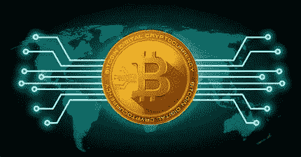
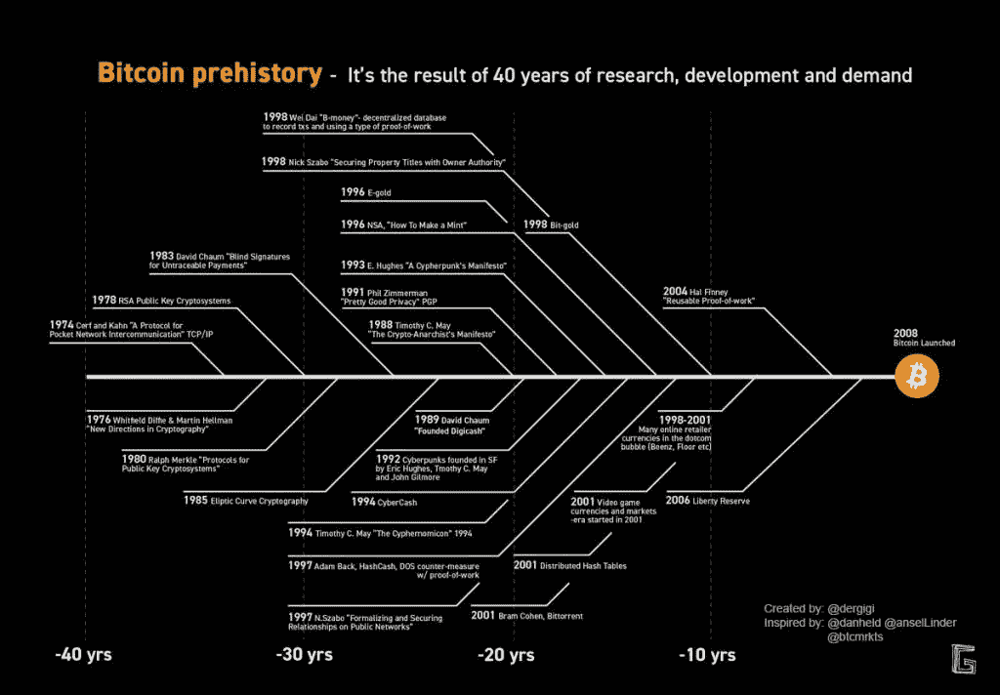

# 加密的采用必须是自愿的

> 原文：<https://medium.com/coinmonks/the-crypto-adoption-must-be-voluntary-7980e42dc0f1?source=collection_archive---------26----------------------->

加密无政府状态

一个点对点的电子现金系统，就是这样被中本聪构想出来的比特币，2008 年 10 月 31 日。

许多人庆祝比特币在一些国家被监管为合法用途，或被接受为支付手段，例如在萨尔瓦多，这是一个好消息。

**我厌恶它。**

我们不需要政府的许可来选择我们的钱。我们给了他们中本聪想从他们手中夺走的权力，并把它交给了我们。

绝大多数人都是在有政府官方指导计划的学校里接受教育的，他们当然接受货币必须由国家发行和控制，或者更确切地说，由临时管理政府的政治家来发行和控制。

这种货币管理影响到整个人口，并赋予政府巨大的权力。

根据比特币爱好者的说法，比特币的推出是为了创造一个公平的货币体系。但是，对批评者来说，比特币在为不同犯罪活动融资方面扮演着重要角色，这是监管者的完美借口。

一个没有钱的国家就没有权力，就会消失。

金钱是经济中最需要的商品，因此它必须被所有人接受。区别在于，如果是自愿的还是法律强制的，在手枪尖端。

# 我们信任比特币是货币吗？

比特币的基础并不为所有人所知。比特币不是凭空出现的。

数字货币的概念由来已久。特别是，一个被称为密码朋克(cypherpunks)的集体写了很多关于数字货币、其匿名使用、这些系统的实施方式以及密码学的一般社会意义的文章。

«Bitcoin is an idea» Gigi

密码术允许两个人交换信息，协商电子合同，而不知道对方的真实姓名或合法身份。

加密货币具有成为货币的各种积极品质。此外，它们比信托货币(基于债务发行的国家货币)具有更好的品质。

加密货币是私有的，人们自愿选择它们，信托资金是必须的。

所有私人货币都是人类行动过程的结果，而人类的社会学习过程不可避免地需要时间。所有变成货币的商品(牛、皮、羊毛、盐、烟草、金、银等)。)在数百万人之后实现了它，在自由市场中自发地互动。

基于区块链的加密货币只有在被所有公众大量选择的情况下才会成为现实。也就是说，如果它们成为公众自发要求最多的井。

由于实现加密协议的重新路由加密数据包的广泛使用，网络上的交互将越来越难以追踪。

> “……开放社会中的隐私需要匿名交易系统。到目前为止，现金是这种类型的主要系统。匿名交易系统不是秘密交易系统。匿名系统允许个人在他们希望的时候，并且只有在他们希望的时候，透露他们的身份；这是隐私的本质……”(秘密无政府主义者清单)。

在交易中，声誉将比如今的信用评级更为重要。这些进步将彻底改变政府监管的性质、征税和控制经济互动的能力、维护秘密信息的能力，甚至改变信任和声誉的性质。

加密货币完全符合这个**加密无政府状态**的计划。

> 无政府状态不是混乱，正如国家教育中告诉我们的那样，但它是缺乏一个实施法律的中央权威。无政府状态是同伴之间自愿契约的关系和联合。

一个国家的中央银行是国家的金融机构，是货币政策的制定者，因为他们有绝对的权力来管理货币的使用。在商业银行的帮助下，政府调节经济中所有的货币流动。

在大多数情况下，政府对资本有控制。因此，他们使用不同的形式和方法来避免硬币的输出，这是政府在处理货币发行和监管时的另一种控制形式。

这些控制措施之一是在资本市场，股票交易所，最重要的私人管理公司的行动进行交易。

创造传统金融工具，如 ETF 和比特币期货，意味着削弱中本聪的理念，因为它操纵价格，印刷波动性，并破坏计量单位的属性，而计量单位需要商品才能成为货币。这是感到比特币威胁的当权派采取的行动。

# 最后的话

这取决于我们比特币的成功，以及总体而言，加密经济的生态系统。

重要的是要理解比特币将权力从政治权力转移到社会权力，即人民的权力，从而削弱政府权威。

把钱从国家分离出来的影响和现代民主国家一样，把教会从国家分离出来。

一个没有货币管理的国家失去了权力的三大支柱之一，另外两大支柱是税收和公共债务。

在未来的无政府主义者中，权力发生了变化，也许精英们说了很多的新的世界秩序也会发生变化。

【liberlion.com 号

> 加入 Coinmonks [电报频道](https://t.me/coincodecap)和 [Youtube 频道](https://www.youtube.com/c/coinmonks/videos)了解加密交易和投资

# 另外，阅读

*   [瓦济里克斯 NFT 评论](https://coincodecap.com/wazirx-nft-review)|[Bitsgap vs Pionex](https://coincodecap.com/bitsgap-vs-pionex)|[Tangem 评论](https://coincodecap.com/tangem-wallet-review)
*   [如何使用 Solidity 在以太坊上创建 DApp？](https://coincodecap.com/create-a-dapp-on-ethereum-using-solidity)
*   [币安 vs FTX](https://coincodecap.com/binance-vs-ftx) | [最佳(SOL)索拉纳钱包](https://coincodecap.com/solana-wallets)
*   [如何在 Uniswap 上交换加密？](https://coincodecap.com/swap-crypto-on-uniswap) | [A-Ads 审查](https://coincodecap.com/a-ads-review)
*   [加密货币储蓄账户](/coinmonks/cryptocurrency-savings-accounts-be3bc0feffbf) | [YoBit 评论](/coinmonks/yobit-review-175464162c62)