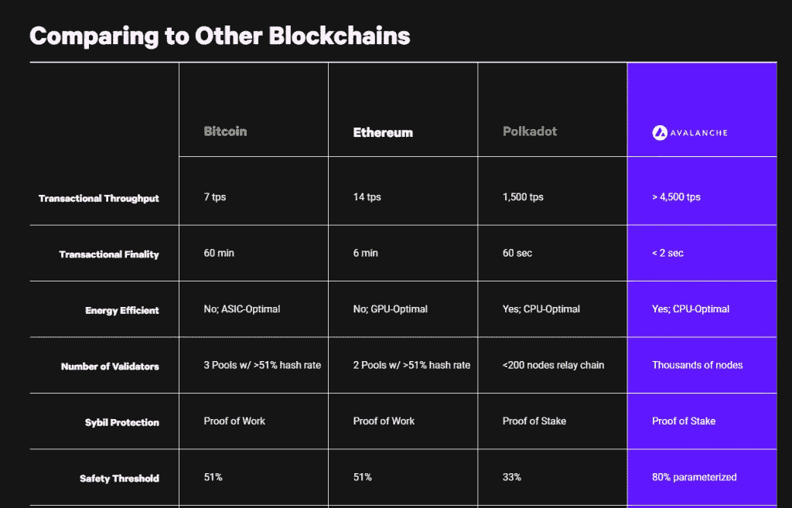
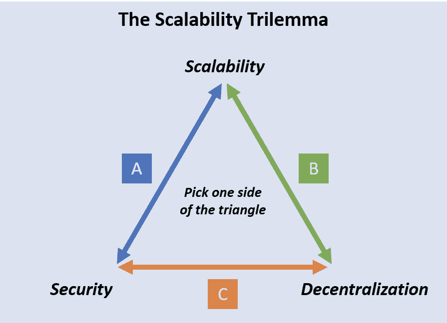
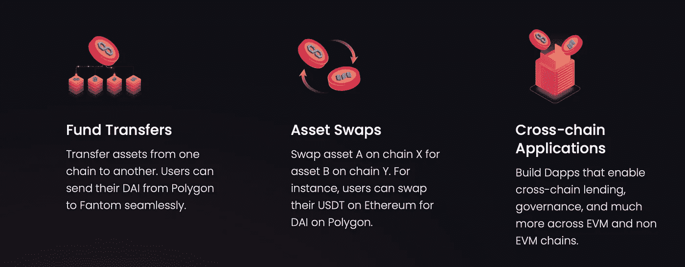
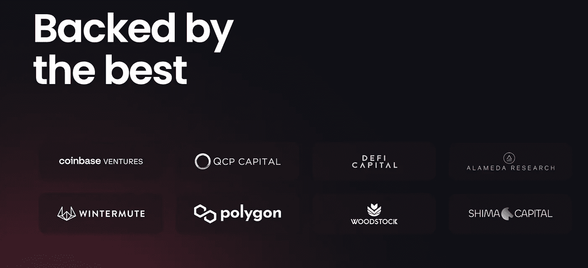

# 加密日记—2022 年 4 月 15 日

> 原文：<https://medium.com/coinmonks/the-crypto-diary-04-15-2022-166159abb6b2?source=collection_archive---------29----------------------->

大家下午好，

从目前的市场情绪来看，自上一篇文章以来似乎没有什么变化。等待 BTC 下跌或反弹来测试顶部趋势线。目前，我技术分析的主要来源是交易视图，你可以看到每个人对图表的看法。我更像是一个基本面分析者，但我会用 TA(技术分析)来确定进场时间。有了加密技术，就很难对市场进行计时，因为资金似乎想什么时候进出就什么时候进出，这在很大程度上取决于新闻或炒作。

一周以来，我一直在关注$AVAX、$NEAR 和$ROUTE 这样的项目。在这篇文章中，我将分享我正在观察的数据，以及如果/当我开始建仓时，我将在未来几年内监测的内容。

$AVAX —在今天的市场上，有许多不同的链试图完成同一件事，即转到第 1 层协议。除了 ETH，很难说哪个项目会成为国王，所以我密切关注的一个数据点是正在建设的 dApps 的数量。根据 Coinmarketcap 的数据，AVAX 的生态系统中有 210 个项目，超过了 Solana(SOL)，目前为 177 个。在这个领域，很难找到开发人员，所以我会密切关注这个数字，看看建设者们的去向。

什么是 AVAX —雪崩？Avalanche 是一个开放的、可编程的智能合同平台，用于以低成本快速构建的分散式应用程序。AVAX 的处理时间为 4，500 TPS，规模不限，子网的阻塞时间为 2 秒。该项目目前排名第十，市值 200 亿美元。

我关注的第二个项目是$NEAR。这是一个年轻的生态系统，但我们都应该关注。目前以 100 亿美元的 MC 排名第 18，如果增长趋势保持不变，该项目还有发展空间。根据 Coinmarketcap，该生态系统目前有 21 个项目，因此与 AVAX 相比，在计算 dApp 与估值比率时，风险略高。虽然还处于初级阶段，但目标是$NEAR 达到 100K TPS，有 100 万个节点，这将解决去中心化、可伸缩性和安全性的三难问题。这绝对是一个值得关注的项目，假设开发继续以这种速度进行，我希望在这个领域建立一个地位，如果它更接近$AVAX dApp 与 MC 的比率~ $2B MC 或$3(当然 dApp 的数量可以增加以满足这个比率。

最后，$ROUTE 我相信是一颗宝石。如果你看看我以前的帖子，我是互操作性的忠实粉丝，并且相信这是这个领域真正需要的东西。我认为这是不同生态系统之间的互联网连接，以实现更好的执行和流动性的跨链交易。虽然其他互操作性项目需要在每个网络之间建立单独的桥梁，但$ROUTE 已经找到了一种方法来将每个生态系统连接到一个单一的枢纽点，使它们能够以这一领域前所未有的速度扩展。在我看来，这是开创性的代码，市值约为 2500 万美元，如果团队能够实现他们的承诺，肯定会成为 100 倍的轰动。

这些低资本项目的风险总是很高，因为不确定性很高。该项目得到了比特币基地和阿拉米达研究公司的支持，并且 Polygon 公司也大力参与了$ROUTE 的开发。换句话说，知名加密公司正在为这个年轻的项目赌上自己的声誉。阅读由 [Router Protocol](https://medium.com/u/bcf8c8fe0c69?source=post_page-----166159abb6b2--------------------------------) 发布的白皮书和媒体文章，很明显该团队在市场上是最新的，并且对整个空间非常了解。这绝对是一个值得观看的项目。

感谢阅读！我们将继续关注市场，并在遇到新想法时分享最新进展。未来几年的目标是找到下一个“大”项目，将区块链空间带到下一个水平。在推特上关注[未被遗忘的 0x](https://twitter.com/undisclosed0x) 的实时更新。

> *加入 Coinmonks* [*电报频道*](https://t.me/coincodecap) *和* [*Youtube 频道*](https://www.youtube.com/c/coinmonks/videos) *了解加密交易和投资*

# 另外，阅读

*   [Bookmap 评论](https://coincodecap.com/bookmap-review-2021-best-trading-software) | [美国 5 大最佳加密交易所](https://coincodecap.com/crypto-exchange-usa)
*   最佳加密[硬件钱包](/coinmonks/hardware-wallets-dfa1211730c6) | [Bitbns 评论](/coinmonks/bitbns-review-38256a07e161)
*   [新加坡十大最佳加密交易所](https://coincodecap.com/crypto-exchange-in-singapore) | [购买 AXS](https://coincodecap.com/buy-axs-token)
*   [红狗赌场评论](https://coincodecap.com/red-dog-casino-review) | [Swyftx 评论](https://coincodecap.com/swyftx-review) | [造币厂评论](https://coincodecap.com/coingate-review)
*   [投资印度的最佳密码](https://coincodecap.com/best-crypto-to-invest-in-india-in-2021)|[WazirX P2P](https://coincodecap.com/wazirx-p2p)|[Hi Dollar Review](https://coincodecap.com/hi-dollar-review)