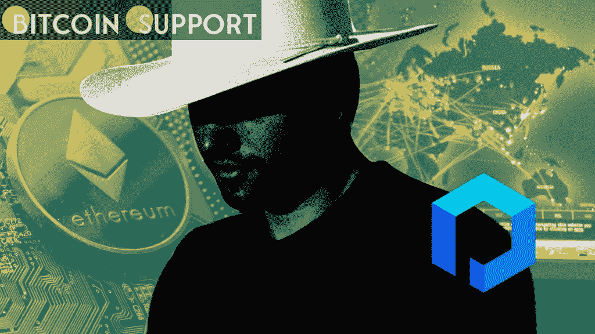

# 加密生态系统需要白帽黑客，因为他们可以帮助它更好地工作

> 原文：<https://medium.com/coinmonks/the-crypto-ecosystem-needs-white-hat-hackers-because-they-can-help-it-work-better-d47e2cf01e9a?source=collection_archive---------54----------------------->

[**https://bitcoinsupports.com/**](https://bitcoinsupports.com/)

On three of Ethereum’s layer 2 networks, Jay Freeman prevented a potential $750 million vulnerability from being exploited.

Jay Freeman took the stage this past weekend at ETHDenver to discuss his almost billion-dollar bug discovery in the core code of Optimism, Boba, and Metis, which he termed “Unbridled Optimism.”

Freeman has a background in software development and hacking, having played a key part in the development of jailbreak software for iOS. Within the wild west of open-source encryption, his experience has proven invaluable. Only two weeks ago, a smart contract flaw caused a $350 million hole in the Wormhole bridge, and that wasn’t even the largest exploit in recent memory. Bridge exploits, on the other hand, are generally discovered quickly since they are utilised frequently and are continually monitored by the people in charge of maintaining them, according to Freeman.

Freeman detected a severe flaw in Optimism’s virtual machine during the first week of February, which developers may not have been able to fix as soon. The flaw was found in Optimism’s selfdestruct feature, which lets contracts to be terminated while also sending any remaining ether balance to a specified address.

Why do blockchains include a self-destruct function if it sounds dangerous? Obsolete or unsafe contracts can be removed from the chain using this function, which also returns the ether balance to the rightful owner.

**Unless, of course, there is a bug.**

Without actually burning the ether balance within a contract, Optimism’s selfdestruct method returned the ether balance to the chosen address. “This means that when a contract self-destructs, the balance is BOTH delivered to the beneficiary AND also kept,” says Freeman. If attackers were successful in calling the contract, they might set up a loop that doubled their OETH balance until Optimism devs recognised and patched it.

After examining past selfdestruct calls on Optimism and tracking one wallet back to an Etherscan employee, Freeman noticed that he was not the first to discover the problem. The employee had discovered and tested the flaw, but didn’t realise the gravity of the situation and left it alone. As additional funds were bridged to Optimism and other layer 2 systems duplicated the programming Optimism had put in place, the vulnerability had grown worse. Layer 2 networks are connected but functionally distinct from the foundation layer.

As a result, if Freeman hadn’t discovered the problem, a minting vulnerability would have let an attacker to double their money every time the selfdestruct function on Boba and Metis was invoked, according to Freeman.

**DeFi and White Hats**

Even if the Optimism team had detected and temporarily halted bridge transactions using the sequencer during a hypothetical attack, an attacker may still have wrecked layer 2 decentralised finance (DeFi). Any attacker might deplete decentralised exchanges and abuse lending platforms with worthless collateral using the forged OETH. The vulnerability would have likely caused irreversible damage to the Ethereum ecosystem, rendering layer 2 users’ cash unusable and leaving no assets on the other end of the bridge. On the day the vulnerability was discovered, Optimism, Boba, and Metis had roughly $750 million in DeFi locked up, almost all of which was at danger.

**The necessity of friendly rivalry**

With anonymous founders, open-source programming, and billions of dollars looking to take on risk, decentralised finance remains a risky business. This massive sum of money has established an incentive system that rewards organisations who build quickly and distribute tokens.

Traders and investors, on the other hand, find caution and professionalism less appealing. Even while the market finally punishes shortcuts, the world economy has witnessed the effects of constant risk taking time and time again. There’s no reason to believe the same thing won’t happen in crypto and decentralised finance, with only the most diligent protocols surviving in the end.

Freeman has also considered where the line between “Code is Law” and third-party trust should be drawn. Bug rewards, he argued, are critical in motivating good actors to seek for and exploit flaws. By putting the payoff for being a good actor on a par with the payoff for being a bad actor, the incentives for white hatting shift dramatically.

This type of “friendly adversarialism,” as Freedman described it, can encourage ecosystem players to be more transparent, honest, and even pessimistic about new ideas.

This pessimism is crucial. Today’s climate may be excessively optimistic, causing investors and DeFi users to become enthusiastic about protocols that may never work or possibly be dangerous. This lack of control, along with the open-source nature of the technology, offers the ideal setting for hackers and scammers, a problem that most of the crypto industry refuses to acknowledge.

**Visit our website:-** [**https://bitcoinsupports.com/**](https://bitcoinsupports.com/)

**Disclaimer: These are the writer’s opinions and should not be considered investment advice. Readers should do their own research.**

> *加入 Coinmonks* [*电报频道*](https://t.me/coincodecap) *和* [*Youtube 频道*](https://www.youtube.com/c/coinmonks/videos) *了解加密交易和投资*

# 另外，阅读

*   [3 商业评论](/coinmonks/3commas-review-an-excellent-crypto-trading-bot-2020-1313a58bec92) | [Pionex 评论](https://coincodecap.com/pionex-review-exchange-with-crypto-trading-bot) | [Coinrule 评论](/coinmonks/coinrule-review-2021-a-beginner-friendly-crypto-trading-bot-daf0504848ba)
*   [莱杰 vs n 格拉夫](/coinmonks/ledger-vs-ngrave-zero-7e40f0c1d694) | [莱杰纳诺 s vs x](/coinmonks/ledger-nano-s-vs-x-battery-hardware-price-storage-59a6663fe3b0) | [币安评论](/coinmonks/binance-review-ee10d3bf3b6e)
*   [Bybit Exchange 审查](/coinmonks/bybit-exchange-review-dbd570019b71) | [Bityard 审查](https://coincodecap.com/bityard-reivew) | [Jet-Bot 审查](https://coincodecap.com/jet-bot-review)
*   [3 commas vs crypto hopper](/coinmonks/3commas-vs-pionex-vs-cryptohopper-best-crypto-bot-6a98d2baa203)|[赚取加密利息](/coinmonks/earn-crypto-interest-b10b810fdda3)
*   最好的比特币[硬件钱包](/coinmonks/hardware-wallets-dfa1211730c6) | [BitBox02 回顾](/coinmonks/bitbox02-review-your-swiss-bitcoin-hardware-wallet-c36c88fff29)
*   [BlockFi vs Celsius](/coinmonks/blockfi-vs-celsius-vs-hodlnaut-8a1cc8c26630)|[Hodlnaut 点评](/coinmonks/hodlnaut-review-best-way-to-hodl-is-to-earn-interest-on-your-bitcoin-6658a8c19edf) | [KuCoin 点评](https://coincodecap.com/kucoin-review)
*   [Bitsgap 审查](/coinmonks/bitsgap-review-a-crypto-trading-bot-that-makes-easy-money-a5d88a336df2) | [Quadency 审查](/coinmonks/quadency-review-a-crypto-trading-automation-platform-3068eaa374e1) | [Bitbns 审查](/coinmonks/bitbns-review-38256a07e161)
*   [密码本交易平台](/coinmonks/top-10-crypto-copy-trading-platforms-for-beginners-d0c37c7d698c) | [Coinmama 审核](/coinmonks/coinmama-review-ace5641bde6e)