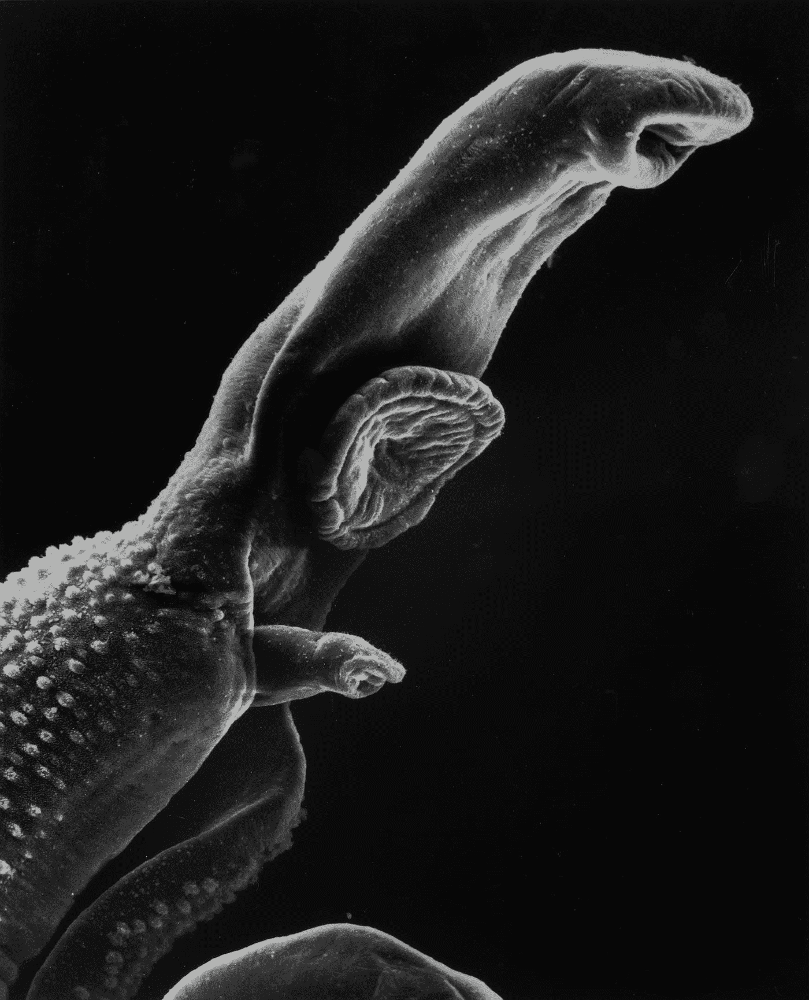
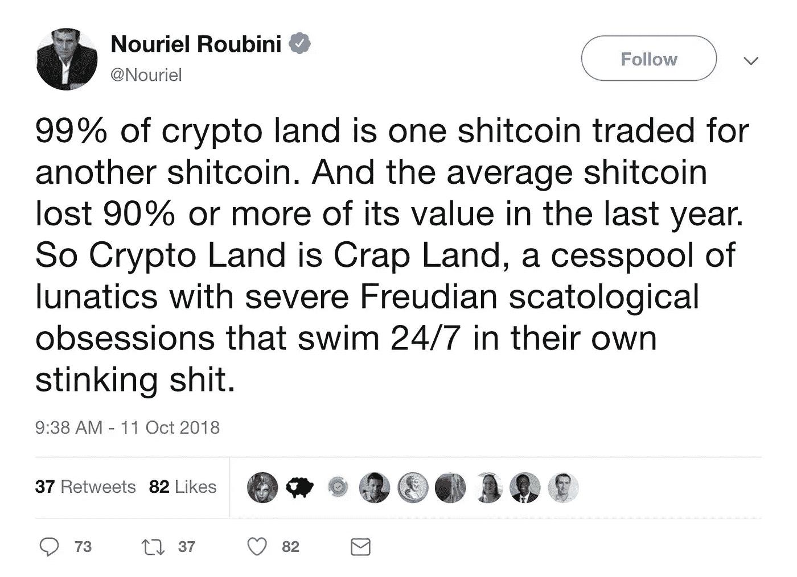

# 秘密黑客世界:99%是寄生在比特币上的狗屎硬币

> 原文：<https://medium.com/coinmonks/the-crypto-hackland-99-are-shitcoins-parasitically-living-from-bitcoin-225284412b60?source=collection_archive---------44----------------------->

## 努里埃尔·鲁比尼，生物学 101，一张来自国家癌症研究所的令人作呕的照片，以及对一个深刻话题的肤浅分析。事情就是这样。在泥土和石头下面有价值。发现它需要努力

Photo by [National Cancer Institute](https://unsplash.com/@nci?utm_source=medium&utm_medium=referral) on [Unsplash](https://unsplash.com?utm_source=medium&utm_medium=referral)

## **加密货币为什么会存在？**

第一个也是主要的原因是，一种不需要第三方的在线价值交换方式在技术上已经实现(见比特币[白皮书](https://bitcoin.org/en/bitcoin-paper))。人类的自然动机之一，也是发明背后的主要驱动力，是解决问题。加密货币是对最初的**什么是价值的问题的进一步解决(或宏观进化的微观阶段)。**

其次，因为区块链(自相矛盾的超资本主义共产主义)和比特币背后的理想主义笔名中本聪厌倦了传统、集权和腐败的金融体系的行为，特别是在 2008/2009 年危机期间和之后。

第三，因为‘双重消费’是通过一个没有业主、没有物业的社区游戏(无法抑制的挑战自己、挑战对方的冲动)解决的。其结果成为 21 世纪最具革命性的事件之一:互联网现金的诞生。

第四，因为 Satoshi 发明了点对点的电子现金系统。

## 加密货币是干什么用的？

破坏(破解)系统，解决铭刻在人性中的问题(因为它也是创造它们)，改变现状。伴随着这种欲望而来的是对金融不服从和反抗强权的需要。它的存在也是为了简化繁琐的传统金融体系，反过来让金融真正普及。Cryptos 也是对肾上腺素、风险和匿名赚快钱的赌博的回应。

对于寻求刺激者、反叛者、反体制者、不墨守成规者、麻烦制造者和(害怕 FOMO 的)新奇追随者来说，这个组合太性感了。

## 生活在一起(共生)

这种创新的负面后果之一是出现了寄生虫，它们毫不费力地依靠他人的利润为生。没有互利主义，只有自私。每个参与者获得的成本收益是极不平等的:鳟鱼赢得或受益，诚实的人失去或伤害。

在现有的近 20，000 种加密货币中，有 10，067 种列在 CoinMarketCap(担保印章)上，80%是无用的。[【1】](#_ftn1)

**帕累托，永远帕累托。靠那 20%生活的 80%的人。**

[【1】](#_ftnref1)8500 市值低于 100 万美元。8881 个价值不到 1 美元。9，163 家的 24 小时交易量低于 100 万美元。791 有 1 亿到 10 亿的流通供应量。大约 7，450 家公司完成了市值和交易量低于 100 万美元、价格低于 1 美元的组合。

*

> *加入 Coinmonks* [*电报频道*](https://t.me/coincodecap) *和* [*Youtube 频道*](https://www.youtube.com/c/coinmonks/videos) *了解加密交易和投资*

# 另外，阅读

*   [有哪些交易信号？](https://coincodecap.com/trading-signal) | [Bitstamp vs 比特币基地](https://coincodecap.com/bitstamp-coinbase) | [买索拉纳](https://coincodecap.com/buy-solana)
*   [ProfitFarmers 回顾](https://coincodecap.com/profitfarmers-review) | [如何使用 Cornix Trading Bot](https://coincodecap.com/cornix-trading-bot)
*   [西班牙 5 大最佳文案交易平台](https://coincodecap.com/copy-trading-spain)
*   [Pionex 双投](https://coincodecap.com/pionex-dual-investment) | [AdvCash 审核](https://coincodecap.com/advcash-review) | [支持审核](https://coincodecap.com/uphold-review)
*   [面向开发者的 8 个最佳加密货币 API](https://coincodecap.com/best-cryptocurrency-apis)
*   [十大最佳加密货币博客](https://coincodecap.com/best-cryptocurrency-blogs) | [YouHodler 评论](https://coincodecap.com/youhodler-review)