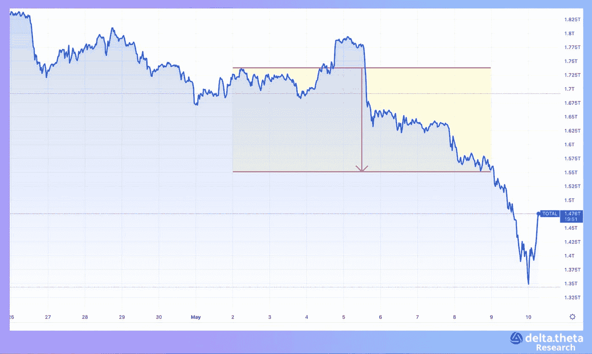
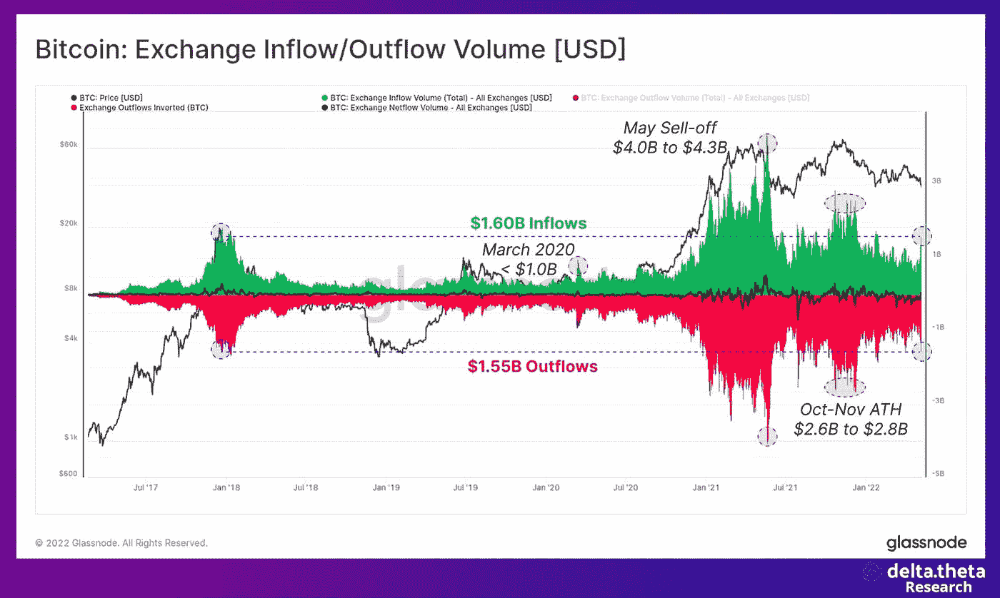
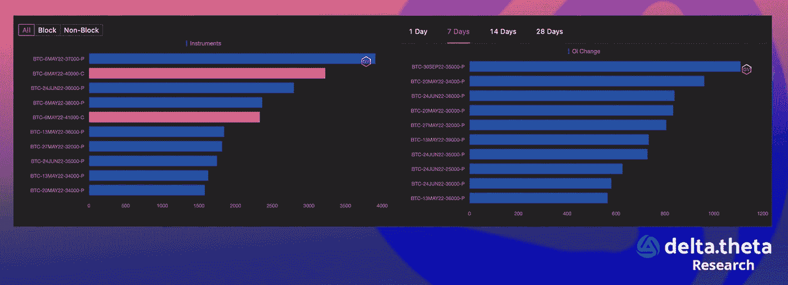
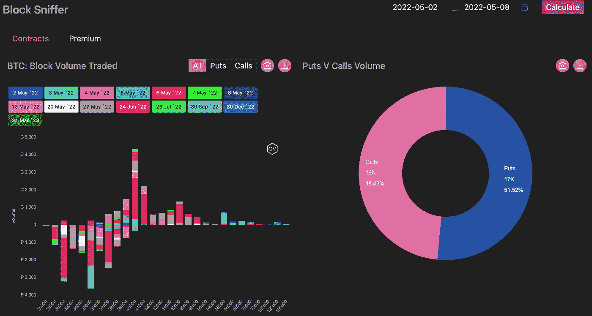

# 加密市场终于进入了一个长期的“熊市”阶段

> 原文：<https://medium.com/coinmonks/the-crypto-market-has-finally-entered-a-bearish-phase-for-a-long-time-ceaf21e77666?source=collection_archive---------27----------------------->

虽然两周前还可以讨论逆转的可能性，但 5 月 2 日至 9 日的一周毫无疑问地表明，加密市场已经真正进入了熊市阶段，而且可能会持续很长时间。

本周初，总市值指数徘徊在 1.7 万亿美元左右。本周中期甚至出现了 1.794 美元的局部峰值。然后“可怕”的事情发生了:总市值开始暴跌，类似于 2021 年 6 月。该指数用了 4 天时间突破 14 亿美元，使其本周总跌幅超过 3000 亿美元(超过 17.5%)。

显然，再次提及比特币的轨迹与总资本化指数几乎相同是多余的，但重要的是要明白，几乎总是前者触发后者，而不是相反。

因此，“加密货币№1”在本周初从 38 525 开始，然后我们可以在 39 830 看到一个局部峰值。紧接着，价格暴跌，在撰写本文时，价格已跌至 30 572 点的低点(一周下跌 20.6%)。31000–30000 水平是一个相当强的支撑，因为许多大型企业和私人比特币持有者的平均购买价格在这个区域附近。如果这一基本水平被突破，利率进一步下降是可以预期的。

当然，在以太坊的例子中，我们观察不到任何“反趋势”。一切几乎相同，从 2840 点开始，在 2955 点达到局部峰值，然后连续下跌至 2261 点(一周下跌 20.4%)。

# 新闻

加密货币交易所币安已经暂停撤回卢纳和 UST 代币，因为以土地为基础的稳定币[正在努力重新与美元挂钩。这一消息传出之际，Terra 的 UST 算法稳定币正处于明显的动荡之中，该算法稳定币是仅次于 USDT 和 USDC 的第三大稳定币发行商。在过去的几天里，它对美元急剧下跌，](https://www.theblockcrypto.com/linked/145961/binance-suspends-luna-and-ust-withdrawals-amid-market-turbulence)[先是跌至 0.6 美元](https://decrypt.co/99849/terra-stablecoin-peg-slips-despite-loan-bitcoin-reserves)，然后实际上更接近其原始价值(0.92 美元)，但随后暴跌至 0.3 美元。与此同时，Terra 生态系统的本土象征 Luna 在 24 小时内下跌了 95%以上，其价格跌至 1 美元以下(历史最高价为 99 美元)。泰拉首席执行官道权[已经宣布了一项计划](https://www.theblockcrypto.com/post/146254/terraform-labs-ceo-do-kwon-unveils-plan-to-restore-ust-peg)恢复 UST 盯住美元。一个算法稳定币模型被发现不成功，该团队计划添加某种形式的抵押品。

加密货币交易平台 Amber Group 在筹集了 2 亿美元后几个月就开始寻求新的资金。据 Block 报道，另一项交易可能会将这家新加坡初创公司的估值提高到 80 亿美元。其中一名消息人士称，最终估值很可能在 50 亿至 80 亿美元之间。就彭博而言，[是第一个报道筹款的，并表示琥珀将价值 100 亿美元。Amber 成立于 2017 年，为机构和消费者客户提供广泛的产品。截至今年 2 月，该公司在全球拥有 1000 多家机构客户，管理的资产超过 50 亿美元。](https://www.bloomberg.com/news/articles/2022-05-05/crypto-trading-startup-amber-seeks-funding-at-10-billion-value)

周一，萨尔瓦多[在汇率严重下跌的情况下购买了](https://www.coindesk.com/business/2022/05/09/el-salvador-acquires-500-additional-bitcoin-amid-market-drop/) 500 BTC。第一个让比特币成为官方货币的州的总统[在推特](https://twitter.com/nayibbukele/status/1523742670044413954?s=20&t=eWs_EWFOQgccPkgrG14hAg)上说，他以大约 30744 美元的平均价格购买了 500 枚比特币。周一的比特币购买似乎是萨尔瓦多迄今为止最大的一次购买，也是迄今为止的第十次。

凯蒂·焕(a16z 的前合伙人)的新公司焕风险投资[与 NFT 初创企业仿植物怪兽佐拉实验室达成了第一笔交易](https://www.theblockcrypto.com/linked/145358/nft-marketplace-zora-raises-50-million-in-round-led-by-haun-ventures)。这一轮 5000 万美元的融资对该公司的估值为 6 亿美元。仿植物怪兽佐拉协议允许艺术家和开发商创建 NFT 市场和收藏品。仿植物怪兽佐拉有自己的初级市场，用户可以在那里发布 NFT，类似于 OpenSea，但他们的大多数 NFT 都是在第三方市场上出售的。像出版创业公司 Mirror 和 FWB 这样的公司，已经使用仿植物怪兽佐拉的协议向他们社区的成员出售 NFT。除了 Haun Ventures，首轮赞助商还包括比特币基地风投和 Kindred Ventures。

# 市场形势

交易所和外部地址之间的 BTC 转账上周大幅增加，达到 32 亿英镑。这一数字仍远低于去年秋天的相应 ATH 值，但高于 2018 年的水平，这清楚地表明了过去几年市场在流动性和活跃度方面的增长程度。

上图最好地表达了期权交易活动——看跌期权在 30000–34000 点的总优势表明交易者对 BTC 价格进一步下跌(根据 5 月和 6 月的到期日判断，是最接近的)的高度预期。

从上周的交易活动图，我们可以得出结论，期权市场几乎已经停止交易长期执行日期。主要交易活动集中在短期交易中，执行日期在 6 月(上半年末)。缺乏长期的大型交易策略一方面强调了当前宏观经济的不确定性，另一方面也为重新估价和可能的市场逆转留下了空间。