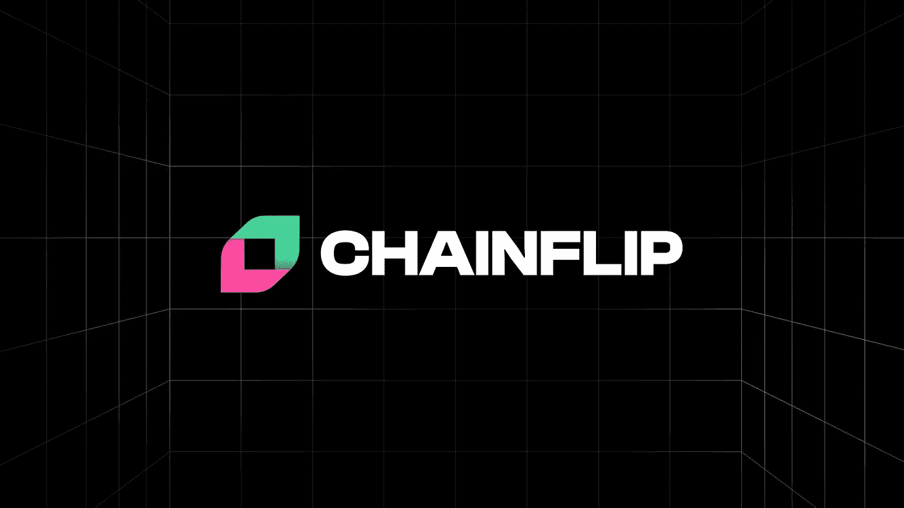
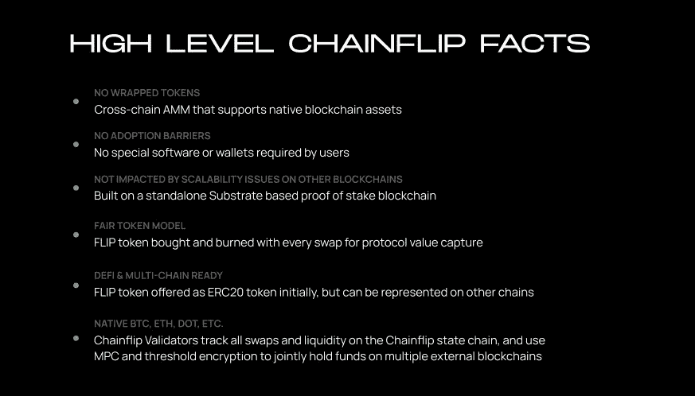
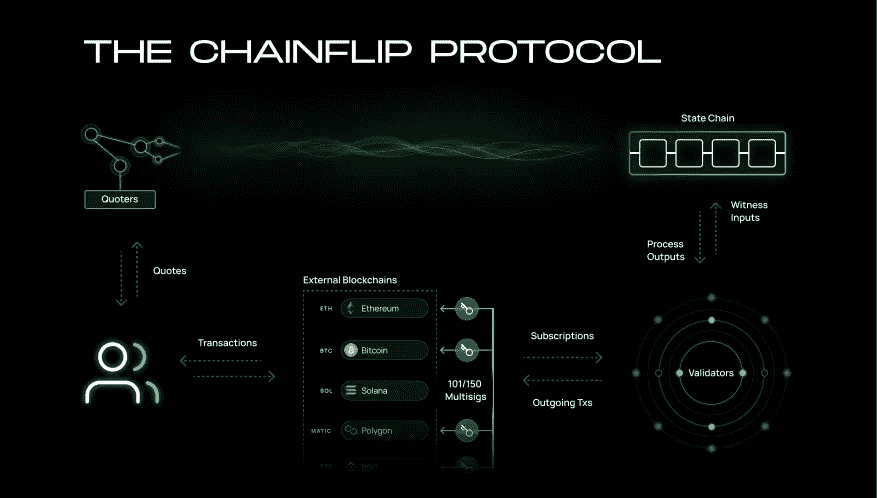

# 加密神谕|链式翻转——不再桥接！交换和接收任何区块链上的本机加密+ $FLIP 令牌潜力

> 原文：<https://medium.com/coinmonks/the-crypto-oracles-chainflip-no-more-bridging-fd5fb071ea3e?source=collection_archive---------3----------------------->

## 跨任何区块链交换加密，并在单次交易中在任何地方接收原生加密，而无需特殊要求，如包装令牌或持有特定加密以支付汽油费。

锁链技术正在经历一些成长的烦恼。**在不同的区块链之间转移密码既困难又耗时。**这提高了分散融资(DeFi)的准入门槛。通常你会发现，人们会留在他们连接的第一个平台上，只是不愿意继续搬到不同的区块链，尽管那里有机会。

以太坊的联合创始人和加密社区的代表人物 Vitalik Buterin 谈到了这个问题:

> “我们应该把资源投入到一个合适的(无信任、无服务器、最大限度地像 Uniswap 一样的 UX) ETH ← → BTC 分散式交易所。令人尴尬的是，我们仍然不能毫无信任地在两个最大的加密生态系统之间轻松移动。”
> 
> 维塔利克·布特林

**Chainflip 是少数几个正在开发的通用跨链解决方案之一，旨在使生态系统之间的移动加密无缝且不可信。【Chainflip 试图实现的目标是独特的。**

> “如果 SolanArt 允许本地 ETH 存款为用户的新 Solana 帐户提供资金，或者如果 USDC 可以被用来直接购买 Arweave 以上传一些东西到 permaweb，这些开发者将大大减少他们用户的摩擦，增加他们自己的协议收入并加速全面采用”( [Chainflip 博客](https://blog.chainflip.io/en/home-community-update-4/))。

Chainflip 将是我们一直期待的多链解决方案。您可以直接用您的 ETH 换 BTC。不再依赖包装好的代币。多链意味着能够“支持任何通用的分散交易网络”([chain flip litepape](https://chainflip.io/lightpaper.pdf))。

[Chainflip Litepaper](https://chainflip.io/lightpaper.pdf)

# 问题是

> "**目前不存在任何促进低摩擦跨链交换作为完全分散协议的机制。**交换代币应该是一个简单的过程，您应该能够选择要交换的资产，插入接收链的目的地址，并为您生成存款地址。使用这个地址，您应该能够发送资金，无论您的钱包如何，然后只需接收另一条链上的其他资产”([chain flip litepape](https://chainflip.io/lightpaper.pdf))。

到目前为止，我们需要包装好的代币、特定的钱包要求、预付定金和支付汽油费的抵押要求。在区块链，这些条件下的桥接资产是进入市场的一个障碍，需要清除才能大规模采用 DeFi 和其他区块链服务。

> **第二层解决方案和原子互换没有解决这个问题。**任何要求您在链条上存储额外抵押品以进行掉期交易的解决方案或集中经纪人都完全没有抓住要点。人们希望能够在一个快速的步骤中清算他们的全部头寸。
> 
> “除非用户在总体上比在集中交易所执行的步骤更少，否则 DEX 被广泛采用的可能性很低。**在用户能够与系统**([chain flip litepape](https://chainflip.io/lightpaper.pdf))交互之前，不应该期望用户将他们的资金转移到新的特殊钱包或平台。

基本上，Chainflip 正在构建一个解决方案，在这个解决方案中，您可以在任何区块链上一步获得任何您想要的加密资产，没有任何独特的条件，并且通过一个简单的用户体验/界面。

让我们透过区块链行业领袖 Vitalik Buterin 的视角，深入探讨为什么多链是区块链产品和解决方案的未来。

# Vitalik Buterin 谈区块链的未来

Vitalik [最近在推特上](https://twitter.com/VitalikButerin/status/1479501366192132099?s=20)讲述了他为什么对多链区块链生态系统持乐观态度。他分享了 AMA 以太坊基金会的 reddit 主题,解释了为什么未来是多链的。

**Vitalik 声称加密桥有一些基本的安全限制。**下面是一个思想实验，有助于解释当前桥接/跨链技术的漏洞:

> “现在，想象一下，如果你将 100 个 ETH 移动到 Solana 上的一座桥上，得到 100 个 Solana-WETH，然后以太坊受到 51%的攻击，会发生什么。**攻击者将一堆他们自己的 ETH 存入 Solana-WETH，然后在 Solana 方确认后立即在 Ethereum 方恢复该交易。**
> 
> 索拉纳-韦瑟的合同现在不再是完全支持，也许你的 100 索拉纳-韦瑟现在只值 60 埃特。即使有一个完美的基于 ZK-斯纳克的桥完全验证了共识，**它仍然容易受到 51%的攻击，像这样的攻击**”([Vitalik Reddit](https://www.reddit.com/r/ethereum/comments/rwojtk/ama_we_are_the_efs_research_team_pt_7_07_january/?utm_source=pocket_mylist))。

**这意味着在以太坊上持有以太坊原生资产或在索拉纳上持有索拉纳原生资产会比反之更安全。**这就是 Chainflip 所允许的——在没有可能危及区块链安全的特殊条件下交换本地资产。

# 链式翻转的工作原理

**Chainflip 在许多连锁店中部署了许多钱包，用户可以向这些钱包存款以使用该平台。这类似于集中式交换的工作方式**,然而 Chainflip 是通过一个分散的节点网络来工作的。验证者可以通过加密示意图为每个支持的区块链创建单个联合钱包。这种设置允许本机跨链交换。

由 Chainflip 开发并使用 Substrate 构建的自定义状态链协调被交换的资产并确保正确使用。这是区块链的利害关系证明。

实际上只有 5 个元素让 Chainflip 发挥作用。这些是金库。验证器、状态链、报价器和流动性池。

这些元素在[文章](https://chainflip.io/lightpaper.pdf)的第 6 页进行了讨论:

## 地下室

> 金库是由验证者共同拥有和操作的钱包。为了创建这些库，验证器参与设置过程，在该过程中，确定性地选择新节点在下一个活动库中服务。这些节点构造一个门限签名钱包，只有当给定门限的验证者对交易签名时，才能从该钱包发送交易

## 验证器

> 与典型的区块链节点相比，验证器是执行一组扩展操作的绑定节点。**这些节点竞争有限的一组验证器位置，从块奖励中获得奖励，并维护 Chainflip 的状态链。**他们需要**有权访问**(或运行他们自己的)**包含受支持资产的每个区块链的客户端**

## 状态链

> “状态链使用基板构建，是一个独立的区块链，充当 **Chainflip 的协调机制**。它包含与保险库内容相关的所有数据，以及如何处理进入链式翻转保险库的交易的规则集，如何管理流动性和互换，以及验证器如何就何时何地在另一个区块链上发送传出交易达成共识。”

## 报价人

> “报价器是用户和状态链之间的接口。报价器的主要功能是代表用户将报价插入状态链。**报价包含交换细节，如输入和输出地址，以及可选的附加指令，如滑动限制、返回地址和超时规则。**报价也用于电报向流动性池添加流动性。**quoter 允许用户在自己的设备上无需任何特殊软件即可与系统进行交互。**

## 流动性池

> “流动性池被简单地定义为两个金库的保留部分。例如，BTC/USDC 流动性池将在比特币和 USDC 金库中各保留一部分。每个区块链只需要一个保险库，但是每个保险库的内容实际上可以在多个流动性池之间进行分割。**流动性提供商向这些资金池添加流动性，以便当人们以与有限合伙人和 Uniswap 相同的方式跨资金池交易时赚取费用。**”

所有这些角色共同确保 Chainflip 网络的正常运行和安全性。**在 Chainflip 的网络上，交换只需 60 秒即可得到确认。大部分的等待时间将来自你交换的区块链的确认时间。**

# $翻转代币

$FLIP 令牌将是与 ERC 20 兼容的 ERC-777 令牌。总供应量将达到 9000 万美元，将奖励给验证者和流动性挖掘项目。

## 令牌实用程序

**每一次交换都将导致协议通过$FLIP/$USDC 池购买和燃烧少量的$FLIP 令牌**。Chainflip 声称这增加了协议的安全性。作为用户，您不需要$FLIP 来与交换进行交互。自动处理$FLIP 费用。

**基本上，通过持有$FLIP，您可以获得产品的费用收入和长期收益。**

# 结论

**Chainflip 旨在创建即插即用的互操作性。对于用户来说，获得他们想要的资产和开发人员来说，集成 dApp 将变得非常简单。从根本上来说， **Chainflip 实际上是一个去中心化的交换平台，拥有比目前市场上更好的交换加密资产的机制。****

将不再有令牌包装，或简单交换令牌的一般特殊要求。您将能够以一种不可信的方式交换加密交叉链，它只需要一个互联网连接，浏览器和目的地地址。

最终，Chainflip 的存在将有助于创建一个真正分散的生态系统，而不依赖于可信的中介，同时提供比集中式产品更好的用户友好体验。

链式翻转的美妙之处在于它不仅仅是一个跨链的敏捷。它是可以重新用于构建多链解决方案的基础架构。 Chainflip 将成为 DeFi 的基石。

如果你有兴趣了解更多，请点击阅读[的最新更新。](https://blog.chainflip.io/community-update-4/)

感谢阅读这篇文章！**如果你认为我应该调查任何与密码相关的事情，那么通过 Twitter DM(**[**@ kyled Collins**](https://twitter.com/kyledcollins)**)告诉我。我总是在寻找好机会。此外，如果您有任何问题，请随时联系我们**。****

*请注意，我写的都不是财务建议——只是我对投资机会的看法。*

> 加入 Coinmonks [电报频道](https://t.me/coincodecap)和 [Youtube 频道](https://www.youtube.com/c/coinmonks/videos)了解加密交易和投资

## 另外，阅读

*   [有哪些交易信号？](https://blog.coincodecap.com/trading-signal) | [比特斯坦普 vs 比特币基地](https://blog.coincodecap.com/bitstamp-coinbase)
*   [ProfitFarmers 回顾](https://blog.coincodecap.com/profitfarmers-review) | [如何使用 Cornix Trading Bot](https://blog.coincodecap.com/cornix-trading-bot)
*   [如何在势不可挡的域名上购买域名？](https://blog.coincodecap.com/buy-domain-on-unstoppable-domains)
*   [印度的加密税](https://blog.coincodecap.com/crypto-tax-india) | [altFINS 审核](https://blog.coincodecap.com/altfins-review) | [Prokey 审核](/coinmonks/prokey-review-26611173c13c)
*   [赢取注册奖金——10 大最佳加密平台](https://blog.coincodecap.com/earn-sign-up-bonus)
*   [Blockfi vs 比特币基地](https://blog.coincodecap.com/blockfi-vs-coinbase) | [BitKan 点评](https://blog.coincodecap.com/bitkan-review) | [Bexplus 点评](https://blog.coincodecap.com/bexplus-review)
*   [南非的加密交易所](https://blog.coincodecap.com/crypto-exchanges-in-south-africa) | [BitMEX 加密信号](https://blog.coincodecap.com/bitmex-crypto-signals)
*   [MoonXBT 副本交易](https://blog.coincodecap.com/moonxbt-copy-trading) | [阿联酋的加密钱包](https://blog.coincodecap.com/crypto-wallets-in-uae)
*   [雷米塔诺审查](https://blog.coincodecap.com/remitano-review)|[1 英寸协议指南](https://blog.coincodecap.com/1inch)
*   [iTop VPN 审查](https://blog.coincodecap.com/itop-vpn-review) | [曼陀罗交易所审查](https://blog.coincodecap.com/mandala-exchange-review)
*   [40 个最佳电报频道](https://blog.coincodecap.com/best-telegram-channels) | [喜美元评论](https://blog.coincodecap.com/hi-dollar-review)
*   [折叠 App 审核](https://blog.coincodecap.com/fold-app-review) | [StealthEX 审核](/coinmonks/stealthex-review-396c67309988) | [Stormgain 审核](https://blog.coincodecap.com/stormgain-review)
*   [购买 PancakeSwap(蛋糕)](https://blog.coincodecap.com/buy-pancakeswap) | [俱吠罗评论](/coinmonks/coinswitch-kuber-review-1a8dc5c7a739)