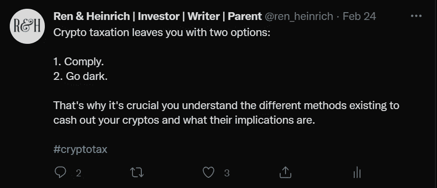

# 隐性影子经济及其政治影响

> 原文：<https://medium.com/coinmonks/the-crypto-shadow-economy-and-its-political-impact-8881963afabd?source=collection_archive---------15----------------------->

更广泛采用加密技术的第二层后果。

Photo by [Ariel Pilotto](https://unsplash.com/@ariel_pilotto?utm_source=medium&utm_medium=referral) on [Unsplash](https://unsplash.com?utm_source=medium&utm_medium=referral)

加密正在蓬勃发展。随着每个月的过去，我们看到更多坚实的项目在不同的领域实现，如 DeFi，游戏，音乐和艺术。与此同时，加密变得更快、更安全、更容易使用，这意味着更多的人采用这项技术。

所有这些都很棒，但也越来越引起国家行为者的注意。这不仅意味着更多的机构采用，也意味着当局更多的控制。

这反过来又与秘密影子经济有关，这种经济在全球呈现出越来越多的具体形式。

# 什么是秘密影子经济？

首先，简单解释一下我所理解的秘密影子经济。

它是指人们使用区块链技术进行商品和服务的金融交易，而不向当局报告。这意味着参与交易的人不用向政府缴税。

# **地下经济如何形成**

这不是什么新鲜事。“在一边”做生意的人和人类本身一样古老。因此，我们很自然地会在加密领域看到类似的事情发生。

加密的固有属性甚至鼓励了这种发展。

毕竟，我为什么要这么做

*   通过烦人的程序把我的硬币送到交易所，
*   把它们改成菲亚特，
*   等了几天钱到了我的银行账户，
*   向银行解释这些钱的来源，
*   只是为了最终能付钱给另一个人，

当我在区块链上几秒钟内就能毫无困难地完成所有这些工作时。

当然，如果我使用加密服务购买任何商品或服务，我不必向政府缴纳任何税款。当然，前提是当局不能将钱包分配给特定的人。

政府希望在区块链发生的交易中分得一杯羹，这对许多人来说似乎不公平。这也是因为民族国家在密码领域做得很少。是太空中的人们自己建造了一切。所以可以理解他们希望国家不管他们和 crypto。

# **为了更大的利益而偷窃？**

另一个原因是很多人认为税收是盗窃。不仅仅是在对加密交易征税的时候，而是在一般情况下。

我不完全同意。

国家及其不同部分的运转需要税收。没有钱，就没有行政、警察和军队。人们有理由抱怨浪费的政府如何处理纳税人的钱，其中一些被用于不良目的。

毫无疑问。

但是你的税收也支付了很多好的东西，比如公路网，幼儿园和学校，公园和医院。

最后一点是我作为一个欧洲人特别关心的。这里的大多数国家都有非常好的公共医疗体系。其原因是多方面的。但当我需要在当地医院接受治疗时，我可以免费获得。此外，当我去看医生时，我经常可以这样做，而不必支付大量的费用。

为什么？

因为在我国，每个人都需要将自己的一部分收入纳入社会保险体系。政府使用这些资金来建设良好的公共医疗基础设施。

但让我们退后一步，以便更好地理解政府在这一切中的观点。

# **政府总是需要更多的钱**

如果你纵观历史，关注不同社会的经济和金融历史，你会发现有些模式似乎反复出现。

其中之一是，一个国家存在的时间越长，整个社会变得越复杂，它的政府需要更多的钱来维持事物。

这意味着运营成本总是在上升。这也是为什么我们必须向国家缴纳的税款和税款总是在增加，但似乎从未减少。

# **贪婪的看着密码**

移到此时此地，我们的情况看起来不太好。

我们的超复杂社会正在慢慢走出一个疫情。全球经济处于糟糕状态。我们在欧洲有场战争。全球能源危机正在上演。通货膨胀将很快达到两位数。

在高通货膨胀和没有真正经济增长的情况下，政府将无法像以前那样创造更多的税收。为了抑制通货膨胀，世界各国的中央银行将不得不提高利率。这将导致许多过去靠廉价信贷生存的僵尸公司破产。许多人将失业。税收将因此减少。

 [## 通货膨胀将如何影响 21 世纪 20 年代和 30 年代

### 未来几十年的经济宏观趋势及其如何影响我的投资策略。

medium.com](/coinmonks/how-inflation-will-impact-the-2020s-2030s-af7315c64396) 

世界各地的政府都在关注这一切，发现他们需要更多的钱，更多的钱来维持整个系统的运转。(事实上，如今政府只是通过印刷机凭空创造出无限数量的资金，这是一个我将在另一篇文章中讨论的问题。)

然后他们看看密码空间里发生了什么。

他们看到每天都有价值数十亿美元的交易发生。他们看到了经济中这个生机勃勃、不断增长的部分，似乎是凭空出现的。他们看到所有的钱在太空中晃动，并认为“我们想要其中的一部分”。

# **2 个方案**

密码越大，当局就越想拥有它的一部分。

这对您意味着什么？

预计全球各国政府将增强追踪区块链交易的能力。考虑到这一点，我看到了加密用户的两种选择。

**选项 1:** 基本上，每当人们将他们的密码转换为菲亚特，并且涉及 KYC(了解你的客户)过程时，当局就可以了解他们在密码领域的许多活动。他们可以检查分配给一个人的钱包的进出交易，如果有任何不清楚的地方，可以确定钱从哪里流出或流向哪里。

因此，如果加密用户不想迟早惹上税务机关或其他机构的麻烦，他们记录所有交易符合他们的利益。

**选项 2:** 人们使用不能分配给他们个人的隐私币和钱包。这本质上可以归结为不通过通常的金融服务提供商(集中交易所、银行)将密码转换成菲亚特。交易发生在这些钱包之间，不容易被跟踪。行动中的秘密影子经济。

# 展望未来

如我所说，当局将继续提高追踪交易的能力。这不仅包括区块链正在发生的事情，还包括对发送、接收、购买和出售加密货币的软件解决方案的控制。

同样，他们将加强对资金流动的控制。围绕 CBDCs(中央银行数字货币)的最新发展显然正朝着这个方向发展。

随着加密用户数量的持续增长，这迟早也会成为选举中的一个问题。对于许多选民来说，政府和政党如何采取反对或支持加密的立场将是投票站中的一个争论点。