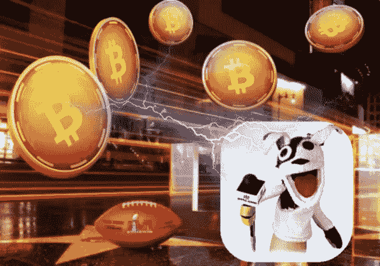

# 秘密超级碗

> 原文：<https://medium.com/coinmonks/the-crypto-super-bowl-1e7180e76830?source=collection_archive---------29----------------------->

上周日，超过一亿名观众收看了 LVI 超级碗，并在此过程中接触到加密货币和区块链，以一种非常大的方式冲击了公众的意识。最引人注目的是由从勒布朗·詹姆斯到拉里·戴维的体育和娱乐名人主演的加密广告。

事实上，即使是被动地观看比赛——同时积极地狼吞虎咽地吃你最喜欢的超级碗薯片 n ' dip——也很难在比赛过程中让加密货币几次进入你的潜意识中(想想 20 世纪 50 年代电影院的“[喝可口可乐](https://www.businessinsider.com/subliminal-ads-2011-5#:~:text=The%20birth%20of%20subliminal%20advertising,to%20be%20aware%20of%20it.)”潜意识广告)。)

我个人最喜欢的加密广告是 https://www.youtube.com/watch?v=Ut3m9OK1c7Y 的拉里·戴维****和 https://youtu.be/aI3LNq_lres 的凯尔·洛瑞[的 BitBuy 广告。两个广告都是在错过机会的前提下巧妙打出的。更老练的投资者可能会推测，当名人和运动员抛出一个迷因时，这表明市场已经见顶，是时候卖出了。](https://youtu.be/aI3LNq_lres)****

****但是不要绝望，我们仍然处于加密革命的早期。当然，并不是所有他们兜售的加密交易、服务和货币都经得起时间的考验，也不是****

****如果你提前进入，成为下一个有望改变人生的大财富。****

****在你决定购买什么，更重要的是你持有什么之前，需要做更多的深思熟虑。这些商业广告和 20 年前的互联网超级碗广告的本质区别在于，这些公司的每一种商业模式都是基于高速的大宗交易。而不是基于底层加密的效用或功能。只要你在交易，买卖什么密码都没关系。****

****购买并托管比特币等全新资产类别(依我拙见，这将是一切的最终结算层)的想法，并不完全符合这些交易所的最佳利益。他们的商业成功基于交易的速度和数量。****

****好消息是，你可以直接购买比特币，自己获得该资产的所有权，并持有它。我看到了拥有一辆汽车和租赁一辆汽车之间的相似之处。当你拥有一辆汽车时，你就拥有了一笔资产，而在当今的经济时代，这笔资产实际上正在升值。租赁是暂时的，基于一段时间，当租赁到期时，您将资产归还给其原始所有者(经销商)。)请注意，您对资产的态度也反映在您对车辆的保养上。当你拥有比特币并保管你的加密货币时，如果持有并培育这种资产(例如平均成本)，从长远来看，这种资产可能会上涨，以便你以后可以为自己或爱人的利益利用财务收益。****

****完全披露:我个人每天都在持续积累比特币，同时保持密切关注，并在我认为能够解决问题并实现更多创新的加密和区块链技术上下很小的“赌注”。****

****作为一个 30 年来一直站在科技媒体前沿，有时甚至是前沿的人，这很令人兴奋，但我也知道这是一场马拉松，而不是短跑。如果我们在明年的超级碗上看到一家加密公司的单独广告，其产品或服务不仅仅是在区块链上交易——无论是钱包还是某种“智能合约”——我会将其视为一个突破性的里程碑。在这一点上，我心爱的旧金山 49 人队进入明年超级碗的可能性差不多，这肯定是可能的，但要到达那里，竞争激烈，道路艰难。****

****就像 20 年前的网络热潮一样，这是一个真正令人兴奋的时代，早期，狂野的西部，直到下一个创新阶段，每天都有创业公司涌现，在区块链上运行。正如 Web1.0、Web2.0 和移动计算刺激了创新，为无数公司创造了财富，并改变了我们作为消费者的生活，加密也将如此。****

****有一件事是肯定的:这一次不会一样了。****

****祝一切顺利，****

****吉姆(人名)****

> *****加入 Coinmonks* [*电报频道*](https://t.me/coincodecap) *和* [*Youtube 频道*](https://www.youtube.com/c/coinmonks/videos) *了解加密交易和投资*****

# ****另外，阅读****

*   ****[Bookmap 评论](https://coincodecap.com/bookmap-review-2021-best-trading-software) | [美国 5 大最佳加密交易所](https://coincodecap.com/crypto-exchange-usa)****
*   ****最佳加密[硬件钱包](/coinmonks/hardware-wallets-dfa1211730c6) | [Bitbns 评论](/coinmonks/bitbns-review-38256a07e161)****
*   ****[新加坡十大最佳加密交易所](https://coincodecap.com/crypto-exchange-in-singapore) | [收购 AXS](https://coincodecap.com/buy-axs-token)****
*   ****[红狗赌场评论](https://coincodecap.com/red-dog-casino-review) | [Swyftx 评论](https://coincodecap.com/swyftx-review) | [CoinGate 评论](https://coincodecap.com/coingate-review)****
*   ****[投资印度的最佳加密软件](https://coincodecap.com/best-crypto-to-invest-in-india-in-2021)|[WazirX P2P](https://coincodecap.com/wazirx-p2p)|[Hi Dollar Review](https://coincodecap.com/hi-dollar-review)****
*   ****[加拿大最佳加密交易机器人](https://coincodecap.com/5-best-crypto-trading-bots-in-canada) | [库币评论](https://coincodecap.com/kucoin-review)****