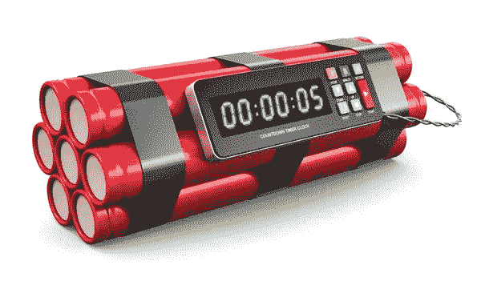
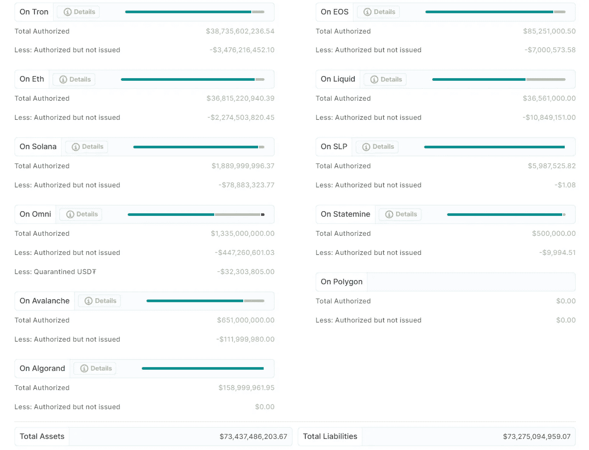
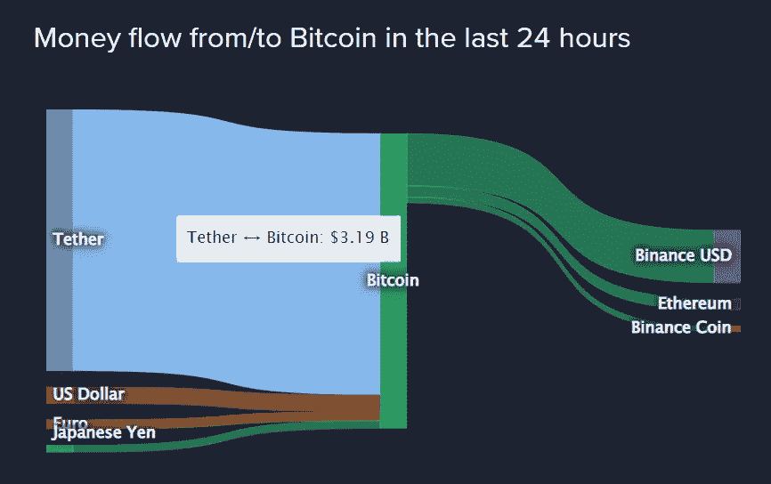
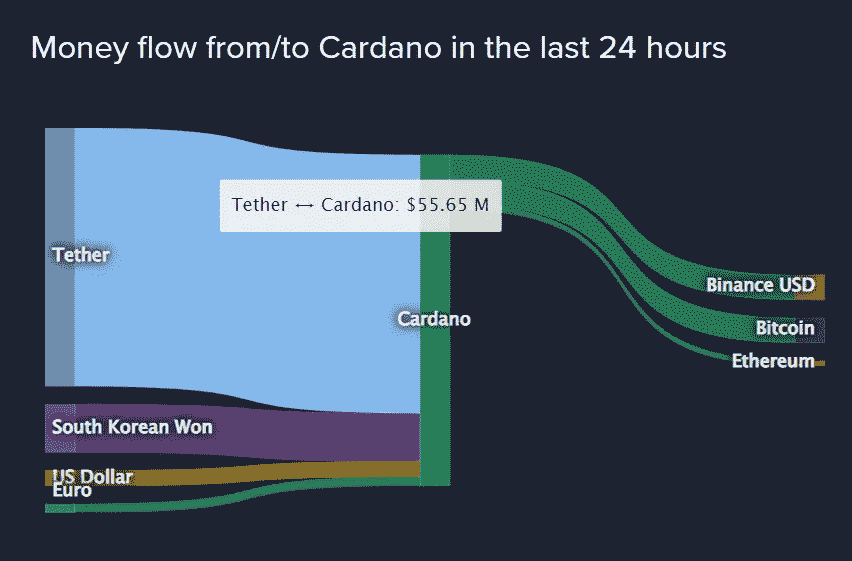

# 秘密定时炸弹

> 原文：<https://medium.com/coinmonks/the-crypto-time-bomb-abfc5c8eef7d?source=collection_archive---------7----------------------->

作为介于法定货币和加密货币之间的中间货币，Tether (USD₮)的流行在交易中更有意义，但对“Hodl”来说就不那么有意义了。它是每日最高加密交易量的稳定硬币。

USD₮是一些交易所接受的令牌，如 Bitfinex、币安、Huobi Global、Kraken、Coinbase、Kukoin、Poloniex 等，但也建立在不同的区块链上，包括 Algorand、比特币现金的简单分类帐协议(SLP)、以太坊、EOS、Liquid Network、Omni、Tron 和 Solana，它们充当传输协议，由与区块链交互的开源软件组成，以实现系链令牌的发行和赎回。

可能导致 USD₮崩溃的网络效应将是巨大的，也就是说，其主要功能——与美元平价的损失，因为除了作为加密市场的主要交易工具之外，它的协议在不同的区块链上运行，正如我解释的那样。

您可以在以下详细信息中看到，截至 2022 年 5 月，其在不同区块链的资产和负债分布情况，值得注意的是，资产集中在 Tron 和以太坊，负债集中在 Eos:

[Transparency](https://tether.to/en/transparency)

系绳有一个见不得人的来历。你可以看看我写的关于这个主题的文章，我把它放在了 *(1)* 的最后。

所有积累的关于 Tether 的信息都清楚地表明，整个系统，无论是其结构、目的还是其货币政策，都可能是一个骗局。

纽约地区的[司法部长 James](https://ag.ny.gov/press-release/2021/attorney-general-james-ends-virtual-currency-trading-platform-bitfinexs-illegal) 于 2019 年调查了 Tether Holdings Limited，于 2021 年结束。结果呢？明显诈骗。即确认资金支持不当。

在 Hacker News 上的一篇[帖子中，他说:“*……就像美联储不能停止将美国赤字货币化，以免收益率爆炸一样，为了支撑价格，美联储必须继续印刷 USD₮。交易所不能让这种情况发生，因为绝大多数人无法进入真正的银行系统，因此好斗的用户必须设计“菲亚特 onramps”。*](https://news.ycombinator.com/item?id=25683586)

这种发行操纵直接影响市场，因为主要是比特币被购买，从而影响其价格。

大多数加密货币都是使用 Tether 购买的。2022 年 5 月，89%的比特币交易都是通过 Tether 进行的。

[Coinlib BTC](https://coinlib.io/coin/BTC/Bitcoin)

以卡尔达诺为例，78%的阿达是与 USD₮.进行贸易的

[Coinlib Cardano](https://coinlib.io/coin/ADA/Cardano)

监管最严格的交易所不使用限制手段，而是使用真正的法定货币，用美元进行更大的交易量。然而，在其他监管较少的交易所，这是系绳。比特币基地和 Bitstamp 是监管最严格的两家交易所，在某些司法管辖区，它们不允许带系绳交易，这将意味着业务损失。然而，在币安、Bit-Z 和 HitBTC 等监管较少的交易所，它们的交易量要高得多。正是出于这个原因，监管机构感到担忧。

发行的系绳越多，比特币价格越高。促进这种关系的限制交易策略如下:

*   鲍勃，一个加密投资者，投入 100 美元到比特币基地。
*   然后鲍勃用这些美元在比特币基地上购买了价值 100 美元的比特币。
*   鲍勃将他价值 100 美元的比特币转移到非银行交易所，如 Bybit。
*   Bob 开始在 Bybit 上交易加密货币，使用杠杆并接受促销礼品，这些都被称为 Tether。
*   Tether Ltd .在交易所购买 Bob 的比特币，几乎肯定是通过一个可否认的代理交易账户。鲍勃以电汇方式收到付款。
*   Tether Ltd .将鲍勃的比特币转移到比特币基地这样的银行交易所。
*   最后，Tether Ltd .在比特币基地出售 Bob 的比特币以换取美元，从而退出加密货币市场。

总的来说，系绳的机制如下。Tether Ltd .凭空印出假美元
2。他们用这个假货来买 BTC
3。BTC 价格上涨。“Tether 由未披露的资产支持”

巴哈马[中央银行](https://www.centralbankbahamas.com/publications/qsd/quarterly-statistical-digest-november-2020-1?N=C)报告了有多少外币存放在 Tether 控股有限公司总部所在地巴哈马的国内银行，证实在 Tether 从 46 亿美元增加到 100 亿美元期间，巴哈马国内银行的外币只增加了 6 亿美元。

这种经济模式对生态系统来说是不健康的，在生态系统中，排放从无到有，比特币(或其他有价值的加密货币)被收购。

这种模式能持续多久？如果它崩溃了，密码市场崩溃的导火索是什么？

你可以在[简短一点:在 Crypto 的末日机器](https://crypto-anonymous-2021.medium.com/the-bit-short-inside-cryptos-doomsday-machine-f8dcf78a64d3)里面深化这个分析。总是 DYOR。

*(1)* [系绳的蒙昧主义](https://adapulse.io/the-obscurantism-of-tether/)

[自由人](http://liberlion.com)

> 加入 Coinmonks [电报频道](https://t.me/coincodecap)和 [Youtube 频道](https://www.youtube.com/c/coinmonks/videos)了解加密交易和投资

# 另外，阅读

*   [3 商业评论](/coinmonks/3commas-review-an-excellent-crypto-trading-bot-2020-1313a58bec92) | [Pionex 评论](https://coincodecap.com/pionex-review-exchange-with-crypto-trading-bot) | [Coinrule 评论](/coinmonks/coinrule-review-2021-a-beginner-friendly-crypto-trading-bot-daf0504848ba)
*   [莱杰 vs n rave](/coinmonks/ledger-vs-ngrave-zero-7e40f0c1d694)|[莱杰 nano s vs x](/coinmonks/ledger-nano-s-vs-x-battery-hardware-price-storage-59a6663fe3b0) | [币安评论](/coinmonks/binance-review-ee10d3bf3b6e)
*   [Bybit Exchange 审查](/coinmonks/bybit-exchange-review-dbd570019b71) | [Bityard 审查](https://coincodecap.com/bityard-reivew) | [Jet-Bot 审查](https://coincodecap.com/jet-bot-review)
*   [3 commas vs crypto hopper](/coinmonks/3commas-vs-pionex-vs-cryptohopper-best-crypto-bot-6a98d2baa203)|[赚取加密利息](/coinmonks/earn-crypto-interest-b10b810fdda3)
*   最好的比特币[硬件钱包](/coinmonks/hardware-wallets-dfa1211730c6) | [BitBox02 回顾](/coinmonks/bitbox02-review-your-swiss-bitcoin-hardware-wallet-c36c88fff29)
*   [BlockFi vs 摄氏度](/coinmonks/blockfi-vs-celsius-vs-hodlnaut-8a1cc8c26630) | [Hodlnaut 审核](/coinmonks/hodlnaut-review-best-way-to-hodl-is-to-earn-interest-on-your-bitcoin-6658a8c19edf) | [KuCoin 审核](https://coincodecap.com/kucoin-review)
*   [Bitsgap 审查](/coinmonks/bitsgap-review-a-crypto-trading-bot-that-makes-easy-money-a5d88a336df2) | [Quadency 审查](/coinmonks/quadency-review-a-crypto-trading-automation-platform-3068eaa374e1) | [Bitbns 审查](/coinmonks/bitbns-review-38256a07e161)