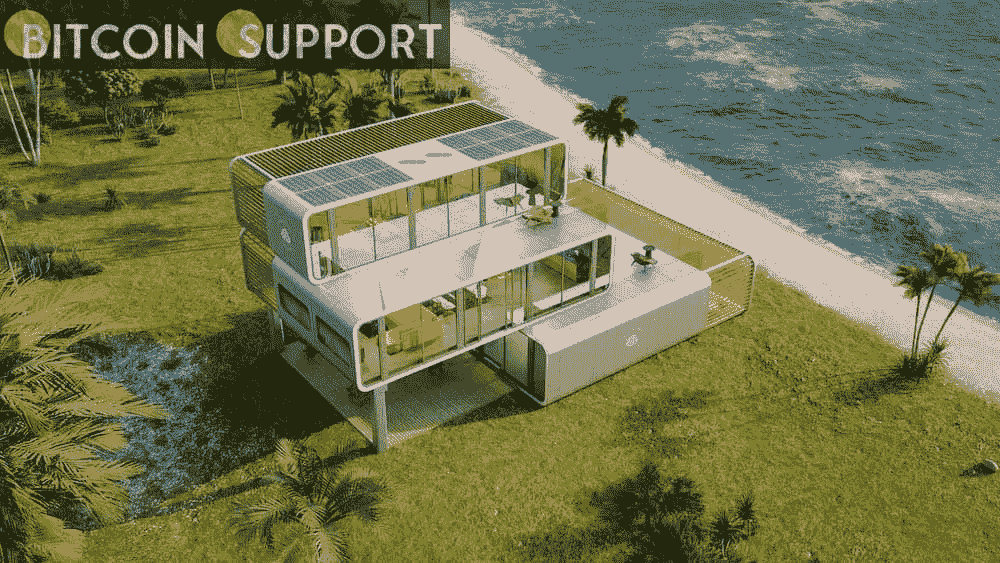
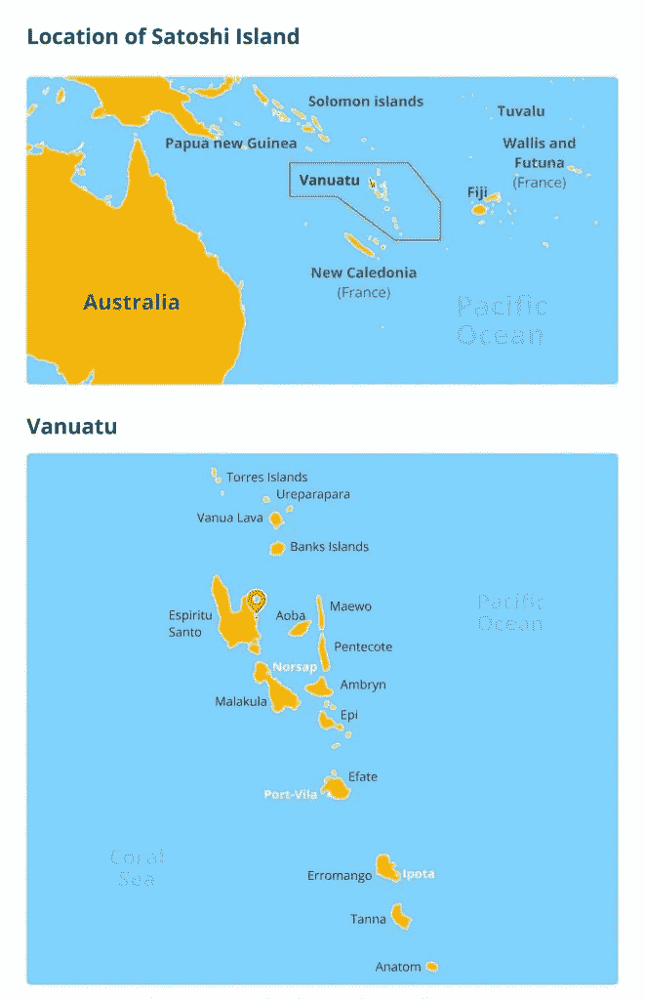
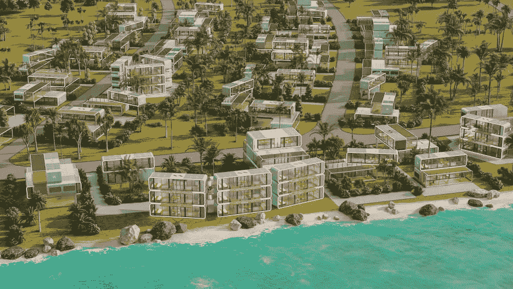
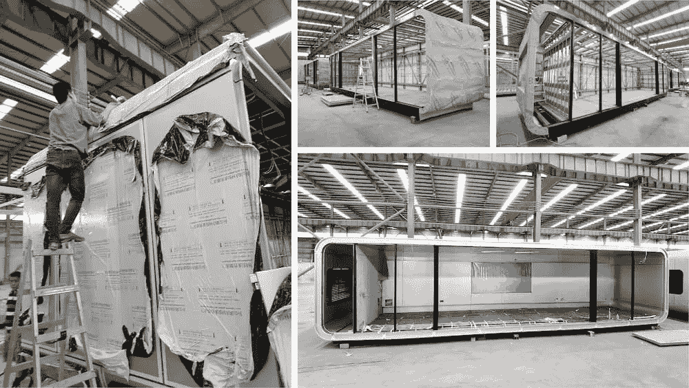
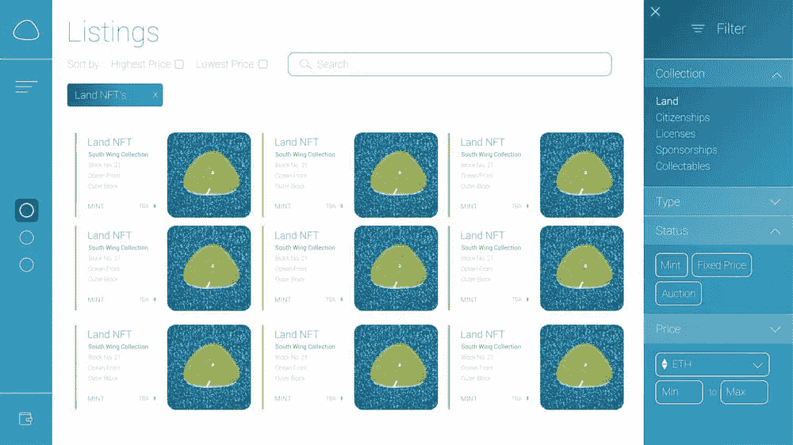

# “聪岛”的加密乌托邦已经收到了 5 万份 NFT 公民申请

> 原文：<https://medium.com/coinmonks/the-crypto-utopia-of-satoshi-island-has-received-50k-citizenship-nft-applications-d417e2ae3ae2?source=collection_archive---------26----------------------->

**Visit our website:-** [**https://bitcoinsupports.com/**](https://bitcoinsupports.com/)

模块化住宅正在建造，NFT 公民申请正在提交，在南太平洋一个禁止现金的加密岛上，一个分散化的未来被承诺。

萨尔瓦多，退居二线；一个新的比特币热点即将出现。Satoshi 岛是一个 3200 万平方英尺的私人岛屿保护区，位于遥远的南太平洋，是“加密社区的家园”

Satoshi 岛是蜜月隐居地、邦德-恶棍隐居地和自然主义者天堂的混合体，只有一个令人困惑的例外:一切都是秘密的。Denys Troyak、James Law、Taras Filatov 和 Benjamin Nero 组成的 Satoshi Island 团队告诉我们，这是:

**“一个真正的加密经济，所有交易都在加密中进行，岛上的所有所有权都由 NFTs 代表。”该公司援引比特币(BTC)创始人中本聪的话说，“这座岛屿计划全年举办活动，举办家庭和总部加密项目，并成为全球加密爱好者的聚集地”。这个岛屿最终可能“作为一个分散的自治组织运作”他们已经购买了一个岛屿，获得了建筑许可，并收到了 50，000 份 NFT 签证申请，成为永久居民。目前，NFT 市场仍处于保密状态。**

**Visit our website:-** [**https://bitcoinsupports.com/**](https://bitcoinsupports.com/)

即使对于最雄心勃勃的加密社区成员来说，数字乌托邦的发展也似乎难以理解。尽管如此，创作者已经收到了“5 万份申请我们的自由公民身份 NFT，这是我们土地 NFT 销售的白名单，并允许持有者在岛上生活并享有许多其他特权。”每一个住宅都将成为一个 NFT，或“NFT 的岛屿”，可以进行交易。据 NFT 持有者称，传统主义者可以“将他们的数字权利转化为瓦努阿图官方土地登记处的真实文件”。

不同于 Fyre Festival 或 CryptoLand 等众所周知的失败项目，也不同于过度兴奋的风险投资团队的任何其他失败的幻想项目，Satoshi Island 有一个现成的战略，以系统的方式取得了重大进展。为了选择一个地方，该团队搜索了全球，遵循法律程序，并避免付费营销和影响者计划。

[https://Twitter . com/satoshiisland/status/1486531640822317062](https://twitter.com/satoshiisland/status/1486531640822317062)

在 2017 年的奔牛期间，Satoshi Island 概念“开始是一个为加密社区创造一个称之为家的地方的想法，多年后选择了物理岛。”事实上，“找到合适的岛屿，把所有东西放在一起，准备向公众展示，需要几年时间。”首先，这个岛必须离文明足够远以提供隐居，但又不能太远以至于难以成长。第二，该岛屿应免受自然灾害的影响，不应易受气候变化的影响。寻找合适地点的斗争变得更加困难，因为尽管找遍全球寻找待售岛屿“无疑令人兴奋”，但他们“必须务实”。

**“这个计划开始是一个寻找孤岛的加密项目，而不是寻找加密城市的孤岛。”**

此外，负责领土的当局必须“接受秘密城市的概念”经过多年的寻找，该团队最终在瓦努阿图找到了一个赢家:“政府展示了创新的愿望，并立即对对话持开放态度。”

的确，太平洋岛国正在赢得加密货币友好的声誉。在附近的汤加，比特币作为法定货币的问题受到了热烈讨论，而马绍尔群岛也对同一海域的 Dao“敞开了大门”。

**Visit our website:-** [**https://bitcoinsupports.com/**](https://bitcoinsupports.com/)

瓦努阿图缺乏“就业和旅游业”，这个曾经被称为拉塔罗的岛屿被过度捕捞和过度偷猎。在购买土地之前，椰子蟹种群已经“濒临灭绝”开发一个思考未来的空间并创造大量就业机会的想法吸引了瓦努阿图政府。螃蟹的目标是重新繁殖数量下降的野生动物。
该团队已经获得政府批准，开始在岛上利用“最新、最好的可持续技术”进行建设，太阳能功能是未来模块化住宅设计中的一个例子。该项目的建筑师补充说，“这对他们来说是一个从头开始建设土地的绝佳机会。”

**Visit our website:-** [**https://bitcoinsupports.com/**](https://bitcoinsupports.com/)

该岛的全部能源供应将来自可再生能源。与此同时，该团队表示，“加密货币挖掘并不是我们的首要任务。”相反，“安装在房屋顶部的太阳能电池板将在一个公共电网上运行整个城镇，”根据这个概念。

当被问及比特币矿工能否把一个 S19 装进包里长期采矿时，团队回应没有问题。

**Visit our website:-** [**https://bitcoinsupports.com/**](https://bitcoinsupports.com/)

除了可持续性，该团队还强调了该岛整体氛围的相关性。它将是一个拥有“常住人口”的“家”，因此它不会是一个“度假胜地”。据该网站称，其目标是被称为“世界加密之都”，如果没有永久居民，这是不可能的。该岛的人口将是 21000 名投资者或居民，与将被开采的 2100 万枚比特币相呼应。自然，居住权是通过区块链的 NFT 授予的。到目前为止，已经有 50，000 人报名参加了这项活动，他们相信“一个全年都可以生活、工作和参观的社区”的愿景。尽管如此，NFT 居民身份并不能赋予瓦努阿图公民身份。瓦努阿图政府声称，公民身份需要花费 13 万美元，这些加密爱好者希望告别菲亚特，迎接一年到头阳光灿烂的加密货币生活。

**Visit our website:-** [**https://bitcoinsupports.com/**](https://bitcoinsupports.com/)

NFT 市场将很快开放，物理岛的工作已经开始。对于短期停留，该岛将于今年第四季度“私人开放”。2023 年初，NFT 房主将能够“开始在岛上居住”。

**访问我们的网站:-**[**https://bitcoinsupports.com/**](https://bitcoinsupports.com/)

**免责声明:以上为作者观点，不应视为投资建议。读者应该自己做研究。**

> *加入 Coinmonks* [*电报频道*](https://t.me/coincodecap) *和* [*Youtube 频道*](https://www.youtube.com/c/coinmonks/videos) *了解加密交易和投资*

# 另外，阅读

*   [3 商业评论](/coinmonks/3commas-review-an-excellent-crypto-trading-bot-2020-1313a58bec92) | [Pionex 评论](https://coincodecap.com/pionex-review-exchange-with-crypto-trading-bot) | [Coinrule 评论](/coinmonks/coinrule-review-2021-a-beginner-friendly-crypto-trading-bot-daf0504848ba)
*   [莱杰 vs n rave](/coinmonks/ledger-vs-ngrave-zero-7e40f0c1d694)|[莱杰 nano s vs x](/coinmonks/ledger-nano-s-vs-x-battery-hardware-price-storage-59a6663fe3b0) | [币安评论](/coinmonks/binance-review-ee10d3bf3b6e)
*   [Bybit Exchange 评论](/coinmonks/bybit-exchange-review-dbd570019b71) | [Bityard 评论](https://coincodecap.com/bityard-reivew) | [Jet-Bot 评论](https://coincodecap.com/jet-bot-review)
*   [3 commas vs crypto hopper](/coinmonks/3commas-vs-pionex-vs-cryptohopper-best-crypto-bot-6a98d2baa203)|[赚取加密利息](/coinmonks/earn-crypto-interest-b10b810fdda3)