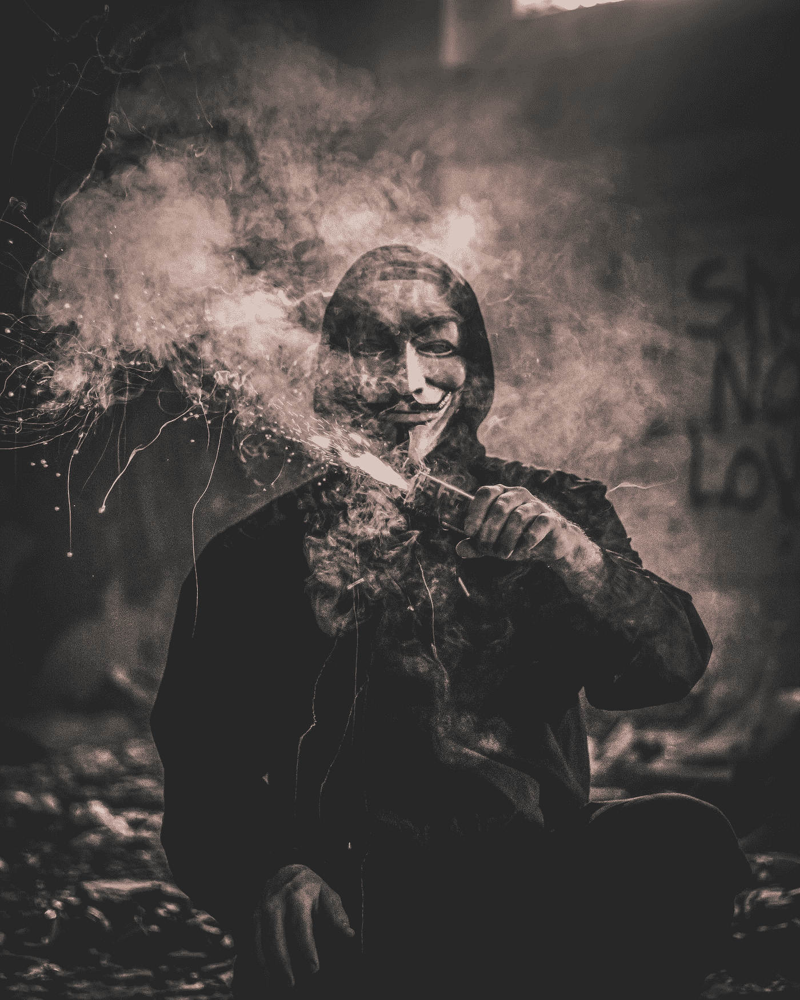
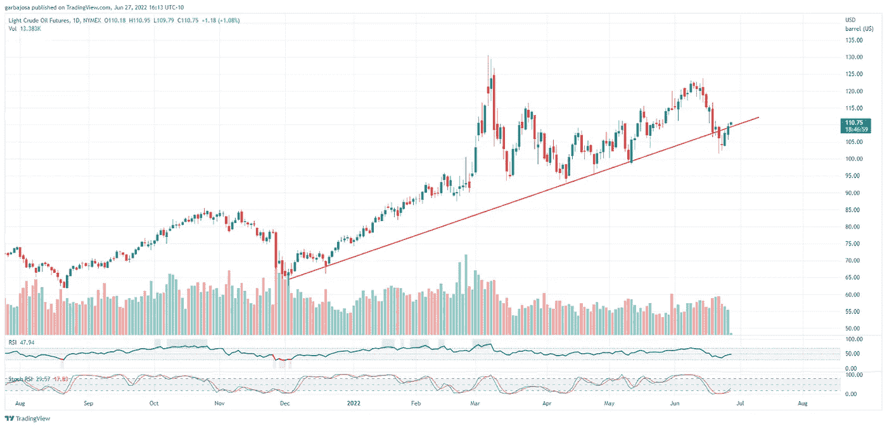
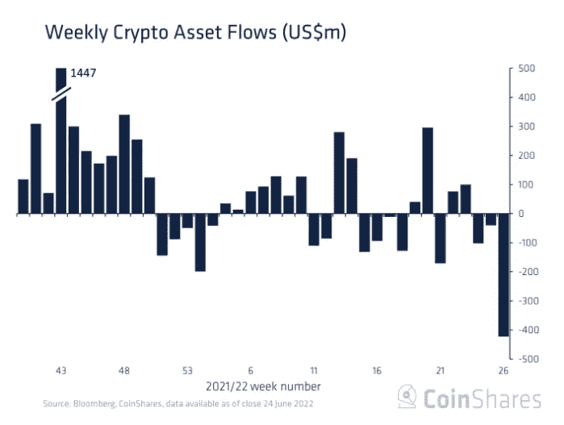
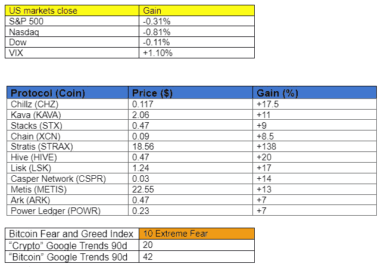

# 加密义务警员来了。谁是匿名目标？

> 原文：<https://medium.com/coinmonks/the-crypto-vigilantes-are-here-whos-anonymous-targeting-26d41ea7bb3a?source=collection_archive---------27----------------------->

## 每日加密混合器# 026 | 6.28.22

加密市场、新闻、指标和协议更新的每日摘要。

**概述**

*   匿名目标降临。
*   加密资产转移达到创纪录水平。
*   这张图表可能是美联储打破需求的信号吗？
*   FTX 寻求收购另一家大型交易所。

Photo by [Daniel Lincoln](https://unsplash.com/@danny_lincoln?utm_source=medium&utm_medium=referral) on [Unsplash](https://unsplash.com?utm_source=medium&utm_medium=referral)

**匿名目标降临了。**

早上好，家人，

在隐体诗中，情节变得更加复杂了。

虽然 Terra 崩溃后的传染效应继续以各种形式困扰着市场，包括 3AC、Blockfi 和 Celsius(都与 Terra 或 Luna 资产有关)的不光彩清算，但其他人正在跟踪 Terra 成员在动荡时期的行动。

许多人质疑 Terra 在崩溃期间的内部运作，特别是权道。以至于被称为 Anonymous 的义务警员黑客组织注意到了。反过来,“匿名者”现在的网站旨在将跆拳道和泰拉队绳之以法。(视频如下)。老实说，如果我是跆拳道，我会吓得发抖。

# 市场更新🌍

**BTC/美元**

根据昨天的新闻简报，比特币(BTC)价格似乎正在失去动力，因为它接近 22k 水平的强大阻力。此外，相对强度指数(RSI)已经进入超卖区，所有这些都支持价格回撤。除非本周出现一些令人惊讶的因素，否则比特币将可能在近期的支撑和阻力之间保持低波动区间。BTC 股市收盘下跌 1.56%，至 20，699 美元。

*高分辨率* [*图表*](https://www.tradingview.com/x/ycGXFpAu/)

从加密到宏观轻质原油期货(CL1！)价格似乎已经打破了七个月的上涨趋势，并试图重新测试趋势底部。美联储的目标是全面减少需求；这种趋势打破可能是一个成功的运动的第一个信号。尽管原油的供应方面可能对其价格有重要影响，但这超出了本通讯的探讨范围。

**轻质原油期货 CL1！/美元**

*高分辨率* [*图表*](https://www.tradingview.com/x/sbxktPhj/)

**数字资产资金流动周报**

CoinShares 发布的每周[资产资金流报告](https://blog.coinshares.com/volume-86-digital-asset-fund-flows-weekly-report-10b238f6e1ef)显示了惊人的资金流出数量，上周总计 4 . 23 亿美元。流出资金主要集中在比特币上，总额达到创纪录的 4.53 亿美元。根据该报告，资金外流主要来自加拿大的一家交易所，可能是比特币跌至 17760 美元的原因。

另一方面，以太坊 11 周以来首次出现 1100 万美元的资金流入。该报告主要关注机构对证券交易所加密资产的兴趣。

*高清*[图表](https://blog.coinshares.com/volume-86-digital-asset-fund-flows-weekly-report-10b238f6e1ef)

***在***[***Substack***](https://tradergabi.substack.com/subscribe?)***订阅，率先获得这份免费的每日简讯。***

如果你喜欢这份报告，并且认为它值 20 分(0.01 美分)，请点击下面的按钮来支持我的写作。(最多 50 次！)谢谢！

# 新闻观察📰

**航海家号在 3AC** 之后。Voyager Digital LLC 向 Three Arrows Capital 发出违约通知，因其未能支付 BTC 和 USDC 价值 6 . 55 亿美元的贷款。根据 Cision Newswire 的报道,“航海家号”打算继续进行回收工作。

**Celsius 团队抵制破产**。监督 Celsius 破产问题的律师建议该公司申请第 11 章破产，但该团队认为客户更愿意避免诉讼。Celsius 认为，避免破产宣告将为客户带来更多价值，同时该公司将释放流动性不足的头寸。此外，破产可能会进入长达数年的诉讼程序，例如 Mt. Gox 一案，用户等了八年才结案。

**FTX 要收购罗宾汉？** Sam Bankman-Fried 的 FTX 加密交易所正在内部[讨论](https://cointelegraph.com/news/crypto-exchange-ftx-is-looking-into-acquiring-robinhood-report)可能收购股票/加密交易所应用程序 Robin Hood。今年早些时候，Sam Bankman-Fried 购买了该公司 7.6%的股份。FTX 和 SBF 继续扩张，而大多数行业都在挣扎。SBF 知道当他看到一个好交易！

**新闻花絮:**

*   比特币基地[增加](https://twitter.com/CoinbaseAssets/status/1541492281974349827?s=20&t=3xZKdvCRAaeGkAWoiLcarA)对 Chain (XCN)、MetisDAO (METIS)、Monavale (MONA)、AirSwap (AST)和 Media Network (MEDIA)的支持。

# 在协议层，⛓

**协议级花絮:**

*   图腾[赢得](https://twitter.com/Totem_Live_/status/1540418733222645767?s=20&t=kA5VIkmCB-4l0R9Cz_POIQ)20 号波尔卡多特副链拍卖，支持一个卡佩克斯副链的位置。
*   Messari [报道](https://messari.io/article/thorswap-solving-cross-chain-s-centralization-problem?utm_source=newsletter_middle&utm_medium=organic_email&utm_campaign=solving_cross_chain_centralization)关于 THORChain 原生 THORswap(雷神)。

# NFT 和元宇宙最新消息🐵

**NFTS 花絮:**

*   玛氏公司[提交](https://finbold.com/mars-inc-files-nft-crypto-and-metaverse-trademarks-applications-for-mms/)M&M 的加密和元宇宙商标申请。

**我的五分钱……**

如果“匿名者”在跟踪你，你可能已经在某个地方搞砸了。

Kwon 逃脱韩国调查人员、证券交易委员会和现在的 Anonymous 的控制的可能性有多大？

我会说我给它 0.1%的机会。道权很可能会因为他在 Terra 的行为而入狱。当动机和手段一致时，人们倾向于走肮脏的道路。当数百万投资者损失他们辛苦赚来的钱时，这些家伙很可能一路中饱私囊。我可能完全错了，但我相信概率对我有利。蝙蝠侠里那句著名的台词是什么？

> “你要么像英雄一样死去，要么活得足够长，看着自己变成恶棍。”
> 
> *——黑暗骑士*

祝你好运，道权。

感谢阅读！

# 加布里

*关注我的*[*Twitter*](https://twitter.com/web3_gabri)*和*[*Medium*](/@TraderGabi)*或在*[*Substack*](https://tradergabi.substack.com/subscribe?)*订阅此免费每日快讯。谢谢！*

***通过订阅*** [***子栈***](https://tradergabi.substack.com/subscribe?) ***成为第一个收到这份免费每日简讯的人。***

如果你喜欢这份报告，并且认为它值 20 分(0.01 美分)，请点击下面的按钮来支持我的写作。(最多 50 次！)谢谢！

*出版商、作家和图表分析师表达的所有观点不应被视为财务建议，也不一定反映秘密玩笑的观点。出版商、作家和图表制作者可能持有所讨论的代币和资产的头寸。鼓励读者自己做研究。*

> 加入 Coinmonks [电报频道](https://t.me/coincodecap)和 [Youtube 频道](https://www.youtube.com/c/coinmonks/videos)了解加密交易和投资

# 另外，阅读

*   [block fi vs Celsius](/coinmonks/blockfi-vs-celsius-vs-hodlnaut-8a1cc8c26630)|[Hodlnaut 审核](/coinmonks/hodlnaut-review-best-way-to-hodl-is-to-earn-interest-on-your-bitcoin-6658a8c19edf) | [KuCoin 审核](https://coincodecap.com/kucoin-review)
*   [Bitsgap 审查](/coinmonks/bitsgap-review-a-crypto-trading-bot-that-makes-easy-money-a5d88a336df2) | [Quadency 审查](/coinmonks/quadency-review-a-crypto-trading-automation-platform-3068eaa374e1) | [Bitbns 审查](/coinmonks/bitbns-review-38256a07e161)
*   [加密复制交易平台](/coinmonks/top-10-crypto-copy-trading-platforms-for-beginners-d0c37c7d698c) | [Coinmama 评论](/coinmonks/coinmama-review-ace5641bde6e)
*   [印度的加密交易所](/coinmonks/bitcoin-exchange-in-india-7f1fe79715c9) | [比特币储蓄账户](/coinmonks/bitcoin-savings-account-e65b13f92451)
*   [OKEx vs KuCoin](https://coincodecap.com/okex-kucoin) | [摄氏替代品](https://coincodecap.com/celsius-alternatives) | [如何购买 VeChain](https://coincodecap.com/buy-vechain)
*   [币安期货交易](https://coincodecap.com/binance-futures-trading)|[3 commas vs Mudrex vs eToro](https://coincodecap.com/mudrex-3commas-etoro)