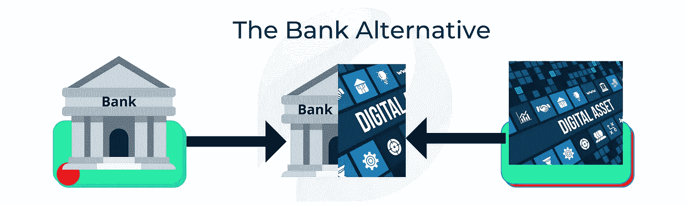
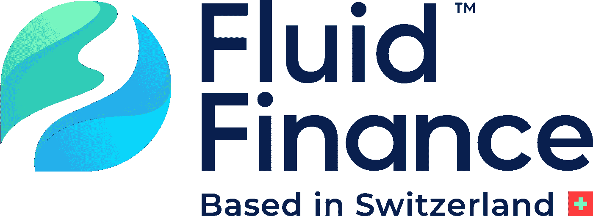
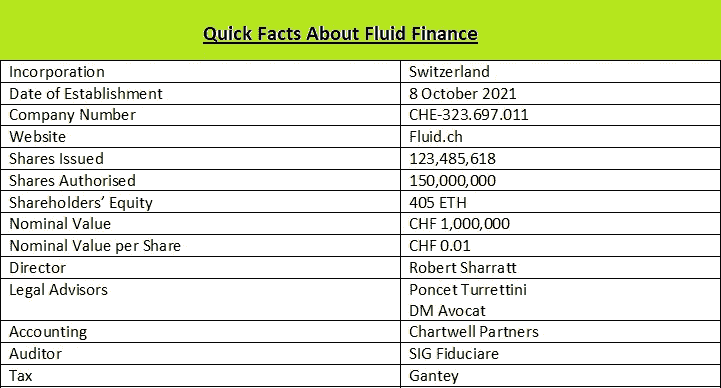
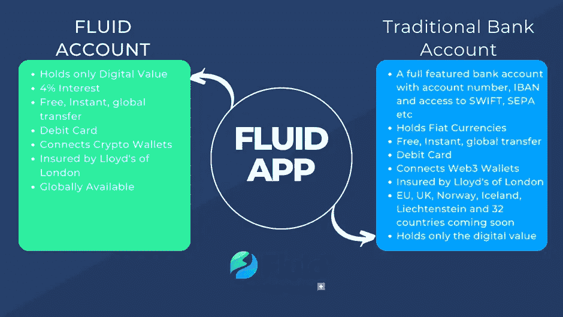

# 加密世界需要一个替代数字资产的银行

> 原文：<https://medium.com/coinmonks/the-crypto-world-needs-a-bank-alternative-for-digital-asset-26c37ccf5dbf?source=collection_archive---------9----------------------->

它对加密货币/数字资产的作用与传统银行对真实货币的作用相同。保持它的安全和价值。

The Bank Alternative — by Valuefirst

## **传统金融做什么**

暂时远离加密空间。如果我持有一只股票，并且我认为它会继续贬值，我会卖掉这只股票，把我的钱存在**银行**，直到我找到一个合适的或者有回报的投资。我想大多数人都会这么做。

银行为我们提供了一个安全存放钱的地方，而且价值相当稳定，同时也让我们可以随时随地取用钱，而且通常是我们选择的货币。

大多数人现在将他们的数字资产换成稳定的硬币，并将其存储在钱包或交易所中，其中许多也是协议或项目本身，可能不安全。

## 银行受到监管:交易所、项目和协议经常消失

数字资产的银行替代品应该为您提供一个安全的休息场所，远离加密市场、交易所、协议和项目的不稳定性。一个像银行一样值得信赖的地方，在那里你可以安全地停车，直到你准备好再次跳入。

> ***数字现金*** *不是一种稳定的货币，而是更像一种私人的 CBDC，它是以数字形式存在于链条上的真实货币*

## **那么，数字资产的银行替代品应该是什么样的呢？**

银行的替代方案应该是传统银行和数字世界的混合体，能够使用数字现金从同一个接入点无缝地满足两个金融世界的需求。其特征应包括但不限于

*   1.使用多种货币(美元、欧元、英镑、瑞士法郎等)的数字现金作为价值储存手段。
*   2.必须完全投保、部分监管或监管就绪并注册
*   3.不得直接参与 DEX、加密项目或协议。
*   4.必须至少部分建立在链上
*   5.允许轻松进出法定货币和加密货币/DeFi
*   6.提供传统的银行产品和服务，如带息储蓄账户

# **流动金融是一种银行选择**

Fluid Finance Logo — Fluid.ch

[Fluid](http://fluid.ch) 是一款诞生于瑞士的银行替代产品，它将传统银行和数字世界的精华整合到一个应用程序中，构建了一个安全可靠的银行模型，更适合当今世界，尤其是数字资产。

## **流动数字现金**

数字现金不是一种稳定的货币，它更像是一种私营部门的 CBDC，它是链上数字形式的真实货币。流动数字现金是 100% 1:1 比例的法定支持，任何人都可以验证。国库中持有的现金支持量和流通中的等价数字现金总是相同的。

*   -检查金库中的现金[此处](https://retail.fluidfi.ch/gw/open/v1/treasury/dusd)
*   ——查看流通中的数字现金[这里](https://arbiscan.io/token/0xf0b5ceefc89684889e5f7e0a7775bd100fcd3709)

## **由伦敦劳埃德保险公司承保**

尽管 fluid 使用了一些最安全的技术，并且在一个拥有世界上最严格的银行和金融法律的国家——瑞士注册和运营。不满意的液体由伦敦劳埃德保险公司全额保险。

## **安全技术和环境**

Veriff & Merkle Science logos Mash-up by Valuefirst

fluid 与世界领先的全球身份验证服务公司 Veriff 和确保所有进出区块链交易完整性的 Merkle Science Compass 合作，创建了一个世界一流的安全环境。

## **无缝上下坡**

Currencycloud, Arbitrum and Chainlink logos Mash-up by ValueFirst

通过与智能技术全球支付提供商 Currencycloud、以太坊 dApps 的下一代第 2 层 Arbitrum 以及从链外到链内智能合约的防篡改数据提供商 Chainlink 合作，Fluid 能够在一个应用程序中无缝地为您带来两个金融世界，并且成本最低。

## **关于流体的一些重要快速事实**

From Fluid.ch Medium

## **产品供应**

流动[产品](https://fluid.ch/our-products/)围绕 it 的传统银行账户和流动账户构建，两者都在同一个应用程序中。你的流动账户上还有高达 4%的利息

Two Worlds One App by ValueFirst

现在，您知道在哪里安全地存储您的数字资产

## 我邀请你来流体金融。你可以在这里使用我的推荐链接[，但前提是你已经做了调查](https://app.fluid.ch/invite/ValueFirst)

## **警告:**

*   *注意——这不是金融投资建议。*
*   *所有金融投资都涉及风险 DYOR(在进行任何金融投资之前，请自行研究)*
*   这篇文章是我对这个主题的想法和看法

此外，通过您选择的任何渠道加入社区

[**推特**](https://twitter.com/fluid_fi)|[|**电报**](https://t.me/fluid_fi)|[|**公告**|](https://t.me/fluid_fi_ann)|[|](https://discord.gg/xbu3qhrxps)|[|**GitLab**|](https://gitlab.com/fluidfinance/stablecoin2.0)|[|**YouTube**|](http://youtube.com/c/fluidfi)|**网站:**[**fluid . ch**](https://fluid.ch/)|[|**数字美元(DigitalDollar**](/fluidfi/introducing-digitaldollar-dusd-7ef626bb9958)

> 加入 Coinmonks [电报频道](https://t.me/coincodecap)和 [Youtube 频道](https://www.youtube.com/c/coinmonks/videos)了解加密交易和投资

# 另外，阅读

*   [Bookmap 评论](https://coincodecap.com/bookmap-review-2021-best-trading-software) | [美国 5 大最佳加密交易所](https://coincodecap.com/crypto-exchange-usa)
*   [如何在 FTX 交易所交易期货](https://coincodecap.com/ftx-futures-trading) | [OKEx vs 币安](https://coincodecap.com/okex-vs-binance)
*   [CoinLoan 评论](https://coincodecap.com/coinloan-review) | [YouHodler 评论](/coinmonks/youhodler-4-easy-ways-to-make-money-98969b9689f2) | [BlockFi 评论](https://coincodecap.com/blockfi-review)
*   [XT.COM 评论](https://coincodecap.com/profittradingapp-for-binance)币安评论 | [的 ProfitTradingApp](https://coincodecap.com/xt-com-review)
*   [SmithBot 评论](https://coincodecap.com/smithbot-review) | [4 款最佳免费开源交易机器人](https://coincodecap.com/free-open-source-trading-bots)