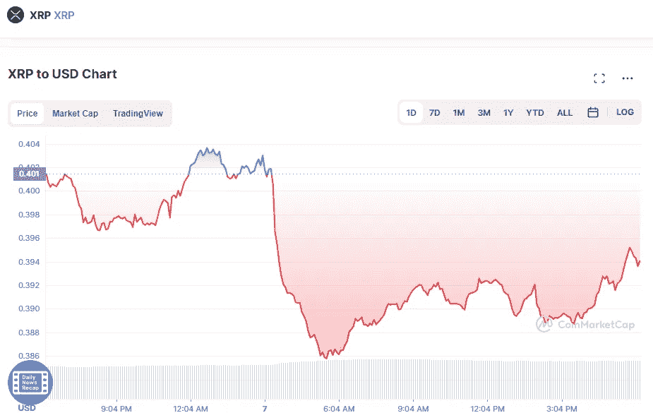

# 我今天买的加密货币

> 原文：<https://medium.com/coinmonks/the-cryptocurrencies-that-i-bought-today-ffde1e1268d6?source=collection_archive---------31----------------------->

# 涟漪(XRP)

Source photo [XRP price today, XRP to USD live, marketcap and chart | CoinMarketCap](https://coinmarketcap.com/currencies/xrp/)

XRP 现在的交易价格为 0.394 美元，比昨天的收盘价下跌了 1.62%。这反映了前一周下降了 6%，过去一个月下降了 32%。

根据 XRP 的相对强弱指数，现在已经相当平静了一段时间。此外，它只需 0.39 美元，非常便宜。这是由许多因素造成的，不仅仅是持续的法律…