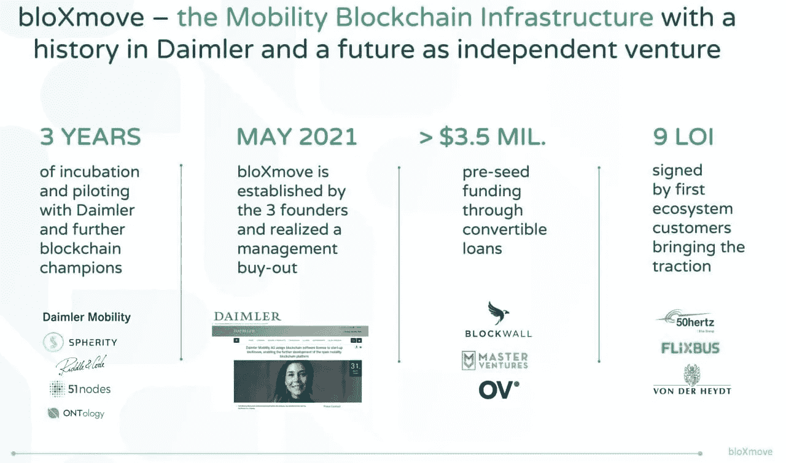
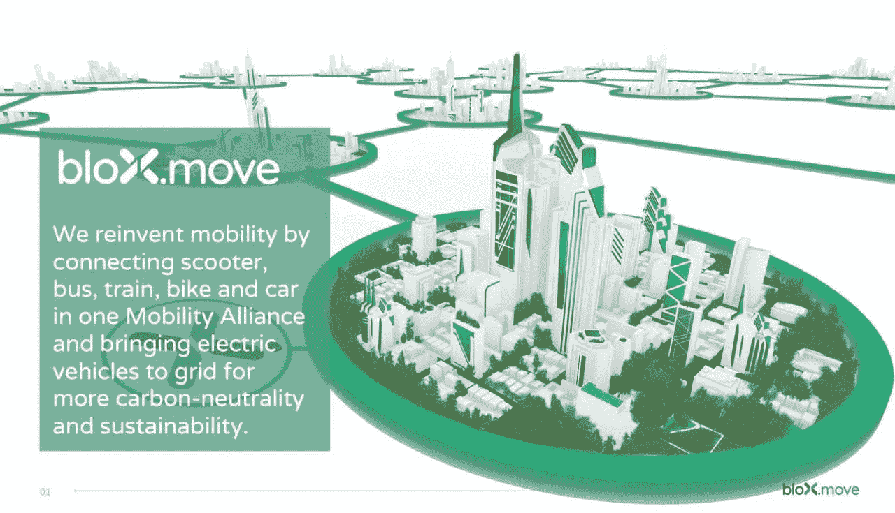
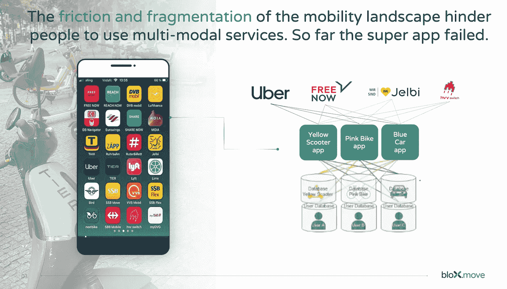
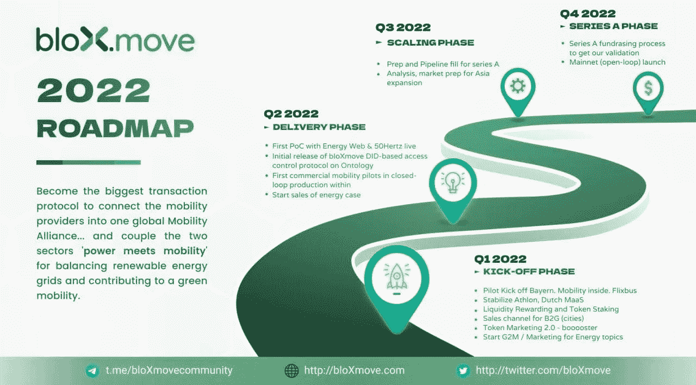
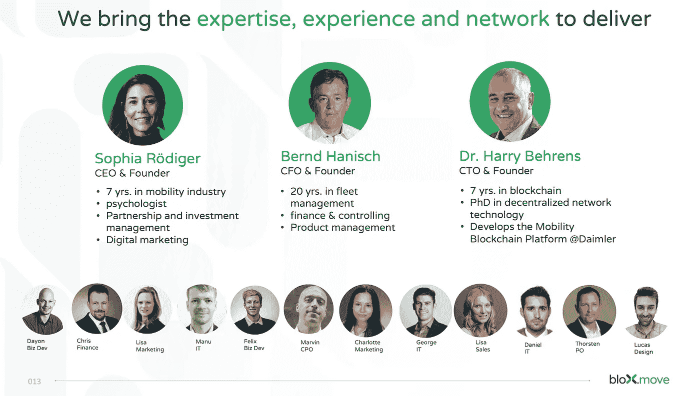
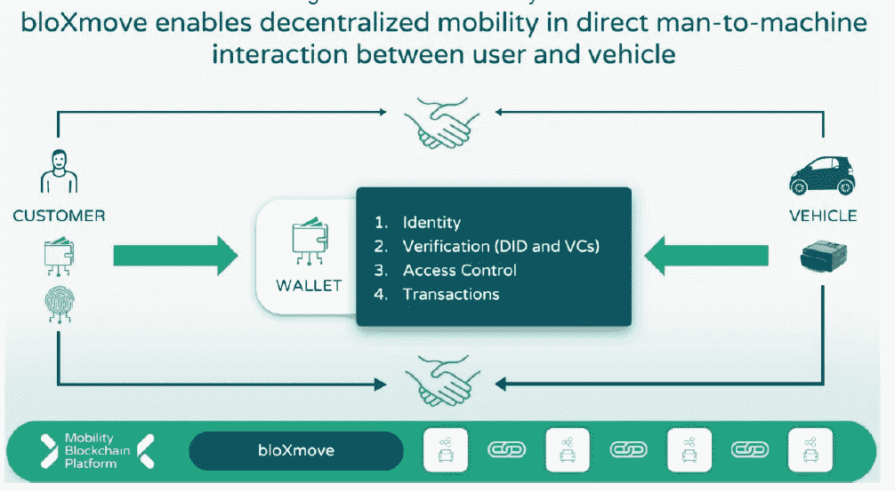
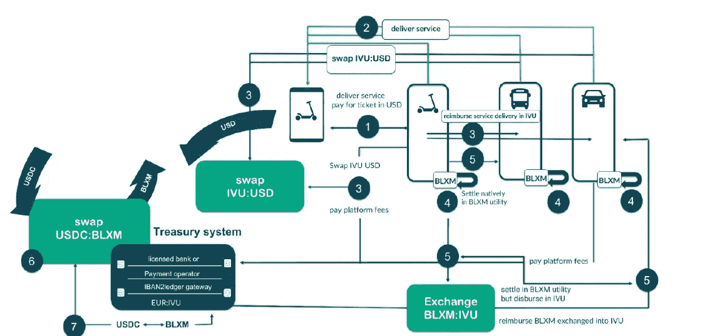

# 当 99%的人出局时，加密货币初创公司仍将存在

> 原文：<https://medium.com/coinmonks/the-cryptocurrency-startup-that-will-remain-when-99-are-out-69f1d97da058?source=collection_archive---------19----------------------->

当加密泡沫破裂时，这家加密支持的初创公司将是能够渡过难关的 1%之一。

就像互联网泡沫破裂一样，平庸的初创公司也投降了。像雅虎、谷歌等初创公司(现在是独角兽)生存并成长。

很多加密货币项目会失败的原因是；

首先，他们根本没有用例；

第二，用例不可行或不可实现

第三:他们没有密码行业之外的用例

第四:他们缺乏优秀的团队来实施好的想法(即使他们有)

少数会做得很好并成为独角兽和大型分散机构的人拥有可实施的项目、可行的用例、独立于密码行业的项目和优秀的团队。

bloXmove 就是符合这四个标准的项目之一。

让我给你一点这一切是如何开始的背景；

## 【bloXmove 如何开始

戴姆勒(梅赛德斯的母公司)，为了启动一个移动区块链平台(MBP)，成立了一个由 Harry Behren(现 bloXmove 创始人兼 CTO)领导的团队。

该小组的任务是开发一个有效的流动平台。经过三年的努力，跨越了与不同创业公司的各种合作关系(Spherity，51 nodes，50 hertz 等。)，该团队提供了一个有效的移动区块链平台。

戴姆勒意识到，MBP 的进一步发展和增长将是迅速的，如果它是独立的，独立于戴姆勒，许可 MBP blox move 在管理层收购。

## 【bloXmove 正在解决的问题

一般来说，移动即服务(Maas)产业正在解决城市交通拥堵问题。

如今，人们在基于按使用付费的软件平台上订购移动服务是很常见的；这使得人们更没有理由拥有汽车，因此，通过减少道路上的车辆数量来减少交通拥堵。

MaaS 行业目前是分散的；您需要几个应用程序或门户来预订机票、订购拼车服务、租用踏板车等。这就带来了很多不便。

bloXmove 正在通过创建一个去中心化的移动区块链平台，在一个全球联盟中连接不同的移动服务提供商，来解决 MaaS 行业的碎片化问题。

> “bloXmove 旨在通过一个简单易用的应用程序，统一所有的交通系统，让用户更加方便快捷。”

bloXmove 的其他商业模式是将电动汽车连接到电网。bloXmove 将电动汽车连接到通过可再生能源发电的电网。电动车的识别、合同的签署、验证和交易的结算都将在 bloXmove 协议上完成。

## **blox move 如何改变移动性？**

想象一下，跨地区和国家旅行，预订和订购机票、公共汽车、火车、滑板车等，只需在手机上使用一个集成协议，一次性登机，就可以在各国自由漫游，没有任何麻烦。

这不是很好吗？

最重要的是，你将支付更少，因为交易费可以忽略不计。例如，主要拼车平台将合作伙伴的收入削减 25%，这使得你作为客户支付的总金额高于交易费用较少时的金额。

此外，你的数据是安全的，因为它在区块链上，没有人会操纵你的数据来实现个人利益，比如在社交媒体上用相关广告瞄准你。

## 【bloXmove 目前的位置和路线图

bloXmove 在区块链、能源和移动行业拥有众多合作伙伴。

bloXmove 已经指定团队从事不同的项目，旨在实现创业公司的使命。

bloXmove 正在进行会谈，团队正在努力实现路线图。

**Q1 2022:启动阶段**

bloXmove 将通过 Flixbus 推出其首个飞行员移动性用例。

流动性回报已经开始，下注方将很快跟进

稳定 Athlon，荷兰马斯

B2G(城市)的销售渠道

代币营销 2.0

启动 G2M/能源营销

**Q2 2022:交付阶段**

首次概念验证(PoC ),带能源网和 50 赫兹直播

基于 bloXmove DID 的本体访问控制协议的初步发布

内闭环生产的首个商用移动试点

能源案例的开始

**2022 年第三季度:缩放阶段**

系列 A 的准备和管道填充

分析，为亚洲市场扩张做市场准备

**2022 年第四季度:A 轮阶段**

首轮融资流程获得我们的认可

Mainnet(开环)启动

## **blox move 团队和风险投资合伙人**

该团队由来自不同领域的专业人士组成，他们拥有良好的业绩记录、商业网络和丰富的经验。

首席执行官(Sophia Roediger)在戴姆勒工作了七年多，领导了戴姆勒的全球转型和数字创新与合作伙伴关系等计划。

首席技术官兼创始人哈里·伯伦斯于 2015 年加入戴姆勒。他在 2017 年负责戴姆勒移动平台如 car2go 和数字金融的 IT。他在戴姆勒公司提出了分散式移动平台，即现在的 bloXmove。

Bernd Hanisch，创始人兼首席财务官，拥有 20 年的车队管理经验，在项目管理、财务和控制方面经验丰富。

**支持 bloXmove 的风险投资家；**

*   Ventures:欧洲加密领域最著名的加速公司之一
*   布洛克威尔资本:德国第一个加密基金
*   Master Ventures:一家经营付费点火装置的新加坡/泰国合资企业

# **BLXM 令牌的效用**

BLXM 令牌有两种形式的实用程序场景；本地和混合场景。

本机场景是典型的纯加密场景。在这里，用户通过安全账户与协议进行交互；例如钱包，协议提供服务以换取令牌；在这种情况下，没有银行，没有传统的记账和会计，也没有主要的监管。BLXM 令牌用于利用服务和结算费用。

混合情景适用于高度监管经济体中的受监管企业，如欧盟、中国或美国。在这里，服务将以法定货币(欧元、CNY 或美元)计价和结算。这是必要的，因为受监管的市场拥有健全的会计系统和纳税申报程序。

**BLXM 是通货紧缩**

BLXM 的总最大供应量固定在 5000 万单位

bloXmove 将一直消耗在 BLXM 中支付的每笔交易费用的 10%到 40%。精确测量将动态确定

当达到 1000 万的最低供应量时，燃烧就会停止

一旦达到限额，bloXmove 将开始接受其他代币作为交易费用。

在哪里获得令牌

令牌当前处于打开状态

*   薄饼交换
*   UniSwap
*   比特玛特

**结论**

有了这些信息，你就知道这个项目是可持续的，而且我已经让你很容易地加入这个创新的创业公司，就像我在阅读它之后所做的那样。

首先，你可以加入社交媒体平台(非常敏感的平台)

可以加入社团；

看看那里的网站:bloxmove.com

电报:https://t.me/bloXmoveCommunity—电报:

在推特上关注:https://twitter.com/BloXmove

Youtube 频道:[https://w ww.youtube.com/watch?v=T8wy-z3_BaU&t = 6s](https://www.youtube.com/watch?v=T8wy-z3_BaU&t=6s)

#bloXmove #mobility #BLXM

我的电报手柄@Glamourbuk